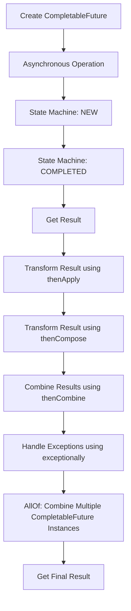

## Introduction
**CompletableFuture** is a powerful tool in Java for handling asynchronous operations. It allows developers to write more efficient and readable code by providing a way to compose and handle asynchronous operations in a more straightforward way. In real-world scenarios, **CompletableFuture** is used in applications that require concurrent execution of tasks, such as web servers, database queries, and file I/O operations. Every engineer should know how to use **CompletableFuture** because it provides a way to write more efficient and scalable code.

> **Note:** Asynchronous programming is essential in modern applications, and **CompletableFuture** is a key tool for achieving this.

## Core Concepts
**CompletableFuture** is a class that implements the **Future** interface, which represents the result of an asynchronous computation. The core concepts of **CompletableFuture** include:

* **thenApply**: applies a transformation to the result of the asynchronous operation
* **thenCompose**: applies a transformation to the result of the asynchronous operation and returns a new **CompletableFuture**
* **thenCombine**: combines the results of two asynchronous operations
* **exceptionally**: handles exceptions that occur during the asynchronous operation
* **allOf**: combines multiple **CompletableFuture** instances into a single **CompletableFuture**

> **Warning:** When using **CompletableFuture**, it's essential to handle exceptions properly to avoid unexpected behavior.

## How It Works Internally
**CompletableFuture** uses a state machine to manage the state of the asynchronous operation. The state machine has several states, including:

* **NEW**: the initial state
* **COMPLETED**: the operation has completed successfully
* **FAILED**: the operation has failed with an exception

When a **CompletableFuture** instance is created, it starts in the **NEW** state. As the asynchronous operation progresses, the state machine transitions to **COMPLETED** or **FAILED**, depending on the outcome of the operation.

Here's a step-by-step breakdown of how **CompletableFuture** works:

1. Create a **CompletableFuture** instance using one of the factory methods, such as **supplyAsync** or **runAsync**.
2. The **CompletableFuture** instance starts in the **NEW** state.
3. The asynchronous operation is executed, and the result is computed.
4. If the operation completes successfully, the state machine transitions to **COMPLETED**, and the result is stored in the **CompletableFuture** instance.
5. If the operation fails with an exception, the state machine transitions to **FAILED**, and the exception is stored in the **CompletableFuture** instance.
6. The **thenApply**, **thenCompose**, **thenCombine**, and **exceptionally** methods can be used to transform the result of the asynchronous operation or handle exceptions.

## Code Examples
### Example 1: Basic Usage
```java
import java.util.concurrent.CompletableFuture;
import java.util.concurrent.ExecutionException;

public class CompletableFutureExample {
    public static void main(String[] args) throws InterruptedException, ExecutionException {
        // Create a CompletableFuture instance using supplyAsync
        CompletableFuture<String> future = CompletableFuture.supplyAsync(() -> {
            try {
                Thread.sleep(1000);
            } catch (InterruptedException e) {
                Thread.currentThread().interrupt();
            }
            return "Hello, World!";
        });

        // Get the result of the asynchronous operation
        String result = future.get();
        System.out.println(result);
    }
}
```
This example demonstrates how to create a **CompletableFuture** instance using **supplyAsync** and get the result of the asynchronous operation using **get**.

### Example 2: Using thenApply
```java
import java.util.concurrent.CompletableFuture;

public class CompletableFutureThenApplyExample {
    public static void main(String[] args) {
        // Create a CompletableFuture instance using supplyAsync
        CompletableFuture<String> future = CompletableFuture.supplyAsync(() -> {
            try {
                Thread.sleep(1000);
            } catch (InterruptedException e) {
                Thread.currentThread().interrupt();
            }
            return "Hello, World!";
        });

        // Use thenApply to transform the result of the asynchronous operation
        CompletableFuture<String> transformedFuture = future.thenApply(result -> result.toUpperCase());
        transformedFuture.thenAccept(System.out::println);
    }
}
```
This example demonstrates how to use **thenApply** to transform the result of the asynchronous operation.

### Example 3: Using thenCombine
```java
import java.util.concurrent.CompletableFuture;

public class CompletableFutureThenCombineExample {
    public static void main(String[] args) {
        // Create two CompletableFuture instances using supplyAsync
        CompletableFuture<String> future1 = CompletableFuture.supplyAsync(() -> {
            try {
                Thread.sleep(1000);
            } catch (InterruptedException e) {
                Thread.currentThread().interrupt();
            }
            return "Hello, ";
        });
        CompletableFuture<String> future2 = CompletableFuture.supplyAsync(() -> {
            try {
                Thread.sleep(1000);
            } catch (InterruptedException e) {
                Thread.currentThread().interrupt();
            }
            return "World!";
        });

        // Use thenCombine to combine the results of the two asynchronous operations
        CompletableFuture<String> combinedFuture = future1.thenCombine(future2, (result1, result2) -> result1 + result2);
        combinedFuture.thenAccept(System.out::println);
    }
}
```
This example demonstrates how to use **thenCombine** to combine the results of two asynchronous operations.

## Visual Diagram

This diagram illustrates the workflow of **CompletableFuture**, including the creation of a **CompletableFuture** instance, the execution of the asynchronous operation, the transformation of the result using **thenApply** and **thenCompose**, the combination of results using **thenCombine**, and the handling of exceptions using **exceptionally**.

> **Tip:** Use the **thenApply** and **thenCompose** methods to transform the result of the asynchronous operation, and use **thenCombine** to combine the results of multiple asynchronous operations.

## Comparison
| Approach | Time Complexity | Space Complexity | Pros | Cons | Best For |
| --- | --- | --- | --- | --- | --- |
| **CompletableFuture** | O(1) | O(1) | Efficient, flexible, and easy to use | Can be complex to handle exceptions | Asynchronous operations with multiple dependencies |
| **Callback** | O(n) | O(n) | Simple to implement | Can lead to callback hell | Simple asynchronous operations with a single dependency |
| **RxJava** | O(n) | O(n) | Powerful and flexible | Can be complex to learn | Complex asynchronous operations with multiple dependencies and error handling |
| **Project Reactor** | O(n) | O(n) | Powerful and flexible | Can be complex to learn | Complex asynchronous operations with multiple dependencies and error handling |

## Real-world Use Cases
1. **Web Server**: A web server can use **CompletableFuture** to handle multiple requests concurrently, improving the overall performance and scalability of the server.
2. **Database Query**: A database query can use **CompletableFuture** to execute multiple queries concurrently, improving the overall performance and reducing the latency of the query.
3. **File I/O**: A file I/O operation can use **CompletableFuture** to read and write files concurrently, improving the overall performance and reducing the latency of the operation.

> **Interview:** Can you explain the difference between **thenApply** and **thenCompose**? How would you use **thenCombine** to combine the results of two asynchronous operations?

## Common Pitfalls
1. **Not Handling Exceptions**: Failing to handle exceptions properly can lead to unexpected behavior and crashes.
2. **Using thenApply Incorrectly**: Using **thenApply** incorrectly can lead to unexpected behavior and errors.
3. **Not Using thenCombine Correctly**: Not using **thenCombine** correctly can lead to unexpected behavior and errors.
4. **Not Using exceptionally**: Not using **exceptionally** can lead to unexpected behavior and errors.

> **Warning:** Always handle exceptions properly using **exceptionally**, and use **thenApply** and **thenCombine** correctly to avoid unexpected behavior and errors.

## Interview Tips
1. **Explain the Difference between thenApply and thenCompose**: Be prepared to explain the difference between **thenApply** and **thenCompose**, and provide examples of how to use them correctly.
2. **Use thenCombine Correctly**: Be prepared to explain how to use **thenCombine** to combine the results of two asynchronous operations.
3. **Handle Exceptions Properly**: Be prepared to explain how to handle exceptions properly using **exceptionally**, and provide examples of how to use it correctly.

> **Tip:** Practice using **CompletableFuture** and its methods, and be prepared to explain how to use them correctly in an interview.

## Key Takeaways
* **CompletableFuture** is a powerful tool for handling asynchronous operations in Java.
* **thenApply** and **thenCompose** are used to transform the result of an asynchronous operation.
* **thenCombine** is used to combine the results of two asynchronous operations.
* **exceptionally** is used to handle exceptions that occur during an asynchronous operation.
* **allOf** is used to combine multiple **CompletableFuture** instances into a single **CompletableFuture**.
* Always handle exceptions properly using **exceptionally**.
* Use **thenApply** and **thenCombine** correctly to avoid unexpected behavior and errors.
* Practice using **CompletableFuture** and its methods to improve your skills and knowledge.