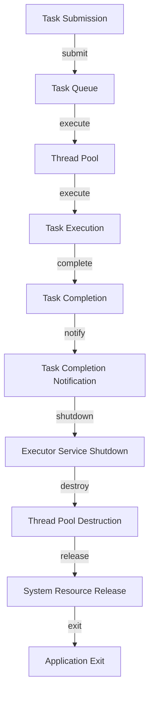

## Introduction
The **ExecutorService** is a high-level API in Java that provides a way to manage a pool of threads that can be used to execute tasks asynchronously. It is a part of the **java.util.concurrent** package and is designed to simplify the process of managing threads and executing tasks in a multithreaded environment. The ExecutorService is particularly useful in scenarios where you need to perform multiple tasks concurrently, such as in web servers, database queries, or batch processing.

> **Note:** The ExecutorService is a powerful tool that can help improve the performance and scalability of your application by allowing you to execute tasks concurrently and manage threads efficiently.

In real-world scenarios, the ExecutorService is widely used in various applications, such as web servers, database systems, and batch processing systems. For example, a web server can use an ExecutorService to handle multiple requests concurrently, improving the overall performance and responsiveness of the system.

## Core Concepts
The ExecutorService is built around several core concepts, including:

* **Thread pool**: A thread pool is a group of threads that are used to execute tasks. The ExecutorService manages a thread pool that can be used to execute tasks concurrently.
* **Task**: A task is a unit of work that can be executed by the ExecutorService. Tasks can be represented as instances of the **Runnable** or **Callable** interfaces.
* **Executor**: An executor is an object that manages a thread pool and executes tasks. The ExecutorService provides several types of executors, including **ThreadPoolExecutor**, **FixedThreadPool**, and **CachedThreadPool**.

> **Warning:** Using the ExecutorService incorrectly can lead to performance issues, such as thread starvation or deadlock. It is essential to understand the core concepts and use the ExecutorService correctly to avoid these issues.

## How It Works Internally
The ExecutorService works by managing a thread pool that can be used to execute tasks. When a task is submitted to the ExecutorService, it is added to a queue and executed by an available thread in the pool. If no threads are available, the task is blocked until a thread becomes available.

The ExecutorService uses a **ThreadPoolExecutor** to manage the thread pool. The ThreadPoolExecutor is responsible for creating and managing threads, as well as executing tasks. The ThreadPoolExecutor uses a **BlockingQueue** to store tasks that are waiting to be executed.

> **Tip:** The ExecutorService provides several configuration options that can be used to customize its behavior, such as setting the maximum number of threads or the keep-alive time for idle threads.

## Code Examples
Here are three complete and runnable examples that demonstrate how to use the ExecutorService:

### Example 1: Basic Usage
```java
import java.util.concurrent.ExecutorService;
import java.util.concurrent.Executors;

public class BasicUsage {
    public static void main(String[] args) {
        // Create an executor service with a fixed thread pool of 5 threads
        ExecutorService executor = Executors.newFixedThreadPool(5);

        // Submit 10 tasks to the executor service
        for (int i = 0; i < 10; i++) {
            final int taskNumber = i;
            executor.execute(() -> {
                System.out.println("Task " + taskNumber + " executed by thread " + Thread.currentThread().getName());
            });
        }

        // Shut down the executor service
        executor.shutdown();
    }
}
```

### Example 2: Real-World Pattern
```java
import java.util.concurrent.Callable;
import java.util.concurrent.ExecutorService;
import java.util.concurrent.Executors;
import java.util.concurrent.Future;

public class RealWorldPattern {
    public static void main(String[] args) throws Exception {
        // Create an executor service with a cached thread pool
        ExecutorService executor = Executors.newCachedThreadPool();

        // Submit 10 tasks to the executor service
        for (int i = 0; i < 10; i++) {
            final int taskNumber = i;
            Callable<String> task = () -> {
                // Simulate some work
                Thread.sleep(1000);
                return "Task " + taskNumber + " completed";
            };

            // Submit the task and get a future
            Future<String> future = executor.submit(task);

            // Get the result of the task
            String result = future.get();
            System.out.println(result);
        }

        // Shut down the executor service
        executor.shutdown();
    }
}
```

### Example 3: Advanced Usage
```java
import java.util.concurrent.ExecutorService;
import java.util.concurrent.Executors;
import java.util.concurrent.ScheduledExecutorService;
import java.util.concurrent.TimeUnit;

public class AdvancedUsage {
    public static void main(String[] args) {
        // Create a scheduled executor service with a fixed thread pool of 5 threads
        ScheduledExecutorService executor = Executors.newScheduledThreadPool(5);

        // Submit a task to the executor service with a delay of 5 seconds
        executor.schedule(() -> {
            System.out.println("Task executed with a delay of 5 seconds");
        }, 5, TimeUnit.SECONDS);

        // Submit a task to the executor service with a fixed rate of 1 second
        executor.scheduleAtFixedRate(() -> {
            System.out.println("Task executed with a fixed rate of 1 second");
        }, 0, 1, TimeUnit.SECONDS);

        // Shut down the executor service
        executor.shutdown();
    }
}
```

## Visual Diagram


> **Note:** The visual diagram illustrates the flow of task submission, execution, and completion in the ExecutorService.

## Comparison
| Approach | Time Complexity | Space Complexity | Pros | Cons | Best For |
| --- | --- | --- | --- | --- | --- |
| ThreadPoolExecutor | O(1) | O(n) | Flexible and customizable | Can be complex to configure | Applications with variable workloads |
| FixedThreadPool | O(1) | O(n) | Simple and easy to use | Limited flexibility | Applications with fixed workloads |
| CachedThreadPool | O(1) | O(n) | Adaptive and dynamic | Can be resource-intensive | Applications with dynamic workloads |

> **Tip:** The choice of approach depends on the specific requirements of the application, such as the type of workload, the number of tasks, and the available resources.

## Real-world Use Cases
Here are three real-world use cases for the ExecutorService:

1. **Web Server**: A web server can use the ExecutorService to handle multiple requests concurrently, improving the overall performance and responsiveness of the system.
2. **Database System**: A database system can use the ExecutorService to execute multiple queries concurrently, improving the overall performance and throughput of the system.
3. **Batch Processing**: A batch processing system can use the ExecutorService to execute multiple tasks concurrently, improving the overall performance and efficiency of the system.

> **Warning:** Using the ExecutorService in a production environment requires careful consideration of the configuration options and the underlying hardware resources.

## Common Pitfalls
Here are four common pitfalls to avoid when using the ExecutorService:

1. **Thread Starvation**: Thread starvation occurs when a thread is unable to access the shared resources due to other threads holding onto them for an extended period.
2. **Deadlock**: Deadlock occurs when two or more threads are blocked indefinitely, each waiting for the other to release a resource.
3. **Resource Leaks**: Resource leaks occur when the ExecutorService is not properly shut down, leading to resource leaks and memory leaks.
4. **Uncaught Exceptions**: Uncaught exceptions occur when an exception is thrown by a task, but not caught or handled properly, leading to unexpected behavior and crashes.

> **Tip:** To avoid these pitfalls, it is essential to understand the configuration options and the underlying mechanics of the ExecutorService, as well as to use proper exception handling and resource management techniques.

## Interview Tips
Here are three common interview questions related to the ExecutorService, along with weak and strong answers:

1. **What is the difference between ThreadPoolExecutor and FixedThreadPool?**
	* Weak answer: "They are both used for executing tasks concurrently, but I'm not sure what the difference is."
	* Strong answer: "ThreadPoolExecutor is a more flexible and customizable executor, while FixedThreadPool is a simpler and easier-to-use executor with a fixed thread pool size."
2. **How do you handle exceptions in the ExecutorService?**
	* Weak answer: "I'm not sure, but I think it's handled automatically by the ExecutorService."
	* Strong answer: "You can handle exceptions in the ExecutorService by using a try-catch block or by implementing a custom exception handler, such as a `Thread.UncaughtExceptionHandler`."
3. **What is the purpose of the `shutdown()` method in the ExecutorService?**
	* Weak answer: "I'm not sure, but I think it's used to stop the ExecutorService."
	* Strong answer: "The `shutdown()` method is used to prevent new tasks from being submitted to the ExecutorService, while allowing existing tasks to complete. It is an important step in properly shutting down the ExecutorService and releasing system resources."

> **Interview:** The ExecutorService is a critical component of Java concurrency, and understanding its configuration options, underlying mechanics, and best practices is essential for any Java developer.

## Key Takeaways
Here are ten key takeaways to remember when using the ExecutorService:

* The ExecutorService is a high-level API for managing a pool of threads that can be used to execute tasks asynchronously.
* The ThreadPoolExecutor is a flexible and customizable executor that can be used to execute tasks concurrently.
* The FixedThreadPool is a simpler and easier-to-use executor with a fixed thread pool size.
* The CachedThreadPool is an adaptive and dynamic executor that can be used to execute tasks concurrently.
* The `shutdown()` method is used to prevent new tasks from being submitted to the ExecutorService, while allowing existing tasks to complete.
* The `execute()` method is used to submit a task to the ExecutorService for execution.
* The `submit()` method is used to submit a task to the ExecutorService for execution and return a Future object.
* The `invokeAll()` method is used to execute a collection of tasks concurrently and return a list of Future objects.
* The `invokeAny()` method is used to execute a collection of tasks concurrently and return the result of the first task to complete.
* The ExecutorService is an essential component of Java concurrency, and understanding its configuration options, underlying mechanics, and best practices is critical for any Java developer.