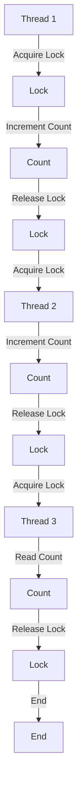

## Introduction
Locks are a fundamental synchronization mechanism in concurrent programming, allowing multiple threads to access shared resources safely. In Java, **ReentrantLock**, **ReadWriteLock**, and **StampedLock** are three types of locks that provide different levels of concurrency and synchronization. Understanding these locks is crucial for building high-performance, concurrent systems. **ReentrantLock** is a basic lock that allows a thread to reacquire the lock, while **ReadWriteLock** allows multiple threads to read a resource simultaneously. **StampedLock**, introduced in Java 8, provides a more advanced locking mechanism that allows for optimistic concurrency.

> **Note:** Locks are essential in concurrent programming, as they prevent data corruption and ensure thread safety. In a multi-threaded environment, locks help to synchronize access to shared resources, ensuring that only one thread can modify the resource at a time.

## Core Concepts
* **Lock**: A lock is a synchronization mechanism that allows only one thread to access a shared resource at a time.
* **ReentrantLock**: A reentrant lock is a lock that allows a thread to reacquire the lock, even if it already holds the lock.
* **ReadWriteLock**: A read-write lock is a lock that allows multiple threads to read a resource simultaneously, but only one thread can write to the resource at a time.
* **StampedLock**: A stamped lock is a lock that provides a combination of exclusive and shared modes, allowing for optimistic concurrency.

> **Warning:** Using locks incorrectly can lead to deadlocks, livelocks, or starvation, which can significantly impact system performance and reliability.

## How It Works Internally
When a thread acquires a lock, it gains exclusive access to the shared resource. The lock is typically implemented using a combination of atomic operations and a queue to manage waiting threads. The **ReentrantLock** and **ReadWriteLock** use a fairness policy to ensure that threads are granted access to the lock in a fair order. The **StampedLock** uses a stamped token to manage access to the lock, allowing for optimistic concurrency.

Here is a step-by-step breakdown of how a **ReentrantLock** works:
1. A thread attempts to acquire the lock using the `lock()` method.
2. If the lock is available, the thread acquires the lock and increments the lock count.
3. If the lock is not available, the thread is added to the waiting queue.
4. When the lock is released using the `unlock()` method, the lock count is decremented.
5. If the lock count reaches zero, the next thread in the waiting queue is granted access to the lock.

## Code Examples
### Example 1: Basic ReentrantLock Usage
```java
import java.util.concurrent.locks.ReentrantLock;

public class ReentrantLockExample {
    private final ReentrantLock lock = new ReentrantLock();
    private int count = 0;

    public void increment() {
        lock.lock(); // Acquire the lock
        try {
            count++;
        } finally {
            lock.unlock(); // Release the lock
        }
    }

    public int getCount() {
        lock.lock(); // Acquire the lock
        try {
            return count;
        } finally {
            lock.unlock(); // Release the lock
        }
    }

    public static void main(String[] args) throws InterruptedException {
        ReentrantLockExample example = new ReentrantLockExample();
        Thread thread1 = new Thread(() -> {
            for (int i = 0; i < 10000; i++) {
                example.increment();
            }
        });
        Thread thread2 = new Thread(() -> {
            for (int i = 0; i < 10000; i++) {
                example.increment();
            }
        });
        thread1.start();
        thread2.start();
        thread1.join();
        thread2.join();
        System.out.println(example.getCount()); // Should print 20000
    }
}
```
### Example 2: ReadWriteLock Usage
```java
import java.util.concurrent.locks.ReadWriteLock;
import java.util.concurrent.locks.ReentrantReadWriteLock;

public class ReadWriteLockExample {
    private final ReadWriteLock lock = new ReentrantReadWriteLock();
    private int count = 0;

    public void increment() {
        lock.writeLock().lock(); // Acquire the write lock
        try {
            count++;
        } finally {
            lock.writeLock().unlock(); // Release the write lock
        }
    }

    public int getCount() {
        lock.readLock().lock(); // Acquire the read lock
        try {
            return count;
        } finally {
            lock.readLock().unlock(); // Release the read lock
        }
    }

    public static void main(String[] args) throws InterruptedException {
        ReadWriteLockExample example = new ReadWriteLockExample();
        Thread thread1 = new Thread(() -> {
            for (int i = 0; i < 10000; i++) {
                example.increment();
            }
        });
        Thread thread2 = new Thread(() -> {
            for (int i = 0; i < 10000; i++) {
                example.increment();
            }
        });
        Thread thread3 = new Thread(() -> {
            for (int i = 0; i < 10000; i++) {
                System.out.println(example.getCount());
            }
        });
        thread1.start();
        thread2.start();
        thread3.start();
        thread1.join();
        thread2.join();
        thread3.join();
        System.out.println(example.getCount()); // Should print 20000
    }
}
```
### Example 3: StampedLock Usage
```java
import java.util.concurrent.locks.StampedLock;

public class StampedLockExample {
    private final StampedLock lock = new StampedLock();
    private int count = 0;

    public void increment() {
        long stamp = lock.writeLock(); // Acquire the write lock
        try {
            count++;
        } finally {
            lock.unlockWrite(stamp); // Release the write lock
        }
    }

    public int getCount() {
        long stamp = lock.readLock(); // Acquire the read lock
        try {
            return count;
        } finally {
            lock.unlockRead(stamp); // Release the read lock
        }
    }

    public static void main(String[] args) throws InterruptedException {
        StampedLockExample example = new StampedLockExample();
        Thread thread1 = new Thread(() -> {
            for (int i = 0; i < 10000; i++) {
                example.increment();
            }
        });
        Thread thread2 = new Thread(() -> {
            for (int i = 0; i < 10000; i++) {
                example.increment();
            }
        });
        Thread thread3 = new Thread(() -> {
            for (int i = 0; i < 10000; i++) {
                System.out.println(example.getCount());
            }
        });
        thread1.start();
        thread2.start();
        thread3.start();
        thread1.join();
        thread2.join();
        thread3.join();
        System.out.println(example.getCount()); // Should print 20000
    }
}
```
> **Tip:** When using locks, it's essential to follow best practices, such as always releasing the lock in a finally block to ensure that the lock is released even if an exception occurs.

## Visual Diagram

The diagram illustrates the sequence of events when multiple threads access a shared resource using a lock. The lock is acquired by each thread, the count is incremented or read, and the lock is released.

## Comparison
| Lock Type | Time Complexity | Space Complexity | Pros | Cons |
| --- | --- | --- | --- | --- |
| ReentrantLock | O(1) | O(1) | Reentrant, fair | Can be slow due to fairness policy |
| ReadWriteLock | O(1) | O(1) | Allows multiple readers | Can be slow due to writer priority |
| StampedLock | O(1) | O(1) | Optimistic concurrency | Can be complex to use |

> **Interview:** What is the difference between a reentrant lock and a read-write lock? A reentrant lock allows a thread to reacquire the lock, while a read-write lock allows multiple threads to read a resource simultaneously.

## Real-world Use Cases
* **Database transactions**: Locks are used to ensure that database transactions are executed atomically and consistently.
* **File systems**: Locks are used to prevent multiple threads from accessing the same file simultaneously.
* **Web servers**: Locks are used to prevent multiple threads from accessing the same resource simultaneously.

## Common Pitfalls
* **Deadlocks**: Deadlocks occur when two or more threads are blocked indefinitely, each waiting for the other to release a resource.
* **Livelocks**: Livelocks occur when two or more threads are unable to proceed because they are too busy responding to each other's actions.
* **Starvation**: Starvation occurs when a thread is unable to access a shared resource due to other threads holding the lock for an extended period.
* **Lock contention**: Lock contention occurs when multiple threads compete for the same lock, leading to performance degradation.

> **Warning:** Locks can be a performance bottleneck if not used carefully. It's essential to minimize lock contention and avoid deadlocks, livelocks, and starvation.

## Interview Tips
* **What is the difference between a reentrant lock and a read-write lock?**: A reentrant lock allows a thread to reacquire the lock, while a read-write lock allows multiple threads to read a resource simultaneously.
* **How do you avoid deadlocks?**: To avoid deadlocks, ensure that locks are always acquired in a consistent order, and avoid nested locks.
* **What is the purpose of a stamped lock?**: A stamped lock provides optimistic concurrency, allowing multiple threads to access a shared resource simultaneously.

## Key Takeaways
* **Locks are essential for synchronization**: Locks ensure that multiple threads can access shared resources safely.
* **ReentrantLock is a basic lock**: ReentrantLock allows a thread to reacquire the lock.
* **ReadWriteLock allows multiple readers**: ReadWriteLock allows multiple threads to read a resource simultaneously.
* **StampedLock provides optimistic concurrency**: StampedLock allows multiple threads to access a shared resource simultaneously.
* **Locks can be a performance bottleneck**: Locks can lead to performance degradation if not used carefully.
* **Deadlocks, livelocks, and starvation must be avoided**: These conditions can lead to system instability and performance degradation.
* **Locks must be released in a finally block**: To ensure that locks are always released, even if an exception occurs.