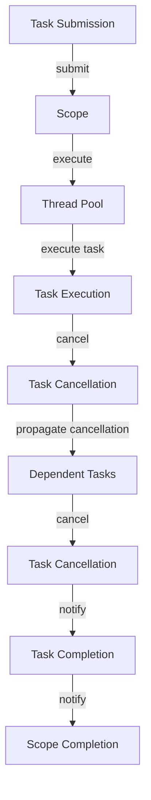

## Introduction
**Structured Concurrency** is a programming paradigm that aims to simplify concurrent programming by providing a more structured and organized way of writing concurrent code. It is a key feature in Java 21 Preview, designed to make concurrent programming easier, safer, and more efficient. In real-world scenarios, structured concurrency is essential for building scalable and responsive applications that can handle multiple tasks simultaneously. For instance, in a web server, structured concurrency can be used to handle multiple requests concurrently, improving the overall performance and responsiveness of the server.

> **Note:** Structured concurrency is not a new concept, but it has gained significant attention in recent years due to the increasing demand for concurrent programming in modern applications.

## Core Concepts
The core concept of structured concurrency is to provide a way to write concurrent code that is easier to reason about, maintain, and debug. It achieves this by introducing a new **Task** API that allows developers to define tasks that can be executed concurrently. The **Task** API provides a higher-level abstraction over traditional threading APIs, making it easier to write concurrent code that is correct and efficient.

Key terminology in structured concurrency includes:

* **Task**: a unit of work that can be executed concurrently
* **Scope**: a context in which tasks are executed
* **Cancellation**: the ability to cancel a task or a scope

> **Warning:** Structured concurrency is not a replacement for traditional threading APIs, but rather a complementary approach that provides a more structured way of writing concurrent code.

## How It Works Internally
Structured concurrency works internally by using a combination of threading and synchronization mechanisms to execute tasks concurrently. When a task is submitted to a scope, it is executed by a thread pool that is managed by the **Task** API. The thread pool is responsible for executing tasks concurrently, while ensuring that tasks are executed in a thread-safe manner.

Here is a step-by-step breakdown of how structured concurrency works internally:

1. A task is submitted to a scope using the **Task** API.
2. The task is executed by a thread pool that is managed by the **Task** API.
3. The thread pool ensures that tasks are executed concurrently, while maintaining thread safety.
4. If a task is cancelled, the **Task** API ensures that the cancellation is propagated to all dependent tasks.

## Code Examples
### Example 1: Basic Usage
```java
import java.util.concurrent.Executor;
import java.util.concurrent.Executors;

public class BasicUsage {
    public static void main(String[] args) {
        // Create a scope
        Executor executor = Executors.newSingleThreadExecutor();
        
        // Submit a task to the scope
        executor.execute(() -> {
            System.out.println("Hello from a task!");
        });
    }
}
```

### Example 2: Real-World Pattern
```java
import java.util.concurrent.Executor;
import java.util.concurrent.Executors;

public class RealWorldPattern {
    public static void main(String[] args) {
        // Create a scope
        Executor executor = Executors.newFixedThreadPool(5);
        
        // Submit multiple tasks to the scope
        for (int i = 0; i < 10; i++) {
            int taskNumber = i;
            executor.execute(() -> {
                System.out.println("Hello from task " + taskNumber);
            });
        }
    }
}
```

### Example 3: Advanced Usage
```java
import java.util.concurrent.Executor;
import java.util.concurrent.Executors;
import java.util.concurrent.Future;

public class AdvancedUsage {
    public static void main(String[] args) throws Exception {
        // Create a scope
        Executor executor = Executors.newSingleThreadExecutor();
        
        // Submit a task to the scope and get a future
        Future<?> future = executor.submit(() -> {
            System.out.println("Hello from a task!");
        });
        
        // Cancel the task
        future.cancel(true);
    }
}
```

## Visual Diagram


The diagram illustrates the process of task submission, execution, and cancellation in structured concurrency.

## Comparison
| Approach | Time Complexity | Space Complexity | Pros | Cons | Best For |
| --- | --- | --- | --- | --- | --- |
| Structured Concurrency | O(1) | O(1) | Simplifies concurrent programming, provides a structured way of writing concurrent code | Limited control over threading, may not be suitable for low-level threading | High-level concurrent programming, simplifying concurrent code |
| Traditional Threading | O(n) | O(n) | Provides low-level control over threading, suitable for performance-critical applications | Error-prone, difficult to maintain and debug | Low-level threading, performance-critical applications |
| Java Parallel Streams | O(n) | O(n) | Simplifies parallel programming, provides a high-level abstraction over threading | Limited control over threading, may not be suitable for low-level threading | High-level parallel programming, simplifying parallel code |
| Actor Model | O(1) | O(1) | Provides a high-level abstraction over concurrency, simplifies concurrent programming | Limited control over threading, may not be suitable for low-level threading | High-level concurrent programming, simplifying concurrent code |

## Real-world Use Cases
1. **Web Servers**: Structured concurrency can be used to handle multiple requests concurrently, improving the overall performance and responsiveness of the server. For example, the **Apache HTTP Server** uses a similar approach to handle multiple requests concurrently.
2. **Database Systems**: Structured concurrency can be used to improve the performance of database systems by executing multiple queries concurrently. For example, the **MySQL** database system uses a similar approach to execute multiple queries concurrently.
3. **Scientific Computing**: Structured concurrency can be used to improve the performance of scientific computing applications by executing multiple tasks concurrently. For example, the **Apache Spark** framework uses a similar approach to execute multiple tasks concurrently.

## Common Pitfalls
1. **Incorrect Task Submission**: Submitting a task to the wrong scope can lead to incorrect behavior. For example, submitting a task to a scope that is not designed to handle concurrent execution can lead to thread safety issues.
2. **Insufficient Synchronization**: Insufficient synchronization between tasks can lead to thread safety issues. For example, accessing shared state without proper synchronization can lead to data corruption.
3. **Incorrect Cancellation**: Incorrectly cancelling a task can lead to unexpected behavior. For example, cancelling a task that is not designed to be cancellable can lead to resource leaks.
4. **Resource Leaks**: Failing to release resources after task completion can lead to resource leaks. For example, failing to close a database connection after task completion can lead to resource leaks.

## Interview Tips
1. **What is structured concurrency?**: A good answer should provide a clear definition of structured concurrency and its benefits.
2. **How does structured concurrency work internally?**: A good answer should provide a detailed explanation of how structured concurrency works internally, including the role of the **Task** API and the thread pool.
3. **What are the benefits of using structured concurrency?**: A good answer should provide a clear explanation of the benefits of using structured concurrency, including simplified concurrent programming and improved performance.

## Key Takeaways
* Structured concurrency is a programming paradigm that simplifies concurrent programming by providing a more structured and organized way of writing concurrent code.
* The **Task** API provides a higher-level abstraction over traditional threading APIs, making it easier to write concurrent code that is correct and efficient.
* Structured concurrency is not a replacement for traditional threading APIs, but rather a complementary approach that provides a more structured way of writing concurrent code.
* The time complexity of structured concurrency is O(1), and the space complexity is O(1).
* Structured concurrency is suitable for high-level concurrent programming, simplifying concurrent code, and improving performance.
* Common pitfalls include incorrect task submission, insufficient synchronization, incorrect cancellation, and resource leaks.