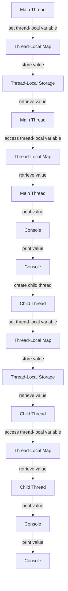

## Introduction
**ThreadLocal** is a Java class that allows you to create variables that are local to a specific thread. It is a part of the Java Concurrency API and is used to achieve thread-safety in multithreaded applications. In a multithreaded environment, each thread has its own copy of the variable, and changes made by one thread do not affect the other threads. This is particularly useful when you want to maintain a separate state for each thread, such as a transaction ID or a user ID.

> **Note:** ThreadLocal variables are not shared between threads, which makes them useful for avoiding synchronization issues and improving performance.

ThreadLocal is commonly used in real-world applications, such as web servers, where each request is handled by a separate thread. For example, a web server might use ThreadLocal to store the current user's ID or the current transaction ID. This allows the server to handle multiple requests concurrently without worrying about thread-safety issues.

## Core Concepts
The core concept of ThreadLocal is that it allows you to create variables that are local to a specific thread. Here are some key terms and definitions:

* **ThreadLocal**: a Java class that provides a way to create variables that are local to a specific thread.
* **Thread-local variable**: a variable that is local to a specific thread and is not shared with other threads.
* **Thread-local storage**: a mechanism that allows each thread to have its own copy of a variable.

> **Tip:** ThreadLocal is a useful tool for achieving thread-safety in multithreaded applications, but it should be used judiciously, as it can lead to memory leaks if not used properly.

Mental models for understanding ThreadLocal include:

* **Separate copies**: each thread has its own separate copy of the variable, which is not shared with other threads.
* **Thread-local scope**: the variable is only accessible within the scope of the current thread.

## How It Works Internally
ThreadLocal works by using a hash map to store the thread-local variables. Each thread has its own hash map, which is used to store the variables that are local to that thread. When a thread accesses a ThreadLocal variable, it uses its own hash map to retrieve the value.

Here is a step-by-step breakdown of how ThreadLocal works:

1. **Initialization**: the ThreadLocal variable is initialized with a default value.
2. **Thread creation**: when a new thread is created, it creates its own hash map to store the thread-local variables.
3. **Variable access**: when a thread accesses a ThreadLocal variable, it uses its own hash map to retrieve the value.
4. **Variable update**: when a thread updates a ThreadLocal variable, it updates the value in its own hash map.

> **Warning:** ThreadLocal variables can lead to memory leaks if not used properly. For example, if a thread-local variable is not removed when the thread is finished, it can continue to occupy memory.

## Code Examples
Here are three complete and runnable code examples that demonstrate the use of ThreadLocal:

### Example 1: Basic Usage
```java
public class ThreadLocalExample {
    private static ThreadLocal<String> threadLocal = new ThreadLocal<>();

    public static void main(String[] args) {
        threadLocal.set("Main thread");
        System.out.println("Main thread: " + threadLocal.get());

        Thread thread = new Thread(() -> {
            threadLocal.set("Child thread");
            System.out.println("Child thread: " + threadLocal.get());
        });
        thread.start();
        try {
            thread.join();
        } catch (InterruptedException e) {
            Thread.currentThread().interrupt();
        }
        System.out.println("Main thread: " + threadLocal.get());
    }
}
```
This example demonstrates the basic usage of ThreadLocal. The main thread sets the value of the thread-local variable to "Main thread", and the child thread sets the value to "Child thread". The output shows that each thread has its own separate copy of the variable.

### Example 2: Real-World Pattern
```java
public class TransactionManager {
    private static ThreadLocal<String> transactionId = new ThreadLocal<>();

    public static void startTransaction(String id) {
        transactionId.set(id);
    }

    public static String getTransactionId() {
        return transactionId.get();
    }

    public static void endTransaction() {
        transactionId.remove();
    }

    public static void main(String[] args) {
        startTransaction("Transaction 1");
        System.out.println("Transaction ID: " + getTransactionId());

        Thread thread = new Thread(() -> {
            startTransaction("Transaction 2");
            System.out.println("Transaction ID: " + getTransactionId());
            endTransaction();
        });
        thread.start();
        try {
            thread.join();
        } catch (InterruptedException e) {
            Thread.currentThread().interrupt();
        }
        System.out.println("Transaction ID: " + getTransactionId());
    }
}
```
This example demonstrates a real-world pattern for using ThreadLocal. The `TransactionManager` class uses a thread-local variable to store the current transaction ID. The `startTransaction` method sets the transaction ID, and the `getTransactionId` method retrieves the ID. The `endTransaction` method removes the transaction ID when the transaction is finished.

### Example 3: Advanced Usage
```java
public class ThreadLocalExample {
    private static ThreadLocal<String> threadLocal = new ThreadLocal<>();

    public static void main(String[] args) {
        threadLocal.set("Main thread");
        System.out.println("Main thread: " + threadLocal.get());

        ExecutorService executor = Executors.newFixedThreadPool(5);
        for (int i = 0; i < 10; i++) {
            final int index = i;
            executor.submit(() -> {
                threadLocal.set("Thread " + index);
                System.out.println("Thread " + index + ": " + threadLocal.get());
            });
        }
        executor.shutdown();
        try {
            executor.awaitTermination(1, TimeUnit.MINUTES);
        } catch (InterruptedException e) {
            Thread.currentThread().interrupt();
        }
        System.out.println("Main thread: " + threadLocal.get());
    }
}
```
This example demonstrates an advanced usage of ThreadLocal. The main thread sets the value of the thread-local variable to "Main thread", and then submits 10 tasks to an executor service. Each task sets the value of the thread-local variable to "Thread X", where X is the index of the task. The output shows that each thread has its own separate copy of the variable.

## Visual Diagram

This diagram shows the flow of thread-local variables between the main thread and the child thread. The main thread sets the value of the thread-local variable, which is stored in the thread-local map. The child thread sets its own value of the thread-local variable, which is also stored in the thread-local map.

## Comparison
| Approach | Time Complexity | Space Complexity | Pros | Cons | Best For |
| --- | --- | --- | --- | --- | --- |
| ThreadLocal | O(1) | O(n) | Thread-safe, easy to use | Can lead to memory leaks if not used properly | Multithreaded applications where thread-safety is critical |
| Synchronized | O(n) | O(1) | Thread-safe, easy to implement | Can lead to performance issues due to synchronization overhead | Multithreaded applications where thread-safety is critical, but performance is not a concern |
| Locks | O(n) | O(1) | Thread-safe, flexible | Can lead to performance issues due to lock contention | Multithreaded applications where thread-safety is critical, and fine-grained locking is required |
| Atomic Variables | O(1) | O(1) | Thread-safe, efficient | Limited to primitive types | Multithreaded applications where thread-safety is critical, and atomic updates are required |

## Real-world Use Cases
Here are three real-world use cases for ThreadLocal:

* **Database connections**: a web server might use ThreadLocal to store the current database connection for each thread.
* **Transaction IDs**: a financial application might use ThreadLocal to store the current transaction ID for each thread.
* **User IDs**: a web application might use ThreadLocal to store the current user ID for each thread.

## Common Pitfalls
Here are four common pitfalls to watch out for when using ThreadLocal:

* **Memory leaks**: if a thread-local variable is not removed when the thread is finished, it can continue to occupy memory.
* **Incorrect usage**: if a thread-local variable is not used correctly, it can lead to thread-safety issues.
* **Performance issues**: if a thread-local variable is not used efficiently, it can lead to performance issues.
* **Deadlocks**: if a thread-local variable is used in a way that can lead to deadlocks, it can cause the application to hang.

> **Warning:** ThreadLocal variables can lead to memory leaks if not used properly. Make sure to remove the thread-local variable when the thread is finished.

## Interview Tips
Here are three common interview questions related to ThreadLocal:

* **What is ThreadLocal?**: a good answer should explain that ThreadLocal is a Java class that provides a way to create variables that are local to a specific thread.
* **How does ThreadLocal work?**: a good answer should explain the internal mechanics of ThreadLocal, including the use of a hash map to store the thread-local variables.
* **What are the benefits and drawbacks of using ThreadLocal?**: a good answer should explain the benefits of using ThreadLocal, including thread-safety and ease of use, as well as the drawbacks, including the potential for memory leaks and performance issues.

> **Interview:** Be prepared to answer questions about the internal mechanics of ThreadLocal, as well as the benefits and drawbacks of using it.

## Key Takeaways
Here are ten key takeaways to remember about ThreadLocal:

* **ThreadLocal is a Java class that provides a way to create variables that are local to a specific thread**.
* **ThreadLocal uses a hash map to store the thread-local variables**.
* **Each thread has its own separate copy of the thread-local variable**.
* **ThreadLocal is thread-safe and easy to use**.
* **ThreadLocal can lead to memory leaks if not used properly**.
* **ThreadLocal has a time complexity of O(1) and a space complexity of O(n)**.
* **ThreadLocal is best used in multithreaded applications where thread-safety is critical**.
* **ThreadLocal can be used to store database connections, transaction IDs, and user IDs**.
* **ThreadLocal should be used judiciously, as it can lead to performance issues if not used efficiently**.
* **ThreadLocal is a powerful tool for achieving thread-safety in multithreaded applications, but it requires careful usage to avoid common pitfalls**.