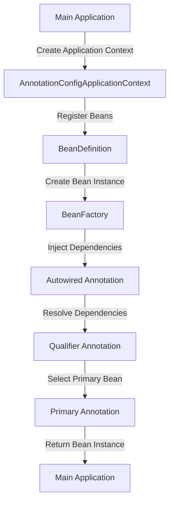

## Introduction
Autowiring is a fundamental concept in the Spring Framework that enables developers to automatically inject dependencies into beans. This feature simplifies the process of managing complex object graphs and reduces the amount of boilerplate code required to configure an application. In this section, we will explore the importance of autowiring, its real-world relevance, and why every engineer should understand this concept.

Autowiring is essential in modern software development, as it allows developers to focus on writing business logic rather than managing dependencies. By automatically injecting dependencies, autowiring enables developers to write more modular, flexible, and maintainable code. In real-world applications, autowiring is used extensively in frameworks such as Spring Boot, which provides a simplified way of building web applications and microservices.

> **Note:** Autowiring is not unique to Spring and is also available in other frameworks, such as Guice and CDI. However, Spring's implementation of autowiring is one of the most widely used and well-established.

## Core Concepts
In this section, we will delve into the core concepts of autowiring, including **@Autowired**, **@Qualifier**, and **@Primary**.

*   **@Autowired**: This annotation is used to enable autowiring for a specific bean or field. When a bean is annotated with **@Autowired**, Spring will automatically inject the required dependencies into the bean.
*   **@Qualifier**: This annotation is used to specify the name of the bean that should be injected. This is useful when there are multiple beans of the same type, and you want to inject a specific one.
*   **@Primary**: This annotation is used to specify that a particular bean should be used as the primary bean when there are multiple beans of the same type.

> **Warning:** When using **@Autowired**, make sure that the bean is properly configured and registered in the application context. Failure to do so can result in a **NoSuchBeanDefinitionException**.

## How It Works Internally
Autowiring works by using the **BeanFactory** and **BeanDefinition** classes to manage the creation and injection of beans. When a bean is annotated with **@Autowired**, Spring will use the **BeanFactory** to create an instance of the bean and inject the required dependencies.

Here is a step-by-step breakdown of how autowiring works internally:

1.  The **BeanFactory** is created and configured with the application context.
2.  The **BeanDefinition** is created and registered with the **BeanFactory**.
3.  The **BeanFactory** uses the **BeanDefinition** to create an instance of the bean.
4.  The **BeanFactory** injects the required dependencies into the bean using the **@Autowired** annotation.
5.  The bean is then returned to the application for use.

> **Tip:** To improve performance, consider using **@Lazy** annotation to enable lazy loading of beans. This can help reduce the overhead of creating and injecting beans that are not immediately needed.

## Code Examples
Here are three complete and runnable code examples that demonstrate the use of autowiring:

### Example 1: Basic Autowiring
```java
// Import necessary annotations and classes
import org.springframework.context.annotation.AnnotationConfigApplicationContext;
import org.springframework.context.annotation.Configuration;
import org.springframework.beans.factory.annotation.Autowired;

// Define a simple service interface
interface UserService {
    void printName();
}

// Define a simple service implementation
@Configuration
class UserServiceImpl implements UserService {
    @Override
    public void printName() {
        System.out.println("John Doe");
    }
}

// Define a main application class
public class Main {
    @Autowired
    private UserService userService;

    public static void main(String[] args) {
        // Create an application context
        AnnotationConfigApplicationContext context = new AnnotationConfigApplicationContext(Main.class);

        // Get the main application instance
        Main main = context.getBean(Main.class);

        // Call the printName method
        main.userService.printName();
    }
}
```

### Example 2: Using @Qualifier
```java
// Import necessary annotations and classes
import org.springframework.context.annotation.AnnotationConfigApplicationContext;
import org.springframework.context.annotation.Configuration;
import org.springframework.beans.factory.annotation.Autowired;
import org.springframework.beans.factory.annotation.Qualifier;

// Define a simple service interface
interface UserService {
    void printName();
}

// Define two simple service implementations
@Configuration
class UserServiceImpl1 implements UserService {
    @Override
    public void printName() {
        System.out.println("John Doe");
    }
}

@Configuration
class UserServiceImpl2 implements UserService {
    @Override
    public void printName() {
        System.out.println("Jane Doe");
    }
}

// Define a main application class
public class Main {
    @Autowired
    @Qualifier("userServiceImpl1")
    private UserService userService;

    public static void main(String[] args) {
        // Create an application context
        AnnotationConfigApplicationContext context = new AnnotationConfigApplicationContext(Main.class);

        // Get the main application instance
        Main main = context.getBean(Main.class);

        // Call the printName method
        main.userService.printName();
    }
}
```

### Example 3: Using @Primary
```java
// Import necessary annotations and classes
import org.springframework.context.annotation.AnnotationConfigApplicationContext;
import org.springframework.context.annotation.Configuration;
import org.springframework.beans.factory.annotation.Autowired;
import org.springframework.beans.factory.annotation.Primary;

// Define a simple service interface
interface UserService {
    void printName();
}

// Define two simple service implementations
@Configuration
class UserServiceImpl1 implements UserService {
    @Override
    public void printName() {
        System.out.println("John Doe");
    }
}

@Configuration
@Primary
class UserServiceImpl2 implements UserService {
    @Override
    public void printName() {
        System.out.println("Jane Doe");
    }
}

// Define a main application class
public class Main {
    @Autowired
    private UserService userService;

    public static void main(String[] args) {
        // Create an application context
        AnnotationConfigApplicationContext context = new AnnotationConfigApplicationContext(Main.class);

        // Get the main application instance
        Main main = context.getBean(Main.class);

        // Call the printName method
        main.userService.printName();
    }
}
```

## Visual Diagram

This diagram illustrates the process of creating an application context, registering beans, and injecting dependencies using autowiring. The **@Autowired** annotation is used to enable autowiring, while the **@Qualifier** annotation is used to specify the name of the bean to inject. The **@Primary** annotation is used to select the primary bean when there are multiple beans of the same type.

> **Interview:** In an interview, you may be asked to explain the difference between **@Autowired** and **@Qualifier**. Be sure to highlight the role of **@Autowired** in enabling autowiring and the role of **@Qualifier** in specifying the name of the bean to inject.

## Comparison
Here is a comparison of different approaches to dependency injection:

| Approach | Time Complexity | Space Complexity | Pros | Cons | Best For |
| --- | --- | --- | --- | --- | --- |
| Autowiring | O(1) | O(1) | Simplifies dependency injection, reduces boilerplate code | Can lead to tight coupling, makes it harder to debug | Small to medium-sized applications |
| Constructor Injection | O(1) | O(1) | Makes dependencies explicit, easier to test | Can lead to constructor overloading, makes it harder to use inheritance | Large-scale applications, applications with complex dependencies |
| Setter Injection | O(1) | O(1) | Allows for optional dependencies, makes it easier to use inheritance | Can lead to mutable state, makes it harder to test | Applications with optional dependencies, applications that require a high degree of flexibility |

> **Tip:** When choosing an approach to dependency injection, consider the size and complexity of your application, as well as the trade-offs between simplicity, testability, and flexibility.

## Real-world Use Cases
Here are three real-world examples of using autowiring in production applications:

*   **Netflix**: Netflix uses autowiring extensively in its microservices architecture to manage dependencies between services. By using autowiring, Netflix can simplify its dependency injection and reduce the amount of boilerplate code required to configure its services.
*   **Amazon**: Amazon uses autowiring in its AWS Lambda platform to manage dependencies between functions. By using autowiring, Amazon can simplify its dependency injection and reduce the amount of boilerplate code required to configure its functions.
*   **Google**: Google uses autowiring in its Google Cloud Platform to manage dependencies between services. By using autowiring, Google can simplify its dependency injection and reduce the amount of boilerplate code required to configure its services.

> **Note:** Autowiring is a widely adopted technology in the industry, and many companies use it to simplify their dependency injection and reduce the amount of boilerplate code required to configure their applications.

## Common Pitfalls
Here are four common pitfalls to watch out for when using autowiring:

*   **Tight Coupling**: Autowiring can lead to tight coupling between beans, making it harder to test and maintain the application. To avoid this, use **@Qualifier** to specify the name of the bean to inject, and use **@Primary** to select the primary bean when there are multiple beans of the same type.
*   **Over-Reliance on Autowiring**: Autowiring can make it harder to debug the application, as the dependencies are not explicit. To avoid this, use constructor injection or setter injection to make dependencies explicit, and use autowiring only when necessary.
*   **Mutable State**: Autowiring can lead to mutable state, as the dependencies are injected at runtime. To avoid this, use immutable state, and use autowiring only when necessary.
*   **Debugging Issues**: Autowiring can make it harder to debug the application, as the dependencies are not explicit. To avoid this, use constructor injection or setter injection to make dependencies explicit, and use autowiring only when necessary.

> **Warning:** Be careful when using autowiring, as it can lead to tight coupling, over-reliance on autowiring, mutable state, and debugging issues. Use autowiring judiciously, and consider the trade-offs between simplicity, testability, and flexibility.

## Interview Tips
Here are three common interview questions related to autowiring, along with weak and strong answers:

*   **Question 1:** What is autowiring, and how does it work?
    *   **Weak Answer:** Autowiring is a technology that enables dependency injection. It works by using annotations to inject dependencies into beans.
    *   **Strong Answer:** Autowiring is a technology that enables dependency injection by using annotations to inject dependencies into beans. It works by using the **BeanFactory** and **BeanDefinition** classes to manage the creation and injection of beans. Autowiring can simplify dependency injection and reduce the amount of boilerplate code required to configure an application.
*   **Question 2:** What is the difference between **@Autowired** and **@Qualifier**?
    *   **Weak Answer:** **@Autowired** is used to enable autowiring, while **@Qualifier** is used to specify the name of the bean to inject.
    *   **Strong Answer:** **@Autowired** is used to enable autowiring, while **@Qualifier** is used to specify the name of the bean to inject. **@Autowired** is used to inject dependencies into beans, while **@Qualifier** is used to select the primary bean when there are multiple beans of the same type.
*   **Question 3:** How do you avoid tight coupling when using autowiring?
    *   **Weak Answer:** You can avoid tight coupling by using constructor injection or setter injection.
    *   **Strong Answer:** You can avoid tight coupling by using **@Qualifier** to specify the name of the bean to inject, and by using **@Primary** to select the primary bean when there are multiple beans of the same type. Additionally, you can use constructor injection or setter injection to make dependencies explicit, and use autowiring only when necessary.

> **Tip:** When answering interview questions related to autowiring, be sure to highlight the benefits and trade-offs of using autowiring, and demonstrate your understanding of the technology and its applications.

## Key Takeaways
Here are ten key takeaways to remember when using autowiring:

*   **Autowiring simplifies dependency injection**: Autowiring can simplify dependency injection and reduce the amount of boilerplate code required to configure an application.
*   **Autowiring can lead to tight coupling**: Autowiring can lead to tight coupling between beans, making it harder to test and maintain the application.
*   **Use @Qualifier to specify the name of the bean to inject**: **@Qualifier** can be used to specify the name of the bean to inject, and to select the primary bean when there are multiple beans of the same type.
*   **Use @Primary to select the primary bean**: **@Primary** can be used to select the primary bean when there are multiple beans of the same type.
*   **Autowiring can lead to mutable state**: Autowiring can lead to mutable state, as the dependencies are injected at runtime.
*   **Use constructor injection or setter injection to make dependencies explicit**: Constructor injection or setter injection can be used to make dependencies explicit, and to avoid tight coupling.
*   **Autowiring can make it harder to debug the application**: Autowiring can make it harder to debug the application, as the dependencies are not explicit.
*   **Use autowiring judiciously**: Autowiring should be used judiciously, and only when necessary.
*   **Consider the trade-offs between simplicity, testability, and flexibility**: When using autowiring, consider the trade-offs between simplicity, testability, and flexibility.
*   **Use @Lazy to enable lazy loading of beans**: **@Lazy** can be used to enable lazy loading of beans, and to improve performance.

> **Note:** Autowiring is a powerful technology that can simplify dependency injection and reduce the amount of boilerplate code required to configure an application. However, it can also lead to tight coupling, mutable state, and debugging issues. Use autowiring judiciously, and consider the trade-offs between simplicity, testability, and flexibility.