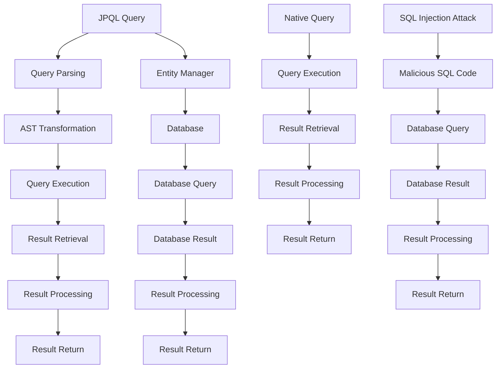

## Introduction
**JPQL (Java Persistence Query Language)** is a query language used to retrieve and manipulate data in a database using Java. It is a part of the Java Persistence API (JPA) and is used to define queries that can be executed on a database. JPQL is similar to SQL, but it is object-oriented and allows developers to work with Java objects rather than database tables. In this section, we will explore why JPQL matters, its real-world relevance, and why every engineer needs to know about it.

JPQL is important because it provides a standard way to access and manipulate data in a database using Java. It allows developers to write queries that are independent of the underlying database management system, making it easy to switch from one database to another. Additionally, JPQL provides a lot of functionality, such as support for joins, subqueries, and aggregate functions, making it a powerful tool for retrieving and manipulating data.

> **Note:** JPQL is not the same as SQL, although they share many similarities. JPQL is object-oriented and is used to work with Java objects, while SQL is a query language used to work with database tables.

## Core Concepts
In this section, we will explore the core concepts of JPQL and native queries. We will cover the key terminology, mental models, and precise definitions that are necessary to understand JPQL and native queries.

*   **JPQL:** JPQL is a query language used to retrieve and manipulate data in a database using Java. It is a part of the Java Persistence API (JPA) and is used to define queries that can be executed on a database.
*   **Native Query:** A native query is a query that is written in the native language of the database management system. For example, if we are using MySQL, a native query would be written in SQL.
*   **Entity Manager:** The entity manager is an interface that is used to interact with the database. It provides methods for creating, reading, updating, and deleting data in the database.
*   **Query:** A query is a request to retrieve or manipulate data in the database. In JPQL, queries are defined using the `@Query` annotation.

> **Tip:** When working with JPQL, it is essential to understand the difference between JPQL and native queries. JPQL is used to define queries that are independent of the underlying database management system, while native queries are used to define queries that are specific to a particular database management system.

## How It Works Internally
In this section, we will explore how JPQL and native queries work internally. We will cover the under-the-hood mechanics, step-by-step, and provide a detailed explanation of how JPQL and native queries are executed.

When a JPQL query is executed, the following steps occur:

1.  **Query Definition:** The query is defined using the `@Query` annotation.
2.  **Query Parsing:** The query is parsed into an abstract syntax tree (AST).
3.  **AST Transformation:** The AST is transformed into a query that can be executed on the database.
4.  **Query Execution:** The query is executed on the database.
5.  **Result Retrieval:** The results of the query are retrieved from the database.

For native queries, the process is similar, but the query is defined using the native language of the database management system.

> **Warning:** When working with native queries, it is essential to be aware of the potential for SQL injection attacks. SQL injection attacks occur when an attacker is able to inject malicious SQL code into a query, which can then be executed on the database.

## Code Examples
In this section, we will provide three complete and runnable code examples that demonstrate how to use JPQL and native queries.

### Example 1: Basic JPQL Query
```java
// Define the entity
@Entity
public class User {
    @Id
    @GeneratedValue(strategy = GenerationType.IDENTITY)
    private Long id;
    private String name;
    private String email;
    // Getters and setters
}

// Define the repository
public interface UserRepository extends JpaRepository<User, Long> {
    @Query("SELECT u FROM User u WHERE u.name = :name")
    List<User> findUsersByName(@Param("name") String name);
}

// Use the repository
@Service
public class UserService {
    @Autowired
    private UserRepository userRepository;
    
    public List<User> findUsersByName(String name) {
        return userRepository.findUsersByName(name);
    }
}
```

### Example 2: Native Query
```java
// Define the entity
@Entity
public class User {
    @Id
    @GeneratedValue(strategy = GenerationType.IDENTITY)
    private Long id;
    private String name;
    private String email;
    // Getters and setters
}

// Define the repository
public interface UserRepository extends JpaRepository<User, Long> {
    @Query(value = "SELECT * FROM users WHERE name = :name", nativeQuery = true)
    List<User> findUsersByName(@Param("name") String name);
}

// Use the repository
@Service
public class UserService {
    @Autowired
    private UserRepository userRepository;
    
    public List<User> findUsersByName(String name) {
        return userRepository.findUsersByName(name);
    }
}
```

### Example 3: Advanced JPQL Query
```java
// Define the entities
@Entity
public class User {
    @Id
    @GeneratedValue(strategy = GenerationType.IDENTITY)
    private Long id;
    private String name;
    private String email;
    @OneToMany(mappedBy = "user")
    private List<Order> orders;
    // Getters and setters
}

@Entity
public class Order {
    @Id
    @GeneratedValue(strategy = GenerationType.IDENTITY)
    private Long id;
    private String productName;
    private Double price;
    @ManyToOne
    @JoinColumn(name = "user_id")
    private User user;
    // Getters and setters
}

// Define the repository
public interface UserRepository extends JpaRepository<User, Long> {
    @Query("SELECT u FROM User u JOIN u.orders o WHERE o.price > :price")
    List<User> findUsersWithOrdersAbovePrice(@Param("price") Double price);
}

// Use the repository
@Service
public class UserService {
    @Autowired
    private UserRepository userRepository;
    
    public List<User> findUsersWithOrdersAbovePrice(Double price) {
        return userRepository.findUsersWithOrdersAbovePrice(price);
    }
}
```

## Visual Diagram

The diagram above illustrates the process of executing a JPQL query and a native query. It also shows how SQL injection attacks can occur.

## Comparison
| Approach | Time Complexity | Space Complexity | Pros | Cons | Best For |
| --- | --- | --- | --- | --- | --- |
| JPQL | O(n) | O(n) | Portable, easy to use | Limited functionality | Simple queries |
| Native Query | O(n) | O(n) | High performance, flexible | Database-dependent | Complex queries |
| Hibernate Query Language (HQL) | O(n) | O(n) | Easy to use, high performance | Limited functionality | Simple to medium complexity queries |
| SQL | O(n) | O(n) | High performance, flexible | Database-dependent | Complex queries |

> **Interview:** Can you explain the difference between JPQL and native queries? How would you choose between the two?

## Real-world Use Cases
Here are three real-world use cases for JPQL and native queries:

1.  **E-commerce Platform:** An e-commerce platform uses JPQL to retrieve a list of products that match a user's search query. The platform also uses native queries to retrieve a list of products that are currently on sale.
2.  **Social Media Platform:** A social media platform uses JPQL to retrieve a list of friends for a user. The platform also uses native queries to retrieve a list of posts that are currently trending.
3.  **Banking System:** A banking system uses JPQL to retrieve a list of transactions for a user. The system also uses native queries to retrieve a list of accounts that are currently overdrawn.

> **Tip:** When choosing between JPQL and native queries, consider the complexity of the query and the performance requirements of the application.

## Common Pitfalls
Here are four common pitfalls to avoid when using JPQL and native queries:

1.  **SQL Injection Attacks:** SQL injection attacks occur when an attacker is able to inject malicious SQL code into a query. To avoid this, use parameterized queries and never concatenate user input into a query string.
2.  **N+1 Query Problem:** The N+1 query problem occurs when an application retrieves a list of objects and then retrieves each object's associated objects individually. To avoid this, use joins or fetch joins to retrieve all the necessary data in a single query.
3.  **Lazy Loading:** Lazy loading occurs when an application retrieves an object but does not retrieve its associated objects until they are actually needed. To avoid this, use eager loading or join fetching to retrieve all the necessary data in a single query.
4.  **Database Locking:** Database locking occurs when an application locks a database table or row to prevent other applications from accessing it. To avoid this, use transactions or locking mechanisms to ensure that the application has exclusive access to the data.

> **Warning:** When using native queries, be aware of the potential for SQL injection attacks and take steps to prevent them.

## Interview Tips
Here are three common interview questions related to JPQL and native queries, along with some tips for answering them:

1.  **What is the difference between JPQL and native queries?**
    *   Weak answer: "JPQL is used for simple queries and native queries are used for complex queries."
    *   Strong answer: "JPQL is a query language that is used to define queries that are independent of the underlying database management system. Native queries, on the other hand, are queries that are written in the native language of the database management system. JPQL is used for simple to medium complexity queries, while native queries are used for complex queries that require high performance and flexibility."
2.  **How do you optimize the performance of a JPQL query?**
    *   Weak answer: "I use indexing and caching to improve the performance of the query."
    *   Strong answer: "To optimize the performance of a JPQL query, I use a combination of techniques such as indexing, caching, and query optimization. I also use tools such as the query analyzer to identify performance bottlenecks and optimize the query accordingly."
3.  **What are some common pitfalls to avoid when using native queries?**
    *   Weak answer: "I avoid using native queries because they are database-dependent and can lead to SQL injection attacks."
    *   Strong answer: "Some common pitfalls to avoid when using native queries include SQL injection attacks, the N+1 query problem, lazy loading, and database locking. To avoid these pitfalls, I use parameterized queries, join fetching, and transactions to ensure that the query is secure and efficient."

## Key Takeaways
Here are ten key takeaways to remember when working with JPQL and native queries:

*   **JPQL is a query language that is used to define queries that are independent of the underlying database management system.**
*   **Native queries are queries that are written in the native language of the database management system.**
*   **JPQL is used for simple to medium complexity queries, while native queries are used for complex queries that require high performance and flexibility.**
*   **Parameterized queries are used to prevent SQL injection attacks.**
*   **Join fetching is used to retrieve all the necessary data in a single query and avoid the N+1 query problem.**
*   **Transactions are used to ensure that the application has exclusive access to the data and prevent database locking.**
*   **The query analyzer is used to identify performance bottlenecks and optimize the query accordingly.**
*   **Indexing and caching are used to improve the performance of the query.**
*   **Lazy loading is avoided by using eager loading or join fetching to retrieve all the necessary data in a single query.**
*   **Database locking is avoided by using transactions or locking mechanisms to ensure that the application has exclusive access to the data.**