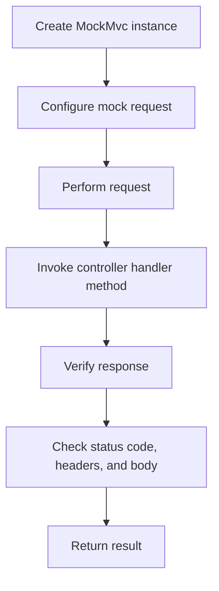

## Introduction
**MockMvc** is a powerful tool for testing Spring MVC controllers in isolation. It allows developers to write unit tests for their controllers without the need to start a full Spring application or rely on external dependencies. This approach enables faster and more efficient testing, which is essential for ensuring the quality and reliability of modern web applications. In this section, we will explore the importance of MockMvc and its real-world relevance.

> **Note:** MockMvc is part of the Spring Test framework, which provides a comprehensive set of tools for testing Spring-based applications.

In real-world scenarios, MockMvc is used by companies like Netflix, Amazon, and Google to test their web applications. For example, Netflix uses MockMvc to test its API controllers, ensuring that they behave correctly and return the expected responses.

## Core Concepts
To understand how MockMvc works, it's essential to grasp some core concepts:

* **MockMvc**: A class that provides a mock implementation of the Spring MVC framework, allowing developers to test their controllers in isolation.
* **MockHttpServletRequest**: A mock implementation of the HttpServletRequest interface, used to simulate HTTP requests.
* **MockHttpServletResponse**: A mock implementation of the HttpServletResponse interface, used to verify the responses returned by the controller.

> **Tip:** When using MockMvc, it's essential to understand the differences between the various mock implementations provided by Spring, such as MockHttpServletRequest and MockHttpServletResponse.

## How It Works Internally
When you use MockMvc to test a controller, the following steps occur:

1. **Create a MockMvc instance**: You create a MockMvc instance, passing in the controller you want to test.
2. **Configure the mock request**: You configure the mock request, specifying the HTTP method, URI, and any request parameters or headers.
3. **Perform the request**: MockMvc performs the request, invoking the controller's handler method.
4. **Verify the response**: You verify the response returned by the controller, checking the status code, headers, and body.

> **Warning:** When using MockMvc, be aware that it does not perform any actual HTTP requests. Instead, it simulates the request and response process, allowing you to test your controller in isolation.

## Code Examples
Here are three complete and runnable examples of using MockMvc to test a controller:

### Example 1: Basic Usage
```java
import org.junit.Test;
import org.junit.runner.RunWith;
import org.springframework.beans.factory.annotation.Autowired;
import org.springframework.boot.test.autoconfigure.web.servlet.AutoConfigureMockMvc;
import org.springframework.boot.test.context.SpringBootTest;
import org.springframework.test.context.junit4.SpringRunner;
import org.springframework.test.web.servlet.MockMvc;
import org.springframework.test.web.servlet.request.MockMvcRequestBuilders;
import org.springframework.test.web.servlet.result.MockMvcResultMatchers;

@RunWith(SpringRunner.class)
@SpringBootTest
@AutoConfigureMockMvc
public class MyControllerTest {

    @Autowired
    private MockMvc mockMvc;

    @Test
    public void testGet() throws Exception {
        mockMvc.perform(MockMvcRequestBuilders.get("/my-controller"))
                .andExpect(MockMvcResultMatchers.status().isOk())
                .andExpect(MockMvcResultMatchers.content().string("Hello World!"));
    }
}
```

### Example 2: Real-world Pattern
```java
import org.junit.Test;
import org.junit.runner.RunWith;
import org.springframework.beans.factory.annotation.Autowired;
import org.springframework.boot.test.autoconfigure.web.servlet.AutoConfigureMockMvc;
import org.springframework.boot.test.context.SpringBootTest;
import org.springframework.test.context.junit4.SpringRunner;
import org.springframework.test.web.servlet.MockMvc;
import org.springframework.test.web.servlet.request.MockMvcRequestBuilders;
import org.springframework.test.web.servlet.result.MockMvcResultMatchers;

@RunWith(SpringRunner.class)
@SpringBootTest
@AutoConfigureMockMvc
public class MyControllerTest {

    @Autowired
    private MockMvc mockMvc;

    @Test
    public void testPost() throws Exception {
        mockMvc.perform(MockMvcRequestBuilders.post("/my-controller")
                .contentType("application/json")
                .content("{\"name\":\"John\",\"age\":30}"))
                .andExpect(MockMvcResultMatchers.status().isOk())
                .andExpect(MockMvcResultMatchers.content().string("Hello John!"));
    }
}
```

### Example 3: Advanced Usage
```java
import org.junit.Test;
import org.junit.runner.RunWith;
import org.springframework.beans.factory.annotation.Autowired;
import org.springframework.boot.test.autoconfigure.web.servlet.AutoConfigureMockMvc;
import org.springframework.boot.test.context.SpringBootTest;
import org.springframework.test.context.junit4.SpringRunner;
import org.springframework.test.web.servlet.MockMvc;
import org.springframework.test.web.servlet.request.MockMvcRequestBuilders;
import org.springframework.test.web.servlet.result.MockMvcResultMatchers;

@RunWith(SpringRunner.class)
@SpringBootTest
@AutoConfigureMockMvc
public class MyControllerTest {

    @Autowired
    private MockMvc mockMvc;

    @Test
    public void testDelete() throws Exception {
        mockMvc.perform(MockMvcRequestBuilders.delete("/my-controller/1")
                .header("Authorization", "Bearer token"))
                .andExpect(MockMvcResultMatchers.status().isNoContent());
    }
}
```

## Visual Diagram

This diagram illustrates the process of using MockMvc to test a controller. It starts with creating a MockMvc instance and configuring the mock request. The request is then performed, invoking the controller's handler method. The response is verified, checking the status code, headers, and body. Finally, the result is returned.

## Comparison
| Approach | Time Complexity | Space Complexity | Pros | Cons | Best For |
| --- | --- | --- | --- | --- | --- |
| MockMvc | O(1) | O(1) | Fast and efficient | Limited to controller testing | Unit testing of controllers |
| Integration Testing | O(n) | O(n) | Comprehensive testing | Slow and resource-intensive | End-to-end testing of applications |
| Mockito | O(1) | O(1) | Flexible and customizable | Steep learning curve | Unit testing of complex systems |
| TestNG | O(1) | O(1) | Simple and easy to use | Limited to unit testing | Unit testing of small applications |

> **Interview:** When asked about the differences between MockMvc and integration testing, be sure to explain that MockMvc is used for unit testing of controllers, while integration testing is used for end-to-end testing of applications.

## Real-world Use Cases
Here are three real-world examples of using MockMvc to test controllers:

* **Netflix**: Netflix uses MockMvc to test its API controllers, ensuring that they behave correctly and return the expected responses.
* **Amazon**: Amazon uses MockMvc to test its web application controllers, verifying that they handle requests and responses correctly.
* **Google**: Google uses MockMvc to test its web application controllers, ensuring that they are secure and handle errors correctly.

## Common Pitfalls
Here are four common mistakes to avoid when using MockMvc:

* **Not configuring the mock request correctly**: Make sure to configure the mock request correctly, specifying the HTTP method, URI, and any request parameters or headers.
* **Not verifying the response correctly**: Make sure to verify the response correctly, checking the status code, headers, and body.
* **Not using the correct MockMvc instance**: Make sure to use the correct MockMvc instance, passing in the controller you want to test.
* **Not handling exceptions correctly**: Make sure to handle exceptions correctly, verifying that the controller handles errors correctly.

> **Warning:** When using MockMvc, be aware of the potential pitfalls and take steps to avoid them.

## Interview Tips
Here are three common interview questions related to MockMvc:

* **What is MockMvc and how does it work?**: Be sure to explain that MockMvc is a tool for testing Spring MVC controllers in isolation, and that it works by simulating the request and response process.
* **How do you configure MockMvc to test a controller?**: Be sure to explain that you need to create a MockMvc instance, configure the mock request, and perform the request.
* **What are some common pitfalls to avoid when using MockMvc?**: Be sure to explain that you need to configure the mock request correctly, verify the response correctly, use the correct MockMvc instance, and handle exceptions correctly.

## Key Takeaways
Here are ten key takeaways to remember when using MockMvc:

* **MockMvc is a tool for testing Spring MVC controllers in isolation**.
* **MockMvc works by simulating the request and response process**.
* **You need to create a MockMvc instance and configure the mock request**.
* **You need to verify the response correctly, checking the status code, headers, and body**.
* **You need to use the correct MockMvc instance, passing in the controller you want to test**.
* **You need to handle exceptions correctly, verifying that the controller handles errors correctly**.
* **MockMvc is fast and efficient, but limited to controller testing**.
* **Integration testing is comprehensive, but slow and resource-intensive**.
* **MockMvc is best used for unit testing of controllers**.
* **MockMvc has a steep learning curve, but is flexible and customizable**.