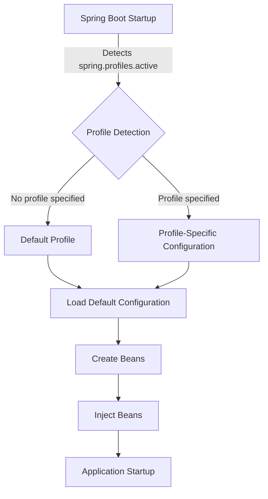

## Introduction
In the world of software development, **profiles** are a crucial aspect of managing different environments, such as development, testing, staging, and production. **Spring Boot**, a popular Java framework, provides a robust mechanism for handling profiles through the `@Profile` annotation and the `spring.profiles.active` property. In this article, we will delve into the world of Spring Boot profiles, exploring their definition, core concepts, internal mechanics, and real-world applications.

> **Note:** Profiles are essential for ensuring that your application behaves correctly in different environments, and Spring Boot provides a simple and elegant way to manage them.

## Core Concepts
A **profile** in Spring Boot is a set of configurations that are specific to a particular environment. For example, you might have a `dev` profile for development, a `test` profile for testing, and a `prod` profile for production. Each profile can have its own set of properties, such as database connections, API keys, and logging levels.

The `@Profile` annotation is used to specify which profile a particular configuration or bean belongs to. For example:
```java
@Configuration
@Profile("dev")
public class DevConfig {
    // configuration specific to dev environment
}
```
The `spring.profiles.active` property is used to specify which profile is currently active. This property can be set in various ways, including:

* As a command-line argument: `--spring.profiles.active=dev`
* As an environment variable: `SPRING_PROFILES_ACTIVE=dev`
* In the `application.properties` file: `spring.profiles.active=dev`

> **Tip:** It's a good practice to use a default profile, such as `dev`, and override it with a specific profile when needed.

## How It Works Internally
When Spring Boot starts up, it checks for the `spring.profiles.active` property to determine which profile is currently active. If no profile is specified, Spring Boot will use the default profile.

Here's a step-by-step breakdown of how Spring Boot handles profiles:

1. **Profile detection**: Spring Boot checks for the `spring.profiles.active` property and determines which profile is currently active.
2. **Profile-specific configuration**: Spring Boot loads the configuration specific to the active profile.
3. **Bean creation**: Spring Boot creates beans based on the profile-specific configuration.
4. **Bean injection**: Spring Boot injects the created beans into the application.

> **Warning:** If you have multiple profiles with the same configuration, Spring Boot will use the last one it encounters. This can lead to unexpected behavior, so make sure to use unique configurations for each profile.

## Code Examples
### Example 1: Basic Profile Configuration
```java
// application.properties
spring.profiles.active=dev

// DevConfig.java
@Configuration
@Profile("dev")
public class DevConfig {
    @Bean
    public DataSource dataSource() {
        return DataSourceBuilder.create()
                .driverClassName("com.mysql.cj.jdbc.Driver")
                .url("jdbc:mysql://localhost:3306/devdb")
                .username("devuser")
                .password("devpass")
                .build();
    }
}
```
### Example 2: Profile-Specific Configuration
```java
// application.properties
spring.profiles.active=test

// TestConfig.java
@Configuration
@Profile("test")
public class TestConfig {
    @Bean
    public DataSource dataSource() {
        return DataSourceBuilder.create()
                .driverClassName("com.mysql.cj.jdbc.Driver")
                .url("jdbc:mysql://localhost:3306/testdb")
                .username("testuser")
                .password("testpass")
                .build();
    }
}
```
### Example 3: Advanced Profile Configuration
```java
// application.properties
spring.profiles.active=prod

// ProdConfig.java
@Configuration
@Profile("prod")
public class ProdConfig {
    @Bean
    public DataSource dataSource() {
        return DataSourceBuilder.create()
                .driverClassName("com.mysql.cj.jdbc.Driver")
                .url("jdbc:mysql://prodhost:3306/proddb")
                .username("produser")
                .password("prodpass")
                .build();
    }
    
    @Bean
    public JdbcTemplate jdbcTemplate(DataSource dataSource) {
        return new JdbcTemplate(dataSource);
    }
}
```
> **Interview:** Can you explain how Spring Boot handles profiles and how you would configure a profile-specific data source?

## Visual Diagram

The diagram illustrates the flow of profile detection and configuration in Spring Boot.

## Comparison
| Profile Management Approach | Time Complexity | Space Complexity | Pros | Cons | Best For |
| --- | --- | --- | --- | --- | --- |
| Spring Boot Profiles | O(1) | O(1) | Easy to use, flexible, and scalable | Limited control over profile-specific configuration | Most Spring Boot applications |
| Manual Profile Management | O(n) | O(n) | High degree of control over profile-specific configuration | Error-prone, tedious, and difficult to maintain | Complex applications with custom profile requirements |
| Environment Variables | O(1) | O(1) | Simple and easy to use | Limited flexibility and scalability | Small applications with simple profile requirements |
| Configuration Files | O(n) | O(n) | Flexible and scalable | Error-prone and difficult to maintain | Large applications with complex profile requirements |

> **Note:** The time and space complexity of profile management approaches can vary depending on the specific implementation and requirements.

## Real-world Use Cases
1. **Netflix**: Uses Spring Boot profiles to manage different environments, such as development, testing, and production.
2. **Amazon**: Uses Spring Boot profiles to manage different regions, such as US, EU, and APAC.
3. **Google**: Uses Spring Boot profiles to manage different environments, such as development, testing, and production, for their cloud-based services.

> **Tip:** Use Spring Boot profiles to manage different environments and regions, and to ensure that your application behaves correctly in each environment.

## Common Pitfalls
1. **Incorrect profile configuration**: Make sure to use the correct profile configuration and to override it with a specific profile when needed.
2. **Missing profile-specific configuration**: Make sure to provide profile-specific configuration for each environment.
3. **Inconsistent profile naming**: Use consistent naming conventions for profiles, such as `dev`, `test`, and `prod`.
4. **Profile-specific bean creation**: Make sure to create beans specific to each profile, and to inject them correctly.

> **Warning:** Incorrect profile configuration can lead to unexpected behavior, so make sure to test your application thoroughly in each environment.

## Interview Tips
1. **What is a Spring Boot profile?**: A Spring Boot profile is a set of configurations specific to a particular environment.
2. **How do you configure a profile-specific data source?**: Use the `@Profile` annotation and specify the profile-specific configuration in a separate configuration class.
3. **What is the difference between `@Profile` and `spring.profiles.active`?**: `@Profile` is used to specify which profile a particular configuration or bean belongs to, while `spring.profiles.active` is used to specify which profile is currently active.

> **Interview:** Can you explain how to use Spring Boot profiles to manage different environments and to ensure that your application behaves correctly in each environment?

## Key Takeaways
* Spring Boot profiles are a powerful mechanism for managing different environments and regions.
* Use the `@Profile` annotation to specify which profile a particular configuration or bean belongs to.
* Use the `spring.profiles.active` property to specify which profile is currently active.
* Make sure to provide profile-specific configuration for each environment.
* Use consistent naming conventions for profiles.
* Test your application thoroughly in each environment to ensure that it behaves correctly.
* Use Spring Boot profiles to manage different environments and regions, and to ensure that your application behaves correctly in each environment.
* Profile management approaches have different time and space complexities, and the choice of approach depends on the specific requirements and implementation.