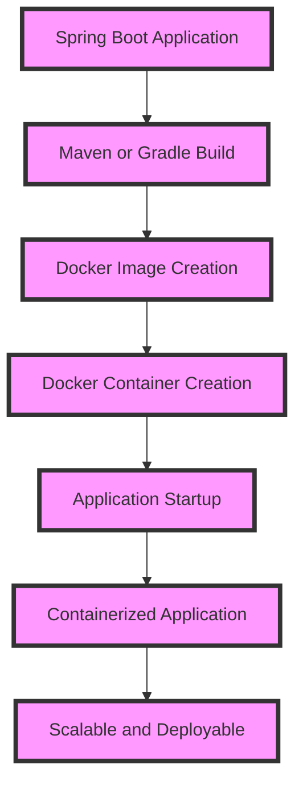

## Introduction
**Spring Boot** is a popular Java-based framework for building microservices and web applications. It simplifies the development process by providing a set of pre-configured dependencies and automatic configuration. **Docker** is a containerization platform that allows developers to package, ship, and run applications in containers. In this study note, we will explore how to use Spring Boot with Docker to build and deploy scalable, containerized applications. 
> **Note:** The combination of Spring Boot and Docker provides a powerful way to build and deploy modern web applications.

## Core Concepts
To understand how Spring Boot works with Docker, it's essential to grasp the following core concepts:
* **Spring Boot Starter**: A set of pre-configured dependencies that simplify the development process. For example, the `spring-boot-starter-web` starter includes dependencies for building web applications.
* **Docker Image**: A lightweight, standalone package that includes everything an application needs to run, including code, dependencies, and environment settings.
* **Docker Container**: A runtime instance of a Docker image, which provides a isolated environment for the application to run in.
* **Containerization**: The process of packaging an application and its dependencies into a container, which can be run on any system that supports Docker.
> **Tip:** Using Spring Boot Starters can significantly reduce the time and effort required to build and configure a Spring-based application.

## How It Works Internally
When you build a Spring Boot application with Docker, the following steps occur:
1. **Maven or Gradle Build**: The Spring Boot application is built using Maven or Gradle, which creates a JAR or WAR file containing the application code and dependencies.
2. **Docker Image Creation**: A Docker image is created using the `docker build` command, which packages the Spring Boot application and its dependencies into a single image.
3. **Docker Container Creation**: A Docker container is created from the Docker image using the `docker run` command, which provides an isolated environment for the application to run in.
4. **Application Startup**: The Spring Boot application is started inside the Docker container, which initializes the application and its dependencies.

## Code Examples
Here are three complete, runnable code examples that demonstrate how to use Spring Boot with Docker:
### Example 1: Basic Spring Boot Application
```java
// Import necessary dependencies
import org.springframework.boot.SpringApplication;
import org.springframework.boot.autoconfigure.SpringBootApplication;

// Define the Spring Boot application
@SpringBootApplication
public class HelloWorldApplication {
    public static void main(String[] args) {
        // Start the Spring Boot application
        SpringApplication.run(HelloWorldApplication.class, args);
    }
}
```
### Example 2: Spring Boot Application with Docker
```java
// Import necessary dependencies
import org.springframework.boot.SpringApplication;
import org.springframework.boot.autoconfigure.SpringBootApplication;

// Define the Spring Boot application
@SpringBootApplication
public class HelloWorldApplication {
    public static void main(String[] args) {
        // Start the Spring Boot application
        SpringApplication.run(HelloWorldApplication.class, args);
    }
}

// Dockerfile
FROM openjdk:8-jdk-alpine
ARG JAR_FILE=hello-world-0.0.1-SNAPSHOT.jar
COPY ${JAR_FILE} app.jar
ENTRYPOINT ["java","-jar","/app.jar"]
```
### Example 3: Advanced Spring Boot Application with Docker Compose
```java
// Import necessary dependencies
import org.springframework.boot.SpringApplication;
import org.springframework.boot.autoconfigure.SpringBootApplication;

// Define the Spring Boot application
@SpringBootApplication
public class HelloWorldApplication {
    public static void main(String[] args) {
        // Start the Spring Boot application
        SpringApplication.run(HelloWorldApplication.class, args);
    }
}

// Dockerfile
FROM openjdk:8-jdk-alpine
ARG JAR_FILE=hello-world-0.0.1-SNAPSHOT.jar
COPY ${JAR_FILE} app.jar
ENTRYPOINT ["java","-jar","/app.jar"]

// docker-compose.yml
version: '3'
services:
  hello-world:
    build: .
    ports:
      - "8080:8080"
    depends_on:
      - db
  db:
    image: postgres
    environment:
      - POSTGRES_USER=myuser
      - POSTGRES_PASSWORD=mypassword
      - POSTGRES_DB=mydb
```
> **Warning:** Make sure to update the `Dockerfile` and `docker-compose.yml` files to match your specific application requirements.

## Visual Diagram

The diagram illustrates the process of building a Spring Boot application with Docker, from the initial build to the final containerized application.

## Comparison
| Approach | Time Complexity | Space Complexity | Pros | Cons | Best For |
| --- | --- | --- | --- | --- | --- |
| Spring Boot | O(1) | O(1) | Simplifies development process, provides pre-configured dependencies | Limited control over underlying infrastructure | Building microservices and web applications |
| Docker | O(1) | O(1) | Provides isolated environment, scalable and deployable | Steep learning curve, requires additional configuration | Containerizing applications, deploying to cloud or on-premises |
| Kubernetes | O(n) | O(n) | Provides automated deployment, scaling, and management | Complex setup, requires significant resources | Orchestrating containerized applications, large-scale deployments |
| Serverless | O(1) | O(1) | Provides cost-effective, scalable solution | Limited control over underlying infrastructure, vendor lock-in | Building event-driven applications, real-time data processing |

## Real-world Use Cases
1. **Netflix**: Uses Spring Boot and Docker to build and deploy scalable, containerized applications for its streaming service.
2. **Amazon**: Uses Spring Boot and Docker to build and deploy microservices for its e-commerce platform.
3. **Google**: Uses Spring Boot and Docker to build and deploy scalable, containerized applications for its cloud-based services.

## Common Pitfalls
1. **Incorrect Dockerfile Configuration**: Failing to specify the correct base image, or not copying the application code into the container.
```dockerfile
# Incorrect Dockerfile
FROM openjdk:8-jdk-alpine
ARG JAR_FILE=hello-world-0.0.1-SNAPSHOT.jar
```
```dockerfile
# Correct Dockerfile
FROM openjdk:8-jdk-alpine
ARG JAR_FILE=hello-world-0.0.1-SNAPSHOT.jar
COPY ${JAR_FILE} app.jar
ENTRYPOINT ["java","-jar","/app.jar"]
```
2. **Insufficient Memory Allocation**: Failing to allocate sufficient memory to the Docker container, leading to performance issues.
```dockerfile
# Incorrect Dockerfile
FROM openjdk:8-jdk-alpine
ARG JAR_FILE=hello-world-0.0.1-SNAPSHOT.jar
COPY ${JAR_FILE} app.jar
ENTRYPOINT ["java","-jar","/app.jar"]
```
```dockerfile
# Correct Dockerfile
FROM openjdk:8-jdk-alpine
ARG JAR_FILE=hello-world-0.0.1-SNAPSHOT.jar
COPY ${JAR_FILE} app.jar
ENTRYPOINT ["java","-Xmx1024m","-jar","/app.jar"]
```
> **Interview:** Be prepared to answer questions about your experience with Spring Boot and Docker, such as how you would troubleshoot a Docker container issue or optimize a Spring Boot application for performance.

## Interview Tips
1. **Spring Boot vs. Traditional Spring**: Be prepared to explain the differences between Spring Boot and traditional Spring, and how Spring Boot simplifies the development process.
2. **Docker Containerization**: Be prepared to explain the benefits of containerization, and how Docker provides an isolated environment for applications.
3. **Kubernetes Orchestration**: Be prepared to explain the benefits of Kubernetes, and how it provides automated deployment, scaling, and management of containerized applications.

## Key Takeaways
* **Spring Boot simplifies the development process** by providing pre-configured dependencies and automatic configuration.
* **Docker provides an isolated environment** for applications, making it easy to deploy and manage containerized applications.
* **Containerization is essential** for building scalable and deployable applications.
* **Kubernetes provides automated deployment, scaling, and management** of containerized applications.
* **Serverless provides a cost-effective, scalable solution** for building event-driven applications.
* **Spring Boot and Docker are widely used** in production environments, including Netflix, Amazon, and Google.
* **Correct Dockerfile configuration** is crucial for building and deploying containerized applications.
* **Insufficient memory allocation** can lead to performance issues in Docker containers.
> **Tip:** Make sure to practice building and deploying Spring Boot applications with Docker to gain hands-on experience and improve your skills.