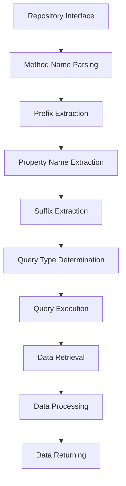

## Introduction
**Spring Data** is a part of the **Spring Framework** that provides a simple and consistent programming model for data access. One of its key features is **Derived Query Methods**, which allow developers to define custom queries using method names. In this section, we will explore what Derived Query Methods are, why they matter, and their real-world relevance. 
> **Note:** Derived Query Methods are a powerful tool for simplifying data access in Spring-based applications.

Derived Query Methods are used to define custom queries for retrieving data from a database. They are called "derived" because the query is derived from the method name. This approach eliminates the need to write boilerplate code for data access, making it easier to focus on business logic. 
> **Tip:** Using Derived Query Methods can significantly reduce the amount of code needed for data access, making applications more maintainable and efficient.

In real-world applications, Derived Query Methods are used to retrieve data from databases, perform complex queries, and even handle pagination and sorting. They are widely used in various industries, including finance, healthcare, and e-commerce. 
> **Warning:** Not using Derived Query Methods can lead to complex and hard-to-maintain data access code, which can negatively impact application performance and scalability.

## Core Concepts
To understand Derived Query Methods, it's essential to grasp the following core concepts:

* **Repository**: A repository is an interface that defines data access methods for a specific entity.
* **Entity**: An entity is a Java class that represents a table in a database.
* **Method Name**: The method name is used to derive the query. The method name is composed of a prefix, a property name, and a suffix.
* **Prefix**: The prefix is used to specify the type of query (e.g., `find`, `get`, `count`).
* **Property Name**: The property name is used to specify the column name in the database.
* **Suffix**: The suffix is used to specify the query condition (e.g., `By`, `And`, `Or`).

> **Interview:** When asked about Derived Query Methods, be prepared to explain the core concepts and provide examples of how they are used in real-world applications.

## How It Works Internally
Derived Query Methods work by using a combination of reflection and annotation processing. Here's a step-by-step breakdown of how it works:

1. The repository interface is annotated with `@Repository`.
2. The method name is parsed to extract the prefix, property name, and suffix.
3. The prefix is used to determine the type of query (e.g., `find`, `get`, `count`).
4. The property name is used to determine the column name in the database.
5. The suffix is used to determine the query condition (e.g., `By`, `And`, `Or`).
6. The query is executed using the underlying data access technology (e.g., JDBC, Hibernate).

> **Note:** The internal workings of Derived Query Methods are complex, but understanding the basics can help developers troubleshoot issues and optimize performance.

## Code Examples
Here are three complete and runnable examples of Derived Query Methods:

### Example 1: Basic Usage
```java
// Entity
@Entity
public class User {
    @Id
    @GeneratedValue(strategy = GenerationType.IDENTITY)
    private Long id;
    private String name;
    private String email;
    // Getters and setters
}

// Repository
public interface UserRepository extends JpaRepository<User, Long> {
    List<User> findByName(String name);
}

// Service
@Service
public class UserService {
    @Autowired
    private UserRepository userRepository;
    
    public List<User> getUsersByName(String name) {
        return userRepository.findByName(name);
    }
}
```

### Example 2: Real-World Pattern
```java
// Entity
@Entity
public class Order {
    @Id
    @GeneratedValue(strategy = GenerationType.IDENTITY)
    private Long id;
    private String customerName;
    private BigDecimal total;
    // Getters and setters
}

// Repository
public interface OrderRepository extends JpaRepository<Order, Long> {
    List<Order> findByCustomerNameAndTotalGreaterThan(String customerName, BigDecimal total);
}

// Service
@Service
public class OrderService {
    @Autowired
    private OrderRepository orderRepository;
    
    public List<Order> getOrdersByCustomerNameAndTotal(String customerName, BigDecimal total) {
        return orderRepository.findByCustomerNameAndTotalGreaterThan(customerName, total);
    }
}
```

### Example 3: Advanced Usage
```java
// Entity
@Entity
public class Product {
    @Id
    @GeneratedValue(strategy = GenerationType.IDENTITY)
    private Long id;
    private String name;
    private BigDecimal price;
    // Getters and setters
}

// Repository
public interface ProductRepository extends JpaRepository<Product, Long> {
    @Query("SELECT p FROM Product p WHERE p.price > :price")
    List<Product> findProductsByPriceGreaterThan(@Param("price") BigDecimal price);
}

// Service
@Service
public class ProductService {
    @Autowired
    private ProductRepository productRepository;
    
    public List<Product> getProductsByPriceGreaterThan(BigDecimal price) {
        return productRepository.findProductsByPriceGreaterThan(price);
    }
}
```

## Visual Diagram

The diagram illustrates the internal workings of Derived Query Methods, from method name parsing to data retrieval and processing.

## Comparison
| Approach | Time Complexity | Space Complexity | Pros | Cons | Best For |
| --- | --- | --- | --- | --- | --- |
| Derived Query Methods | O(1) | O(1) | Simplifies data access, reduces boilerplate code | Limited flexibility, requires annotation processing | Simple data access, CRUD operations |
| JPQL | O(n) | O(n) | Flexible, supports complex queries | Verbose, requires manual query writing | Complex queries, data analysis |
| Native SQL | O(n) | O(n) | Flexible, supports complex queries | Verbose, requires manual query writing | Complex queries, data analysis |
| Hibernate Query Language | O(n) | O(n) | Flexible, supports complex queries | Verbose, requires manual query writing | Complex queries, data analysis |

## Real-world Use Cases
Here are three real-world use cases for Derived Query Methods:

* **E-commerce platform**: An e-commerce platform uses Derived Query Methods to retrieve products by category, price range, and customer reviews.
* **Financial application**: A financial application uses Derived Query Methods to retrieve transactions by account number, date range, and transaction type.
* **Healthcare system**: A healthcare system uses Derived Query Methods to retrieve patient records by name, date of birth, and medical condition.

## Common Pitfalls
Here are four common pitfalls to avoid when using Derived Query Methods:

* **Incorrect method name**: Using an incorrect method name can result in a `NoSuchMethodException`.
* **Incorrect annotation**: Using an incorrect annotation can result in a `BeanCreationException`.
* **Incorrect query**: Using an incorrect query can result in a `QuerySyntaxException`.
* **Incorrect data access**: Using an incorrect data access technology can result in a `DataAccessException`.

> **Warning:** Not using Derived Query Methods correctly can lead to complex and hard-to-maintain data access code, which can negatively impact application performance and scalability.

## Interview Tips
Here are three common interview questions related to Derived Query Methods:

* **What is the purpose of Derived Query Methods?**: The purpose of Derived Query Methods is to simplify data access and reduce boilerplate code.
* **How do you use Derived Query Methods in a real-world application?**: You can use Derived Query Methods in a real-world application by defining a repository interface and using the `@Repository` annotation.
* **What are the benefits and drawbacks of using Derived Query Methods?**: The benefits of using Derived Query Methods include simplified data access and reduced boilerplate code, while the drawbacks include limited flexibility and requires annotation processing.

> **Interview:** When asked about Derived Query Methods, be prepared to explain the concepts, provide examples, and discuss the benefits and drawbacks.

## Key Takeaways
Here are ten key takeaways to remember:

* **Derived Query Methods simplify data access**: Derived Query Methods simplify data access by reducing boilerplate code.
* **Derived Query Methods use annotation processing**: Derived Query Methods use annotation processing to derive the query.
* **Method name is used to derive the query**: The method name is used to derive the query.
* **Prefix, property name, and suffix are used to determine the query**: The prefix, property name, and suffix are used to determine the query.
* **Derived Query Methods are flexible**: Derived Query Methods are flexible and can be used with various data access technologies.
* **Derived Query Methods have limited flexibility**: Derived Query Methods have limited flexibility and require annotation processing.
* **Derived Query Methods are best for simple data access**: Derived Query Methods are best for simple data access and CRUD operations.
* **Derived Query Methods can be used with JPQL, Native SQL, and Hibernate Query Language**: Derived Query Methods can be used with JPQL, Native SQL, and Hibernate Query Language.
* **Derived Query Methods require correct method name and annotation**: Derived Query Methods require correct method name and annotation to work correctly.
* **Derived Query Methods can improve application performance and scalability**: Derived Query Methods can improve application performance and scalability by simplifying data access and reducing boilerplate code.