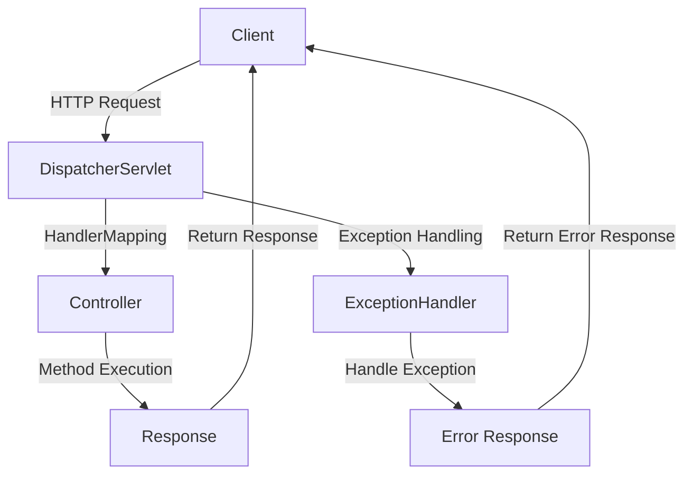

## Introduction
**Spring MVC** is a popular Java framework for building web applications. It provides a robust and flexible way to handle HTTP requests and responses, making it a widely used choice for enterprise-level applications. In this section, we will explore the key concepts of Spring MVC, including `@RestController`, `@RequestMapping`, `@GetMapping`, and `@PostMapping`. We will also discuss why these annotations are essential for building RESTful APIs.
> **Note:** Spring MVC is built on top of the Spring Framework, which provides a comprehensive set of tools for building enterprise-level applications.

## Core Concepts
Let's start by defining the key concepts:
* **`@RestController`**: This annotation is used to indicate that a class is a controller where every method returns a domain object instead of a view.
* **`@RequestMapping`**: This annotation is used to map HTTP requests to specific methods in a controller.
* **`@GetMapping`**: This annotation is used to map HTTP GET requests to specific methods in a controller.
* **`@PostMapping`**: This annotation is used to map HTTP POST requests to specific methods in a controller.

These annotations are essential for building RESTful APIs, as they provide a way to map HTTP requests to specific methods in a controller. By using these annotations, developers can create a clear and concise API that is easy to maintain and understand.
> **Tip:** When using `@RestController`, it's essential to return a domain object instead of a view, as this will allow the framework to automatically convert the object to JSON or XML.

## How It Works Internally
Let's take a look at how Spring MVC works internally:
1. **Request**: The client sends an HTTP request to the server.
2. **DispatcherServlet**: The request is received by the `DispatcherServlet`, which is the main entry point of the Spring MVC framework.
3. **HandlerMapping**: The `DispatcherServlet` uses the `HandlerMapping` to determine which controller method should handle the request.
4. **Controller**: The `HandlerMapping` maps the request to a specific controller method, which is then executed.
5. **Response**: The controller method returns a response, which is then sent back to the client.

This process is essential for understanding how Spring MVC works, as it provides a clear overview of how requests are handled and responded to.
> **Warning:** When using `@RequestMapping`, it's essential to specify the correct HTTP method (e.g., GET, POST, PUT, DELETE) to avoid unexpected behavior.

## Code Examples
Here are three complete and runnable examples:
### Example 1: Basic Usage
```java
import org.springframework.web.bind.annotation.GetMapping;
import org.springframework.web.bind.annotation.RestController;

@RestController
public class HelloController {
    @GetMapping("/hello")
    public String hello() {
        return "Hello, World!";
    }
}
```
This example demonstrates the basic usage of `@RestController` and `@GetMapping`.
### Example 2: Real-World Pattern
```java
import org.springframework.web.bind.annotation.GetMapping;
import org.springframework.web.bind.annotation.PostMapping;
import org.springframework.web.bind.annotation.RequestBody;
import org.springframework.web.bind.annotation.RestController;

@RestController
public class UserController {
    @GetMapping("/users")
    public List<User> getUsers() {
        // Return a list of users
        return Arrays.asList(new User("John Doe", "johndoe@example.com"));
    }

    @PostMapping("/users")
    public User createUser(@RequestBody User user) {
        // Create a new user
        return user;
    }
}

class User {
    private String name;
    private String email;

    public User(String name, String email) {
        this.name = name;
        this.email = email;
    }

    // Getters and setters
}
```
This example demonstrates a real-world pattern for creating a RESTful API using `@RestController`, `@GetMapping`, and `@PostMapping`.
### Example 3: Advanced Usage
```java
import org.springframework.web.bind.annotation.GetMapping;
import org.springframework.web.bind.annotation.PathVariable;
import org.springframework.web.bind.annotation.RestController;

@RestController
public class OrderController {
    @GetMapping("/orders/{orderId}")
    public Order getOrder(@PathVariable Long orderId) {
        // Return an order by ID
        return new Order(orderId, "John Doe", "johndoe@example.com");
    }
}

class Order {
    private Long id;
    private String customerName;
    private String customerEmail;

    public Order(Long id, String customerName, String customerEmail) {
        this.id = id;
        this.customerName = customerName;
        this.customerEmail = customerEmail;
    }

    // Getters and setters
}
```
This example demonstrates an advanced usage of `@GetMapping` with a path variable.
> **Interview:** When asked about the difference between `@RestController` and `@Controller`, be sure to explain that `@RestController` is a convenience annotation that combines `@Controller` and `@ResponseBody`.

## Visual Diagram

This diagram illustrates the flow of a Spring MVC application, including the `DispatcherServlet`, `HandlerMapping`, `Controller`, and `ExceptionHandler`.

## Comparison
| Approach | Time Complexity | Space Complexity | Pros | Cons | Best For |
| --- | --- | --- | --- | --- | --- |
| `@RestController` | O(1) | O(1) | Convenient, easy to use | Limited flexibility | Simple RESTful APIs |
| `@Controller` | O(1) | O(1) | Flexible, customizable | More complex to use | Complex web applications |
| `@GetMapping` | O(1) | O(1) | Easy to use, convenient | Limited flexibility | Simple GET requests |
| `@PostMapping` | O(1) | O(1) | Easy to use, convenient | Limited flexibility | Simple POST requests |

This comparison table highlights the pros and cons of each approach, including time and space complexity.
> **Tip:** When choosing between `@RestController` and `@Controller`, consider the complexity of your application and the level of customization required.

## Real-world Use Cases
Here are three real-world use cases:
1. **Netflix**: Netflix uses Spring MVC to build its RESTful APIs for managing user accounts, recommendations, and content delivery.
2. **Amazon**: Amazon uses Spring MVC to build its RESTful APIs for managing product information, orders, and customer data.
3. **Google**: Google uses Spring MVC to build its RESTful APIs for managing search results, ads, and user data.

These use cases demonstrate the widespread adoption of Spring MVC in the industry.
> **Warning:** When building a RESTful API, be sure to follow best practices, such as using meaningful resource names and HTTP methods.

## Common Pitfalls
Here are four common pitfalls to avoid:
1. **Incorrect HTTP Method**: Using the wrong HTTP method (e.g., GET instead of POST) can lead to unexpected behavior and security vulnerabilities.
2. **Insufficient Error Handling**: Failing to handle exceptions and errors properly can result in crashes and security vulnerabilities.
3. **Insecure Data Storage**: Storing sensitive data insecurely can lead to security breaches and data loss.
4. **Inadequate Testing**: Failing to test the API thoroughly can result in bugs and security vulnerabilities.

By avoiding these common pitfalls, developers can build a secure and reliable RESTful API using Spring MVC.
> **Interview:** When asked about common pitfalls in Spring MVC, be sure to explain the importance of proper error handling, secure data storage, and thorough testing.

## Interview Tips
Here are three common interview questions and tips:
1. **What is the difference between `@RestController` and `@Controller`?**: Explain that `@RestController` is a convenience annotation that combines `@Controller` and `@ResponseBody`.
2. **How do you handle exceptions in Spring MVC?**: Explain that you can use `@ExceptionHandler` to handle exceptions and return a custom error response.
3. **What is the purpose of `@GetMapping` and `@PostMapping`?**: Explain that these annotations are used to map HTTP GET and POST requests to specific methods in a controller.

By following these tips, developers can demonstrate their knowledge and understanding of Spring MVC and its applications.
> **Note:** When answering interview questions, be sure to provide clear and concise explanations, and use examples to illustrate your points.

## Key Takeaways
Here are ten key takeaways:
* **Spring MVC is a popular Java framework for building web applications**.
* **`@RestController` is a convenience annotation that combines `@Controller` and `@ResponseBody`**.
* **`@GetMapping` and `@PostMapping` are used to map HTTP GET and POST requests to specific methods in a controller**.
* **Proper error handling is essential for building a secure and reliable RESTful API**.
* **Secure data storage is critical for protecting sensitive data**.
* **Thorough testing is necessary for ensuring the quality and reliability of the API**.
* **`@ExceptionHandler` is used to handle exceptions and return a custom error response**.
* **`@Controller` is a more flexible and customizable annotation than `@RestController`**.
* **Spring MVC is widely adopted in the industry, with companies like Netflix, Amazon, and Google using it to build their RESTful APIs**.
* **By following best practices and avoiding common pitfalls, developers can build a secure and reliable RESTful API using Spring MVC**.