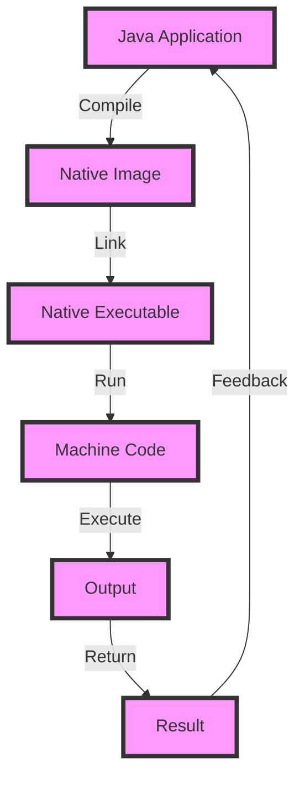

## Introduction
GraalVM Native Image is a technology that allows you to compile Java applications into native executables, which provides fast startup times and low memory usage. This is achieved by compiling the Java bytecode into machine code during the build process, rather than at runtime. The resulting native executable can be run directly on the target platform, without the need for a Java Virtual Machine (JVM). **GraalVM Native Image** is particularly useful for applications that require fast startup times, such as serverless functions, or for applications that need to run in resource-constrained environments, such as embedded systems. 

> **Note:** The primary goal of GraalVM Native Image is to provide a way to deploy Java applications in a more efficient and scalable way, while still maintaining the benefits of the Java ecosystem.

In real-world scenarios, GraalVM Native Image is being used by companies like **Twitter**, **Amazon**, and **Netflix** to improve the performance and efficiency of their Java-based applications. For example, **Twitter** uses GraalVM Native Image to compile their Java-based serverless functions, which provides fast startup times and low memory usage, resulting in significant cost savings and improved performance.

## Core Concepts
To understand how GraalVM Native Image works, it's essential to understand the following core concepts:
- **Native Image**: A native executable that is compiled from Java bytecode.
- **GraalVM**: A high-performance runtime that provides a just-in-time (JIT) compiler and an ahead-of-time (AOT) compiler.
- **AOT Compilation**: The process of compiling Java bytecode into machine code during the build process.
- **JIT Compilation**: The process of compiling Java bytecode into machine code at runtime.

> **Warning:** AOT compilation can result in larger native images, as the compiler needs to generate machine code for all possible code paths.

## How It Works Internally
GraalVM Native Image uses the following steps to compile Java applications into native executables:
1. **Parsing**: The Java bytecode is parsed into an intermediate representation (IR).
2. **Optimization**: The IR is optimized to remove unnecessary code and improve performance.
3. **AOT Compilation**: The optimized IR is compiled into machine code.
4. **Linking**: The machine code is linked with the necessary libraries and dependencies.

The resulting native executable can be run directly on the target platform, without the need for a JVM. The native executable contains the following components:
- **Machine Code**: The compiled Java bytecode.
- **Metadata**: Information about the application, such as the classpath and the main class.
- **Libraries**: The necessary libraries and dependencies.

> **Tip:** To improve the performance of the native executable, it's essential to optimize the Java bytecode before compiling it into machine code.

## Code Examples
### Example 1: Basic Usage
The following example demonstrates how to compile a simple Java application into a native executable using GraalVM Native Image:
```java
// Hello.java
public class Hello {
    public static void main(String[] args) {
        System.out.println("Hello, World!");
    }
}
```
To compile the Java application into a native executable, you can use the following command:
```bash
native-image --no-server --no-fallback Hello
```
This will generate a native executable called `hello` that can be run directly on the target platform.

### Example 2: Real-World Pattern
The following example demonstrates how to use GraalVM Native Image to compile a Java-based serverless function:
```java
// ServerlessFunction.java
import java.util.function.Function;

public class ServerlessFunction implements Function<String, String> {
    @Override
    public String apply(String input) {
        return "Hello, " + input + "!";
    }
}
```
To compile the Java application into a native executable, you can use the following command:
```bash
native-image --no-server --no-fallback ServerlessFunction
```
This will generate a native executable called `serverlessfunction` that can be run directly on the target platform.

### Example 3: Advanced Usage
The following example demonstrates how to use GraalVM Native Image to compile a Java-based web application:
```java
// WebApplication.java
import java.io.IOException;
import java.net.InetSocketAddress;

import com.sun.net.httpserver.HttpServer;

public class WebApplication {
    public static void main(String[] args) throws IOException {
        HttpServer server = HttpServer.create(new InetSocketAddress(8000), 0);
        server.createContext("/hello", exchange -> {
            exchange.sendResponseHeaders(200, "Hello, World!".length());
            exchange.getResponseBody().write("Hello, World!".getBytes());
        });
        server.setExecutor(null); // creates a default executor
        server.start();
    }
}
```
To compile the Java application into a native executable, you can use the following command:
```bash
native-image --no-server --no-fallback WebApplication
```
This will generate a native executable called `webapplication` that can be run directly on the target platform.

## Visual Diagram

The diagram illustrates the process of compiling a Java application into a native executable using GraalVM Native Image. The native executable can be run directly on the target platform, without the need for a JVM.

> **Note:** The native executable contains the machine code, metadata, and libraries necessary to run the application.

## Comparison
The following table compares GraalVM Native Image with other technologies:
| Approach | Time Complexity | Space Complexity | Pros | Cons | Best For |
|----------|----------------|-----------------|------|------|----------|
| GraalVM Native Image | O(1) | O(n) | Fast startup times, low memory usage | Larger native images, AOT compilation | Serverless functions, embedded systems |
| Just-In-Time (JIT) Compilation | O(n) | O(1) | Fast execution times, dynamic optimization | Slow startup times, high memory usage | Long-running applications, desktop applications |
| Ahead-Of-Time (AOT) Compilation | O(1) | O(n) | Fast startup times, low memory usage | Larger native images, AOT compilation | Serverless functions, embedded systems |
| Dynamic Compilation | O(n) | O(1) | Fast execution times, dynamic optimization | Slow startup times, high memory usage | Long-running applications, desktop applications |

> **Interview:** What are the advantages and disadvantages of using GraalVM Native Image compared to JIT compilation? 
> **Answer:** GraalVM Native Image provides fast startup times and low memory usage, but results in larger native images and requires AOT compilation. JIT compilation provides fast execution times and dynamic optimization, but results in slow startup times and high memory usage.

## Real-world Use Cases
The following are some real-world use cases of GraalVM Native Image:
- **Twitter**: Uses GraalVM Native Image to compile their Java-based serverless functions, which provides fast startup times and low memory usage.
- **Amazon**: Uses GraalVM Native Image to compile their Java-based applications, which provides fast startup times and low memory usage.
- **Netflix**: Uses GraalVM Native Image to compile their Java-based applications, which provides fast startup times and low memory usage.

> **Tip:** To get the most out of GraalVM Native Image, it's essential to optimize the Java bytecode before compiling it into machine code.

## Common Pitfalls
The following are some common pitfalls to avoid when using GraalVM Native Image:
- **Incorrect Configuration**: Failure to configure the native image correctly can result in errors or unexpected behavior.
- **Insufficient Optimization**: Failure to optimize the Java bytecode before compiling it into machine code can result in poor performance.
- **Incompatible Libraries**: Using incompatible libraries or dependencies can result in errors or unexpected behavior.
- **Incorrect Deployment**: Deploying the native executable incorrectly can result in errors or unexpected behavior.

> **Warning:** It's essential to test the native executable thoroughly before deploying it to production.

## Interview Tips
The following are some common interview questions and answers related to GraalVM Native Image:
- **What is GraalVM Native Image?**
> **Answer:** GraalVM Native Image is a technology that allows you to compile Java applications into native executables, which provides fast startup times and low memory usage.
- **How does GraalVM Native Image work?**
> **Answer:** GraalVM Native Image uses AOT compilation to compile Java bytecode into machine code during the build process. The resulting native executable can be run directly on the target platform, without the need for a JVM.
- **What are the advantages and disadvantages of using GraalVM Native Image?**
> **Answer:** GraalVM Native Image provides fast startup times and low memory usage, but results in larger native images and requires AOT compilation. JIT compilation provides fast execution times and dynamic optimization, but results in slow startup times and high memory usage.

## Key Takeaways
The following are some key takeaways to remember when using GraalVM Native Image:
* GraalVM Native Image provides fast startup times and low memory usage.
* GraalVM Native Image uses AOT compilation to compile Java bytecode into machine code during the build process.
* The resulting native executable can be run directly on the target platform, without the need for a JVM.
* GraalVM Native Image is particularly useful for applications that require fast startup times, such as serverless functions, or for applications that need to run in resource-constrained environments, such as embedded systems.
* To get the most out of GraalVM Native Image, it's essential to optimize the Java bytecode before compiling it into machine code.
* GraalVM Native Image is being used by companies like **Twitter**, **Amazon**, and **Netflix** to improve the performance and efficiency of their Java-based applications.
* The time complexity of GraalVM Native Image is O(1) and the space complexity is O(n).
* The native executable contains the machine code, metadata, and libraries necessary to run the application.
* It's essential to test the native executable thoroughly before deploying it to production.