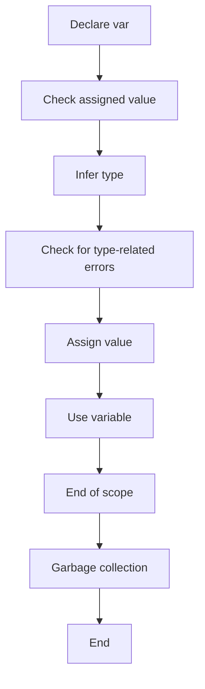

## Introduction
Java 10 introduced a new feature called Local Variable Type Inference, also known as `var`. This feature allows developers to declare local variables without specifying their type explicitly. The type of the variable is inferred by the compiler based on the assigned value. This feature is designed to improve the readability and conciseness of Java code, making it easier to write and maintain. In this section, we will explore the concept of Local Variable Type Inference, its benefits, and real-world relevance.

> **Note:** Local Variable Type Inference is not the same as dynamic typing. The type of the variable is still determined at compile-time, but it is inferred by the compiler instead of being explicitly declared.

## Core Concepts
To understand Local Variable Type Inference, we need to know the following core concepts:

* **Type Inference**: The process of determining the type of a variable based on its assigned value.
* **Local Variables**: Variables declared within a method or block.
* **Implicit Typing**: The process of declaring a variable without specifying its type explicitly.

The key terminology in this context is `var`, which is used to declare a local variable without specifying its type.

> **Tip:** Use `var` to declare local variables when the type is obvious from the assigned value, making the code more concise and readable.

## How It Works Internally
When a local variable is declared using `var`, the compiler infers its type based on the assigned value. The compiler checks the type of the assigned value and determines the type of the variable. This process is called type inference.

Here is a step-by-step breakdown of how it works:

1. The compiler encounters a `var` declaration.
2. The compiler checks the assigned value and determines its type.
3. The compiler infers the type of the variable based on the assigned value.
4. The compiler checks for any type-related errors, such as incompatible types.

> **Warning:** Be careful when using `var` with null values, as the compiler may not be able to infer the type correctly.

## Code Examples
Here are three complete and runnable code examples that demonstrate the use of Local Variable Type Inference:

### Example 1: Basic Usage
```java
public class LocalVariableTypeInference {
    public static void main(String[] args) {
        // Declare a local variable using var
        var name = "John";
        System.out.println(name);
    }
}
```
This example demonstrates the basic usage of `var` to declare a local variable.

### Example 2: Real-World Pattern
```java
public class Employee {
    private String name;
    private int age;

    public Employee(String name, int age) {
        this.name = name;
        this.age = age;
    }

    public void printDetails() {
        // Declare local variables using var
        var fullName = name + " " + age;
        var details = "Name: " + fullName + ", Age: " + age;
        System.out.println(details);
    }

    public static void main(String[] args) {
        Employee employee = new Employee("John", 30);
        employee.printDetails();
    }
}
```
This example demonstrates a real-world pattern of using `var` to declare local variables within a method.

### Example 3: Advanced Usage
```java
public class AdvancedUsage {
    public static void main(String[] args) {
        // Declare a local variable using var with a lambda expression
        var printer = (String message) -> System.out.println(message);
        printer.print("Hello, World!");
    }
}
```
This example demonstrates the advanced usage of `var` with a lambda expression.

## Visual Diagram

This diagram illustrates the process of Local Variable Type Inference, from declaring a `var` to assigning a value and using the variable.

> **Note:** The diagram shows the process of type inference and assignment, but it does not show the actual memory layout or garbage collection process.

## Comparison
Here is a comparison of Local Variable Type Inference with other programming languages:

| Language | Type Inference | Implicit Typing |
| --- | --- | --- |
| Java | Yes (Local Variable Type Inference) | Yes |
| C# | Yes (var) | Yes |
| Python | Yes (Dynamic Typing) | Yes |
| JavaScript | Yes (Dynamic Typing) | Yes |
| Scala | Yes (Type Inference) | Yes |

## Real-world Use Cases
Here are three real-world use cases of Local Variable Type Inference:

1. **Android App Development**: In Android app development, Local Variable Type Inference can be used to declare local variables within methods, making the code more concise and readable.
2. **Web Development**: In web development, Local Variable Type Inference can be used to declare local variables within servlets or controllers, making the code more readable and maintainable.
3. **Machine Learning**: In machine learning, Local Variable Type Inference can be used to declare local variables within algorithms, making the code more concise and efficient.

> **Tip:** Use Local Variable Type Inference in combination with other Java features, such as lambda expressions and method references, to write more concise and readable code.

## Common Pitfalls
Here are four common pitfalls to avoid when using Local Variable Type Inference:

1. **Null Values**: Be careful when using `var` with null values, as the compiler may not be able to infer the type correctly.
2. **Incompatible Types**: Be careful when assigning incompatible types to a `var` variable, as it may cause a compile-time error.
3. **Lambda Expressions**: Be careful when using `var` with lambda expressions, as it may cause a compile-time error if the type cannot be inferred.
4. **Method References**: Be careful when using `var` with method references, as it may cause a compile-time error if the type cannot be inferred.

> **Warning:** Always check the type of the assigned value and the type of the variable to avoid type-related errors.

## Interview Tips
Here are three common interview questions related to Local Variable Type Inference, along with weak and strong answers:

1. **What is Local Variable Type Inference?**
	* Weak answer: "It's a feature that allows you to declare local variables without specifying their type."
	* Strong answer: "Local Variable Type Inference is a feature that allows you to declare local variables without specifying their type, and the type is inferred by the compiler based on the assigned value. It improves the readability and conciseness of Java code."
2. **How does Local Variable Type Inference work?**
	* Weak answer: "It works by declaring a local variable without specifying its type."
	* Strong answer: "Local Variable Type Inference works by declaring a local variable using `var`, and the compiler infers the type based on the assigned value. It checks for type-related errors and assigns the value to the variable."
3. **What are the benefits of using Local Variable Type Inference?**
	* Weak answer: "It makes the code more readable."
	* Strong answer: "Local Variable Type Inference makes the code more readable, concise, and maintainable. It reduces the amount of boilerplate code and improves the overall quality of the code. It also makes it easier to write and debug code."

> **Interview:** Be prepared to explain the concept of Local Variable Type Inference, its benefits, and how it works internally.

## Key Takeaways
Here are the key takeaways from this topic:

* Local Variable Type Inference is a feature that allows you to declare local variables without specifying their type.
* The type of the variable is inferred by the compiler based on the assigned value.
* Local Variable Type Inference improves the readability and conciseness of Java code.
* It reduces the amount of boilerplate code and improves the overall quality of the code.
* Use `var` to declare local variables when the type is obvious from the assigned value.
* Be careful when using `var` with null values, incompatible types, lambda expressions, and method references.
* Local Variable Type Inference is not the same as dynamic typing.
* The time complexity of Local Variable Type Inference is O(1), as it is a compile-time feature.
* The space complexity of Local Variable Type Inference is O(1), as it does not allocate any additional memory.