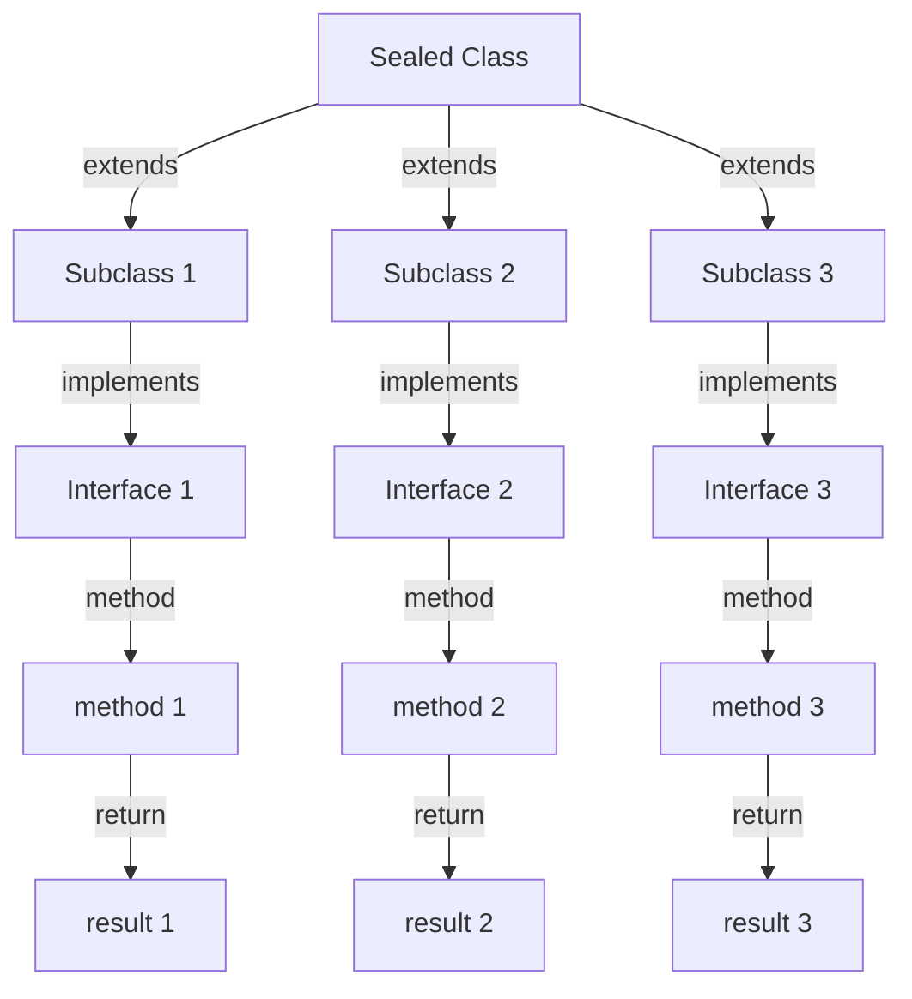

## Introduction
Java 17 introduces two significant features: **Sealed Classes** and **Pattern Matching switch** (available as a preview feature). These features aim to improve the expressiveness and conciseness of Java code. In this study guide, we will delve into the details of these features, exploring what they are, why they matter, and their real-world relevance. **Sealed Classes** allow developers to restrict which classes can extend or implement them, providing a way to define a fixed set of subclasses. **Pattern Matching switch**, on the other hand, enhances the traditional switch statement by enabling more flexible and expressive matching.

> **Note:** These features are designed to make Java code more readable, maintainable, and efficient. As a Java developer, understanding these features is essential to stay up-to-date with the latest developments in the Java ecosystem.

## Core Concepts
To grasp **Sealed Classes** and **Pattern Matching switch**, it's crucial to understand the underlying concepts:

*   **Sealed Classes**: A sealed class is a class that can be extended or implemented only by a fixed set of subclasses. This is achieved by using the `sealed` keyword when defining the class. The subclasses are specified using the `permits` keyword.
*   **Pattern Matching switch**: This feature extends the traditional switch statement by allowing more flexible matching, including the ability to match against different types of values, such as objects or expressions.

> **Tip:** When using **Sealed Classes**, consider the **Open-Closed Principle**, which states that a class should be open for extension but closed for modification. Sealed classes help enforce this principle by limiting the classes that can extend or implement them.

## How It Works Internally
Let's dive into the under-the-hood mechanics of **Sealed Classes** and **Pattern Matching switch**:

1.  **Sealed Classes**: When a class is declared as sealed, the Java compiler checks that all subclasses are specified using the `permits` keyword. This ensures that only the allowed subclasses can extend or implement the sealed class.
2.  **Pattern Matching switch**: The Java compiler translates the pattern matching switch statement into a combination of if-else statements, using the `instanceof` operator to check the type of the value being matched.

> **Warning:** When using **Pattern Matching switch**, be aware that the `instanceof` operator can lead to **ClassCastException** if not used carefully. Always ensure that the types being matched are compatible.

## Code Examples
Here are three complete and runnable examples demonstrating the usage of **Sealed Classes** and **Pattern Matching switch**:

### Example 1: Basic Sealed Class
```java
// Define a sealed class
public sealed class Vehicle permits Car, Truck {
    public abstract void drive();
}

// Define a subclass
public final class Car extends Vehicle {
    @Override
    public void drive() {
        System.out.println("Driving a car");
    }
}

// Define another subclass
public final class Truck extends Vehicle {
    @Override
    public void drive() {
        System.out.println("Driving a truck");
    }
}

// Usage
public class Main {
    public static void main(String[] args) {
        Vehicle car = new Car();
        Vehicle truck = new Truck();
        car.drive(); // Output: Driving a car
        truck.drive(); // Output: Driving a truck
    }
}
```

### Example 2: Pattern Matching switch
```java
// Define a class hierarchy
public abstract class Shape {
    public abstract void draw();
}

public class Circle extends Shape {
    @Override
    public void draw() {
        System.out.println("Drawing a circle");
    }
}

public class Rectangle extends Shape {
    @Override
    public void draw() {
        System.out.println("Drawing a rectangle");
    }
}

// Usage
public class Main {
    public static void main(String[] args) {
        Shape shape = new Circle();
        switch (shape) {
            case Circle c -> System.out.println("Found a circle");
            case Rectangle r -> System.out.println("Found a rectangle");
            default -> System.out.println("Unknown shape");
        }
    }
}
```

### Example 3: Advanced Sealed Class with Pattern Matching switch
```java
// Define a sealed class
public sealed class Color permits Red, Green, Blue {
    public abstract void printColor();
}

// Define subclasses
public final class Red extends Color {
    @Override
    public void printColor() {
        System.out.println("Red");
    }
}

public final class Green extends Color {
    @Override
    public void printColor() {
        System.out.println("Green");
    }
}

public final class Blue extends Color {
    @Override
    public void printColor() {
        System.out.println("Blue");
    }
}

// Usage
public class Main {
    public static void main(String[] args) {
        Color color = new Red();
        switch (color) {
            case Red r -> System.out.println("Red color");
            case Green g -> System.out.println("Green color");
            case Blue b -> System.out.println("Blue color");
            default -> System.out.println("Unknown color");
        }
    }
}
```

## Visual Diagram

This diagram illustrates the relationships between a sealed class, its subclasses, and the interfaces they implement.

> **Interview:** During an interview, you may be asked to explain the benefits of using sealed classes and pattern matching switch. Be prepared to discuss how these features improve code readability, maintainability, and expressiveness.

## Comparison
| Approach | Time Complexity | Space Complexity | Pros | Cons | Best For |
| --- | --- | --- | --- | --- | --- |
| Sealed Classes | O(1) | O(1) | Improves code readability, restricts subclassing | Limited flexibility | Defining a fixed set of subclasses |
| Pattern Matching switch | O(1) | O(1) | Enhances switch statement, improves code expressiveness | May lead to ClassCastException if not used carefully | Handling different types of values in a switch statement |
| Traditional switch | O(1) | O(1) | Simple and efficient | Limited flexibility, may lead to code duplication | Handling a fixed set of constant values |
| if-else chain | O(n) | O(1) | Flexible, can handle complex conditions | May lead to code duplication, harder to read | Handling complex conditions or a large number of cases |

## Real-world Use Cases
Here are three real-world examples of using **Sealed Classes** and **Pattern Matching switch**:

1.  **Defining a set of payment methods**: A sealed class can be used to define a set of payment methods, such as credit card, PayPal, or bank transfer. Each payment method can be a subclass of the sealed class.
2.  **Handling different types of network requests**: A pattern matching switch statement can be used to handle different types of network requests, such as GET, POST, PUT, or DELETE.
3.  **Implementing a state machine**: A sealed class can be used to define a set of states in a state machine, and a pattern matching switch statement can be used to handle transitions between states.

> **Tip:** When using **Sealed Classes** and **Pattern Matching switch**, consider the **Single Responsibility Principle**, which states that a class should have only one reason to change. These features can help enforce this principle by defining a clear and concise structure for your code.

## Common Pitfalls
Here are four common mistakes to avoid when using **Sealed Classes** and **Pattern Matching switch**:

1.  **Forgetting to specify subclasses**: When defining a sealed class, make sure to specify all subclasses using the `permits` keyword.
2.  **Using pattern matching switch with incompatible types**: Ensure that the types being matched in a pattern matching switch statement are compatible to avoid **ClassCastException**.
3.  **Overusing sealed classes**: Sealed classes should be used judiciously, as they can limit flexibility. Consider using abstract classes or interfaces instead.
4.  **Not handling default cases**: Always handle default cases in a pattern matching switch statement to avoid unexpected behavior.

> **Warning:** When using **Sealed Classes** and **Pattern Matching switch**, be aware of the potential for **ClassCastException** if not used carefully. Always ensure that the types being matched are compatible.

## Interview Tips
Here are three common interview questions related to **Sealed Classes** and **Pattern Matching switch**, along with sample answers:

1.  **What are the benefits of using sealed classes?**
    *   Weak answer: Sealed classes restrict subclassing.
    *   Strong answer: Sealed classes improve code readability, maintainability, and expressiveness by defining a fixed set of subclasses. They also help enforce the Open-Closed Principle.
2.  **How does pattern matching switch improve code expressiveness?**
    *   Weak answer: Pattern matching switch allows more flexible matching.
    *   Strong answer: Pattern matching switch enhances the traditional switch statement by enabling more flexible and expressive matching, including the ability to match against different types of values, such as objects or expressions.
3.  **What are some common use cases for sealed classes and pattern matching switch?**
    *   Weak answer: Sealed classes can be used for defining a set of payment methods.
    *   Strong answer: Sealed classes and pattern matching switch can be used in a variety of scenarios, such as defining a set of payment methods, handling different types of network requests, or implementing a state machine. They can help improve code readability, maintainability, and expressiveness.

## Key Takeaways
Here are ten key takeaways to remember when using **Sealed Classes** and **Pattern Matching switch**:

*   **Sealed classes** restrict subclassing and improve code readability, maintainability, and expressiveness.
*   **Pattern matching switch** enhances the traditional switch statement by enabling more flexible and expressive matching.
*   **Sealed classes** and **pattern matching switch** can be used together to define a clear and concise structure for your code.
*   **Sealed classes** help enforce the **Open-Closed Principle**, which states that a class should be open for extension but closed for modification.
*   **Pattern matching switch** can lead to **ClassCastException** if not used carefully.
*   **Sealed classes** and **pattern matching switch** can be used in a variety of scenarios, such as defining a set of payment methods, handling different types of network requests, or implementing a state machine.
*   **Sealed classes** and **pattern matching switch** improve code expressiveness and readability.
*   **Sealed classes** and **pattern matching switch** can help reduce code duplication and improve maintainability.
*   **Sealed classes** and **pattern matching switch** can be used to define a fixed set of subclasses and handle different types of values in a switch statement.
*   **Sealed classes** and **pattern matching switch** are powerful features that can help improve the overall quality and maintainability of your code.