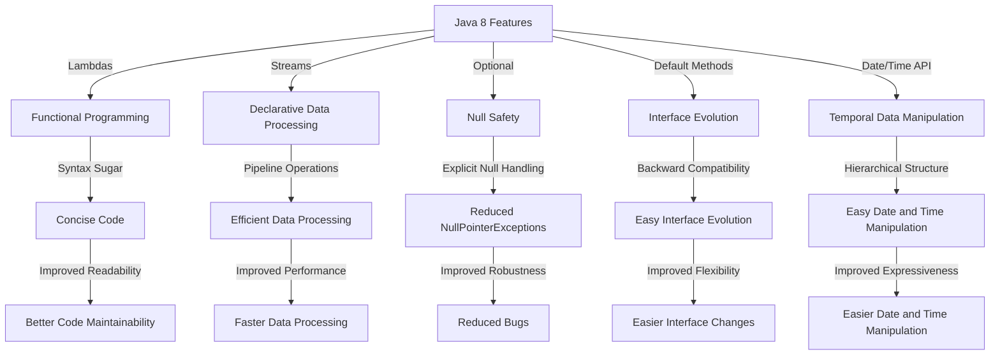

## Introduction
Java 8, released in 2014, introduced several significant features that have transformed the way developers write Java code. These features include **Lambdas**, **Streams**, **Optional**, **Default Methods**, and the **Date/Time API**. These modern features have greatly improved the expressiveness, readability, and conciseness of Java code. In this article, we will delve into each of these features, exploring what they are, why they matter, and their real-world relevance.

Java 8's features have had a profound impact on the Java ecosystem, making it a more attractive choice for developers. **Lambdas**, for instance, enable functional programming in Java, allowing for more concise and expressive code. **Streams** provide a declarative way of processing data, making it easier to work with large datasets. **Optional** helps avoid **NullPointerExceptions**, while **Default Methods** enable the addition of new functionality to existing interfaces without breaking backward compatibility. The **Date/Time API** simplifies date and time manipulation, making it easier to work with temporal data.

> **Note:** Java 8's features are not just limited to syntax sugar; they have fundamentally changed the way Java developers approach problem-solving.

## Core Concepts
Let's break down each of these features and explore their core concepts:

*   **Lambdas**: A **Lambda** is an anonymous function that can be defined inline within a larger expression. It consists of three parts: the input parameters, the lambda operator (`->`), and the lambda body.
*   **Streams**: A **Stream** is a sequence of elements that can be processed in a pipeline of operations. It's a declarative way of processing data, making it easier to work with large datasets.
*   **Optional**: An **Optional** is a container that may or may not contain a non-null value. It's used to avoid **NullPointerExceptions** and provide a more explicit way of handling null values.
*   **Default Methods**: A **Default Method** is a method with an implementation that can be defined in an interface. It allows for the addition of new functionality to existing interfaces without breaking backward compatibility.
*   **Date/Time API**: The **Date/Time API** provides a comprehensive set of classes for working with dates and times. It includes classes like `LocalDate`, `LocalTime`, and `LocalDateTime`, which provide a more straightforward and expressive way of working with temporal data.

> **Tip:** When working with Java 8 features, it's essential to understand the underlying concepts and how they interact with each other.

## How It Works Internally
Let's take a closer look at how each of these features works internally:

*   **Lambdas**: When a lambda is defined, the compiler generates a synthetic method that implements the target interface. The lambda's parameters are passed as arguments to this method, and the lambda's body is executed as the method's implementation.
*   **Streams**: A stream is created by invoking a terminal operation on a source, such as a collection or an array. The stream is then processed in a pipeline of intermediate operations, such as `filter()` or `map()`, before being consumed by a terminal operation, such as `forEach()` or `collect()`.
*   **Optional**: An optional is created using the `Optional.of()` or `Optional.empty()` methods. The `Optional` class provides various methods for working with the contained value, such as `isPresent()`, `get()`, and `orElse()`.
*   **Default Methods**: A default method is defined in an interface using the `default` keyword. The method's implementation is provided in the interface, and it can be overridden by implementing classes.
*   **Date/Time API**: The Date/Time API uses a hierarchical structure to represent dates and times. The `LocalDate` class represents a date without a time zone, while the `LocalTime` class represents a time without a date. The `LocalDateTime` class combines both date and time.

> **Warning:** When working with Java 8 features, it's crucial to understand the performance implications of each feature. For example, using **Lambdas** can lead to increased memory usage due to the creation of synthetic methods.

## Code Examples
Here are three complete and runnable code examples that demonstrate the usage of Java 8 features:

### Example 1: Basic Lambda Usage
```java
// Define a lambda that takes a string and returns its length
Function<String, Integer> lengthLambda = s -> s.length();

// Use the lambda to calculate the length of a string
String str = "Hello, World!";
int length = lengthLambda.apply(str);
System.out.println("Length: " + length);
```

### Example 2: Stream Processing
```java
// Create a list of numbers
List<Integer> numbers = Arrays.asList(1, 2, 3, 4, 5);

// Use a stream to filter out even numbers and calculate the sum of the remaining numbers
int sum = numbers.stream()
        .filter(n -> n % 2 != 0) // Filter out even numbers
        .mapToInt(n -> n) // Convert to IntStream
        .sum(); // Calculate the sum
System.out.println("Sum of odd numbers: " + sum);
```

### Example 3: Advanced Optional Usage
```java
// Create an optional that may or may not contain a value
Optional<String> optional = Optional.of("Hello, World!");

// Use the optional to perform actions based on its presence or absence
optional.ifPresent(s -> System.out.println("Value present: " + s));
optional.orElse("Default value");
```

## Visual Diagram

The diagram illustrates the relationships between Java 8 features and their benefits. It shows how each feature contributes to improved code quality, performance, and maintainability.

> **Interview:** Can you explain the difference between a lambda and a method reference in Java 8? How would you use each in a real-world scenario?

## Comparison
Here's a comparison of different approaches to working with Java 8 features:

| Approach | Time Complexity | Space Complexity | Pros | Cons | Best For |
| --- | --- | --- | --- | --- | --- |
| Lambdas | O(1) | O(1) | Concise code, improved readability | Increased memory usage | Small, one-time use cases |
| Streams | O(n) | O(n) | Declarative data processing, improved performance | Steep learning curve | Large-scale data processing |
| Optional | O(1) | O(1) | Explicit null handling, reduced NullPointerExceptions | Verbose code | Critical sections of code |
| Default Methods | O(1) | O(1) | Easy interface evolution, backward compatibility | Conflicts with existing methods | Evolving interfaces |
| Date/Time API | O(1) | O(1) | Easy date and time manipulation, improved expressiveness | Steep learning curve | Date and time manipulation |

> **Tip:** When choosing an approach, consider the trade-offs between time complexity, space complexity, and code readability.

## Real-world Use Cases
Here are three real-world use cases for Java 8 features:

*   **Netflix**: Netflix uses Java 8's **Lambdas** and **Streams** to process large amounts of data in their recommendation engine. They also use **Optional** to handle null values and avoid **NullPointerExceptions**.
*   **Dropbox**: Dropbox uses Java 8's **Date/Time API** to handle date and time manipulation in their file synchronization algorithm. They also use **Default Methods** to evolve their interfaces and maintain backward compatibility.
*   **Amazon**: Amazon uses Java 8's **Streams** to process large amounts of data in their e-commerce platform. They also use **Lambdas** to define small, one-time use functions and improve code readability.

> **Warning:** When using Java 8 features in real-world scenarios, it's essential to consider the performance implications and potential pitfalls.

## Common Pitfalls
Here are four common pitfalls to watch out for when using Java 8 features:

*   **Lambda Pitfall**: Using lambdas excessively can lead to increased memory usage and decreased performance. Avoid using lambdas for complex logic or large-scale data processing.
*   **Stream Pitfall**: Using streams with large datasets can lead to performance issues. Avoid using streams with datasets that don't fit in memory.
*   **Optional Pitfall**: Using optional excessively can lead to verbose code. Avoid using optional for simple null checks or when null values are expected.
*   **Default Method Pitfall**: Using default methods can lead to conflicts with existing methods. Avoid using default methods when evolving interfaces with existing implementations.

> **Note:** When using Java 8 features, it's crucial to understand the common pitfalls and take steps to avoid them.

## Interview Tips
Here are three common interview questions related to Java 8 features:

*   **Question 1:** Can you explain the difference between a lambda and a method reference in Java 8? How would you use each in a real-world scenario?
    *   Weak answer: "Lambdas and method references are the same thing."
    *   Strong answer: "Lambdas and method references are both used for functional programming, but they have different use cases. Lambdas are used for small, one-time use functions, while method references are used for referencing existing methods."
*   **Question 2:** How would you use Java 8's streams to process a large dataset? What are the benefits and drawbacks of using streams?
    *   Weak answer: "I would use streams to process a large dataset because it's faster and more efficient."
    *   Strong answer: "I would use streams to process a large dataset because it provides a declarative way of processing data. The benefits include improved performance and readability, while the drawbacks include potential performance issues with large datasets."
*   **Question 3:** Can you explain the purpose of Java 8's optional class? How would you use it in a real-world scenario?
    *   Weak answer: "The optional class is used for handling null values."
    *   Strong answer: "The optional class is used for explicit null handling and avoiding NullPointerExceptions. I would use it in a real-world scenario to handle null values in a critical section of code."

> **Interview:** Can you explain the benefits and drawbacks of using Java 8's default methods? How would you use them in a real-world scenario?

## Key Takeaways
Here are the key takeaways from this article:

*   **Lambdas** provide a concise way of defining small, one-time use functions.
*   **Streams** provide a declarative way of processing data, making it easier to work with large datasets.
*   **Optional** provides a way of explicitly handling null values and avoiding **NullPointerExceptions**.
*   **Default Methods** provide a way of evolving interfaces without breaking backward compatibility.
*   **Date/Time API** provides a comprehensive set of classes for working with dates and times.
*   Java 8 features can improve code readability, maintainability, and performance.
*   Understanding the common pitfalls and taking steps to avoid them is crucial when using Java 8 features.
*   Java 8 features have real-world applications in industries such as e-commerce, file synchronization, and recommendation engines.

> **Note:** Java 8 features are a powerful tool for improving code quality and performance. By understanding the key concepts, benefits, and drawbacks of each feature, developers can write more effective and efficient code.