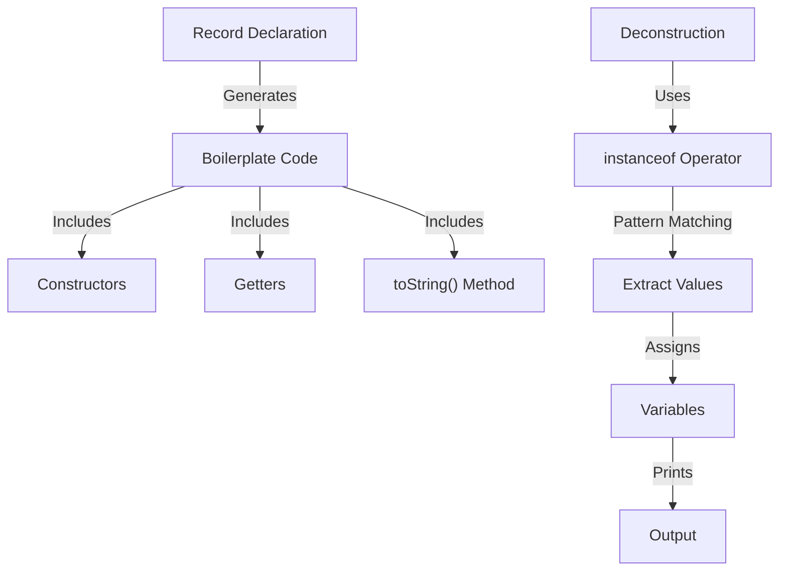

## Introduction
Record patterns and deconstruction are two modern features introduced in Java 14 and later versions. These features aim to simplify the way we work with data in Java, making it more concise and expressive. **Record** is a new type of class in Java, which is primarily used to hold immutable data. It automatically generates boilerplate code such as constructors, getters, and `toString()` methods, making it a great tool for data modeling. **Deconstruction** is a feature of record patterns that allows us to extract values from a record and assign them to separate variables. In this section, we will delve into the world of record patterns and deconstruction, exploring their syntax, usage, and benefits.

## Core Concepts
To work with record patterns and deconstruction, we need to understand the following core concepts:
- **Record**: A record is a special type of class that can be used to hold immutable data. It is declared using the `record` keyword.
- **Components**: Components are the individual elements of a record. They are declared in the record declaration and are used to store data.
- **Deconstruction**: Deconstruction is the process of extracting values from a record and assigning them to separate variables. This is achieved using the `instanceof` operator and pattern matching.
- **Pattern Matching**: Pattern matching is a feature of Java that allows us to check if an object matches a certain pattern. It is used extensively in record patterns and deconstruction.

> **Note:** Record patterns and deconstruction are only available in Java 14 and later versions.

## How It Works Internally
When we declare a record, the Java compiler automatically generates boilerplate code such as constructors, getters, and `toString()` methods. This is done using the `javac` compiler, which is responsible for compiling Java code into bytecode. The generated code is based on the components declared in the record.

Here is a step-by-step breakdown of how record patterns and deconstruction work internally:
1. **Record Declaration**: We declare a record using the `record` keyword, specifying the components that make up the record.
2. **Boilerplate Code Generation**: The Java compiler generates boilerplate code such as constructors, getters, and `toString()` methods based on the components declared in the record.
3. **Deconstruction**: We use the `instanceof` operator and pattern matching to extract values from a record and assign them to separate variables.

> **Tip:** Record patterns and deconstruction can be used to simplify data modeling and reduce boilerplate code.

## Code Examples
Here are three complete and runnable examples of record patterns and deconstruction in Java:
### Example 1: Basic Record Pattern
```java
// Declare a record
record Person(String name, int age) {}

public class Main {
    public static void main(String[] args) {
        // Create a new Person object
        Person person = new Person("John Doe", 30);

        // Use deconstruction to extract values from the record
        if (person instanceof Person(var name, var age)) {
            System.out.println("Name: " + name);
            System.out.println("Age: " + age);
        }
    }
}
```

### Example 2: Real-World Record Pattern
```java
// Declare a record
record Address(String street, String city, String state, String zip) {}

// Declare another record that uses the Address record
record Customer(String name, Address address) {}

public class Main {
    public static void main(String[] args) {
        // Create a new Address object
        Address address = new Address("123 Main St", "Anytown", "CA", "12345");

        // Create a new Customer object
        Customer customer = new Customer("John Doe", address);

        // Use deconstruction to extract values from the records
        if (customer instanceof Customer(var name, var address)) {
            if (address instanceof Address(var street, var city, var state, var zip)) {
                System.out.println("Name: " + name);
                System.out.println("Street: " + street);
                System.out.println("City: " + city);
                System.out.println("State: " + state);
                System.out.println("Zip: " + zip);
            }
        }
    }
}
```

### Example 3: Advanced Record Pattern with Validation
```java
// Declare a record
record Person(String name, int age) {}

public class Main {
    public static void main(String[] args) {
        // Create a new Person object
        Person person = new Person("John Doe", 30);

        // Use deconstruction to extract values from the record and validate them
        if (person instanceof Person(var name, var age) && age > 18) {
            System.out.println("Name: " + name);
            System.out.println("Age: " + age);
        } else {
            System.out.println("Invalid age");
        }
    }
}
```

> **Warning:** Record patterns and deconstruction can make code more concise, but they can also make it harder to read if overused.

## Visual Diagram

This diagram illustrates the process of record declaration, boilerplate code generation, and deconstruction. It shows how the `instanceof` operator and pattern matching are used to extract values from a record and assign them to separate variables.

## Comparison
Here is a comparison of record patterns and deconstruction with other data modeling techniques in Java:
| Approach | Time Complexity | Space Complexity | Pros | Cons | Best For |
|----------|----------------|-----------------|------|------|----------|
| Record Patterns | O(1) | O(1) | Concise, expressive, automatic boilerplate code generation | Limited to immutable data, can be harder to read | Data modeling, API design |
| Classes | O(1) | O(1) | Flexible, allows for mutable data | More verbose, requires manual boilerplate code generation | Complex data modeling, business logic |
| Structs | O(1) | O(1) | Lightweight, allows for mutable data | Limited to primitive types, not supported in Java | Performance-critical code, embedded systems |
| Tuples | O(1) | O(1) | Concise, allows for mutable data | Limited to fixed-size collections, not supported in Java | Data processing, scientific computing |

> **Interview:** What are the benefits of using record patterns and deconstruction in Java? How do they improve code readability and maintainability?

## Real-world Use Cases
Here are three real-world use cases of record patterns and deconstruction:
1. **API Design**: Record patterns and deconstruction can be used to simplify API design by reducing boilerplate code and making data modeling more concise.
2. **Data Processing**: Record patterns and deconstruction can be used to process large datasets by extracting values from records and assigning them to separate variables.
3. **Scientific Computing**: Record patterns and deconstruction can be used to simplify scientific computing by providing a concise and expressive way to model complex data structures.

## Common Pitfalls
Here are four common pitfalls to watch out for when using record patterns and deconstruction:
1. **Overusing Deconstruction**: Deconstruction can make code harder to read if overused. It is essential to strike a balance between conciseness and readability.
2. **Ignoring Validation**: Record patterns and deconstruction can make it easy to ignore validation. It is crucial to validate data before using it to prevent errors.
3. **Using Mutable Data**: Record patterns and deconstruction are limited to immutable data. Using mutable data can lead to unexpected behavior and errors.
4. **Not Understanding Pattern Matching**: Pattern matching is a critical aspect of record patterns and deconstruction. Not understanding pattern matching can lead to errors and unexpected behavior.

> **Tip:** Use record patterns and deconstruction judiciously and validate data before using it.

## Interview Tips
Here are three common interview questions related to record patterns and deconstruction:
1. **What are the benefits of using record patterns and deconstruction in Java?**: A strong answer should highlight the conciseness, expressiveness, and automatic boilerplate code generation provided by record patterns and deconstruction.
2. **How do record patterns and deconstruction improve code readability and maintainability?**: A strong answer should explain how record patterns and deconstruction simplify data modeling, reduce boilerplate code, and make code more expressive.
3. **What are the limitations of record patterns and deconstruction?**: A strong answer should discuss the limitations of record patterns and deconstruction, including their restriction to immutable data and potential impact on code readability.

> **Warning:** Not understanding the limitations of record patterns and deconstruction can lead to unexpected behavior and errors.

## Key Takeaways
Here are ten key takeaways to remember when using record patterns and deconstruction:
* Record patterns and deconstruction simplify data modeling and reduce boilerplate code.
* Record patterns and deconstruction are limited to immutable data.
* Deconstruction can make code harder to read if overused.
* Validation is crucial when using record patterns and deconstruction.
* Pattern matching is a critical aspect of record patterns and deconstruction.
* Record patterns and deconstruction can improve code readability and maintainability.
* Record patterns and deconstruction can simplify API design and data processing.
* Record patterns and deconstruction can be used in scientific computing to model complex data structures.
* Record patterns and deconstruction are only available in Java 14 and later versions.
* Not understanding the limitations of record patterns and deconstruction can lead to unexpected behavior and errors.