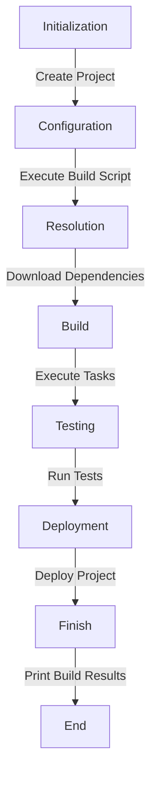

## Introduction
**Gradle** is a popular **build tool** used in the **Java ecosystem** to automate the building, testing, and deployment of software projects. It was designed to overcome the limitations of traditional build tools like **Ant** and **Maven**. Gradle provides a flexible and efficient way to manage complex build processes, making it a crucial tool for any Java developer. In this study guide, we will explore the differences between the **Groovy DSL** and **Kotlin DSL** in Gradle, two popular domain-specific languages used to write Gradle build scripts.

> **Note:** Gradle is widely used in the industry, with companies like **Google**, **Amazon**, and **Netflix** relying on it to manage their build processes.

## Core Concepts
* **Gradle**: A build tool that automates the building, testing, and deployment of software projects.
* **DSL (Domain-Specific Language)**: A programming language tailored for a specific application domain. In Gradle, DSLs are used to write build scripts.
* **Groovy DSL**: A DSL based on the **Groovy** programming language, which is a dynamic language that runs on the Java Virtual Machine (JVM).
* **Kotlin DSL**: A DSL based on the **Kotlin** programming language, which is a modern, statically typed language that runs on the JVM.

> **Tip:** Understanding the basics of Gradle and its DSLs is essential for any Java developer, as it can significantly improve the efficiency and quality of the build process.

## How It Works Internally
Gradle's build process involves the following steps:
1. **Initialization**: Gradle initializes the build process by creating a **Project** object, which represents the build project.
2. **Configuration**: Gradle configures the build process by executing the build script, which is written in a DSL (either Groovy or Kotlin).
3. **Resolution**: Gradle resolves the dependencies required by the project, which involves downloading and caching the necessary libraries.
4. **Build**: Gradle builds the project by executing the tasks defined in the build script.
5. **Testing**: Gradle runs the tests for the project, if any.
6. **Deployment**: Gradle deploys the built project to the desired location.

> **Warning:** A poorly written build script can lead to performance issues, build failures, and decreased productivity.

## Code Examples
### Example 1: Basic Groovy DSL
```groovy
// Define a simple build script in Groovy DSL
plugins {
    id 'java'
}

// Set the Java version
sourceCompatibility = '1.8'

// Define a task to print a message
task printMessage {
    doLast {
        println 'Hello, Gradle!'
    }
}
```
### Example 2: Real-World Kotlin DSL
```kotlin
// Define a build script in Kotlin DSL
plugins {
    java
}

// Set the Java version
java {
    sourceCompatibility = JavaVersion.VERSION_1_8
}

// Define a task to print a message
tasks {
    register("printMessage") {
        doLast {
            println("Hello, Gradle!")
        }
    }
}
```
### Example 3: Advanced Gradle Script
```groovy
// Define a build script with multiple tasks and dependencies
plugins {
    id 'java'
}

// Set the Java version
sourceCompatibility = '1.8'

// Define a task to compile the Java code
task compileJava {
    doLast {
        println 'Compiling Java code...'
    }
}

// Define a task to test the Java code
task testJava {
    dependsOn compileJava
    doLast {
        println 'Testing Java code...'
    }
}

// Define a task to build the project
task build {
    dependsOn testJava
    doLast {
        println 'Building project...'
    }
}
```
> **Interview:** Can you explain the difference between the `doFirst` and `doLast` methods in Gradle?

## Visual Diagram

This diagram illustrates the Gradle build process, from initialization to deployment.

## Comparison
| DSL | Time Complexity | Space Complexity | Pros | Cons | Best For |
| --- | --- | --- | --- | --- | --- |
| Groovy | O(n) | O(n) | Easy to learn, dynamic typing | Slow performance, less secure | Small to medium-sized projects |
| Kotlin | O(n) | O(n) | Statically typed, null safety | Steeper learning curve, less flexible | Large-scale, complex projects |
| Java | O(n) | O(n) | Statically typed, platform independence | Verbose, less flexible | Legacy projects, specific use cases |
| Scala | O(n) | O(n) | Statically typed, functional programming | Steeper learning curve, less widely adopted | Complex, data-intensive projects |

> **Tip:** When choosing a DSL for your Gradle build script, consider the project's size, complexity, and performance requirements.

## Real-world Use Cases
1. **Google**: Uses Gradle to manage the build process for its Android operating system.
2. **Netflix**: Relies on Gradle to build and deploy its streaming service.
3. **Amazon**: Uses Gradle to manage the build process for its cloud computing platform, AWS.

## Common Pitfalls
1. **Incorrect Dependency Management**: Failing to properly manage dependencies can lead to build failures and performance issues.
```groovy
// Wrong: Using an outdated dependency
dependencies {
    implementation 'org.springframework:spring-core:4.3.2'
}

// Right: Using the latest dependency version
dependencies {
    implementation 'org.springframework:spring-core:5.3.15'
}
```
2. **Insufficient Testing**: Not writing enough tests can lead to bugs and errors in the build process.
```groovy
// Wrong: Not testing the build process
task build {
    doLast {
        println 'Building project...'
    }
}

// Right: Testing the build process
task build {
    doLast {
        println 'Building project...'
        // Test the build process
        test {
            println 'Testing build process...'
        }
    }
}
```
> **Warning:** Failing to test the build process can lead to unexpected errors and decreased productivity.

## Interview Tips
1. **What is the difference between the Groovy and Kotlin DSLs in Gradle?**
	* Weak answer: "They are both DSLs used in Gradle."
	* Strong answer: "The Groovy DSL is a dynamic language, while the Kotlin DSL is a statically typed language. Kotlin provides better performance and security, but has a steeper learning curve."
2. **How do you manage dependencies in Gradle?**
	* Weak answer: "I use the `dependencies` block to manage dependencies."
	* Strong answer: "I use the `dependencies` block to manage dependencies, and I make sure to use the latest version of each dependency to avoid compatibility issues."
3. **What is the purpose of the `doFirst` and `doLast` methods in Gradle?**
	* Weak answer: "They are used to execute tasks in a specific order."
	* Strong answer: "The `doFirst` method is used to execute a task before the main task, while the `doLast` method is used to execute a task after the main task. This allows for more flexible and efficient build processes."

## Key Takeaways
* Gradle is a powerful build tool used in the Java ecosystem.
* The Groovy DSL is a dynamic language, while the Kotlin DSL is a statically typed language.
* Gradle's build process involves initialization, configuration, resolution, build, testing, and deployment.
* Managing dependencies and testing the build process are crucial for a successful build.
* Choosing the right DSL for your project depends on its size, complexity, and performance requirements.
* Understanding the `doFirst` and `doLast` methods is essential for writing efficient build scripts.
* Gradle is widely used in the industry, with companies like Google, Amazon, and Netflix relying on it to manage their build processes.