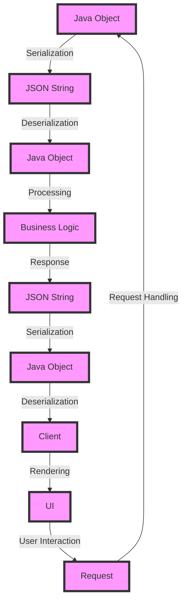

## Introduction
**Jackson** is a popular **JSON** (JavaScript Object Notation) serialization and deserialization library for **Java**. It provides a simple and efficient way to convert Java objects to and from JSON data. Jackson is widely used in many Java-based applications, including web services, RESTful APIs, and data storage systems. Its ability to handle complex data structures, such as nested objects and arrays, makes it an essential tool for any Java developer working with JSON data.

> **Note:** Jackson is not only limited to JSON serialization and deserialization but also supports other data formats like XML, CSV, and more.

In real-world scenarios, Jackson is often used in web applications to exchange data between the client and server. For example, when a user submits a form, the data is sent to the server as JSON, which is then deserialized into a Java object using Jackson. Similarly, when the server responds with data, it is serialized into JSON using Jackson and sent back to the client.

## Core Concepts
To understand how Jackson works, it's essential to grasp the following core concepts:

* **Serialization**: The process of converting a Java object into a JSON string.
* **Deserialization**: The process of converting a JSON string into a Java object.
* **Mapper**: The core component of Jackson responsible for serialization and deserialization.
* **Module**: A way to extend Jackson's functionality by adding custom serializers and deserializers.

> **Tip:** Jackson provides a wide range of modules, including the **Jackson Data Binding** module, which provides a simple way to serialize and deserialize Java objects.

Key terminology includes:

* **POJO** (Plain Old Java Object): A Java object that can be serialized and deserialized using Jackson.
* **JSONNode**: A tree-like data structure used to represent JSON data in Jackson.

## How It Works Internally
When you use Jackson to serialize or deserialize a Java object, the following steps occur:

1. **ObjectMapper** creation: You create an instance of the **ObjectMapper** class, which is the core component of Jackson.
2. **Serialization**: When you call the **writeValue** method on the **ObjectMapper** instance, Jackson serializes the Java object into a JSON string.
3. **Deserialization**: When you call the **readValue** method on the **ObjectMapper** instance, Jackson deserializes the JSON string into a Java object.

> **Warning:** Jackson's default serialization and deserialization settings can lead to security vulnerabilities if not properly configured. For example, Jackson's default setting allows the serialization of arbitrary Java objects, which can lead to remote code execution attacks.

Under the hood, Jackson uses a combination of reflection and annotation-based configuration to determine how to serialize and deserialize Java objects. The **ObjectMapper** instance uses a **JsonFactory** to create a **JsonGenerator** or **JsonParser**, which is responsible for generating or parsing the JSON data.

## Code Examples
### Example 1: Basic Serialization and Deserialization
```java
import com.fasterxml.jackson.databind.ObjectMapper;

public class User {
    private String name;
    private int age;

    public User(String name, int age) {
        this.name = name;
        this.age = age;
    }

    public String getName() {
        return name;
    }

    public void setName(String name) {
        this.name = name;
    }

    public int getAge() {
        return age;
    }

    public void setAge(int age) {
        this.age = age;
    }

    public static void main(String[] args) throws Exception {
        // Create a User object
        User user = new User("John Doe", 30);

        // Create an ObjectMapper instance
        ObjectMapper mapper = new ObjectMapper();

        // Serialize the User object to a JSON string
        String jsonString = mapper.writeValueAsString(user);
        System.out.println(jsonString);

        // Deserialize the JSON string back into a User object
        User deserializedUser = mapper.readValue(jsonString, User.class);
        System.out.println(deserializedUser.getName());
        System.out.println(deserializedUser.getAge());
    }
}
```

### Example 2: Custom Serialization and Deserialization
```java
import com.fasterxml.jackson.databind.ObjectMapper;
import com.fasterxml.jackson.databind.annotation.JsonSerialize;
import com.fasterxml.jackson.databind.annotation.JsonDeserialize;

public class CustomUser {
    private String name;
    private int age;

    public CustomUser(String name, int age) {
        this.name = name;
        this.age = age;
    }

    @JsonSerialize(using = CustomSerializer.class)
    public String getName() {
        return name;
    }

    @JsonDeserialize(using = CustomDeserializer.class)
    public void setName(String name) {
        this.name = name;
    }

    public int getAge() {
        return age;
    }

    public void setAge(int age) {
        this.age = age;
    }

    public static void main(String[] args) throws Exception {
        // Create a CustomUser object
        CustomUser user = new CustomUser("John Doe", 30);

        // Create an ObjectMapper instance
        ObjectMapper mapper = new ObjectMapper();

        // Serialize the CustomUser object to a JSON string
        String jsonString = mapper.writeValueAsString(user);
        System.out.println(jsonString);

        // Deserialize the JSON string back into a CustomUser object
        CustomUser deserializedUser = mapper.readValue(jsonString, CustomUser.class);
        System.out.println(deserializedUser.getName());
        System.out.println(deserializedUser.getAge());
    }
}

class CustomSerializer extends JsonSerializer<String> {
    @Override
    public void serialize(String value, JsonGenerator gen, SerializerProvider provider) throws IOException {
        gen.writeString(value.toUpperCase());
    }
}

class CustomDeserializer extends JsonDeserializer<String> {
    @Override
    public String deserialize(JsonParser p, DeserializationContext ctxt) throws IOException {
        return p.getText().toLowerCase();
    }
}
```

### Example 3: Handling Complex Data Structures
```java
import com.fasterxml.jackson.databind.ObjectMapper;

public class ComplexData {
    private String name;
    private List<String> interests;
    private Map<String, String> addresses;

    public ComplexData(String name, List<String> interests, Map<String, String> addresses) {
        this.name = name;
        this.interests = interests;
        this.addresses = addresses;
    }

    public String getName() {
        return name;
    }

    public void setName(String name) {
        this.name = name;
    }

    public List<String> getInterests() {
        return interests;
    }

    public void setInterests(List<String> interests) {
        this.interests = interests;
    }

    public Map<String, String> getAddresses() {
        return addresses;
    }

    public void setAddresses(Map<String, String> addresses) {
        this.addresses = addresses;
    }

    public static void main(String[] args) throws Exception {
        // Create a ComplexData object
        List<String> interests = Arrays.asList("Reading", "Hiking", "Coding");
        Map<String, String> addresses = new HashMap<>();
        addresses.put("Home", "123 Main St");
        addresses.put("Work", "456 Office St");
        ComplexData complexData = new ComplexData("John Doe", interests, addresses);

        // Create an ObjectMapper instance
        ObjectMapper mapper = new ObjectMapper();

        // Serialize the ComplexData object to a JSON string
        String jsonString = mapper.writeValueAsString(complexData);
        System.out.println(jsonString);

        // Deserialize the JSON string back into a ComplexData object
        ComplexData deserializedComplexData = mapper.readValue(jsonString, ComplexData.class);
        System.out.println(deserializedComplexData.getName());
        System.out.println(deserializedComplexData.getInterests());
        System.out.println(deserializedComplexData.getAddresses());
    }
}
```

## Visual Diagram

This diagram illustrates the process of serializing and deserializing Java objects using Jackson, and how it fits into a larger application workflow.

## Comparison
| Library | Time Complexity | Space Complexity | Pros | Cons |
| --- | --- | --- | --- | --- |
| Jackson | O(n) | O(n) | High-performance, flexible, and customizable | Steep learning curve, complex configuration |
| Gson | O(n) | O(n) | Simple and easy to use, supports streaming | Limited customization options, slower performance |
| FastJSON | O(n) | O(n) | Fast and efficient, supports streaming | Security vulnerabilities, limited customization options |
| JSON-java | O(n) | O(n) | Simple and lightweight, easy to use | Limited features and customization options |

> **Interview:** When asked about the trade-offs between different JSON serialization libraries, be prepared to discuss the pros and cons of each library, including performance, customization options, and security considerations.

## Real-world Use Cases
* **Dropbox**: Uses Jackson to serialize and deserialize JSON data in their web applications.
* **Twitter**: Uses Jackson to handle JSON data in their streaming API.
* **Netflix**: Uses Jackson to serialize and deserialize JSON data in their microservices architecture.

## Common Pitfalls
* **Insecure Deserialization**: Failing to properly configure Jackson's deserialization settings can lead to security vulnerabilities.
* **Performance Issues**: Not optimizing Jackson's performance settings can lead to slow serialization and deserialization times.
* **Data Loss**: Not properly handling null or missing values can lead to data loss during serialization and deserialization.
* **Incompatible Data Types**: Not properly handling incompatible data types can lead to errors during serialization and deserialization.

> **Warning:** Always ensure that you properly configure Jackson's settings to avoid common pitfalls and security vulnerabilities.

## Interview Tips
* **What is the difference between Jackson's serialization and deserialization?**: Be prepared to explain the differences between serialization and deserialization, including how they are used in different scenarios.
* **How do you optimize Jackson's performance?**: Be prepared to discuss ways to optimize Jackson's performance, including configuring settings and using caching.
* **What are some common security vulnerabilities in Jackson?**: Be prepared to discuss common security vulnerabilities in Jackson, including insecure deserialization and data loss.

## Key Takeaways
* Jackson is a high-performance JSON serialization and deserialization library for Java.
* Jackson provides a flexible and customizable way to serialize and deserialize Java objects.
* Jackson has a steep learning curve due to its complex configuration options.
* Jackson is widely used in many Java-based applications, including web services and microservices architectures.
* Jackson provides a simple and efficient way to handle complex data structures, including nested objects and arrays.
* Jackson has a number of common pitfalls, including insecure deserialization and performance issues.
* Jackson requires proper configuration to avoid security vulnerabilities and performance issues.
* Jackson is a popular choice for JSON serialization and deserialization due to its high performance and flexibility.