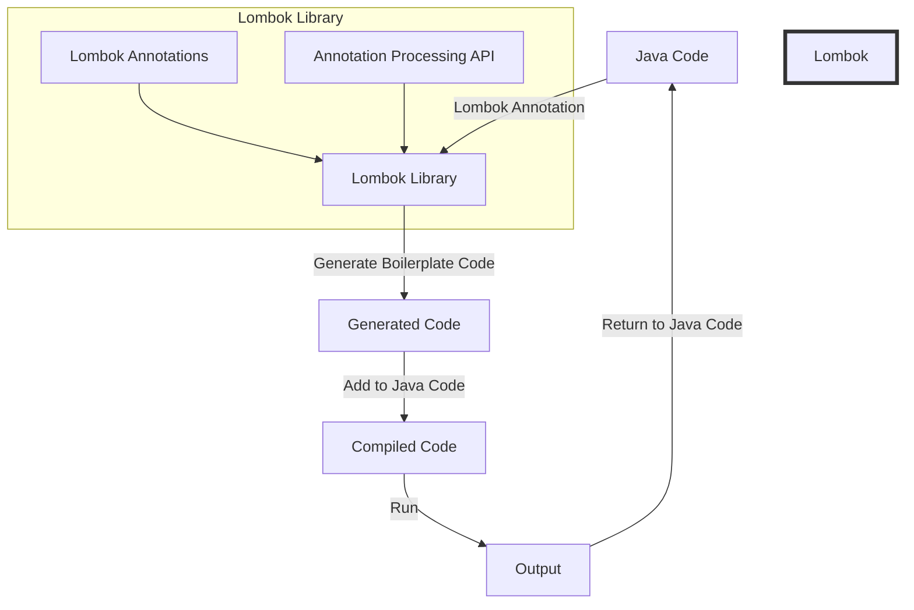

## Introduction
**Lombok** is a Java library that automatically generates boilerplate code, such as getters, setters, and constructors, at compile-time. This reduces the amount of code that developers need to write and maintain, making their codebase more concise and easier to read. Lombok is widely used in the industry, with companies like **Google**, **Amazon**, and **Microsoft** using it in their production codebases. Every Java engineer should know about Lombok, as it can save them a significant amount of time and effort.

> **Note:** Lombok is not a replacement for traditional Java code, but rather a tool that helps simplify the development process.

## Core Concepts
Lombok's core concept is the use of annotations to generate boilerplate code. The most commonly used annotations are:
* `@Getter`: generates getter methods for fields
* `@Setter`: generates setter methods for fields
* `@Data`: generates getter and setter methods, as well as `toString()`, `equals()`, and `hashCode()` methods
* `@NoArgsConstructor`: generates a no-argument constructor
* `@AllArgsConstructor`: generates an all-argument constructor

> **Tip:** Using `@Data` can save you a lot of time, as it generates all the necessary boilerplate code for a class.

## How It Works Internally
Lombok uses the Java compiler's annotation processing API to generate code at compile-time. Here's a step-by-step breakdown of how it works:
1. The Java compiler loads the Lombok library and its annotations.
2. The Lombok library uses the annotation processing API to scan the Java code for Lombok annotations.
3. When a Lombok annotation is found, the Lombok library generates the corresponding boilerplate code.
4. The generated code is then added to the Java code, and the resulting code is compiled.

> **Warning:** Lombok can sometimes cause issues with IDEs and build tools, so make sure to configure them properly.

## Code Examples
### Example 1: Basic Usage
```java
import lombok.Getter;
import lombok.Setter;

public class Person {
    @Getter
    @Setter
    private String name;

    @Getter
    @Setter
    private int age;

    public static void main(String[] args) {
        Person person = new Person();
        person.setName("John");
        person.setAge(30);
        System.out.println(person.getName() + " is " + person.getAge() + " years old.");
    }
}
```
### Example 2: Real-World Pattern
```java
import lombok.Data;

@Data
public class User {
    private String username;
    private String password;
    private String email;

    public static void main(String[] args) {
        User user = new User();
        user.setUsername("johnDoe");
        user.setPassword("password123");
        user.setEmail("johndoe@example.com");
        System.out.println(user.toString());
    }
}
```
### Example 3: Advanced Usage
```java
import lombok.AllArgsConstructor;
import lombok.Getter;
import lombok.NoArgsConstructor;
import lombok.Setter;

@Getter
@Setter
@NoArgsConstructor
@AllArgsConstructor
public class Address {
    private String street;
    private String city;
    private String state;
    private String zip;

    public static void main(String[] args) {
        Address address = new Address("123 Main St", "Anytown", "CA", "12345");
        System.out.println(address.toString());
    }
}
```
## Visual Diagram

The diagram shows the flow of how Lombok generates boilerplate code and adds it to the Java code.

## Comparison
| Approach | Time Complexity | Space Complexity | Pros | Cons | Best For |
| --- | --- | --- | --- | --- | --- |
| Lombok | O(1) | O(1) | Reduces boilerplate code, easy to use | Can cause issues with IDEs and build tools | Small to medium-sized projects |
| Manual Code Generation | O(n) | O(n) | Complete control over code generation | Time-consuming, prone to errors | Large projects with complex requirements |
| Code Generation Tools | O(n) | O(n) | Fast code generation, reduces errors | Steep learning curve, limited customization | Projects with complex code generation requirements |
| Aspect-Oriented Programming | O(n) | O(n) | Modular code generation, easy to maintain | Complex setup, limited support | Projects with complex, modular code generation requirements |

## Real-world Use Cases
* **Google**: Uses Lombok in its Android operating system to reduce boilerplate code and improve development efficiency.
* **Amazon**: Uses Lombok in its AWS SDKs to generate boilerplate code for Java developers.
* **Microsoft**: Uses Lombok in its Azure SDKs to reduce boilerplate code and improve development efficiency.

## Common Pitfalls
* **Not configuring IDEs and build tools properly**: This can cause issues with code generation and compilation.
* **Not using Lombok annotations correctly**: This can lead to incorrect code generation and compilation errors.
* **Not testing generated code thoroughly**: This can lead to runtime errors and bugs.
* **Not using Lombok's advanced features**: This can lead to missed opportunities for code reduction and improvement.

> **Interview:** What are some common pitfalls when using Lombok, and how can you avoid them?

## Interview Tips
* **What is Lombok, and how does it work?**: A strong answer should explain Lombok's core concept and how it generates boilerplate code at compile-time.
* **How do you configure Lombok with your IDE and build tools?**: A strong answer should explain the steps to configure Lombok with popular IDEs and build tools.
* **What are some common use cases for Lombok?**: A strong answer should explain the benefits of using Lombok in small to medium-sized projects and its use in real-world applications.

## Key Takeaways
* Lombok reduces boilerplate code and improves development efficiency.
* Lombok uses annotations to generate code at compile-time.
* Lombok is widely used in the industry, with companies like Google, Amazon, and Microsoft using it in their production codebases.
* Lombok has a steep learning curve, but its benefits outweigh the costs.
* Lombok is best used in small to medium-sized projects with simple code generation requirements.
* Lombok can cause issues with IDEs and build tools if not configured properly.
* Lombok's advanced features can be used to reduce code and improve development efficiency.
* Lombok is not a replacement for traditional Java code, but rather a tool that simplifies the development process.