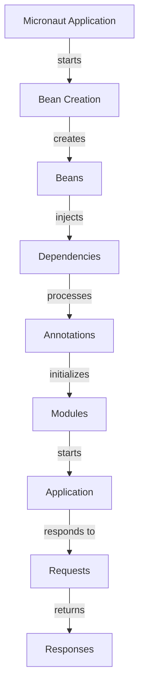

## Introduction
Micronaut is a **lightweight microservices framework** that simplifies building modular, easily testable, and scalable applications. It's built on top of Java and provides a robust set of features for building microservices, including support for **dependency injection**, **aspect-oriented programming**, and **reactive programming**. With Micronaut, you can build applications that are **fast**, **scalable**, and **easy to maintain**. In real-world scenarios, Micronaut is used in production environments by companies like **Oracle**, **IBM**, and **Red Hat**.
> **Note:** Micronaut is designed to be a more efficient alternative to traditional Java frameworks like **Spring** and **Play Framework**.

## Core Concepts
Micronaut is built around several core concepts, including:
* **Beans**: The core components of a Micronaut application, which are instantiated and managed by the framework.
* **Dependencies**: The dependencies of a bean, which are injected by the framework.
* **Annotations**: Used to configure and customize the behavior of beans and dependencies.
* **Modules**: Pre-built features that can be easily integrated into a Micronaut application.
> **Tip:** Micronaut provides a range of modules for common tasks, such as **database access**, **security**, and **messaging**.

## How It Works Internally
When you run a Micronaut application, the following steps occur:
1. **Bean creation**: The framework creates instances of the beans defined in the application.
2. **Dependency injection**: The framework injects the dependencies of each bean.
3. **Annotation processing**: The framework processes the annotations on each bean and dependency.
4. **Module initialization**: The framework initializes any modules that are part of the application.
5. **Application startup**: The framework starts the application and makes it available for use.
> **Warning:** If you're not careful, the complexity of a Micronaut application can quickly get out of hand, so it's essential to keep your application modular and well-organized.

## Code Examples
### Example 1: Basic Micronaut Application
```java
import io.micronaut.runtime.Micronaut;
import io.micronaut.http.annotation.Controller;
import io.micronaut.http.annotation.Get;

@Controller("/hello")
public class HelloController {
    @Get
    public String hello() {
        return "Hello, World!";
    }

    public static void main(String[] args) {
        Micronaut.run(HelloController.class, args);
    }
}
```
This example demonstrates a basic Micronaut application with a single controller that responds to GET requests.
### Example 2: Micronaut Application with Database Access
```java
import io.micronaut.runtime.Micronaut;
import io.micronaut.http.annotation.Controller;
import io.micronaut.http.annotation.Get;
import io.micronaut.data.annotation.Repository;
import io.micronaut.data.jpa.repository.JpaRepository;

import javax.persistence.Entity;
import javax.persistence.Id;

@Entity
public class User {
    @Id
    private Long id;
    private String name;

    // getters and setters
}

@Repository
public interface UserRepository extends JpaRepository<User, Long> {
}

@Controller("/users")
public class UserController {
    private final UserRepository userRepository;

    public UserController(UserRepository userRepository) {
        this.userRepository = userRepository;
    }

    @Get
    public List<User> getUsers() {
        return userRepository.findAll();
    }

    public static void main(String[] args) {
        Micronaut.run(UserController.class, args);
    }
}
```
This example demonstrates a Micronaut application with database access using **JPA** and **Hibernate**.
### Example 3: Micronaut Application with Reactive Programming
```java
import io.micronaut.runtime.Micronaut;
import io.micronaut.http.annotation.Controller;
import io.micronaut.http.annotation.Get;
import io.micronaut.http.annotation.Produces;
import reactor.core.publisher.Flux;

@Controller("/reactive")
public class ReactiveController {
    @Get
    @Produces("application/json")
    public Flux<String> getReactive() {
        return Flux.just("Hello", "World");
    }

    public static void main(String[] args) {
        Micronaut.run(ReactiveController.class, args);
    }
}
```
This example demonstrates a Micronaut application with **reactive programming** using **Project Reactor**.

## Visual Diagram

This diagram illustrates the internal workings of a Micronaut application, from bean creation to responding to requests.

## Comparison
| Framework | Time Complexity | Space Complexity | Pros | Cons | Best For |
| --- | --- | --- | --- | --- | --- |
| Micronaut | O(1) | O(n) | Lightweight, modular, easy to test | Steep learning curve | Building microservices, real-time applications |
| Spring | O(n) | O(n^2) | Mature, widely adopted, large community | Complex, heavy | Building enterprise-level applications |
| Play Framework | O(n) | O(n) | Fast, scalable, easy to use | Limited support for reactive programming | Building web applications, RESTful APIs |
| Quarkus | O(1) | O(n) | Fast, lightweight, easy to use | Limited support for reactive programming | Building cloud-native applications, microservices |

## Real-world Use Cases
* **Oracle**: Uses Micronaut to build microservices for their cloud-based applications.
* **IBM**: Uses Micronaut to build real-time applications for their IoT platform.
* **Red Hat**: Uses Micronaut to build microservices for their cloud-based applications.
> **Tip:** When building microservices with Micronaut, it's essential to keep each service modular and focused on a specific task.

## Common Pitfalls
* **Over-engineering**: Micronaut applications can quickly become complex if not managed properly.
* **Under-engineering**: Failing to take advantage of Micronaut's features can lead to inefficient applications.
* **Not testing**: Failing to test Micronaut applications thoroughly can lead to bugs and performance issues.
* **Not using modules**: Failing to use Micronaut's modules can lead to duplicated code and inefficiencies.
> **Warning:** When building Micronaut applications, it's essential to follow best practices and avoid common pitfalls.

## Interview Tips
* **What is Micronaut?**: A lightweight microservices framework built on top of Java.
* **How does Micronaut work?**: Micronaut creates instances of beans, injects dependencies, processes annotations, and initializes modules.
* **What are the benefits of using Micronaut?**: Lightweight, modular, easy to test, and fast.
> **Interview:** When answering questions about Micronaut, be sure to emphasize its benefits and features, and provide examples of how you've used it in real-world applications.

## Key Takeaways
* **Micronaut is a lightweight microservices framework**: Built on top of Java, Micronaut provides a robust set of features for building modular, easily testable, and scalable applications.
* **Micronaut uses dependency injection**: The framework injects dependencies of each bean, making it easy to manage complex applications.
* **Micronaut supports reactive programming**: Using Project Reactor, Micronaut provides support for building real-time applications.
* **Micronaut has a steep learning curve**: While Micronaut is a powerful framework, it requires a significant amount of time and effort to learn and master.
* **Micronaut is best for building microservices**: With its lightweight and modular design, Micronaut is ideal for building microservices and real-time applications.
* **Micronaut has a growing community**: While Micronaut is still a relatively new framework, it has a growing community of developers and a wide range of resources available.