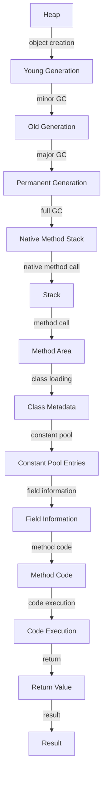

## Introduction
The Java Virtual Machine (JVM) is a crucial component of the Java ecosystem, providing a platform-independent environment for executing Java bytecode. At the heart of the JVM lies its memory layout, which plays a vital role in ensuring the efficient execution of Java programs. In this guide, we will delve into the world of thread-safe JVM memory layout, exploring its core concepts, internal mechanics, and best practices for leveraging its capabilities. Every engineer working with Java should have a deep understanding of the JVM's memory layout, as it directly impacts the performance, scalability, and reliability of their applications.

## Core Concepts
To grasp the JVM's memory layout, we must first understand the following key concepts:
- **Heap**: The heap is the shared memory space where objects are stored. It is divided into generations based on object lifetimes: **Young Generation** (new objects), **Old Generation** (long-lived objects), and **Permanent Generation** ( metadata).
- **Stack**: Each thread has its own stack, which stores primitive types, object references, and method calls. The stack is thread-safe, as each thread has its own stack frame.
- **Method Area**: This region stores class metadata, such as method code, field information, and constant pool entries.
- **Native Method Stack**: This stack is used for native method calls, which are methods written in languages other than Java.

> **Note:** The JVM's memory layout is designed to optimize performance, minimize garbage collection pauses, and provide thread safety.

## How It Works Internally
The JVM's memory layout is managed by the **Garbage Collector** (GC), which periodically reclaims memory occupied by objects that are no longer referenced. The GC uses a generational approach, dividing the heap into generations based on object lifetimes. Here's a step-by-step breakdown of the GC process:
1. **Minor GC**: The GC collects garbage from the young generation, promoting surviving objects to the old generation.
2. **Major GC**: The GC collects garbage from the old generation, which can be a time-consuming process.
3. **Full GC**: The GC collects garbage from the entire heap, including the permanent generation.

> **Warning:** Excessive GC activity can lead to performance issues and increased latency. To mitigate this, it's essential to monitor GC activity and adjust JVM settings accordingly.

## Code Examples
### Example 1: Basic JVM Memory Layout
```java
public class MemoryLayoutExample {
    public static void main(String[] args) {
        // Create an object on the heap
        Object obj = new Object();
        
        // Create a primitive type on the stack
        int primitive = 10;
        
        // Create a method call on the stack
        methodCall(primitive);
    }
    
    public static void methodCall(int primitive) {
        // This method call is stored on the stack
        System.out.println(primitive);
    }
}
```
### Example 2: Thread-Safe Memory Access
```java
public class ThreadSafeMemoryAccess {
    private static int sharedVariable = 0;
    
    public static void main(String[] args) {
        Thread thread1 = new Thread(() -> {
            // Access shared variable
            sharedVariable++;
        });
        
        Thread thread2 = new Thread(() -> {
            // Access shared variable
            sharedVariable++;
        });
        
        thread1.start();
        thread2.start();
    }
}
```
### Example 3: Advanced Memory Management
```java
public class AdvancedMemoryManagement {
    public static void main(String[] args) {
        // Create a large array on the heap
        byte[] largeArray = new byte[1024 * 1024 * 10];
        
        // Create a soft reference to the large array
        SoftReference<byte[]> softRef = new SoftReference<>(largeArray);
        
        // Clear the strong reference to the large array
        largeArray = null;
        
        // Force garbage collection
        System.gc();
        
        // Check if the soft reference is still valid
        if (softRef.get() != null) {
            System.out.println("Soft reference is still valid");
        } else {
            System.out.println("Soft reference has been garbage collected");
        }
    }
}
```
> **Tip:** Using soft references can help reduce memory usage by allowing the GC to reclaim memory when it's no longer strongly referenced.

## Visual Diagram

The above diagram illustrates the JVM's memory layout, including the heap, stack, method area, and native method stack. It also shows the flow of object creation, garbage collection, and method execution.

## Comparison
| Approach | Time Complexity | Space Complexity | Pros | Cons | Best For |
|----------|----------------|-----------------|------|------|----------|
| **Generational GC** | O(1) | O(n) | Efficient, reduces pause times | Complex, requires tuning | Most Java applications |
| **Mark-and-Sweep GC** | O(n) | O(1) | Simple, easy to implement | Slow, high pause times | Small, low-pause-time applications |
| **Concurrent Mark-and-Sweep GC** | O(n) | O(1) | Low pause times, efficient | Complex, requires tuning | Large, high-throughput applications |
| **G1 GC** | O(1) | O(n) | Low pause times, efficient | Complex, requires tuning | Large, high-throughput applications |

> **Interview:** When asked about the JVM's memory layout, be prepared to explain the different generations, the GC process, and the trade-offs between different GC algorithms.

## Real-world Use Cases
1. **Google's JVM**: Google's JVM is optimized for large-scale, high-throughput applications. It uses a custom GC algorithm that minimizes pause times and maximizes throughput.
2. **Amazon's Corretto**: Amazon's Corretto is a JVM that's optimized for cloud-based applications. It uses a tiered GC approach that balances pause times and throughput.
3. **Elasticsearch**: Elasticsearch uses a custom JVM that's optimized for search and analytics workloads. It uses a combination of generational GC and concurrent mark-and-sweep GC to minimize pause times.

## Common Pitfalls
1. **Excessive Object Creation**: Creating too many objects can lead to high GC activity, which can negatively impact performance.
2. **Inadequate JVM Tuning**: Failing to tune the JVM's GC settings can lead to suboptimal performance and increased latency.
3. **Incorrect Synchronization**: Incorrectly synchronizing access to shared variables can lead to thread safety issues.
4. **Insufficient Memory**: Providing insufficient memory to the JVM can lead to OutOfMemoryError exceptions.

> **Warning:** Excessive object creation can lead to high GC activity, which can negatively impact performance. To mitigate this, use object pooling, caching, or other techniques to reduce object creation.

## Interview Tips
1. **What is the JVM's memory layout?**: Be prepared to explain the different generations, the GC process, and the trade-offs between different GC algorithms.
2. **How does the JVM handle thread safety?**: Explain the use of synchronization, locks, and atomic variables to ensure thread safety.
3. **What are the pros and cons of different GC algorithms?**: Compare and contrast the different GC algorithms, including their time and space complexity, pros, and cons.

## Key Takeaways
* The JVM's memory layout consists of the heap, stack, method area, and native method stack.
* The GC process is responsible for reclaiming memory occupied by objects that are no longer referenced.
* The JVM uses a generational approach to divide the heap into generations based on object lifetimes.
* Excessive object creation can lead to high GC activity, which can negatively impact performance.
* Incorrect synchronization can lead to thread safety issues.
* Insufficient memory can lead to OutOfMemoryError exceptions.
* The JVM provides various GC algorithms, including generational GC, mark-and-sweep GC, and concurrent mark-and-sweep GC.
* Each GC algorithm has its pros and cons, and the choice of algorithm depends on the specific use case and requirements.