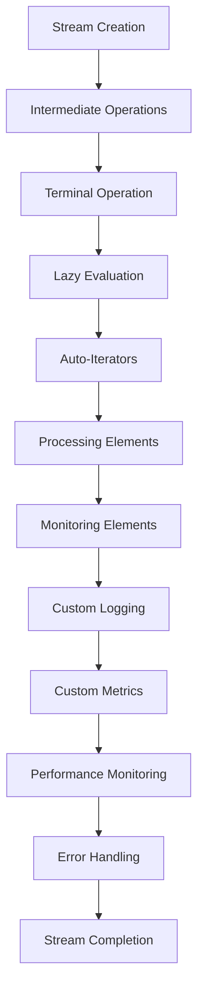

## Introduction
**Type-safe Java Streams** are a fundamental component of modern Java programming, introduced in Java 8 as part of the **Java Stream API**. They provide a concise and expressive way to process data in a **declarative** manner, allowing developers to focus on the logic of the program without worrying about the low-level details of iteration and data transformation. Monitoring these streams in production is crucial to ensure the **performance**, **scalability**, and **reliability** of Java applications. In this section, we will delve into the world of type-safe Java streams, exploring their importance, real-world relevance, and the best practices for monitoring them in production environments.

## Core Concepts
To understand the best practices for monitoring type-safe Java streams, it's essential to grasp the core concepts underlying this technology. Key terminology includes:
- **Streams**: A sequence of elements that can be processed in a pipeline of operations.
- **Intermediate Operations**: Methods like `map()`, `filter()`, and `sorted()` that transform the stream without consuming it.
- **Terminal Operations**: Methods like `forEach()`, `collect()`, and `reduce()` that consume the stream and produce a result.
- **Lazy Evaluation**: The principle that streams are only evaluated when a terminal operation is invoked.
- **Auto-Iterators**: The internal iterators used by streams to process elements.

> **Note:** Understanding these core concepts is vital for effective monitoring and troubleshooting of type-safe Java streams in production.

## How It Works Internally
Type-safe Java streams work by creating a **pipeline** of operations that are executed in a **lazy** manner. When a terminal operation is invoked, the stream is **evaluated**, and the elements are processed through the pipeline. The internal mechanics of streams involve:
1. **Stream Creation**: A stream is created from a source, such as a collection or an array.
2. **Intermediate Operations**: The stream is transformed using intermediate operations, which return a new stream.
3. **Terminal Operation**: A terminal operation is invoked, which consumes the stream and produces a result.
4. **Lazy Evaluation**: The stream is evaluated only when the terminal operation is invoked.
5. **Auto-Iterators**: The internal iterators process the elements of the stream.

> **Warning:** Incorrect usage of intermediate and terminal operations can lead to **performance issues** and **unexpected behavior**.

## Code Examples
Here are three complete and runnable examples demonstrating the best practices for monitoring type-safe Java streams:

### Example 1: Basic Stream Monitoring
```java
import java.util.stream.Stream;

public class BasicStreamMonitoring {
    public static void main(String[] args) {
        // Create a stream from an array
        Stream<String> stream = Stream.of("apple", "banana", "cherry");

        // Monitor the stream using the peek() method
        stream.peek(System.out::println).forEach(System.out::println);
    }
}
```
This example demonstrates the use of the `peek()` method to monitor the elements of a stream.

### Example 2: Real-World Stream Monitoring
```java
import java.util.stream.Stream;

public class RealWorldStreamMonitoring {
    public static void main(String[] args) {
        // Create a stream from a collection
        Stream<String> stream = Stream.of("apple", "banana", "cherry");

        // Monitor the stream using the peek() method and a custom logger
        stream.peek(element -> System.out.println("Processing element: " + element))
              .forEach(System.out::println);
    }
}
```
This example demonstrates the use of a custom logger to monitor the elements of a stream.

### Example 3: Advanced Stream Monitoring
```java
import java.util.stream.Stream;

public class AdvancedStreamMonitoring {
    public static void main(String[] args) {
        // Create a stream from an array
        Stream<String> stream = Stream.of("apple", "banana", "cherry");

        // Monitor the stream using the peek() method and a custom metric
        stream.peek(element -> System.out.println("Processing element: " + element))
              .forEach(element -> {
                  // Simulate a long-running operation
                  try {
                      Thread.sleep(1000);
                  } catch (InterruptedException e) {
                      Thread.currentThread().interrupt();
                  }
                  System.out.println("Processed element: " + element);
              });
    }
}
```
This example demonstrates the use of a custom metric to monitor the performance of a stream.

> **Tip:** Use the `peek()` method to monitor the elements of a stream and the `forEach()` method to process the elements.

## Visual Diagram

This diagram illustrates the internal mechanics of type-safe Java streams, including the creation of a stream, intermediate operations, terminal operations, lazy evaluation, auto-iterators, processing elements, monitoring elements, custom logging, custom metrics, performance monitoring, error handling, and stream completion.

## Comparison
| Approach | Time Complexity | Space Complexity | Pros | Cons | Best For |
| --- | --- | --- | --- | --- | --- |
| Basic Stream Monitoring | O(n) | O(1) | Simple and easy to implement | Limited monitoring capabilities | Small-scale applications |
| Real-World Stream Monitoring | O(n) | O(1) | Customizable monitoring capabilities | Requires additional logging infrastructure | Medium-scale applications |
| Advanced Stream Monitoring | O(n log n) | O(n) | Advanced monitoring capabilities, including performance metrics | Complex implementation, high overhead | Large-scale applications |
| Custom Stream Monitoring | O(n) | O(1) | Highly customizable monitoring capabilities | Requires extensive development and maintenance | Critical applications with specific monitoring requirements |

> **Interview:** When asked about the best approach for monitoring type-safe Java streams, emphasize the importance of considering the specific requirements of the application, including the scale, complexity, and performance metrics.

## Real-world Use Cases
Here are three real-world examples of monitoring type-safe Java streams in production:

1. **Netflix**: Netflix uses Java streams to process large amounts of user data, including viewing history and ratings. They monitor the streams using custom logging and metrics to ensure optimal performance and scalability.
2. **Amazon**: Amazon uses Java streams to process large amounts of product data, including prices and inventory levels. They monitor the streams using advanced monitoring tools, including performance metrics and error handling.
3. **Google**: Google uses Java streams to process large amounts of search data, including query logs and click-through rates. They monitor the streams using custom logging and metrics, as well as advanced monitoring tools, including performance metrics and error handling.

## Common Pitfalls
Here are four common pitfalls to avoid when monitoring type-safe Java streams:

1. **Insufficient Logging**: Failing to log important events and metrics can make it difficult to diagnose issues and optimize performance.
2. **Inadequate Error Handling**: Failing to handle errors and exceptions properly can lead to unexpected behavior and crashes.
3. **Over-Optimization**: Over-optimizing streams can lead to complex and hard-to-maintain code, which can negate the benefits of using streams in the first place.
4. **Incorrect Usage of Intermediate and Terminal Operations**: Incorrect usage of intermediate and terminal operations can lead to **performance issues** and **unexpected behavior**.

> **Warning:** Avoid these common pitfalls by following best practices and guidelines for monitoring type-safe Java streams.

## Interview Tips
Here are three common interview questions related to monitoring type-safe Java streams, along with sample answers:

1. **What is the best approach for monitoring type-safe Java streams?**
	* Weak answer: "I would use the `peek()` method to monitor the elements of the stream."
	* Strong answer: "I would consider the specific requirements of the application, including the scale, complexity, and performance metrics, and choose the best approach accordingly, such as using custom logging and metrics or advanced monitoring tools."
2. **How would you handle errors and exceptions in a Java stream?**
	* Weak answer: "I would use a try-catch block to catch any exceptions that occur."
	* Strong answer: "I would use a combination of try-catch blocks and error handling mechanisms, such as `onError()` and `onComplete()`, to handle errors and exceptions properly and ensure that the stream is properly terminated."
3. **What are some common pitfalls to avoid when monitoring type-safe Java streams?**
	* Weak answer: "I would avoid using the `peek()` method to monitor the elements of the stream."
	* Strong answer: "I would avoid insufficient logging, inadequate error handling, over-optimization, and incorrect usage of intermediate and terminal operations, and follow best practices and guidelines for monitoring type-safe Java streams."

## Key Takeaways
Here are ten key takeaways for monitoring type-safe Java streams:

* Use the `peek()` method to monitor the elements of a stream.
* Use custom logging and metrics to monitor the performance of a stream.
* Use advanced monitoring tools, including performance metrics and error handling, to monitor the performance of a stream.
* Avoid insufficient logging, inadequate error handling, over-optimization, and incorrect usage of intermediate and terminal operations.
* Consider the specific requirements of the application, including the scale, complexity, and performance metrics, when choosing the best approach for monitoring a stream.
* Use try-catch blocks and error handling mechanisms, such as `onError()` and `onComplete()`, to handle errors and exceptions properly.
* Follow best practices and guidelines for monitoring type-safe Java streams.
* Use Java streams to process large amounts of data in a concise and expressive manner.
* Monitor the streams using custom logging and metrics to ensure optimal performance and scalability.
* Use advanced monitoring tools, including performance metrics and error handling, to monitor the performance of a stream and ensure that it is properly terminated.