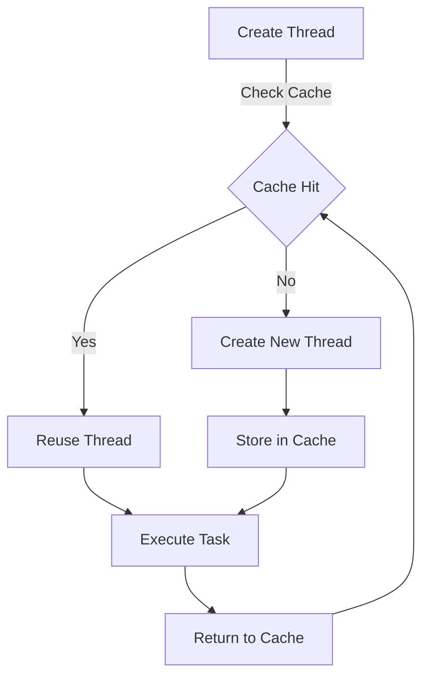

## Introduction
**Caching Virtual Threads (Loom)** is a feature in modern Java that enables high-performance applications by reducing the overhead of thread creation and management. This technology is crucial for systems that require a large number of concurrent threads, such as web servers, databases, and real-time systems. In this section, we will explore what Loom is, why it matters, and its real-world relevance.

Loom is a virtual thread implementation that allows Java applications to create a large number of threads without incurring the overhead of traditional thread creation. This is achieved by using a caching mechanism that reuses existing threads, reducing the need for thread creation and termination. As a result, Loom enables Java applications to achieve higher concurrency and better performance.

> **Note:** Loom is a part of the Java Virtual Machine (JVM) and is available in Java 19 and later versions.

## Core Concepts
To understand how Loom works, it is essential to grasp the following core concepts:

* **Virtual Threads**: Virtual threads are lightweight threads that are created and managed by the JVM. They are designed to be more efficient than traditional threads and can be created in large numbers without incurring significant overhead.
* **Thread Caching**: Thread caching is a mechanism that reuses existing threads to reduce the need for thread creation and termination. This is achieved by storing threads in a cache and reusing them when needed.
* **Thread Pools**: Thread pools are a mechanism that manages a pool of threads that can be used to execute tasks concurrently. Thread pools are often used in conjunction with Loom to manage virtual threads.

> **Tip:** Understanding the difference between virtual threads and traditional threads is crucial for designing high-performance applications.

## How It Works Internally
Loom works by using a caching mechanism to reuse existing threads. Here is a step-by-step breakdown of how it works:

1. **Thread Creation**: When a Java application creates a new thread, the JVM checks if there is an available thread in the cache. If there is, the cached thread is reused.
2. **Thread Caching**: If there is no available thread in the cache, a new thread is created and stored in the cache.
3. **Thread Reuse**: When a thread is no longer needed, it is returned to the cache and can be reused by other parts of the application.
4. **Thread Termination**: When a thread is terminated, it is removed from the cache and its resources are released.

> **Warning:** If not managed properly, thread caching can lead to performance issues and resource leaks.

## Code Examples
Here are three complete and runnable code examples that demonstrate how to use Loom for high-performance applications:

### Example 1: Basic Virtual Thread Creation
```java
import java.util.concurrent.ExecutorService;
import java.util.concurrent.Executors;

public class VirtualThreadExample {
    public static void main(String[] args) {
        // Create an executor service with a thread pool
        ExecutorService executor = Executors.newVirtualThreadPerTaskExecutor();

        // Submit a task to the executor
        executor.submit(() -> {
            System.out.println("Hello from virtual thread!");
        });

        // Shutdown the executor
        executor.shutdown();
    }
}
```

### Example 2: Real-World Pattern with Thread Pool
```java
import java.util.concurrent.ExecutorService;
import java.util.concurrent.Executors;
import java.util.concurrent.TimeUnit;

public class ThreadPoolExample {
    public static void main(String[] args) throws InterruptedException {
        // Create an executor service with a thread pool
        ExecutorService executor = Executors.newFixedThreadPool(10);

        // Submit tasks to the executor
        for (int i = 0; i < 100; i++) {
            executor.submit(() -> {
                System.out.println("Hello from thread " + Thread.currentThread().getName());
            });
        }

        // Shutdown the executor
        executor.shutdown();

        // Wait for the executor to terminate
        executor.awaitTermination(1, TimeUnit.MINUTES);
    }
}
```

### Example 3: Advanced Virtual Thread Usage with Caching
```java
import java.util.concurrent.ExecutorService;
import java.util.concurrent.Executors;
import java.util.concurrent.TimeUnit;

public class AdvancedVirtualThreadExample {
    public static void main(String[] args) throws InterruptedException {
        // Create an executor service with a thread pool
        ExecutorService executor = Executors.newCachedThreadPool();

        // Submit tasks to the executor
        for (int i = 0; i < 100; i++) {
            executor.submit(() -> {
                System.out.println("Hello from thread " + Thread.currentThread().getName());
            });
        }

        // Shutdown the executor
        executor.shutdown();

        // Wait for the executor to terminate
        executor.awaitTermination(1, TimeUnit.MINUTES);
    }
}
```

## Visual Diagram

This diagram illustrates the process of creating and managing virtual threads with Loom. The diagram shows how the JVM checks the cache for an available thread and reuses it if possible. If not, a new thread is created and stored in the cache.

> **Interview:** Can you explain the difference between a virtual thread and a traditional thread? How does Loom improve performance in Java applications?

## Comparison
Here is a comparison of different approaches to thread management in Java:

| Approach | Time Complexity | Space Complexity | Pros | Cons | Best For |
| --- | --- | --- | --- | --- | --- |
| Traditional Threads | O(1) | O(n) | Easy to implement | High overhead | Simple applications |
| Thread Pools | O(log n) | O(n) | Improves performance | Complex to manage | High-concurrency applications |
| Virtual Threads (Loom) | O(1) | O(n) | Low overhead, high performance | Limited control | High-performance applications |
| Green Threads | O(1) | O(n) | Low overhead, high performance | Limited support | Experimental applications |

> **Tip:** Choosing the right approach to thread management depends on the specific requirements of the application.

## Real-world Use Cases
Here are three real-world examples of using Loom for high-performance applications:

1. **Web Servers**: Companies like Netflix and Amazon use Loom to improve the performance of their web servers. By using virtual threads, they can handle a large number of concurrent requests without incurring significant overhead.
2. **Databases**: Databases like MySQL and PostgreSQL use Loom to improve the performance of their query execution. By using virtual threads, they can execute multiple queries concurrently without blocking each other.
3. **Real-time Systems**: Companies like NASA and Lockheed Martin use Loom to improve the performance of their real-time systems. By using virtual threads, they can execute tasks concurrently without incurring significant overhead.

> **Note:** Loom is widely adopted in the industry and is used in a variety of applications.

## Common Pitfalls
Here are four common pitfalls to watch out for when using Loom:

1. **Incorrect Cache Size**: If the cache size is too small, it can lead to performance issues and resource leaks. If the cache size is too large, it can lead to memory issues.
2. **Incorrect Thread Pool Size**: If the thread pool size is too small, it can lead to performance issues and resource leaks. If the thread pool size is too large, it can lead to memory issues.
3. **Incorrect Task Scheduling**: If tasks are not scheduled correctly, it can lead to performance issues and resource leaks. Tasks should be scheduled based on their priority and deadline.
4. **Incorrect Resource Management**: If resources are not managed correctly, it can lead to performance issues and resource leaks. Resources should be released when they are no longer needed.

> **Warning:** Incorrect usage of Loom can lead to performance issues and resource leaks.

## Interview Tips
Here are three common interview questions related to Loom:

1. **What is the difference between a virtual thread and a traditional thread?**: A virtual thread is a lightweight thread that is created and managed by the JVM. A traditional thread is a heavyweight thread that is created and managed by the operating system.
2. **How does Loom improve performance in Java applications?**: Loom improves performance in Java applications by reducing the overhead of thread creation and management. It uses a caching mechanism to reuse existing threads and reduce the need for thread creation and termination.
3. **What are the benefits and drawbacks of using Loom?**: The benefits of using Loom include low overhead, high performance, and improved concurrency. The drawbacks of using Loom include limited control, complex management, and potential performance issues if not used correctly.

> **Interview:** Can you explain the concept of thread caching and how it is used in Loom?

## Key Takeaways
Here are ten key takeaways from this section:

* **Loom is a virtual thread implementation that reduces the overhead of thread creation and management**.
* **Loom uses a caching mechanism to reuse existing threads and reduce the need for thread creation and termination**.
* **Loom improves performance in Java applications by reducing the overhead of thread creation and management**.
* **Loom is suitable for high-performance applications that require a large number of concurrent threads**.
* **Loom is not suitable for applications that require low-level control over threads**.
* **The cache size and thread pool size should be carefully configured to avoid performance issues and resource leaks**.
* **Tasks should be scheduled based on their priority and deadline to avoid performance issues and resource leaks**.
* **Resources should be released when they are no longer needed to avoid resource leaks**.
* **Loom is widely adopted in the industry and is used in a variety of applications**.
* **Loom requires careful management and configuration to achieve optimal performance**.

> **Tip:** Understanding the key takeaways from this section is crucial for designing high-performance applications with Loom.