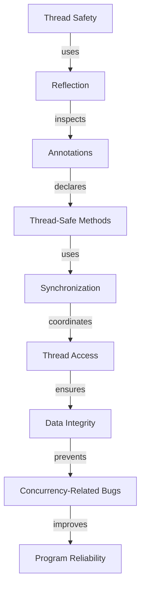

## Introduction
Designing thread-safe systems is a critical aspect of software development, particularly in modern Java applications. **Thread safety** refers to the ability of a program to execute multiple threads concurrently without compromising its integrity or producing unexpected results. One approach to achieving thread safety is through the use of **reflection** and **annotations**. In this section, we will explore the importance of thread safety, its relevance in real-world applications, and why every engineer should be familiar with these concepts.

> **Note:** Thread safety is essential in modern software development, as it ensures that multiple threads can access shared resources without compromising the program's integrity.

## Core Concepts
To understand thread safety, we need to grasp the following core concepts:

* **Thread**: A thread is a separate flow of execution within a program. Threads can run concurrently, improving the program's responsiveness and throughput.
* **Reflection**: Reflection is a mechanism that allows a program to inspect and modify its own structure and behavior at runtime. In Java, reflection is achieved through the use of the `java.lang.reflect` package.
* **Annotations**: Annotations are a form of metadata that can be attached to Java classes, methods, and fields. Annotations can provide additional information about the annotated element and can be processed by the compiler or runtime environment.

> **Warning:** Improper use of reflection and annotations can lead to security vulnerabilities and performance issues. Engineers should exercise caution when using these features.

## How It Works Internally
When designing thread-safe systems with reflection and annotations, the following internal mechanics come into play:

1. **Annotation Processing**: The Java compiler processes annotations at compile-time, generating additional code or metadata that can be used at runtime.
2. **Reflection**: The `java.lang.reflect` package provides classes and methods for inspecting and modifying the program's structure and behavior at runtime.
3. **Synchronization**: Synchronization is the process of coordinating access to shared resources between multiple threads. Java provides various synchronization mechanisms, including locks, semaphores, and monitors.

> **Tip:** Using annotations to declare thread-safe methods or fields can simplify the development process and reduce the risk of concurrency-related bugs.

## Code Examples
Here are three complete and runnable code examples that demonstrate the use of reflection and annotations for designing thread-safe systems:

### Example 1: Basic Thread Safety with Annotations
```java
import java.lang.annotation.ElementType;
import java.lang.annotation.Retention;
import java.lang.annotation.RetentionPolicy;
import java.lang.annotation.Target;

@Target(ElementType.METHOD)
@Retention(RetentionPolicy.RUNTIME)
@interface ThreadSafe {
}

class ThreadSafeExample {
    @ThreadSafe
    public synchronized void threadSafeMethod() {
        // This method is thread-safe due to the synchronized keyword
    }
}

public class Main {
    public static void main(String[] args) {
        ThreadSafeExample example = new ThreadSafeExample();
        example.threadSafeMethod();
    }
}
```

### Example 2: Using Reflection to Inspect Thread Safety
```java
import java.lang.reflect.Method;

class ThreadSafetyInspector {
    public void inspectThreadSafety(Class<?> clazz) {
        for (Method method : clazz.getMethods()) {
            if (method.isAnnotationPresent(ThreadSafe.class)) {
                System.out.println("Method " + method.getName() + " is thread-safe");
            }
        }
    }
}

@Target(ElementType.METHOD)
@Retention(RetentionPolicy.RUNTIME)
@interface ThreadSafe {
}

class ThreadSafeExample {
    @ThreadSafe
    public synchronized void threadSafeMethod() {
        // This method is thread-safe due to the synchronized keyword
    }
}

public class Main {
    public static void main(String[] args) {
        ThreadSafetyInspector inspector = new ThreadSafetyInspector();
        inspector.inspectThreadSafety(ThreadSafeExample.class);
    }
}
```

### Example 3: Advanced Thread Safety with Locks and Annotations
```java
import java.util.concurrent.locks.Lock;
import java.util.concurrent.locks.ReentrantLock;

@Target(ElementType.METHOD)
@Retention(RetentionPolicy.RUNTIME)
@interface ThreadSafe {
}

class ThreadSafeExample {
    private final Lock lock = new ReentrantLock();

    @ThreadSafe
    public void threadSafeMethod() {
        lock.lock();
        try {
            // Critical section of code
        } finally {
            lock.unlock();
        }
    }
}

public class Main {
    public static void main(String[] args) {
        ThreadSafeExample example = new ThreadSafeExample();
        example.threadSafeMethod();
    }
}
```

## Visual Diagram


> **Note:** The diagram illustrates the relationship between thread safety, reflection, annotations, and synchronization.

## Comparison
The following table compares different approaches to designing thread-safe systems:

| Approach | Time Complexity | Space Complexity | Pros | Cons | Best For |
| --- | --- | --- | --- | --- | --- |
| Synchronization | O(1) | O(1) | Easy to implement, ensures data integrity | Can lead to performance bottlenecks, deadlocks | Simple, low-contention scenarios |
| Locks | O(1) | O(1) | Flexible, can be used for fine-grained synchronization | Can be error-prone, lead to deadlocks | High-contention scenarios, complex synchronization |
| Annotations | O(1) | O(1) | Simplifies development, reduces concurrency-related bugs | Limited flexibility, can lead to annotation pollution | Simple, annotation-based scenarios |
| Reflection | O(n) | O(n) | Provides flexibility, can be used for dynamic inspection | Can lead to performance issues, security vulnerabilities | Complex, dynamic scenarios |

## Real-world Use Cases
The following companies and systems use thread safety mechanisms:

* **Google's Guava Library**: Uses annotations and reflection to provide thread-safe data structures and utilities.
* **Apache Kafka**: Employs synchronization and locks to ensure thread safety in its distributed messaging system.
* **Java Concurrency Utilities**: Provides a range of thread-safe classes and interfaces for concurrent programming.

## Common Pitfalls
The following are common mistakes to avoid when designing thread-safe systems:

* **Insufficient Synchronization**: Failing to synchronize access to shared resources can lead to concurrency-related bugs.
* **Incorrect Lock Usage**: Using locks incorrectly can result in deadlocks or performance issues.
* **Annotation Pollution**: Overusing annotations can lead to annotation pollution, making it difficult to maintain and understand the code.
* **Reflection Misuse**: Misusing reflection can result in performance issues, security vulnerabilities, or unexpected behavior.

> **Warning:** Engineers should be cautious when using reflection and annotations, as improper use can lead to security vulnerabilities and performance issues.

## Interview Tips
The following are common interview questions related to thread safety:

* **What is thread safety, and why is it important?**: A strong answer should explain the concept of thread safety, its importance in modern software development, and provide examples of thread-safe programming practices.
* **How do you ensure thread safety in a Java program?**: A weak answer might focus solely on synchronization, while a strong answer should discuss various thread safety mechanisms, including annotations, locks, and reflection.
* **Can you explain the difference between synchronization and locks?**: A strong answer should clearly explain the difference between synchronization and locks, providing examples of when to use each.

## Key Takeaways
The following are key takeaways for designing thread-safe systems with reflection and annotations:

* **Thread safety is essential in modern software development**: Thread safety ensures that multiple threads can access shared resources without compromising the program's integrity.
* **Reflection and annotations can simplify thread safety**: Using annotations and reflection can simplify the development process and reduce the risk of concurrency-related bugs.
* **Synchronization and locks are essential for thread safety**: Synchronization and locks provide a way to coordinate access to shared resources, ensuring data integrity and preventing concurrency-related bugs.
* **Annotation pollution and reflection misuse can lead to issues**: Engineers should be cautious when using annotations and reflection, as improper use can lead to security vulnerabilities, performance issues, or unexpected behavior.
* **Thread safety mechanisms have varying time and space complexities**: Different thread safety mechanisms have varying time and space complexities, and engineers should choose the most suitable approach based on the specific use case.
* **Real-world systems use thread safety mechanisms**: Many real-world systems, including Google's Guava Library and Apache Kafka, employ thread safety mechanisms to ensure data integrity and prevent concurrency-related bugs.