## Introduction
Designing type-safe systems is crucial in modern software development, as it ensures the correctness and reliability of the code. One way to achieve type safety in Java is by using **classloaders**. A classloader is responsible for loading Java classes into the Java Virtual Machine (JVM). In this section, we will explore the importance of classloaders in designing type-safe systems and their real-world relevance.

Classloaders play a vital role in maintaining the integrity of the Java type system. They ensure that classes are loaded correctly and that the types are consistent across the application. This is particularly important in large-scale systems where multiple modules and libraries are used. By using classloaders, developers can ensure that their code is type-safe and avoid common errors such as **ClassCastException**.

> **Note:** Classloaders are not only useful for type safety but also for loading classes dynamically, which is essential in many modern applications, such as web servers and plugins.

## Core Concepts
To understand how classloaders work, it's essential to grasp some core concepts:

* **ClassLoader**: A classloader is an instance of the **java.lang.ClassLoader** class, which is responsible for loading classes into the JVM.
* **Class Loading**: The process of loading a class into the JVM, which involves finding the class file, parsing it, and creating a **Class** object.
* **Type Safety**: The property of a programming language that ensures the correctness of the code at compile-time and runtime.

> **Tip:** To achieve type safety, it's essential to use classloaders correctly and avoid common pitfalls such as loading classes from untrusted sources.

## How It Works Internally
The class loading process in Java involves the following steps:

1. **Class File Search**: The classloader searches for the class file in the classpath.
2. **Class File Parsing**: The classloader parses the class file and creates a **Class** object.
3. **Verification**: The classloader verifies the class file to ensure that it is valid and consistent with the Java type system.
4. **Initialization**: The classloader initializes the class by executing the **static** block.

The classloader uses a **delegate-first** approach, which means that it delegates the class loading to its parent classloader before attempting to load the class itself. This ensures that classes are loaded consistently and avoids conflicts between different classloaders.

> **Warning:** Using custom classloaders can lead to security vulnerabilities if not implemented correctly. Always use trusted sources and follow best practices when loading classes dynamically.

## Code Examples
Here are three complete and runnable examples of using classloaders in Java:

### Example 1: Basic Classloader
```java
import java.lang.ClassLoader;

public class BasicClassLoader {
    public static void main(String[] args) {
        // Create a new classloader
        ClassLoader classLoader = new ClassLoader() {
            @Override
            protected Class<?> findClass(String name) throws ClassNotFoundException {
                // Load the class from the classpath
                return super.findClass(name);
            }
        };

        // Load a class using the classloader
        try {
            Class<?> clazz = classLoader.loadClass("java.lang.String");
            System.out.println("Loaded class: " + clazz.getName());
        } catch (ClassNotFoundException e) {
            System.out.println("Error loading class: " + e.getMessage());
        }
    }
}
```

### Example 2: Custom Classloader
```java
import java.io.ByteArrayOutputStream;
import java.io.File;
import java.io.FileInputStream;
import java.io.IOException;
import java.lang.ClassLoader;

public class CustomClassLoader extends ClassLoader {
    @Override
    protected Class<?> findClass(String name) throws ClassNotFoundException {
        // Load the class from a file
        try {
            File file = new File(name + ".class");
            FileInputStream fis = new FileInputStream(file);
            ByteArrayOutputStream bos = new ByteArrayOutputStream();
            byte[] buffer = new byte[1024];
            int len;
            while ((len = fis.read(buffer)) != -1) {
                bos.write(buffer, 0, len);
            }
            fis.close();
            byte[] classBytes = bos.toByteArray();
            return defineClass(name, classBytes, 0, classBytes.length);
        } catch (IOException e) {
            throw new ClassNotFoundException(name, e);
        }
    }

    public static void main(String[] args) {
        // Create a new instance of the custom classloader
        CustomClassLoader classLoader = new CustomClassLoader();

        // Load a class using the custom classloader
        try {
            Class<?> clazz = classLoader.findClass("HelloWorld");
            System.out.println("Loaded class: " + clazz.getName());
        } catch (ClassNotFoundException e) {
            System.out.println("Error loading class: " + e.getMessage());
        }
    }
}
```

### Example 3: URLClassLoader
```java
import java.net.URL;
import java.net.URLClassLoader;

public class URLClassLoaderExample {
    public static void main(String[] args) {
        // Create a new URL classloader
        try {
            URL url = new URL("file:///path/to/HelloWorld.class");
            URLClassLoader classLoader = new URLClassLoader(new URL[] { url });

            // Load a class using the URL classloader
            Class<?> clazz = classLoader.loadClass("HelloWorld");
            System.out.println("Loaded class: " + clazz.getName());
        } catch (Exception e) {
            System.out.println("Error loading class: " + e.getMessage());
        }
    }
}
```

## Visual Diagram

```mermaid
flowchart TD
    A[Class File Search] -->|found| B[Class File Parsing]
    A -->|not found| C[Delegate to Parent Classloader]
    B --> D[Verification]
    D -->|valid| E[Initialization]
    D -->|invalid| F[Error Handling]
    E --> G[Loaded Class]
    C --> H[Parent Classloader Search]
    H --> I[Class File Search]
    I --> J[Class File Parsing]
    J --> K[Verification]
    K -->|valid| L[Initialization]
    K -->|invalid| M[Error Handling]
    L --> N[Loaded Class]
    F --> O[Error Handling]
    M --> O
    style A fill:#f9f,stroke:#333,stroke-width:2px
    style B fill:#f9f,stroke:#333,stroke-width:2px
    style C fill:#f9f,stroke:#333,stroke-width:2px
    style D fill:#f9f,stroke:#333,stroke-width:2px
    style E fill:#f9f,stroke:#333,stroke-width:2px
    style F fill:#f9f,stroke:#333,stroke-width:2px
    style G fill:#f9f,stroke:#333,stroke-width:2px
    style H fill:#f9f,stroke:#333,stroke-width:2px
    style I fill:#f9f,stroke:#333,stroke-width:2px
    style J fill:#f9f,stroke:#333,stroke-width:2px
    style K fill:#f9f,stroke:#333,stroke-width:2px
    style L fill:#f9f,stroke:#333,stroke-width:2px
    style M fill:#f9f,stroke:#333,stroke-width:2px
    style N fill:#f9f,stroke:#333,stroke-width:2px
    style O fill:#f9f,stroke:#333,stroke-width:2px
```

The diagram illustrates the class loading process in Java, including the search for the class file, parsing, verification, and initialization.

## Comparison
| Classloader | Time Complexity | Space Complexity | Pros | Cons |
| --- | --- | --- | --- | --- |
| **URLClassLoader** | O(1) | O(1) | Easy to use, supports loading classes from URLs | Limited control over the class loading process |
| **Custom Classloader** | O(n) | O(n) | Provides fine-grained control over the class loading process | Requires manual implementation of the class loading logic |
| **ClassLoader** | O(1) | O(1) | Provides a basic implementation of the class loading process | Limited control over the class loading process |
| **ExtClassLoader** | O(1) | O(1) | Provides an extension of the basic classloader | Limited control over the class loading process |

## Real-world Use Cases
Here are three real-world examples of using classloaders in Java:

1. **Apache Tomcat**: Tomcat uses a custom classloader to load web applications and their dependencies.
2. **Eclipse**: Eclipse uses a custom classloader to load plugins and their dependencies.
3. **Spring Framework**: Spring uses a custom classloader to load application classes and their dependencies.

## Common Pitfalls
Here are four common pitfalls when using classloaders in Java:

1. **ClassCastException**: Thrown when trying to cast an object to a class that is not compatible with the object's actual class.
2. **ClassNotFoundException**: Thrown when the classloader cannot find the class file.
3. **NoClassDefFoundError**: Thrown when the classloader cannot find the class definition.
4. **SecurityException**: Thrown when the classloader encounters a security issue while loading a class.

> **Interview:** When asked about classloaders, be sure to mention the importance of type safety and the role of classloaders in maintaining it.

## Interview Tips
Here are three common interview questions related to classloaders in Java:

1. **What is the purpose of a classloader in Java?**: The classloader is responsible for loading classes into the JVM.
2. **How does the classloader resolve conflicts between different versions of the same class?**: The classloader uses a delegate-first approach to resolve conflicts between different versions of the same class.
3. **What is the difference between a **URLClassLoader** and a **Custom Classloader**?**: A **URLClassLoader** is a built-in classloader that loads classes from URLs, while a **Custom Classloader** is a custom implementation of the class loading logic.

## Key Takeaways
Here are ten key takeaways when using classloaders in Java:

* **Classloaders are responsible for loading classes into the JVM**.
* **Type safety is crucial in Java, and classloaders play a vital role in maintaining it**.
* **The classloader uses a delegate-first approach to resolve conflicts between different versions of the same class**.
* **Custom classloaders provide fine-grained control over the class loading process**.
* **URLClassLoaders are easy to use but provide limited control over the class loading process**.
* **Classloaders can be used to load classes from different sources, such as URLs or files**.
* **Classloaders can be used to implement security features, such as loading classes from trusted sources only**.
* **Classloaders can be used to optimize the class loading process, such as by caching frequently loaded classes**.
* **Classloaders can be used to provide a custom implementation of the class loading logic**.
* **Classloaders are essential in large-scale systems where multiple modules and libraries are used**.