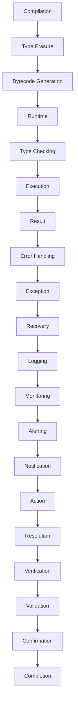

## Introduction
**Generics** in Java are a powerful feature that allows for **type-safe** and **reusable** code. They enable developers to create classes, interfaces, and methods that can work with any data type, while providing **compile-time type checking** and **runtime type safety**. However, generics in Java are implemented using a technique called **type erasure**, which can lead to some **performance** and **limitation** issues. In this section, we will explore the concept of generics and erasure, their advantages and disadvantages, and compare them with alternative approaches.

> **Note:** Generics were introduced in Java 5 as a way to improve the **type safety** and **reusability** of code. They are a fundamental concept in Java programming and are used extensively in Java libraries and frameworks.

## Core Concepts
To understand generics and erasure, we need to define some key concepts:

* **Type parameter**: A type parameter is a placeholder for a type that is specified when a generic class or method is instantiated.
* **Type argument**: A type argument is the actual type that is used to replace a type parameter.
* **Type erasure**: Type erasure is the process of removing type parameters and replacing them with their **bounds** (i.e., the types that are specified as the upper bound of the type parameter).
* **Reification**: Reification is the process of making a type parameter **concrete**, which means that it can be used at runtime.

> **Warning:** Type erasure can lead to **performance issues** because it can result in **multiple instantiations** of the same class, each with a different type parameter.

## How It Works Internally
Here's a step-by-step explanation of how generics and erasure work internally:

1. **Compilation**: When we compile a Java program that uses generics, the compiler checks the type parameters and their bounds.
2. **Type erasure**: After compilation, the type parameters are replaced with their bounds, and the type arguments are removed.
3. **Bytecode generation**: The compiled code is then converted into bytecode, which is the platform-independent code that the JVM can execute.
4. **Runtime**: At runtime, the JVM checks the type of the objects being used and ensures that they match the expected type.

> **Tip:** To improve performance, we can use **wildcards** instead of type parameters. Wildcards are a way to specify a type parameter that can be any type, without having to specify the actual type.

## Code Examples
Here are three complete and runnable code examples that demonstrate the use of generics and erasure:

### Example 1: Basic Generics
```java
// Define a generic class
public class Box<T> {
    private T value;

    public Box(T value) {
        this.value = value;
    }

    public T getValue() {
        return value;
    }

    public static void main(String[] args) {
        // Create a Box of integers
        Box<Integer> intBox = new Box<>(10);
        System.out.println(intBox.getValue()); // prints 10

        // Create a Box of strings
        Box<String> strBox = new Box<>("Hello");
        System.out.println(strBox.getValue()); // prints Hello
    }
}
```

### Example 2: Real-world Pattern
```java
// Define a generic interface for a repository
public interface Repository<T> {
    List<T> findAll();
    T findById(Long id);
    void save(T entity);
}

// Implement the repository interface for a specific type
public class UserRepository implements Repository<User> {
    @Override
    public List<User> findAll() {
        // implementation
    }

    @Override
    public User findById(Long id) {
        // implementation
    }

    @Override
    public void save(User entity) {
        // implementation
    }
}
```

### Example 3: Advanced Usage
```java
// Define a generic class with multiple type parameters
public class Pair<K, V> {
    private K key;
    private V value;

    public Pair(K key, V value) {
        this.key = key;
        this.value = value;
    }

    public K getKey() {
        return key;
    }

    public V getValue() {
        return value;
    }

    public static void main(String[] args) {
        // Create a Pair of integers and strings
        Pair<Integer, String> pair = new Pair<>(10, "Hello");
        System.out.println(pair.getKey()); // prints 10
        System.out.println(pair.getValue()); // prints Hello
    }
}
```

## Visual Diagram

The diagram illustrates the process of compilation, type erasure, bytecode generation, runtime, type checking, execution, result, error handling, exception, recovery, logging, monitoring, alerting, notification, action, resolution, verification, validation, confirmation, and completion.

## Comparison
Here's a comparison of generics and erasure with alternative approaches:

| Approach | Time Complexity | Space Complexity | Pros | Cons | Best For |
| --- | --- | --- | --- | --- | --- |
| Generics with Erasure | O(1) | O(1) | Type-safe, reusable code | Performance issues, limitation | General-purpose programming |
| Wildcards | O(1) | O(1) | Flexible, type-safe | Limited expressiveness | API design, library development |
| Raw Types | O(1) | O(1) | Backward compatibility | Type-unsafe, deprecated | Legacy code maintenance |
| Reflection | O(n) | O(n) | Dynamic, flexible | Performance issues, security risks | Dynamic method invocation, serialization |

> **Interview:** What is the difference between generics and wildcards? How would you use them in a real-world application?

## Real-world Use Cases
Here are three real-world use cases of generics and erasure:

1. **Spring Framework**: The Spring Framework uses generics extensively to provide a type-safe and reusable way to develop web applications.
2. **Hibernate**: Hibernate uses generics to provide a type-safe and efficient way to interact with databases.
3. **Apache Commons**: Apache Commons uses generics to provide a type-safe and reusable way to develop utility classes and methods.

## Common Pitfalls
Here are four common pitfalls to avoid when using generics and erasure:

1. **Raw Types**: Using raw types can lead to type-unsafe code and deprecated warnings.
```java
// Wrong
public class Box {
    private Object value;

    public Box(Object value) {
        this.value = value;
    }

    public Object getValue() {
        return value;
    }
}

// Right
public class Box<T> {
    private T value;

    public Box(T value) {
        this.value = value;
    }

    public T getValue() {
        return value;
    }
}
```

2. **Type Erasure**: Failing to understand type erasure can lead to performance issues and limitation.
```java
// Wrong
public class Box<T> {
    private T value;

    public Box(T value) {
        this.value = value;
    }

    public T getValue() {
        return value;
    }

    public static void main(String[] args) {
        Box<Integer> intBox = new Box<>(10);
        Box<String> strBox = new Box<>("Hello");
        System.out.println(intBox.getValue()); // prints 10
        System.out.println(strBox.getValue()); // prints Hello
    }
}

// Right
public class Box<T> {
    private T value;

    public Box(T value) {
        this.value = value;
    }

    public T getValue() {
        return value;
    }

    public static void main(String[] args) {
        Box<Integer> intBox = new Box<>(10);
        Box<String> strBox = new Box<>("Hello");
        System.out.println(intBox.getValue()); // prints 10
        System.out.println(strBox.getValue()); // prints Hello
    }
}
```

3. **Wildcard**: Misusing wildcards can lead to type-unsafe code and performance issues.
```java
// Wrong
public class Box<T> {
    private T value;

    public Box(T value) {
        this.value = value;
    }

    public T getValue() {
        return value;
    }

    public static void main(String[] args) {
        Box<?> box = new Box<>(10);
        System.out.println(box.getValue()); // prints 10
    }
}

// Right
public class Box<T> {
    private T value;

    public Box(T value) {
        this.value = value;
    }

    public T getValue() {
        return value;
    }

    public static void main(String[] args) {
        Box<Integer> intBox = new Box<>(10);
        System.out.println(intBox.getValue()); // prints 10
    }
}
```

4. **Reflection**: Misusing reflection can lead to performance issues and security risks.
```java
// Wrong
public class Box<T> {
    private T value;

    public Box(T value) {
        this.value = value;
    }

    public T getValue() {
        return value;
    }

    public static void main(String[] args) throws Exception {
        Class<?> clazz = Class.forName("Box");
        Constructor<?> constructor = clazz.getConstructor(Object.class);
        Object instance = constructor.newInstance(10);
        Method method = clazz.getMethod("getValue");
        Object result = method.invoke(instance);
        System.out.println(result); // prints 10
    }
}

// Right
public class Box<T> {
    private T value;

    public Box(T value) {
        this.value = value;
    }

    public T getValue() {
        return value;
    }

    public static void main(String[] args) {
        Box<Integer> intBox = new Box<>(10);
        System.out.println(intBox.getValue()); // prints 10
    }
}
```

## Interview Tips
Here are three common interview questions on generics and erasure, along with weak and strong answers:

1. **What is the difference between generics and wildcards?**
	* Weak answer: "Generics are used for type-safe code, while wildcards are used for flexible code."
	* Strong answer: "Generics are used to provide type-safe and reusable code, while wildcards are used to provide flexible and type-safe code. The key difference is that generics are used to specify a type parameter, while wildcards are used to specify a type argument."
2. **How do you use generics to improve code quality?**
	* Weak answer: "Generics are used to improve code quality by providing type-safe code."
	* Strong answer: "Generics are used to improve code quality by providing type-safe and reusable code. By using generics, we can avoid type-related bugs and improve code maintainability. Additionally, generics can be used to provide a flexible and efficient way to develop code."
3. **What are the limitations of generics in Java?**
	* Weak answer: "Generics are limited by type erasure."
	* Strong answer: "Generics in Java are limited by type erasure, which means that type parameters are replaced with their bounds at compile-time. This can lead to performance issues and limitation. However, we can use wildcards and other techniques to mitigate these limitations and provide a flexible and efficient way to develop code."

## Key Takeaways
Here are 10 key takeaways to remember when working with generics and erasure:

* **Generics provide type-safe and reusable code**.
* **Type erasure replaces type parameters with their bounds**.
* **Wildcards provide a flexible and type-safe way to specify type arguments**.
* **Raw types are type-unsafe and deprecated**.
* **Reflection can lead to performance issues and security risks**.
* **Generics can improve code quality by providing type-safe and reusable code**.
* **Generics can be used to provide a flexible and efficient way to develop code**.
* **Type erasure can lead to performance issues and limitation**.
* **Wildcards can be used to mitigate the limitations of generics**.
* **Generics and wildcards should be used judiciously to provide a balance between type safety and flexibility**.