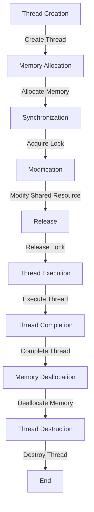

## Introduction
**Multithreading** is a fundamental concept in computer science that allows a program to execute multiple threads or flows of execution concurrently, improving responsiveness, system utilization, and throughput. The **Java Memory Model (JMM)** is a specification that defines how multiple threads interact through shared memory, ensuring that changes made by one thread are visible to other threads. In this study, we will delve into the world of multithreading and JMM, exploring their performance benefits, internal mechanics, and comparison with alternative approaches.

> **Note:** Understanding multithreading and JMM is crucial for any Java developer, as it enables them to write efficient, scalable, and concurrent programs that can take advantage of modern multicore processors.

## Core Concepts
To grasp multithreading and JMM, we need to understand the following key concepts:

* **Thread**: A separate flow of execution within a program, which can run concurrently with other threads.
* **Synchronization**: The process of coordinating access to shared resources between threads to prevent data corruption and ensure consistency.
* **Lock**: A mechanism that allows only one thread to access a shared resource at a time, preventing other threads from accessing it until the lock is released.
* **Happens-Before**: A relationship between two events, where one event must occur before the other, ensuring that changes made by one thread are visible to other threads.

> **Warning:** Without proper synchronization, multithreaded programs can exhibit **race conditions**, where the outcome depends on the relative timing of threads, leading to unpredictable behavior and errors.

## How It Works Internally
When a Java program is executed, the JMM ensures that changes made by one thread are visible to other threads. Here's a step-by-step breakdown of how it works:

1. **Thread creation**: A new thread is created, and its own stack is allocated.
2. **Memory allocation**: The thread allocates memory for its local variables and objects.
3. **Synchronization**: The thread acquires a lock on a shared resource, ensuring exclusive access.
4. **Modification**: The thread modifies the shared resource, making changes visible to other threads.
5. **Release**: The thread releases the lock, allowing other threads to access the shared resource.

> **Tip:** To improve performance, Java developers can use **volatile** variables, which ensure that changes made by one thread are immediately visible to other threads, reducing the need for synchronization.

## Code Examples
Here are three complete and runnable examples that demonstrate multithreading and JMM:

### Example 1: Basic Multithreading
```java
public class BasicMultithreading {
    public static void main(String[] args) {
        // Create two threads
        Thread thread1 = new Thread(() -> {
            System.out.println("Thread 1: Hello, world!");
        });
        Thread thread2 = new Thread(() -> {
            System.out.println("Thread 2: Hello, world!");
        });

        // Start the threads
        thread1.start();
        thread2.start();
    }
}
```
### Example 2: Synchronized Access
```java
public class SynchronizedAccess {
    private static int counter = 0;

    public static void main(String[] args) {
        // Create two threads
        Thread thread1 = new Thread(() -> {
            for (int i = 0; i < 10000; i++) {
                synchronized (SynchronizedAccess.class) {
                    counter++;
                }
            }
        });
        Thread thread2 = new Thread(() -> {
            for (int i = 0; i < 10000; i++) {
                synchronized (SynchronizedAccess.class) {
                    counter++;
                }
            }
        });

        // Start the threads
        thread1.start();
        thread2.start();

        // Wait for both threads to finish
        try {
            thread1.join();
            thread2.join();
        } catch (InterruptedException e) {
            Thread.currentThread().interrupt();
        }

        System.out.println("Final counter value: " + counter);
    }
}
```
### Example 3: Volatile Variables
```java
public class VolatileVariables {
    private static volatile boolean running = true;

    public static void main(String[] args) {
        // Create a thread that checks the volatile variable
        Thread thread = new Thread(() -> {
            while (running) {
                System.out.println("Thread: Running...");
                try {
                    Thread.sleep(100);
                } catch (InterruptedException e) {
                    Thread.currentThread().interrupt();
                }
            }
        });

        // Start the thread
        thread.start();

        // Wait for 1 second and then set the volatile variable to false
        try {
            Thread.sleep(1000);
        } catch (InterruptedException e) {
            Thread.currentThread().interrupt();
        }
        running = false;
    }
}
```
## Visual Diagram

The diagram illustrates the steps involved in thread creation, execution, and destruction, highlighting the importance of synchronization and memory management.

## Comparison
Here's a comparison of different approaches to multithreading and concurrency:

| Approach | Time Complexity | Space Complexity | Pros | Cons | Best For |
| --- | --- | --- | --- | --- | --- |
| **Multithreading** | O(1) | O(n) | Improves responsiveness, system utilization, and throughput | Can introduce synchronization overhead, deadlocks, and race conditions | I/O-bound operations, concurrent programming |
| **Multiprocessing** | O(n) | O(n) | Provides true parallelism, improving performance on multicore systems | Can introduce inter-process communication overhead, memory duplication | CPU-bound operations, scientific computing |
| **Async/Await** | O(1) | O(n) | Simplifies concurrent programming, reducing synchronization overhead | Can introduce callback hell, making code harder to read and maintain | I/O-bound operations, web development |
| **Lock-Free Programming** | O(1) | O(1) | Eliminates synchronization overhead, improving performance and scalability | Requires careful design and implementation to avoid data corruption and inconsistencies | Real-time systems, high-performance computing |

## Real-world Use Cases
Here are three real-world examples of multithreading and concurrency:

1. **Web servers**: Web servers like Apache and Nginx use multithreading to handle multiple requests concurrently, improving responsiveness and throughput.
2. **Database systems**: Database systems like MySQL and PostgreSQL use multithreading to execute queries concurrently, improving performance and reducing latency.
3. **Game engines**: Game engines like Unity and Unreal Engine use multithreading to execute game logic, physics, and rendering concurrently, improving performance and responsiveness.

## Common Pitfalls
Here are four common mistakes that engineers make when working with multithreading and concurrency:

1. **Insufficient synchronization**: Failing to synchronize access to shared resources can lead to data corruption and inconsistencies.
2. **Deadlocks**: Failing to release locks or acquiring locks in the wrong order can lead to deadlocks, where threads are blocked indefinitely.
3. **Starvation**: Failing to prioritize threads or allocate resources fairly can lead to starvation, where threads are unable to access resources or execute.
4. **Livelocks**: Failing to handle errors or exceptions properly can lead to livelocks, where threads are constantly retrying failed operations.

> **Interview:** When asked about multithreading and concurrency, be sure to discuss the importance of synchronization, the risks of deadlocks and starvation, and the benefits of lock-free programming.

## Interview Tips
Here are three common interview questions related to multithreading and concurrency, along with weak and strong answers:

1. **What is the difference between multithreading and multiprocessing?**
	* Weak answer: "Multithreading is when multiple threads run concurrently, while multiprocessing is when multiple processes run concurrently."
	* Strong answer: "Multithreading is a technique where multiple threads share the same memory space, while multiprocessing is a technique where multiple processes have their own separate memory spaces. Multithreading is suitable for I/O-bound operations, while multiprocessing is suitable for CPU-bound operations."
2. **How do you synchronize access to shared resources in a multithreaded environment?**
	* Weak answer: "You can use locks or semaphores to synchronize access."
	* Strong answer: "You can use locks, semaphores, or monitors to synchronize access. Locks are suitable for exclusive access, while semaphores are suitable for controlling the number of threads that can access a resource. Monitors are suitable for more complex synchronization scenarios."
3. **What is the benefit of using async/await in concurrent programming?**
	* Weak answer: "It makes the code look nicer and easier to read."
	* Strong answer: "Async/await simplifies concurrent programming by reducing synchronization overhead and making the code easier to read and maintain. It also improves responsiveness and throughput by allowing the program to execute other tasks while waiting for I/O operations to complete."

## Key Takeaways
Here are ten key takeaways related to multithreading and concurrency:

* **Multithreading improves responsiveness and system utilization**: By executing multiple threads concurrently, multithreading can improve the responsiveness and system utilization of a program.
* **Synchronization is critical in multithreaded environments**: Synchronization is necessary to ensure that threads access shared resources safely and consistently.
* **Locks can introduce synchronization overhead**: Locks can introduce synchronization overhead, which can impact the performance of a program.
* **Volatile variables can reduce synchronization overhead**: Volatile variables can reduce synchronization overhead by ensuring that changes made by one thread are immediately visible to other threads.
* **Async/await simplifies concurrent programming**: Async/await simplifies concurrent programming by reducing synchronization overhead and making the code easier to read and maintain.
* **Multiprocessing provides true parallelism**: Multiprocessing provides true parallelism, which can improve the performance of CPU-bound operations.
* **Lock-free programming eliminates synchronization overhead**: Lock-free programming eliminates synchronization overhead, which can improve the performance and scalability of a program.
* **Deadlocks can occur in multithreaded environments**: Deadlocks can occur in multithreaded environments if threads are not properly synchronized.
* **Starvation can occur in multithreaded environments**: Starvation can occur in multithreaded environments if threads are not properly prioritized or allocated resources.
* **Livelocks can occur in multithreaded environments**: Livelocks can occur in multithreaded environments if errors or exceptions are not properly handled.