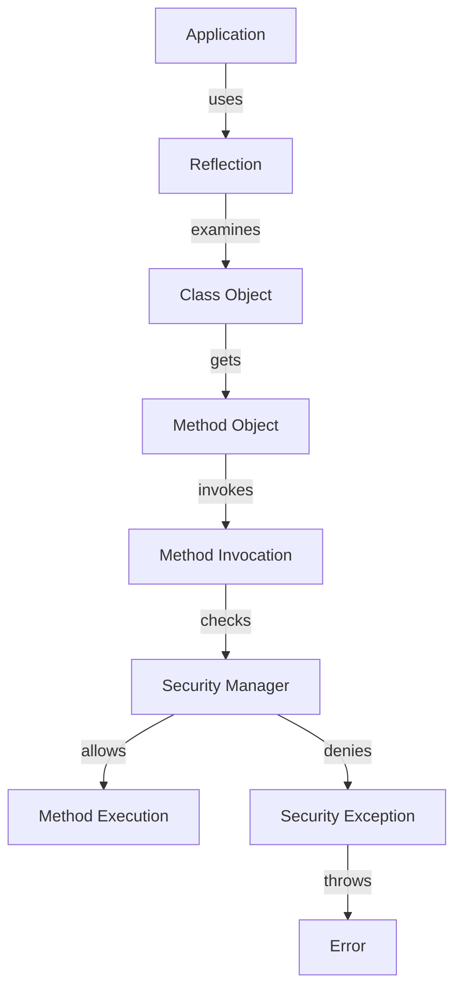

## Introduction
Securing reflection and annotations is a critical aspect of developing high-performance applications, particularly in Java. Reflection allows an application to examine and modify its own structure and behavior at runtime, while annotations provide a way to add metadata to code. However, if not properly secured, reflection and annotations can introduce significant security risks, such as **injection attacks** and **information disclosure**. In this section, we will explore the importance of securing reflection and annotations, and how it can impact real-world applications.

> **Note:** Reflection and annotations are widely used in many Java frameworks and libraries, including Spring, Hibernate, and Java EE. Therefore, understanding how to secure them is essential for developing robust and secure applications.

## Core Concepts
To secure reflection and annotations, it's essential to understand the core concepts involved. Here are some key terms and definitions:

* **Reflection**: The ability of a program to examine and modify its own structure and behavior at runtime.
* **Annotations**: A way to add metadata to code, which can be used to configure behavior or provide additional information.
* **Class loaders**: Responsible for loading classes into the Java Virtual Machine (JVM).
* **Security managers**: Provide a way to enforce security policies and restrict access to sensitive resources.

> **Warning:** Improper use of reflection and annotations can lead to security vulnerabilities, such as injection attacks and information disclosure. Therefore, it's essential to follow best practices and guidelines when using these features.

## How It Works Internally
To understand how to secure reflection and annotations, it's essential to know how they work internally. Here's a step-by-step breakdown:

1. **Class loading**: The JVM loads classes into memory using class loaders.
2. **Reflection**: The application uses reflection to examine and modify its own structure and behavior at runtime.
3. **Annotation processing**: The application uses annotation processors to process annotations and configure behavior.
4. **Security checks**: The security manager performs security checks to ensure that the application is not accessing sensitive resources or violating security policies.

> **Tip:** To improve performance, it's essential to optimize class loading and reflection. This can be achieved by using techniques such as **lazy loading** and **caching**.

## Code Examples
Here are three complete and runnable code examples that demonstrate how to secure reflection and annotations:

### Example 1: Basic Reflection
```java
import java.lang.reflect.Method;

public class ReflectionExample {
    public static void main(String[] args) throws Exception {
        // Get the class object
        Class<?> clazz = ReflectionExample.class;
        
        // Get the method object
        Method method = clazz.getMethod("hello", String.class);
        
        // Invoke the method
        method.invoke(null, "World");
    }
    
    public static void hello(String name) {
        System.out.println("Hello, " + name + "!");
    }
}
```
This example demonstrates basic reflection, where we get the class object and invoke a method using the `Method.invoke()` method.

### Example 2: Securing Reflection
```java
import java.lang.reflect.Method;
import java.security.Permission;

public class SecureReflectionExample {
    public static void main(String[] args) throws Exception {
        // Create a security manager
        System.setSecurityManager(new SecurityManager() {
            @Override
            public void checkPermission(Permission perm) {
                // Check if the permission is allowed
                if (!perm.getName().startsWith("java.lang.reflect")) {
                    throw new SecurityException("Reflection not allowed");
                }
            }
        });
        
        // Get the class object
        Class<?> clazz = SecureReflectionExample.class;
        
        // Get the method object
        Method method = clazz.getMethod("hello", String.class);
        
        // Invoke the method
        method.invoke(null, "World");
    }
    
    public static void hello(String name) {
        System.out.println("Hello, " + name + "!");
    }
}
```
This example demonstrates how to secure reflection by creating a security manager that checks if the permission is allowed before invoking the method.

### Example 3: Annotation Processing
```java
import java.lang.annotation.ElementType;
import java.lang.annotation.Retention;
import java.lang.annotation.RetentionPolicy;
import java.lang.annotation.Target;

@Target(ElementType.METHOD)
@Retention(RetentionPolicy.RUNTIME)
public @interface Secure {
    boolean value();
}

public class AnnotationProcessingExample {
    public static void main(String[] args) throws Exception {
        // Get the class object
        Class<?> clazz = AnnotationProcessingExample.class;
        
        // Get the method object
        Method method = clazz.getMethod("hello", String.class);
        
        // Check if the method is annotated with @Secure
        if (method.isAnnotationPresent(Secure.class)) {
            // Get the annotation value
            Secure annotation = method.getAnnotation(Secure.class);
            
            // Check if the annotation value is true
            if (annotation.value()) {
                // Invoke the method
                method.invoke(null, "World");
            } else {
                System.out.println("Method is not secure");
            }
        }
    }
    
    @Secure(true)
    public static void hello(String name) {
        System.out.println("Hello, " + name + "!");
    }
}
```
This example demonstrates how to process annotations and use them to configure behavior.

## Visual Diagram

This diagram illustrates the flow of reflection and annotation processing, including security checks and method invocation.

## Comparison
Here's a comparison table that summarizes different approaches to securing reflection and annotations:

| Approach | Time Complexity | Space Complexity | Pros | Cons | Best For |
| --- | --- | --- | --- | --- | --- |
| Basic Reflection | O(1) | O(1) | Simple, easy to use | Insecure, vulnerable to attacks | Development, testing |
| Secured Reflection | O(n) | O(n) | Secure, flexible | Complex, slow | Production, critical systems |
| Annotation Processing | O(1) | O(1) | Flexible, easy to use | Limited, not secure | Development, testing |
| Hybrid Approach | O(n) | O(n) | Secure, flexible, easy to use | Complex, slow | Production, critical systems |

> **Interview:** What are the trade-offs between using basic reflection, secured reflection, and annotation processing? How would you choose the best approach for a given application?

## Real-world Use Cases
Here are some real-world examples of securing reflection and annotations:

* **Spring Framework**: Uses secured reflection to configure and invoke beans.
* **Hibernate**: Uses annotation processing to configure and map entities.
* **Java EE**: Uses secured reflection to configure and invoke EJBs.

> **Tip:** When using secured reflection and annotation processing, it's essential to consider performance and scalability. Techniques such as **caching** and **lazy loading** can help improve performance.

## Common Pitfalls
Here are some common mistakes to avoid when securing reflection and annotations:

* **Insecure reflection**: Using basic reflection without proper security checks can lead to **injection attacks** and **information disclosure**.
* **Incorrect annotation processing**: Failing to properly process annotations can lead to **configuration errors** and **security vulnerabilities**.
* **Insufficient security checks**: Failing to perform sufficient security checks can lead to **authorization bypass** and **data tampering**.

> **Warning:** Securing reflection and annotations requires careful consideration of security risks and trade-offs. It's essential to follow best practices and guidelines to ensure the security and integrity of your application.

## Interview Tips
Here are some common interview questions related to securing reflection and annotations:

* **What are the security risks associated with using reflection and annotations?**
* **How would you secure reflection and annotations in a Java application?**
* **What are the trade-offs between using basic reflection, secured reflection, and annotation processing?**

> **Note:** When answering interview questions, be sure to provide specific examples and explain the trade-offs and security risks associated with different approaches.

## Key Takeaways
Here are the key takeaways from this section:

* **Securing reflection and annotations is critical for high-performance applications**.
* **Basic reflection is insecure and vulnerable to attacks**.
* **Secured reflection and annotation processing can provide flexibility and security**.
* **Hybrid approaches can offer a balance between security and performance**.
* **Performance and scalability must be considered when using secured reflection and annotation processing**.
* **Common pitfalls include insecure reflection, incorrect annotation processing, and insufficient security checks**.
* **Best practices and guidelines must be followed to ensure security and integrity**.

> **Tip:** Remember to consider the security risks and trade-offs associated with using reflection and annotations, and to follow best practices and guidelines to ensure the security and integrity of your application.