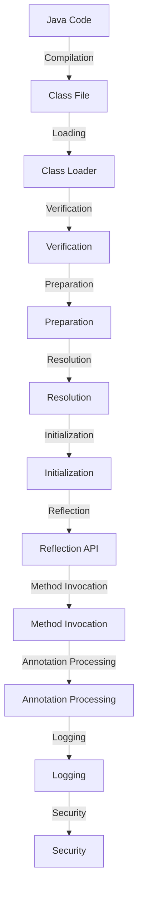

## Introduction
**Reflection** and **annotations** are two fundamental concepts in Java that enable developers to inspect and modify the behavior of their code at runtime. Reflection allows Java code to examine and dynamically call classes, methods, and fields at runtime, while annotations provide a way to add metadata to Java code that can be processed by the compiler, frameworks, and other tools. In this section, we will delve into the world of reflection and annotations, exploring their core concepts, internal workings, and practical applications.

> **Note:** Reflection and annotations are used extensively in modern Java frameworks and libraries, such as Spring, Hibernate, and Java EE. Understanding these concepts is essential for any Java developer who wants to build robust, maintainable, and scalable applications.

## Core Concepts
Let's start by defining some key terms:

* **Reflection**: The ability of a program to examine and modify its own structure and behavior at runtime.
* **Annotation**: A form of metadata that can be added to Java code to provide additional information about the code.
* **Class loader**: A component that loads Java classes into memory.
* **Method invocation**: The process of calling a method on an object.

To understand how reflection and annotations work, let's consider a simple analogy. Imagine a Java class as a blueprint for a house. The blueprint defines the structure and layout of the house, including the rooms, doors, and windows. Reflection is like having a magic lens that allows you to examine the blueprint at runtime, inspecting the rooms, doors, and windows, and even modifying the layout of the house. Annotations are like notes that the architect adds to the blueprint, providing additional information about the design and construction of the house.

## How It Works Internally
When a Java class is loaded into memory, the **class loader** creates a **Class** object that represents the class. The **Class** object contains metadata about the class, including its name, fields, methods, and annotations. Reflection uses this metadata to inspect and modify the class at runtime.

Here's a step-by-step breakdown of how reflection works:

1. **Class loading**: The class loader loads the Java class into memory.
2. **Class object creation**: The class loader creates a **Class** object that represents the class.
3. **Reflection API**: The Java Reflection API provides methods for inspecting and modifying the **Class** object.
4. **Method invocation**: The Reflection API can invoke methods on the **Class** object, allowing developers to call methods dynamically at runtime.

> **Warning:** Reflection can be slow and may introduce security risks if not used carefully. Developers should use reflection judiciously and only when necessary.

## Code Examples
Here are three complete and runnable examples that demonstrate the use of reflection and annotations in Java:

### Example 1: Basic Reflection
```java
// Define a simple class
class Person {
    private String name;

    public Person(String name) {
        this.name = name;
    }

    public void sayHello() {
        System.out.println("Hello, my name is " + name);
    }
}

public class ReflectionExample {
    public static void main(String[] args) throws Exception {
        // Create a Person object
        Person person = new Person("John");

        // Get the Class object for Person
        Class<?> clazz = person.getClass();

        // Get the method sayHello
        Method method = clazz.getMethod("sayHello");

        // Invoke the method
        method.invoke(person);
    }
}
```

### Example 2: Annotation Processing
```java
// Define an annotation
@Retention(RetentionPolicy.RUNTIME)
@Target(ElementType.METHOD)
public @interface Loggable {
    String value();
}

// Define a class with an annotated method
class Logger {
    @Loggable("INFO")
    public void logMessage(String message) {
        System.out.println("Logging: " + message);
    }
}

public class AnnotationExample {
    public static void main(String[] args) throws Exception {
        // Create a Logger object
        Logger logger = new Logger();

        // Get the Class object for Logger
        Class<?> clazz = logger.getClass();

        // Get the method logMessage
        Method method = clazz.getMethod("logMessage", String.class);

        // Check if the method is annotated with @Loggable
        if (method.isAnnotationPresent(Loggable.class)) {
            Loggable annotation = method.getAnnotation(Loggable.class);
            System.out.println("Log level: " + annotation.value());
        }

        // Invoke the method
        method.invoke(logger, "Hello, world!");
    }
}
```

### Example 3: Advanced Reflection
```java
// Define a class with a private field and method
class SecureClass {
    private String secret;

    private SecureClass(String secret) {
        this.secret = secret;
    }

    private void revealSecret() {
        System.out.println("The secret is: " + secret);
    }
}

public class AdvancedReflectionExample {
    public static void main(String[] args) throws Exception {
        // Create a SecureClass object using reflection
        Constructor<?> constructor = SecureClass.class.getDeclaredConstructor(String.class);
        constructor.setAccessible(true);
        SecureClass secureClass = (SecureClass) constructor.newInstance("My secret");

        // Get the private method revealSecret
        Method method = SecureClass.class.getDeclaredMethod("revealSecret");
        method.setAccessible(true);

        // Invoke the method
        method.invoke(secureClass);
    }
}
```

## Visual Diagram

This diagram illustrates the process of compiling, loading, and executing Java code, including the use of reflection and annotation processing.

## Comparison
| Approach | Time Complexity | Space Complexity | Pros | Cons | Best For |
| --- | --- | --- | --- | --- | --- |
| Reflection | O(1) | O(1) | Dynamic method invocation, inspection of classes and objects | Slow, security risks | Dynamic method invocation, debugging |
| Annotation Processing | O(1) | O(1) | Compile-time checking, runtime metadata | Limited expressiveness, verbose syntax | Compile-time checking, runtime metadata |
| Java API | O(1) | O(1) | Standardized interface, well-documented | Limited functionality, verbose syntax | Standardized interface, well-documented |
| Custom Implementation | O(n) | O(n) | Flexible, customizable | Complex, error-prone | Custom, performance-critical code |

## Real-world Use Cases
1. **Spring Framework**: Spring uses reflection and annotation processing to implement its dependency injection and aspect-oriented programming features.
2. **Hibernate**: Hibernate uses reflection and annotation processing to implement its object-relational mapping features.
3. **Java EE**: Java EE uses reflection and annotation processing to implement its enterprise features, such as dependency injection and security.

## Common Pitfalls
1. **Slow performance**: Reflection can be slow due to the overhead of dynamic method invocation and class inspection.
2. **Security risks**: Reflection can introduce security risks if not used carefully, such as invoking private methods or accessing sensitive data.
3. **Complexity**: Reflection can make code more complex and harder to maintain due to the use of dynamic method invocation and class inspection.
4. **Verbosity**: Annotation processing can be verbose due to the need to define and process annotations.

> **Tip:** Use reflection and annotation processing judiciously and only when necessary, and consider using alternative approaches, such as Java API or custom implementation, when possible.

## Interview Tips
1. **What is reflection in Java?**: Reflection is the ability of a program to examine and modify its own structure and behavior at runtime.
2. **How does annotation processing work in Java?**: Annotation processing involves the use of annotations to add metadata to Java code, which can be processed by the compiler, frameworks, and other tools.
3. **What are the benefits and drawbacks of using reflection in Java?**: The benefits of using reflection include dynamic method invocation and inspection of classes and objects, while the drawbacks include slow performance, security risks, and complexity.

> **Interview:** Be prepared to explain the concepts of reflection and annotation processing, and provide examples of how they are used in real-world applications.

## Key Takeaways
* Reflection is the ability of a program to examine and modify its own structure and behavior at runtime.
* Annotation processing involves the use of annotations to add metadata to Java code.
* Reflection and annotation processing are used extensively in modern Java frameworks and libraries.
* Use reflection and annotation processing judiciously and only when necessary.
* Consider using alternative approaches, such as Java API or custom implementation, when possible.
* Reflection can be slow and may introduce security risks if not used carefully.
* Annotation processing can be verbose due to the need to define and process annotations.
* The benefits of using reflection include dynamic method invocation and inspection of classes and objects.
* The drawbacks of using reflection include slow performance, security risks, and complexity.