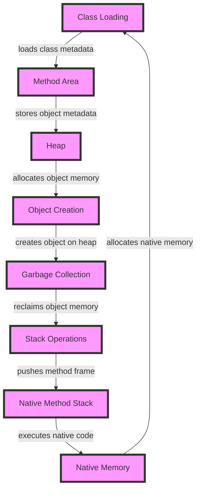

## Introduction
The Java Virtual Machine (JVM) is a crucial component of the Java ecosystem, responsible for executing Java bytecode on a wide range of platforms. At its core, the JVM provides a sandboxed environment for Java programs to run, managing memory allocation, deallocation, and optimization. Understanding how the JVM memory layout works internally is essential for any Java developer, as it has a significant impact on performance, scalability, and reliability. In this article, we'll delve into the inner workings of the JVM memory layout, exploring its core concepts, internal mechanics, and real-world implications.

## Core Concepts
To grasp the JVM memory layout, it's essential to understand the following key concepts:
* **Heap**: The heap is the primary memory area where Java objects are stored. It's divided into generations based on object lifetimes: Young Generation (Eden Space, Survivor Space), Old Generation (Tenured Space), and Permanent Generation (PermGen).
* **Stack**: The stack is a region of memory where primitive types, method calls, and local variables are stored. Each thread has its own stack, and the stack size is fixed.
* **Method Area**: The method area stores class metadata, such as class structures, field information, and method data.
* **Native Method Stack**: The native method stack is used for native method calls, which are methods implemented in native code.
* **PC Register**: The PC register (Program Counter) stores the current instruction pointer.
* **Native Memory**: Native memory refers to memory allocated outside the JVM, typically used for native libraries, sockets, and other system resources.

> **Tip:** Understanding the JVM memory layout is crucial for optimizing Java applications, as it helps identify performance bottlenecks and memory-related issues.

## How It Works Internally
Here's a step-by-step breakdown of how the JVM memory layout works:
1. **Class Loading**: The JVM loads classes into the method area, where class metadata is stored.
2. **Object Creation**: When an object is created, the JVM allocates memory for it in the heap. The object's metadata, such as its class and field information, is stored in the method area.
3. **Garbage Collection**: The JVM periodically performs garbage collection to reclaim memory occupied by objects that are no longer reachable. The garbage collector uses a generational approach, where objects are divided into young and old generations based on their lifetimes.
4. **Stack Operations**: When a method is called, the JVM pushes a new frame onto the stack, which contains the method's local variables, parameters, and return address.
5. **Native Method Calls**: When a native method is called, the JVM allocates a new frame on the native method stack and executes the native code.

> **Warning:** Improperly configured JVM memory settings can lead to performance issues, OutOfMemoryErrors, or even crashes.

## Code Examples
### Example 1: Basic JVM Memory Layout
```java
public class JVMMemoryLayout {
    public static void main(String[] args) {
        // Create an object on the heap
        Object obj = new Object();
        // Print the object's hash code
        System.out.println(obj.hashCode());
    }
}
```
This example demonstrates the creation of an object on the heap and the printing of its hash code.

### Example 2: JVM Memory Profiling
```java
import java.lang.management.ManagementFactory;
import java.lang.management.MemoryMXBean;
import java.lang.management.MemoryUsage;

public class JVMMemoryProfiling {
    public static void main(String[] args) {
        // Get the memory MX bean
        MemoryMXBean memoryMXBean = ManagementFactory.getMemoryMXBean();
        // Get the heap memory usage
        MemoryUsage heapMemoryUsage = memoryMXBean.getHeapMemoryUsage();
        // Print the heap memory usage
        System.out.println("Heap Memory Usage: " + heapMemoryUsage);
    }
}
```
This example demonstrates how to use the Java Management API to profile the JVM memory usage.

### Example 3: JVM Memory Optimization
```java
import java.util.ArrayList;
import java.util.List;

public class JVMMemoryOptimization {
    public static void main(String[] args) {
        // Create a list of objects
        List<Object> list = new ArrayList<>();
        for (int i = 0; i < 10000; i++) {
            list.add(new Object());
        }
        // Clear the list to free up memory
        list.clear();
    }
}
```
This example demonstrates how to optimize JVM memory usage by clearing a list of objects to free up memory.

## Visual Diagram

This diagram illustrates the JVM memory layout and the relationships between its components.

## Comparison
| Approach | Time Complexity | Space Complexity | Pros | Cons | Best For |
| --- | --- | --- | --- | --- | --- |
| Generational Garbage Collection | O(log n) | O(n) | Efficient, low pause times | Complex, requires tuning | High-performance applications |
| Mark-and-Sweep Garbage Collection | O(n) | O(n) | Simple, easy to implement | Slow, high pause times | Low-priority applications |
| Incremental Garbage Collection | O(log n) | O(n) | Low pause times, efficient | Complex, requires tuning | Real-time applications |
| Concurrent Garbage Collection | O(log n) | O(n) | Low pause times, efficient | Complex, requires tuning | High-priority applications |

## Real-world Use Cases
* **Google**: Google uses the JVM to power its Android operating system, which relies heavily on the JVM's memory management capabilities.
* **Amazon**: Amazon uses the JVM to power its AWS Lambda service, which provides a serverless computing platform for developers.
* **Netflix**: Netflix uses the JVM to power its streaming service, which relies on the JVM's memory management capabilities to deliver high-quality video content.

## Common Pitfalls
* **OutOfMemoryError**: Failing to configure the JVM's memory settings properly can lead to OutOfMemoryErrors, which can cause application crashes.
* **Memory Leaks**: Failing to properly close resources, such as database connections or file handles, can lead to memory leaks, which can cause application crashes.
* **Garbage Collection Overhead**: Failing to properly tune the JVM's garbage collection settings can lead to high pause times, which can negatively impact application performance.
* **Native Memory Issues**: Failing to properly manage native memory can lead to crashes, freezes, or other issues.

> **Interview:** Can you explain the difference between the young and old generations in the JVM's garbage collection algorithm?

## Interview Tips
* **Weak Answer**: The young generation is for short-lived objects, and the old generation is for long-lived objects.
* **Strong Answer**: The young generation is divided into the Eden Space and the Survivor Space, where objects are allocated and promoted based on their lifetimes. The old generation, also known as the Tenured Space, is where long-lived objects are stored and garbage collected less frequently.
* **Key Talking Points**: Garbage collection, object lifetimes, generations, promotion, and garbage collection algorithms.

## Key Takeaways
* The JVM memory layout consists of the heap, stack, method area, native method stack, and native memory.
* The heap is divided into generations based on object lifetimes.
* Garbage collection is a crucial aspect of the JVM's memory management capabilities.
* Properly configuring the JVM's memory settings is essential for optimal performance and reliability.
* Understanding the JVM's memory layout and garbage collection algorithm is crucial for optimizing Java applications.
* The JVM provides various tools and APIs for profiling and optimizing memory usage.
* Native memory management is critical for preventing crashes, freezes, or other issues.