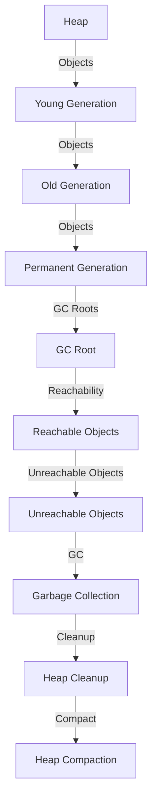

## Introduction
Garbage collection is a crucial component of the Java Virtual Machine (JVM), responsible for automatically managing memory and eliminating the need for manual memory allocation and deallocation. This process helps prevent memory leaks and ensures that the JVM remains stable and efficient. In this section, we will delve into the world of garbage collectors, focusing on the G1 and ZGC collectors, and explore their lifecycles and mechanics.

> **Note:** Garbage collection is a complex process that requires a deep understanding of the JVM's internal workings. As a Java developer, it's essential to grasp the fundamentals of garbage collection to write efficient and scalable code.

Garbage collectors play a vital role in modern Java development, as they enable developers to focus on writing application logic without worrying about memory management. With the ever-increasing demand for high-performance and low-latency applications, understanding garbage collectors has become a critical skill for Java developers.

## Core Concepts
To comprehend garbage collectors, we need to familiarize ourselves with the following key concepts:

* **Heap**: The heap is the memory area where objects are stored. It's divided into generations: young, old, and permanent.
* **Generational Collection**: The JVM divides the heap into generations based on object lifetimes. The young generation is collected more frequently than the old generation.
* **GC Roots**: GC roots are objects that are directly accessible from the application's roots, such as global variables, stack variables, and CPU registers.
* **Reachability**: An object is considered reachable if it's accessible from a GC root, either directly or indirectly.

> **Tip:** Understanding the heap structure and generational collection is crucial for optimizing garbage collection performance.

## How It Works Internally
The G1 and ZGC garbage collectors operate on the following principles:

1. **Mark Phase**: The collector identifies all reachable objects by traversing the object graph from the GC roots.
2. **Pre-Cleaning Phase**: The collector performs a pre-cleaning phase to reduce the amount of work required during the marking phase.
3. **Concurrent Marking Phase**: The collector concurrently marks reachable objects while the application is running.
4. **Remark Phase**: The collector re-marks any objects that were missed during the concurrent marking phase.
5. **Cleanup Phase**: The collector cleans up any unreachable objects and compacts the heap.

The G1 collector uses a **region-based** approach, dividing the heap into fixed-size regions. The ZGC collector, on the other hand, uses a **color-based** approach, coloring objects based on their reachability.

> **Warning:** Incorrectly configuring garbage collection parameters can lead to performance issues and even crashes.

## Code Examples
Here are three complete and runnable examples demonstrating the basics of garbage collection:

### Example 1: Basic Garbage Collection
```java
public class GarbageCollectionExample {
    public static void main(String[] args) {
        // Create a large array to fill the heap
        byte[] bytes = new byte[1024 * 1024 * 100];
        // Null out the reference to make it eligible for GC
        bytes = null;
        // Request the JVM to perform garbage collection
        System.gc();
    }
}
```

### Example 2: G1 Garbage Collection
```java
public class G1GarbageCollectionExample {
    public static void main(String[] args) {
        // Enable G1 garbage collection
        System.setProperty("java.vm.info", "G1");
        // Create a large array to fill the heap
        byte[] bytes = new byte[1024 * 1024 * 100];
        // Null out the reference to make it eligible for GC
        bytes = null;
        // Request the JVM to perform garbage collection
        System.gc();
    }
}
```

### Example 3: ZGC Garbage Collection
```java
public class ZGCGarbageCollectionExample {
    public static void main(String[] args) {
        // Enable ZGC garbage collection
        System.setProperty("java.vm.info", "ZGC");
        // Create a large array to fill the heap
        byte[] bytes = new byte[1024 * 1024 * 100];
        // Null out the reference to make it eligible for GC
        bytes = null;
        // Request the JVM to perform garbage collection
        System.gc();
    }
}
```

> **Interview:** Can you explain the differences between the G1 and ZGC garbage collectors?

## Visual Diagram

The diagram illustrates the basic flow of garbage collection, from object creation to heap cleanup and compaction.

## Comparison
| Garbage Collector | Time Complexity | Space Complexity | Pros | Cons | Best For |
| --- | --- | --- | --- | --- | --- |
| G1 | O(n) | O(n) | Low pause times, high throughput | Complex configuration, high overhead | Large-scale applications |
| ZGC | O(n) | O(n) | Low pause times, low overhead | Limited scalability, experimental | Real-time systems, low-latency applications |
| CMS | O(n) | O(n) | Low pause times, high throughput | High overhead, complex configuration | Large-scale applications |
| Parallel GC | O(n) | O(n) | High throughput, low overhead | High pause times, not suitable for real-time systems | Batch processing, non-interactive applications |

> **Tip:** Choose the right garbage collector based on your application's specific requirements and constraints.

## Real-world Use Cases
Here are three real-world examples of garbage collection in production:

1. **Netflix**: Netflix uses the G1 garbage collector to achieve low pause times and high throughput in their large-scale applications.
2. **Amazon**: Amazon uses a combination of garbage collectors, including the G1 and CMS collectors, to optimize performance and reduce latency in their cloud-based services.
3. **Google**: Google uses a custom garbage collector, designed to work with their specific workload and requirements, to achieve low pause times and high throughput in their search engine and other applications.

## Common Pitfalls
Here are four common pitfalls to watch out for when working with garbage collection:

1. **Incorrect Configuration**: Incorrectly configuring garbage collection parameters can lead to performance issues and even crashes.
2. **Insufficient Heap Size**: Insufficient heap size can cause frequent garbage collection, leading to performance issues and increased latency.
3. **Object Retention**: Retaining objects longer than necessary can cause memory leaks and performance issues.
4. **GC Overhead**: High GC overhead can cause performance issues and increased latency.

> **Warning:** Be cautious when working with garbage collection, as incorrect configuration or insufficient heap size can have severe consequences.

## Interview Tips
Here are three common interview questions related to garbage collection, along with sample answers:

1. **What is the difference between the G1 and ZGC garbage collectors?**
	* Weak answer: "G1 is a generational collector, while ZGC is a concurrent collector."
	* Strong answer: "G1 is a region-based collector that uses a generational approach, while ZGC is a color-based collector that uses a concurrent approach. G1 is suitable for large-scale applications, while ZGC is suitable for real-time systems and low-latency applications."
2. **How does garbage collection work in Java?**
	* Weak answer: "Garbage collection is a process that frees up memory by removing unused objects."
	* Strong answer: "Garbage collection is a process that identifies reachable objects by traversing the object graph from the GC roots. The collector then marks reachable objects and re-marks any objects that were missed during the concurrent marking phase. Finally, the collector cleans up any unreachable objects and compacts the heap."
3. **What are some common pitfalls to watch out for when working with garbage collection?**
	* Weak answer: "Incorrect configuration and insufficient heap size."
	* Strong answer: "Incorrect configuration, insufficient heap size, object retention, and high GC overhead. It's essential to monitor garbage collection performance and adjust configuration parameters accordingly to avoid these pitfalls."

> **Interview:** Can you explain the concept of reachability in garbage collection?

## Key Takeaways
Here are ten key takeaways to remember:

* **Garbage collection is a complex process** that requires a deep understanding of the JVM's internal workings.
* **G1 and ZGC are two popular garbage collectors** that offer low pause times and high throughput.
* **Region-based and color-based approaches** are used by the G1 and ZGC collectors, respectively.
* **Reachability is a critical concept** in garbage collection, as it determines which objects are eligible for collection.
* **GC roots are objects that are directly accessible** from the application's roots.
* **Generational collection is a technique** used to divide the heap into generations based on object lifetimes.
* **Garbage collection performance** can be optimized by adjusting configuration parameters and monitoring performance metrics.
* **Incorrect configuration and insufficient heap size** can lead to performance issues and even crashes.
* **Object retention and high GC overhead** can cause memory leaks and performance issues.
* **Monitoring garbage collection performance** is essential to ensure optimal performance and avoid pitfalls.