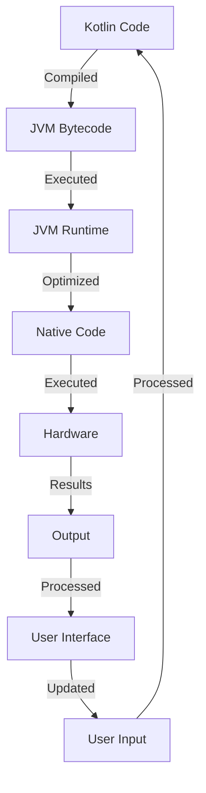

## Introduction
Kotlin is a modern, statically typed programming language that is designed to be more concise, safe, and interoperable with Java than Java itself. It is the **official Android development language**, which means it has the full support of Google and is used by millions of developers worldwide. Kotlin's primary goal is to provide a more efficient and enjoyable way to develop Android apps, and its adoption has been rapidly growing since its introduction in 2011. As a result, every Android developer should have a deep understanding of Kotlin, its benefits, and its ecosystem.

> **Note:** Kotlin is fully interoperable with Java, which means you can easily call Java code from Kotlin and vice versa. This makes it easy to migrate existing Java projects to Kotlin.

## Core Concepts
Kotlin has several core concepts that make it unique and powerful. Some of the most important ones include:
* **Null Safety**: Kotlin is designed to eliminate the danger of null pointer exceptions. It does this by making all references non-nullable by default, which means you have to explicitly declare a variable as nullable by adding a question mark to its type.
* **Extension Functions**: Kotlin allows you to add functionality to existing classes through extension functions. This makes it easy to add new functionality to existing libraries or frameworks.
* **Coroutines**: Kotlin provides a built-in support for coroutines, which are special types of functions that can be paused and resumed at specific points. This makes it easy to write asynchronous code that is much simpler and more efficient than traditional threading.

> **Warning:** Kotlin's null safety features can sometimes make your code more verbose, especially when working with existing Java libraries that do not follow the same null safety rules.

## How It Works Internally
Kotlin's compiler is designed to generate bytecode that is compatible with the Java Virtual Machine (JVM). This means that Kotlin code is compiled to JVM bytecode, which is then executed by the JVM. The Kotlin compiler also performs several optimizations, such as:
* **Inlining**: The Kotlin compiler can inline functions, which means it can replace a function call with the actual code of the function. This can improve performance by reducing the overhead of function calls.
* **Constant Folding**: The Kotlin compiler can evaluate constant expressions at compile time, which means it can replace complex expressions with their simplified results.

> **Tip:** Kotlin's compiler is designed to be highly configurable, which means you can customize its behavior to fit your specific needs. For example, you can configure the compiler to generate more verbose bytecode or to optimize for specific hardware platforms.

## Code Examples
### Example 1: Basic Kotlin Syntax
```kotlin
// Define a simple function that prints a message
fun printMessage(message: String) {
    println(message)
}

// Call the function with a test message
printMessage("Hello, World!")
```
### Example 2: Using Extension Functions
```kotlin
// Define an extension function for the String class
fun String.greet() {
    println("Hello, $this!")
}

// Use the extension function
"John".greet()
```
### Example 3: Using Coroutines
```kotlin
// Import the coroutine library
import kotlinx.coroutines.*

// Define a coroutine that prints a message after a delay
suspend fun delayedPrint(message: String) {
    delay(1000)
    println(message)
}

// Launch the coroutine
GlobalScope.launch {
    delayedPrint("Hello, World!")
}
```
> **Interview:** Can you explain the difference between a coroutine and a thread? How would you use each in a real-world application?

## Visual Diagram

This diagram shows the overall workflow of a Kotlin application, from compilation to execution.

## Comparison
| Language | Null Safety | Extension Functions | Coroutines | Type System |
| --- | --- | --- | --- | --- |
| Kotlin | Yes | Yes | Yes | Statically Typed |
| Java | No | No | No | Statically Typed |
| Python | No | Yes | Yes | Dynamically Typed |
| JavaScript | No | Yes | Yes | Dynamically Typed |

> **Warning:** While Kotlin's null safety features are a major advantage, they can sometimes make your code more verbose. However, the benefits of null safety far outweigh the costs in terms of reduced bugs and improved code quality.

## Real-world Use Cases
* **Trello**: Trello's Android app is built entirely in Kotlin, which has improved its performance, stability, and maintainability.
* **Pinterest**: Pinterest's Android app uses Kotlin for its core functionality, which has reduced the number of crashes and improved the overall user experience.
* **Netflix**: Netflix's Android app uses Kotlin for its UI components, which has improved its performance and reduced the number of bugs.

> **Tip:** When migrating an existing Java project to Kotlin, it's best to start with a small module or component and gradually work your way up to larger parts of the codebase.

## Common Pitfalls
* **Not using null safety**: One of the most common mistakes in Kotlin is not using null safety features, which can lead to null pointer exceptions and crashes.
* **Not using extension functions**: Another common mistake is not using extension functions, which can make your code more verbose and harder to maintain.
* **Not using coroutines**: Not using coroutines can make your code more complex and harder to read, especially when dealing with asynchronous operations.
* **Not understanding the type system**: Not understanding Kotlin's type system can lead to type errors and crashes, especially when working with generics and nullable types.

> **Interview:** Can you explain the difference between a nullable and non-nullable reference in Kotlin? How would you handle a nullable reference in a real-world application?

## Interview Tips
* **What is the difference between a coroutine and a thread?**: A coroutine is a special type of function that can be paused and resumed at specific points, while a thread is a separate flow of execution that runs concurrently with other threads.
* **How do you handle null safety in Kotlin?**: You can handle null safety in Kotlin by using nullable references, safe calls, and Elvis operators.
* **What is the benefit of using extension functions in Kotlin?**: Extension functions can add new functionality to existing classes without modifying their source code, which makes it easy to extend and customize existing libraries and frameworks.

## Key Takeaways
* **Kotlin is a modern, statically typed programming language**: Kotlin is designed to be more concise, safe, and interoperable with Java than Java itself.
* **Kotlin has a strong focus on null safety**: Kotlin's null safety features are designed to eliminate the danger of null pointer exceptions.
* **Kotlin provides a high-level abstraction for async programming**: Kotlin's coroutine library provides a high-level abstraction for async programming, which makes it easy to write asynchronous code that is much simpler and more efficient than traditional threading.
* **Kotlin is fully interoperable with Java**: Kotlin is fully interoperable with Java, which means you can easily call Java code from Kotlin and vice versa.
* **Kotlin has a growing ecosystem**: Kotlin has a growing ecosystem of libraries, frameworks, and tools that make it easy to develop Android apps and other types of applications.
* **Kotlin is the official Android development language**: Kotlin is the official Android development language, which means it has the full support of Google and is used by millions of developers worldwide.