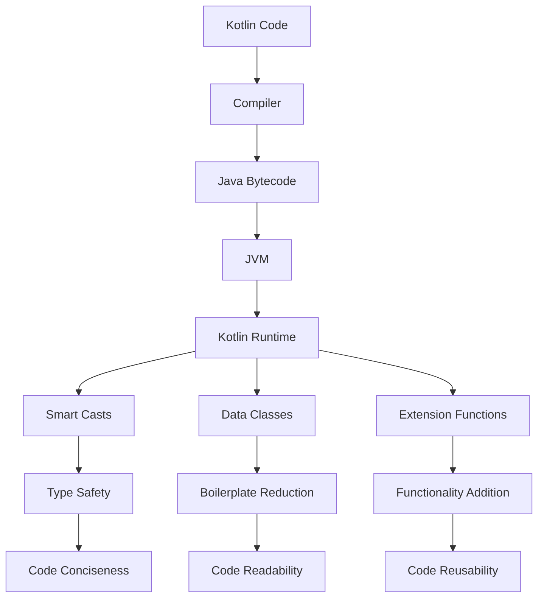

## Introduction
Kotlin is a modern, statically typed programming language that runs on the Java Virtual Machine (JVM). It is designed to be more concise, safe, and interoperable with Java than Java itself. Kotlin's benefits include **smart casts**, **data classes**, and **extension functions**, which make it an attractive choice for Android app development, backend development, and other areas where Java is commonly used. In this overview, we will explore these benefits in depth, including their internal workings, code examples, and real-world use cases.

> **Note:** Kotlin's interoperability with Java means that you can easily call Java code from Kotlin and vice versa, making it a great choice for projects that already use Java.

## Core Concepts
Let's start with the core concepts that make Kotlin so powerful:

* **Smart casts**: In Kotlin, you don't need to explicitly cast a variable to a specific type if the compiler can infer it. This makes your code more concise and easier to read.
* **Data classes**: Data classes are a special type of class in Kotlin that can automatically generate boilerplate code such as `toString()`, `equals()`, and `hashCode()` methods. This saves you time and reduces the amount of code you need to write.
* **Extension functions**: Extension functions allow you to add functionality to existing classes without modifying their source code. This is useful for adding utility functions to classes that you don't own or can't modify.

> **Tip:** Use data classes to simplify your code and reduce boilerplate. For example, instead of writing a `Person` class with `name` and `age` properties and implementing `toString()`, `equals()`, and `hashCode()` methods, you can simply define a `data class Person(val name: String, val age: Int)`.

## How It Works Internally
Let's take a look at how these concepts work internally:

* **Smart casts**: When the compiler encounters a smart cast, it checks the type of the variable at compile-time. If the type is known, it generates a cast instruction at runtime. This means that smart casts are essentially free at runtime, as they are optimized away by the compiler.
* **Data classes**: When you define a data class, the compiler generates the boilerplate code for you. This includes `toString()`, `equals()`, and `hashCode()` methods, as well as a `copy()` function that allows you to create a copy of the object.
* **Extension functions**: Extension functions are essentially static functions that are called on an instance of a class. The compiler generates a static function call at compile-time, so there is no runtime overhead.

> **Warning:** Be careful when using extension functions, as they can make your code harder to read and understand if overused.

## Code Examples
Here are three complete, runnable code examples that demonstrate the benefits of Kotlin:

### Example 1: Smart Casts
```kotlin
fun main() {
    val obj: Any = "Hello, World!"
    if (obj is String) {
        // Smart cast to String
        println(obj.toUpperCase())
    }
}
```
This code demonstrates how smart casts can simplify your code and make it more concise.

### Example 2: Data Classes
```kotlin
data class Person(val name: String, val age: Int)

fun main() {
    val person = Person("John Doe", 30)
    println(person.toString()) // Output: Person(name=John Doe, age=30)
    val copy = person.copy(age = 31)
    println(copy.toString()) // Output: Person(name=John Doe, age=31)
}
```
This code demonstrates how data classes can simplify your code and reduce boilerplate.

### Example 3: Extension Functions
```kotlin
fun String.greet() {
    println("Hello, $this!")
}

fun main() {
    "John".greet() // Output: Hello, John!
}
```
This code demonstrates how extension functions can add functionality to existing classes without modifying their source code.

## Visual Diagram

This diagram illustrates the internal workings of Kotlin, from the compiler to the runtime, and how the benefits of smart casts, data classes, and extension functions are achieved.

> **Note:** The Kotlin compiler generates Java bytecode that is executed by the JVM. This means that Kotlin code can be used anywhere Java code can be used.

## Comparison
Here is a comparison of Kotlin with other programming languages:

| Language | Type Safety | Boilerplate Reduction | Functionality Addition |
| --- | --- | --- | --- |
| Kotlin | Yes | High | High |
| Java | Yes | Low | Low |
| Python | No | Medium | High |
| JavaScript | No | Medium | High |
| Scala | Yes | Medium | High |

## Real-world Use Cases
Here are three real-world use cases of Kotlin:

* **Android App Development**: Kotlin is the official language for Android app development, and is used by many companies, including Google, Facebook, and Uber.
* **Backend Development**: Kotlin is used by companies such as JetBrains, Expedia, and Pinterest for backend development, due to its conciseness, type safety, and interoperability with Java.
* **Desktop Applications**: Kotlin is used by companies such as JetBrains and Oracle for desktop application development, due to its ease of use, conciseness, and performance.

> **Tip:** Use Kotlin for Android app development, as it is the official language and has many benefits, including conciseness, type safety, and interoperability with Java.

## Common Pitfalls
Here are four common pitfalls to watch out for when using Kotlin:

* **Overusing Extension Functions**: Extension functions can make your code harder to read and understand if overused. Use them sparingly and only when necessary.
* **Not Using Data Classes**: Data classes can simplify your code and reduce boilerplate. Use them whenever possible.
* **Not Using Smart Casts**: Smart casts can simplify your code and make it more concise. Use them whenever possible.
* **Not Understanding Type Safety**: Kotlin's type safety can help prevent errors at runtime. Understand how type safety works and use it to your advantage.

> **Warning:** Be careful when using Kotlin's nullable types, as they can lead to null pointer exceptions if not used correctly.

## Interview Tips
Here are three common interview questions and tips for answering them:

* **What is the difference between Kotlin and Java?**: Answer: Kotlin is a modern, statically typed programming language that runs on the JVM, while Java is an older, statically typed programming language that also runs on the JVM. Kotlin has many benefits, including conciseness, type safety, and interoperability with Java.
* **How do you use smart casts in Kotlin?**: Answer: Smart casts are used to cast a variable to a specific type if the compiler can infer it. This makes your code more concise and easier to read.
* **What are data classes and how do you use them?**: Answer: Data classes are a special type of class in Kotlin that can automatically generate boilerplate code such as `toString()`, `equals()`, and `hashCode()` methods. Use them to simplify your code and reduce boilerplate.

> **Interview:** Be prepared to answer questions about Kotlin's benefits, including smart casts, data classes, and extension functions. Show a deep understanding of the language and its features.

## Key Takeaways
Here are ten key takeaways to remember:

* **Kotlin is a modern, statically typed programming language**: Kotlin is designed to be more concise, safe, and interoperable with Java than Java itself.
* **Smart casts simplify your code**: Smart casts can infer the type of a variable and make your code more concise.
* **Data classes reduce boilerplate**: Data classes can automatically generate boilerplate code such as `toString()`, `equals()`, and `hashCode()` methods.
* **Extension functions add functionality**: Extension functions can add functionality to existing classes without modifying their source code.
* **Kotlin is interoperable with Java**: Kotlin code can be used anywhere Java code can be used.
* **Kotlin has type safety**: Kotlin's type safety can help prevent errors at runtime.
* **Kotlin is concise**: Kotlin's syntax is designed to be concise and easy to read.
* **Kotlin has a growing community**: Kotlin's community is growing rapidly, with many companies and developers using the language.
* **Kotlin is the official language for Android app development**: Kotlin is the official language for Android app development, and is used by many companies, including Google, Facebook, and Uber.
* **Kotlin is used for backend development**: Kotlin is used by companies such as JetBrains, Expedia, and Pinterest for backend development, due to its conciseness, type safety, and interoperability with Java.