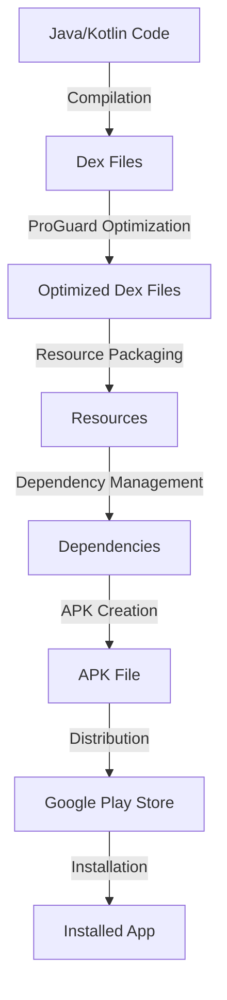

## Introduction
The **Larger Binary Size** issue on Android refers to the problem of increasing the size of an Android app's APK (Android Package File) due to various factors such as unnecessary code, resources, and dependencies. This issue matters because a larger APK size can lead to slower download times, increased storage usage, and a poor user experience. In real-world scenarios, companies like **Google**, **Facebook**, and **Instagram** have to deal with this issue to ensure their apps are lightweight and efficient. Every engineer should know how to optimize their app's binary size to improve performance and user satisfaction.

## Core Concepts
**Binary size** refers to the total size of an app's APK file, which includes the compiled code, resources, and dependencies. **Code optimization** is the process of reducing the size of the compiled code while maintaining its functionality. **Resource optimization** involves reducing the size of resources such as images, videos, and audio files. **Dependency management** is the process of managing the dependencies required by an app to ensure they are necessary and optimized. Key terminology includes **ProGuard**, **Dex**, and **Android App Bundle**.

## How It Works Internally
When an Android app is built, the compiler converts the Java or Kotlin code into **Dex** (Dalvik Executable) files, which are then packaged into an APK file. The APK file contains the Dex files, resources, and dependencies required by the app. The **ProGuard** tool is used to optimize the Dex files by removing unnecessary code and renaming classes, methods, and fields. The **Android App Bundle** is a new packaging format that allows for more efficient distribution of apps by separating the code and resources into separate files.

Here's a step-by-step breakdown of how the binary size is affected:
1. **Code compilation**: The Java or Kotlin code is compiled into Dex files.
2. **ProGuard optimization**: The Dex files are optimized using ProGuard to remove unnecessary code.
3. **Resource packaging**: The resources are packaged into the APK file.
4. **Dependency management**: The dependencies are packaged into the APK file.
5. **APK creation**: The Dex files, resources, and dependencies are packaged into an APK file.

> **Note:** The binary size of an app can be affected by various factors, including the size of the Dex files, resources, and dependencies.

## Code Examples
### Example 1: Basic ProGuard Configuration
```java
// proguard-rules.pro
-keep public class * extends android.app.Activity
-keep public class * extends android.app.Service
-keep public class * extends android.content.BroadcastReceiver
```
This example shows a basic ProGuard configuration that keeps the Activity, Service, and BroadcastReceiver classes.

### Example 2: Optimizing Resources
```kotlin
// res/values/dimens.xml
<dimen name="text_size">16sp</dimen>
```
```kotlin
// res/layout/activity_main.xml
<TextView
    android:layout_width="wrap_content"
    android:layout_height="wrap_content"
    android:textSize="@dimen/text_size" />
```
This example shows how to optimize resources by using a dimen resource for text size.

### Example 3: Dependency Management
```groovy
// build.gradle
dependencies {
    implementation 'com.android.support:appcompat-v7:28.0.0'
    implementation 'com.android.support:design:28.0.0'
}
```
This example shows how to manage dependencies by using the `implementation` keyword to specify the dependencies required by the app.

## Visual Diagram

This diagram shows the process of building an Android app, from compilation to distribution.

> **Tip:** Use the `--debug` flag when building the app to see the detailed build process.

## Comparison
| Approach | Time Complexity | Space Complexity | Pros | Cons | Best For |
| --- | --- | --- | --- | --- | --- |
| ProGuard | O(n) | O(n) | Reduces binary size, improves performance | Can be complex to configure | Large apps with many dependencies |
| Resource Optimization | O(1) | O(1) | Reduces resource size, improves performance | Can be time-consuming | Apps with many resources |
| Dependency Management | O(n) | O(n) | Reduces dependency size, improves performance | Can be complex to manage | Large apps with many dependencies |
| Android App Bundle | O(1) | O(1) | Improves distribution efficiency, reduces binary size | Requires Android 5.0 or later | Apps with many variants |

## Real-world Use Cases
* **Google**: Google uses ProGuard to optimize the binary size of its apps, such as Google Maps and Google Play Store.
* **Facebook**: Facebook uses resource optimization to reduce the size of its resources, such as images and videos.
* **Instagram**: Instagram uses dependency management to reduce the size of its dependencies, such as the Android Support Library.

> **Warning:** Not optimizing the binary size of an app can lead to slower download times and increased storage usage.

## Common Pitfalls
* **Not using ProGuard**: Failing to use ProGuard can result in a larger binary size and reduced performance.
* **Not optimizing resources**: Failing to optimize resources can result in a larger binary size and reduced performance.
* **Not managing dependencies**: Failing to manage dependencies can result in a larger binary size and reduced performance.
* **Not using the Android App Bundle**: Failing to use the Android App Bundle can result in a larger binary size and reduced distribution efficiency.

```java
// Wrong way: Not using ProGuard
// proguard-rules.pro
-keep public class * extends android.app.Activity
```
```java
// Right way: Using ProGuard
// proguard-rules.pro
-keep public class * extends android.app.Activity
-keep public class * extends android.app.Service
-keep public class * extends android.content.BroadcastReceiver
```
> **Interview:** What is the purpose of ProGuard in Android app development? Answer: ProGuard is used to optimize the binary size of an Android app by removing unnecessary code and renaming classes, methods, and fields.

## Interview Tips
* What is the purpose of ProGuard in Android app development? Answer: ProGuard is used to optimize the binary size of an Android app by removing unnecessary code and renaming classes, methods, and fields.
* How do you optimize resources in an Android app? Answer: Resources can be optimized by using a dimen resource for text size, reducing the size of images and videos, and using a consistent naming convention.
* What is the purpose of dependency management in Android app development? Answer: Dependency management is used to reduce the size of dependencies required by an app, improve performance, and ensure that the dependencies are necessary and optimized.

## Key Takeaways
* ProGuard is used to optimize the binary size of an Android app by removing unnecessary code and renaming classes, methods, and fields.
* Resource optimization involves reducing the size of resources, such as images and videos, and using a consistent naming convention.
* Dependency management involves reducing the size of dependencies required by an app, improving performance, and ensuring that the dependencies are necessary and optimized.
* The Android App Bundle is a new packaging format that allows for more efficient distribution of apps by separating the code and resources into separate files.
* Optimizing the binary size of an app can improve performance, reduce download times, and increase user satisfaction.
* Not optimizing the binary size of an app can lead to slower download times and increased storage usage.
* ProGuard, resource optimization, and dependency management are essential tools for optimizing the binary size of an Android app.
* The Android App Bundle is a recommended packaging format for Android apps.
* Optimizing the binary size of an app requires a combination of ProGuard, resource optimization, and dependency management.