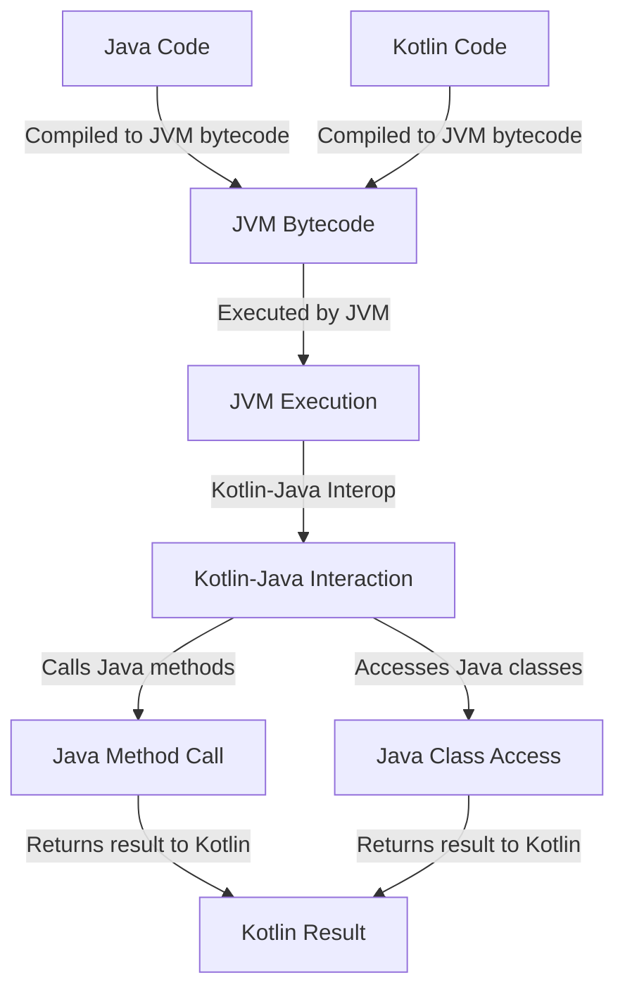

## Introduction
Kotlin, as a modern programming language, provides seamless interoperability with Java. This allows Kotlin developers to leverage the vast ecosystem of Java libraries and frameworks. However, like any complex system, Kotlin-Java interop comes with its own set of edge cases and drawbacks. Understanding these edge cases is crucial for developers to write efficient, robust, and maintainable code. In this article, we will delve into the world of Kotlin-Java interop, exploring its core concepts, internal mechanics, and real-world implications.

## Core Concepts
At its core, Kotlin-Java interop is based on the **Java Virtual Machine (JVM)**. The JVM is the runtime environment for both Java and Kotlin, allowing them to coexist and interact seamlessly. To facilitate this interop, the **Kotlin compiler** generates bytecode that is compatible with the JVM. This bytecode can then be executed alongside Java bytecode, enabling Kotlin and Java code to interact with each other.

The key terminology in this context includes:
- **Java Interop**: The ability of Kotlin code to call Java methods and access Java classes.
- **Kotlin-Java Mapping**: The process of converting Kotlin types and constructs to their Java equivalents.
- **Null Safety**: Kotlin's mechanism for handling null values, which differs from Java's approach.

## How It Works Internally
When the Kotlin compiler generates bytecode, it follows a specific set of rules to ensure compatibility with the JVM. Here's a step-by-step breakdown of the process:
1. **Compilation**: The Kotlin compiler compiles Kotlin source code into an intermediate representation.
2. **Type Mapping**: The compiler maps Kotlin types to their Java equivalents.
3. **Bytecode Generation**: The compiler generates JVM-compatible bytecode from the intermediate representation.
4. **Execution**: The JVM executes the generated bytecode, allowing Kotlin and Java code to interact.

> **Tip:** Understanding the internal mechanics of Kotlin-Java interop can help developers optimize their code and avoid common pitfalls.

## Code Examples
### Example 1: Basic Java Interop
```kotlin
// Import a Java class
import java.util.ArrayList

// Create a Java object and call its methods
fun main() {
    val list = ArrayList<String>()
    list.add("Hello")
    list.add("World")
    println(list) // [Hello, World]
}
```

### Example 2: Kotlin Class in Java
```java
// Import a Kotlin class in Java
import com.example.MyKotlinClass;

public class MyJavaClass {
    public static void main(String[] args) {
        MyKotlinClass myKotlinClass = new MyKotlinClass();
        myKotlinClass.myKotlinMethod(); // Calls the Kotlin method
    }
}
```

### Example 3: Null Safety Interop
```kotlin
// Define a Kotlin function that takes a nullable parameter
fun myKotlinFunction(param: String?) {
    // Check for null and handle accordingly
    if (param != null) {
        println(param)
    } else {
        println("Parameter is null")
    }
}

// Call the Kotlin function from Java with a null parameter
fun main() {
    myKotlinFunction(null) // Prints: Parameter is null
}
```

> **Warning:** When calling Kotlin functions from Java, be aware of Kotlin's null safety features to avoid `NullPointerExceptions`.

## Visual Diagram

This diagram illustrates the process of Kotlin-Java interop, from compilation to execution and interaction between the two languages.

## Comparison
| Approach | Time Complexity | Space Complexity | Pros | Cons | Best For |
|----------|----------------|-----------------|------|------|----------|
| Java Interop | O(1) | O(1) | Seamless integration with Java ecosystem | Potential for null safety issues | Large-scale enterprise applications |
| Kotlin-Java Mapping | O(n) | O(n) | Allows for type-safe interaction between languages | Can be complex to implement | High-performance applications |
| Null Safety Interop | O(1) | O(1) | Ensures null safety when interacting with Java code | Requires additional boilerplate code | Mission-critical applications |
| Manual Type Conversion | O(n) | O(n) | Provides fine-grained control over type conversion | Error-prone and tedious to implement | Legacy system integration |

## Real-world Use Cases
1. **Android App Development**: Many Android apps use Kotlin as the primary language, while still interacting with Java libraries and frameworks.
2. **Enterprise Software**: Large-scale enterprise applications often leverage Kotlin's interoperability with Java to integrate with existing systems and frameworks.
3. **Data Science**: Kotlin's concise syntax and Java interop make it an attractive choice for data scientists working with Java-based data processing frameworks.

> **Interview:** When asked about Kotlin-Java interop, be prepared to discuss the benefits and drawbacks of each approach, as well as provide examples of real-world use cases.

## Common Pitfalls
1. **Null Safety Issues**: Failing to account for null safety when interacting with Java code can lead to `NullPointerExceptions`.
2. **Type Mapping Errors**: Incorrectly mapping Kotlin types to Java types can result in runtime errors or unexpected behavior.
3. **Performance Overhead**: Excessive use of Kotlin-Java interop can introduce performance overhead due to the additional type mapping and conversion required.
4. **Complexity**: Overly complex Kotlin-Java interop can lead to maintainability issues and make it difficult to debug errors.

> **Tip:** To avoid common pitfalls, ensure you understand the internal mechanics of Kotlin-Java interop and follow best practices for null safety and type mapping.

## Interview Tips
1. **What is Kotlin-Java interop, and how does it work?**: Be prepared to explain the internal mechanics of Kotlin-Java interop, including type mapping and bytecode generation.
2. **How do you handle null safety when interacting with Java code?**: Discuss the importance of null safety and provide examples of how to handle null values when interacting with Java code.
3. **What are the benefits and drawbacks of using Kotlin-Java interop?**: Be prepared to discuss the trade-offs between using Kotlin-Java interop, including performance overhead and maintainability concerns.

## Key Takeaways
* Kotlin-Java interop is based on the JVM and allows for seamless interaction between Kotlin and Java code.
* Understanding the internal mechanics of Kotlin-Java interop is crucial for writing efficient and maintainable code.
* Null safety is a critical concern when interacting with Java code, and developers should take steps to ensure null safety.
* Kotlin-Java interop can introduce performance overhead due to type mapping and conversion.
* Best practices for Kotlin-Java interop include using type-safe interaction, handling null safety, and avoiding excessive complexity.
* Real-world use cases for Kotlin-Java interop include Android app development, enterprise software, and data science.
* Common pitfalls to avoid include null safety issues, type mapping errors, performance overhead, and complexity.
* When discussing Kotlin-Java interop in an interview, be prepared to explain the internal mechanics, benefits, and drawbacks, as well as provide examples of real-world use cases.