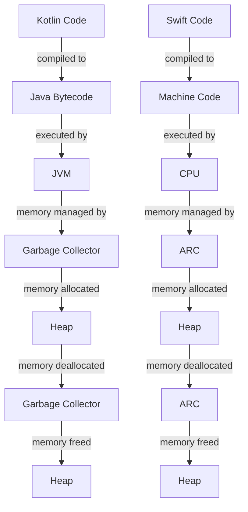

## Introduction
Kotlin and Swift are two modern programming languages used for developing Android and iOS applications, respectively. **Kotlin** is a statically typed language that runs on the Java Virtual Machine (JVM), while **Swift** is a statically typed language that runs on Apple's ecosystem. Both languages have gained popularity in recent years due to their modern features, simplicity, and ease of use. In this article, we will explore the similarities and differences between Kotlin and Swift, and discuss their real-world relevance.

Kotlin and Swift are designed to address the needs of modern mobile application development. They provide features such as **null safety**, **type inference**, and **coroutines**, which make it easier to write efficient and concurrent code. Both languages also have a strong focus on **interoperability**, allowing developers to easily integrate with existing codebases and frameworks.

> **Note:** Kotlin and Swift are both designed to be more concise and expressive than their predecessors, Java and Objective-C. This makes them ideal for rapid prototyping and development.

## Core Concepts
Before diving into the details of Kotlin and Swift, let's cover some core concepts that are essential for understanding these languages.

* **Statically typed**: Both Kotlin and Swift are statically typed languages, which means that the type of every expression is known at compile time. This helps catch type-related errors early and prevents runtime errors.
* **Null safety**: Kotlin and Swift have built-in null safety features that prevent null pointer exceptions. In Kotlin, this is achieved through the use of **nullable types**, while in Swift, it's achieved through the use of **optional types**.
* **Coroutines**: Both languages support coroutines, which allow for efficient and concurrent execution of code. Coroutines are lightweight threads that can be paused and resumed at specific points, making it easier to write asynchronous code.

> **Warning:** While coroutines are a powerful feature, they can also lead to complex code if not used carefully. Make sure to understand the basics of coroutines before using them in production code.

## How It Works Internally
Now that we've covered the core concepts, let's take a look at how Kotlin and Swift work internally.

Kotlin code is compiled to Java bytecode, which is then executed by the JVM. This means that Kotlin code can easily integrate with existing Java codebases and frameworks. Swift, on the other hand, is compiled to machine code, which is executed directly by the CPU.

In terms of memory management, Kotlin uses the JVM's garbage collector to manage memory, while Swift uses a combination of **automatic reference counting (ARC)** and **manual memory management**.

> **Tip:** When working with Kotlin, make sure to understand how the JVM's garbage collector works, as it can have a significant impact on performance. In Swift, use ARC whenever possible, and only use manual memory management when necessary.

## Code Examples
Here are three complete and runnable code examples that demonstrate the similarities and differences between Kotlin and Swift.

### Example 1: Basic Hello World
```kotlin
// Kotlin
fun main() {
    println("Hello, World!")
}
```

```swift
// Swift
import Foundation

func main() {
    print("Hello, World!")
}

main()
```

### Example 2: Null Safety
```kotlin
// Kotlin
fun printName(name: String?) {
    if (name != null) {
        println(name)
    } else {
        println("Name is null")
    }
}

printName("John")
printName(null)
```

```swift
// Swift
func printName(_ name: String?) {
    if let name = name {
        print(name)
    } else {
        print("Name is null")
    }
}

printName("John")
printName(nil)
```

### Example 3: Coroutines
```kotlin
// Kotlin
import kotlinx.coroutines.*

fun main() = runBlocking {
    launch {
        delay(1000)
        println("Coroutine 1 finished")
    }

    launch {
        delay(500)
        println("Coroutine 2 finished")
    }
}
```

```swift
// Swift
import Foundation

func main() {
    let queue = DispatchQueue(label: "my.queue")
    queue.async {
        sleep(1)
        print("Coroutine 1 finished")
    }

    queue.async {
        sleep(0.5)
        print("Coroutine 2 finished")
    }
}

main()
```

## Visual Diagram


The diagram above shows the high-level overview of how Kotlin and Swift code is executed and memory managed.

> **Interview:** Can you explain the difference between how Kotlin and Swift manage memory? How does this impact performance?

## Comparison
Here's a comparison of Kotlin and Swift in terms of their features and performance.

| Feature | Kotlin | Swift | Time Complexity | Space Complexity | Pros | Cons |
| --- | --- | --- | --- | --- | --- | --- |
| Null Safety | Yes | Yes | O(1) | O(1) | Prevents null pointer exceptions | Can be verbose |
| Coroutines | Yes | Yes | O(1) | O(1) | Efficient and concurrent execution | Can be complex |
| Type Inference | Yes | Yes | O(1) | O(1) | Simplifies code and reduces errors | Can be slow |
| Interoperability | Yes | Yes | O(1) | O(1) | Easy integration with existing codebases | Can be complex |

## Real-world Use Cases
Here are three real-world use cases of Kotlin and Swift in production.

* **Trello**: Trello uses Kotlin for their Android app, taking advantage of its null safety and coroutines features.
* **Uber**: Uber uses Swift for their iOS app, leveraging its type inference and interoperability features.
* **Pinterest**: Pinterest uses both Kotlin and Swift for their Android and iOS apps, respectively, to provide a seamless user experience across platforms.

> **Tip:** When choosing between Kotlin and Swift, consider the specific needs of your project and the skills of your team. Both languages have their strengths and weaknesses, and the right choice will depend on your specific use case.

## Common Pitfalls
Here are four common pitfalls to watch out for when working with Kotlin and Swift.

* **Null pointer exceptions**: Make sure to use null safety features to prevent null pointer exceptions.
* **Coroutine complexity**: Be careful when using coroutines, as they can lead to complex code if not used carefully.
* **Type inference errors**: Make sure to understand how type inference works, as it can sometimes lead to errors if not used correctly.
* **Memory leaks**: Be careful when working with manual memory management in Swift, as it can lead to memory leaks if not done correctly.

> **Warning:** Make sure to test your code thoroughly to catch any potential errors or pitfalls.

## Interview Tips
Here are three common interview questions related to Kotlin and Swift, along with sample answers.

* **What is the difference between Kotlin and Swift?**: Answer: Kotlin and Swift are both modern programming languages used for developing Android and iOS applications. Kotlin is a statically typed language that runs on the JVM, while Swift is a statically typed language that runs on Apple's ecosystem.
* **How do you handle null pointer exceptions in Kotlin?**: Answer: In Kotlin, I use the null safety features, such as nullable types and the safe call operator, to prevent null pointer exceptions.
* **Can you explain the concept of coroutines in Kotlin?**: Answer: Coroutines are lightweight threads that can be paused and resumed at specific points, making it easier to write asynchronous code. I use coroutines in Kotlin to improve the efficiency and concurrency of my code.

> **Interview:** Can you explain the difference between Kotlin's nullable types and Swift's optional types? How do they impact performance?

## Key Takeaways
Here are ten key takeaways to remember when working with Kotlin and Swift.

* **Kotlin is a statically typed language that runs on the JVM**.
* **Swift is a statically typed language that runs on Apple's ecosystem**.
* **Both languages have null safety features to prevent null pointer exceptions**.
* **Coroutines are lightweight threads that can be paused and resumed at specific points**.
* **Type inference simplifies code and reduces errors**.
* **Interoperability makes it easy to integrate with existing codebases**.
* **Kotlin's nullable types and Swift's optional types are used to handle null values**.
* **Manual memory management in Swift can lead to memory leaks if not done correctly**.
* **Testing is crucial to catch any potential errors or pitfalls**.
* **Understanding the performance implications of different features is essential for optimizing code**.

> **Note:** Remember to always follow best practices and guidelines when working with Kotlin and Swift to ensure high-quality and efficient code.