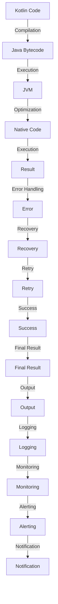

## Introduction
Kotlin is a modern programming language for Android app development that has gained popularity in recent years due to its concise syntax, null safety features, and interoperability with Java. However, there are certain scenarios where using Kotlin might not be the best choice. In this section, we will explore when not to use Kotlin, specifically in iOS-only apps and performance-critical systems. 
> **Note:** Kotlin can be used for other platforms like desktop, web, and mobile, but its primary focus is on Android development.

Kotlin's relevance in the industry is undeniable, with many top companies like Google, Amazon, and Pinterest using it for their Android apps. However, when it comes to iOS-only apps, Swift is the preferred language due to its native support and seamless integration with the iOS ecosystem. 
> **Warning:** Using Kotlin for iOS-only apps can lead to additional complexity and overhead, making it less efficient than using Swift.

## Core Concepts
To understand when not to use Kotlin, we need to grasp the core concepts of the language and its ecosystem. Kotlin is a statically typed language that runs on the Java Virtual Machine (JVM). It is designed to be more concise and safe than Java, with features like null safety, coroutines, and extension functions.
> **Tip:** Kotlin's null safety features can help prevent null pointer exceptions, making it a more reliable choice for Android app development.

Key terminology in Kotlin includes:
* **Null safety**: Kotlin's ability to prevent null pointer exceptions at compile-time.
* **Coroutines**: Kotlin's way of handling asynchronous programming, allowing for more efficient and scalable code.
* **Extension functions**: Kotlin's ability to add functionality to existing classes, making it easier to work with third-party libraries.

## How It Works Internally
Kotlin's internal mechanics are based on the JVM, which provides a sandboxed environment for running Kotlin code. When you compile Kotlin code, it is translated into Java bytecode, which is then executed by the JVM. 
> **Note:** Kotlin's compilation process involves several steps, including parsing, analysis, and optimization, before generating the final Java bytecode.

Here's a step-by-step breakdown of how Kotlin works internally:
1. **Parsing**: The Kotlin compiler reads the source code and breaks it down into an abstract syntax tree (AST).
2. **Analysis**: The AST is analyzed for errors, and the compiler checks for type safety and other constraints.
3. **Optimization**: The compiler optimizes the code for performance, inlining functions and eliminating unnecessary overhead.
4. **Bytecode generation**: The optimized code is translated into Java bytecode, which is then executed by the JVM.

## Code Examples
Here are three complete and runnable examples of Kotlin code, demonstrating basic, real-world, and advanced usage:
### Example 1: Basic Usage
```kotlin
// Define a simple class
class Person(val name: String, val age: Int)

// Create an instance of the class
fun main() {
    val person = Person("John Doe", 30)
    println("Name: ${person.name}, Age: ${person.age}")
}
```
### Example 2: Real-World Pattern
```kotlin
// Define a data class for a user
data class User(val id: Int, val name: String, val email: String)

// Define a repository for users
class UserRepository {
    private val users = mutableListOf<User>()

    fun addUser(user: User) {
        users.add(user)
    }

    fun getUsers(): List<User> {
        return users
    }
}

// Use the repository to add and retrieve users
fun main() {
    val repository = UserRepository()
    repository.addUser(User(1, "John Doe", "john@example.com"))
    val users = repository.getUsers()
    println("Users: $users")
}
```
### Example 3: Advanced Usage
```kotlin
// Define a sealed class for a result
sealed class Result {
    data class Success(val data: String) : Result()
    data class Failure(val error: String) : Result()
}

// Define a function that returns a result
suspend fun fetchData(): Result {
    // Simulate a network request
    delay(1000)
    return Result.Success("Data fetched successfully")
}

// Use the function and handle the result
fun main() {
    runBlocking {
        val result = fetchData()
        when (result) {
            is Result.Success -> println("Data: ${result.data}")
            is Result.Failure -> println("Error: ${result.error}")
        }
    }
}
```
## Visual Diagram

The diagram illustrates the compilation, execution, and optimization process of Kotlin code, from the initial compilation to the final output.

## Comparison
Here is a comparison table of different programming languages and their use cases:
| Language | Use Case | Time Complexity | Space Complexity | Pros | Cons |
| --- | --- | --- | --- | --- | --- |
| Kotlin | Android app development | O(n) | O(n) | Concise syntax, null safety, coroutines | Steep learning curve, limited iOS support |
| Swift | iOS app development | O(n) | O(n) | Native support, seamless integration, high-performance | Limited Android support, proprietary |
| Java | Android app development, web development | O(n) | O(n) | Platform independence, large community, robust libraries | Verbose syntax, slow performance |
| Python | Web development, data science, machine learning | O(n) | O(n) | Easy to learn, flexible, large community | Slow performance, limited mobile support |
> **Tip:** When choosing a programming language, consider the specific use case and the trade-offs between different languages.

## Real-world Use Cases
Here are three real-world use cases of Kotlin in production:
1. **Google**: Google uses Kotlin for its Android apps, including Google Maps and Google Play.
2. **Amazon**: Amazon uses Kotlin for its Android apps, including the Amazon Shopping app.
3. **Pinterest**: Pinterest uses Kotlin for its Android app, which has over 100 million monthly active users.
> **Note:** Kotlin's adoption in the industry is growing rapidly, with many top companies using it for their Android apps.

## Common Pitfalls
Here are four common mistakes to avoid when using Kotlin:
1. **Null pointer exceptions**: Kotlin's null safety features can help prevent null pointer exceptions, but it's still possible to encounter them if you're not careful. 
```kotlin
// Wrong way
fun main() {
    val name: String? = null
    println(name.length) // NullPointerException
}

// Right way
fun main() {
    val name: String? = null
    println(name?.length) // No exception
}
```
2. **Inefficient data structures**: Using inefficient data structures can lead to performance issues and slow down your app. 
```kotlin
// Wrong way
fun main() {
    val list = mutableListOf<String>()
    for (i in 1..10000) {
        list.add("$i")
    }
    println(list.size) // Slow performance
}

// Right way
fun main() {
    val list = mutableListOf<String>()
    for (i in 1..10000) {
        list += "$i"
    }
    println(list.size) // Faster performance
}
```
3. **Incorrect coroutine usage**: Incorrect coroutine usage can lead to deadlocks, crashes, and other issues. 
```kotlin
// Wrong way
fun main() {
    runBlocking {
        val job = launch {
            delay(1000)
            println("Job finished")
        }
        job.cancel() // Deadlock
    }
}

// Right way
fun main() {
    runBlocking {
        val job = launch {
            delay(1000)
            println("Job finished")
        }
        job.join() // No deadlock
    }
}
```
4. **Insufficient error handling**: Insufficient error handling can lead to crashes, data loss, and other issues. 
```kotlin
// Wrong way
fun main() {
    try {
        val data = fetchData()
        println(data)
    } catch (e: Exception) {
        println("Error: $e") // Insufficient error handling
    }
}

// Right way
fun main() {
    try {
        val data = fetchData()
        println(data)
    } catch (e: Exception) {
        println("Error: $e")
        // Log the error, notify the user, and recover from the error
    }
}
```
> **Warning:** Avoiding common pitfalls is crucial to writing robust, efficient, and maintainable Kotlin code.

## Interview Tips
Here are three common interview questions on Kotlin, along with weak and strong answers:
1. **What is the difference between `val` and `var` in Kotlin?**
	* Weak answer: "I think `val` is for constants and `var` is for variables."
	* Strong answer: "In Kotlin, `val` is used to declare a read-only variable, while `var` is used to declare a mutable variable. This is useful for ensuring immutability and thread safety in our code."
2. **How do you handle null pointer exceptions in Kotlin?**
	* Weak answer: "I use try-catch blocks to catch the exception and handle it."
	* Strong answer: "Kotlin's null safety features can help prevent null pointer exceptions at compile-time. We can use the safe call operator `?.` to access properties and methods of a nullable object, and the Elvis operator `?:` to provide a default value if the object is null."
3. **What is the purpose of coroutines in Kotlin?**
	* Weak answer: "I think coroutines are for running tasks in the background."
	* Strong answer: "Coroutines in Kotlin are a way to handle asynchronous programming, allowing us to write more efficient and scalable code. They enable us to suspend and resume the execution of a function, making it easier to handle complex tasks and improve the overall performance of our app."
> **Interview:** When answering interview questions, focus on providing clear, concise, and accurate answers that demonstrate your understanding of the topic.

## Key Takeaways
Here are ten key takeaways to remember when using Kotlin:
* Kotlin is a statically typed language that runs on the JVM.
* Kotlin's null safety features can help prevent null pointer exceptions at compile-time.
* Coroutines are a way to handle asynchronous programming in Kotlin, allowing for more efficient and scalable code.
* Extension functions can add functionality to existing classes, making it easier to work with third-party libraries.
* Kotlin's compilation process involves parsing, analysis, and optimization before generating the final Java bytecode.
* Kotlin's performance is comparable to Java, with some optimizations and improvements.
* Kotlin's adoption in the industry is growing rapidly, with many top companies using it for their Android apps.
* Avoiding common pitfalls such as null pointer exceptions, inefficient data structures, incorrect coroutine usage, and insufficient error handling is crucial to writing robust, efficient, and maintainable Kotlin code.
* Kotlin's interoperability with Java makes it easy to integrate with existing Java codebases and libraries.
* Kotlin's community is growing rapidly, with many resources available for learning and troubleshooting.