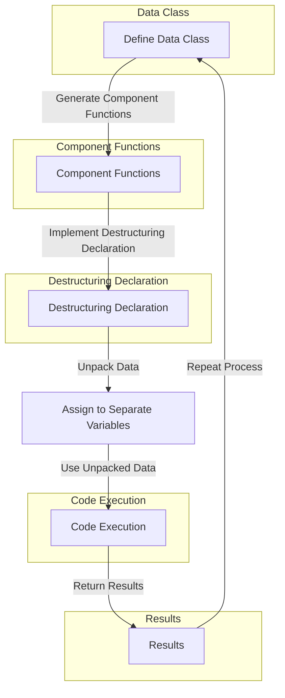

## Introduction
Destructuring declarations are a powerful feature in Kotlin that allows you to unpack data from objects and collections into separate variables. This feature is particularly useful when working with data classes, collections, and functions that return multiple values. In this section, we will explore the concept of destructuring declarations, their importance, and real-world relevance.

Destructuring declarations are essential in Kotlin because they provide a concise and expressive way to extract data from complex objects and collections. This feature is widely used in various programming domains, including data processing, networking, and database operations. For instance, when working with JSON data, you can use destructuring declarations to extract specific fields from a JSON object and assign them to separate variables.

> **Note:** Destructuring declarations are not unique to Kotlin and can be found in other programming languages, such as JavaScript and Python. However, Kotlin's implementation provides a more concise and expressive syntax.

## Core Concepts
To understand destructuring declarations, you need to grasp the following core concepts:

* **Data classes**: Data classes are a type of class in Kotlin that is designed to hold data. They are defined using the `data` keyword and provide a concise way to create classes with immutable properties.
* **Component functions**: Component functions are special functions in Kotlin that allow you to access the properties of a data class. They are used to implement destructuring declarations.
* **Destructuring declaration**: A destructuring declaration is a statement that unpacks data from an object or collection into separate variables.

The mental model for destructuring declarations is to think of them as a way to "unpack" data from a complex object or collection into separate variables. This process is similar to unzipping a file or unpacking a box, where you extract individual items from a larger container.

## How It Works Internally
Destructuring declarations work internally by using component functions to access the properties of a data class. When you define a data class, Kotlin automatically generates component functions for each property. These component functions are then used to implement destructuring declarations.

Here's a step-by-step breakdown of how destructuring declarations work:

1. You define a data class with properties.
2. Kotlin generates component functions for each property.
3. You use a destructuring declaration to unpack data from an object or collection.
4. The component functions are called to access the properties of the object or collection.
5. The data is assigned to separate variables.

The time complexity of destructuring declarations is O(1), meaning that it takes constant time to unpack data from an object or collection. The space complexity is also O(1), as no additional memory is allocated to store the unpacked data.

## Code Examples
Here are three complete and runnable code examples that demonstrate the use of destructuring declarations:

### Example 1: Basic Destructuring Declaration
```kotlin
data class Person(val name: String, val age: Int)

fun main() {
    val person = Person("John Doe", 30)
    val (name, age) = person
    println("Name: $name, Age: $age")
}
```
This example demonstrates a basic destructuring declaration, where we unpack the `name` and `age` properties from a `Person` object.

### Example 2: Destructuring Declaration with Collections
```kotlin
fun main() {
    val numbers = listOf(1, 2, 3, 4, 5)
    val (first, second, third, fourth, fifth) = numbers
    println("First: $first, Second: $second, Third: $third, Fourth: $fourth, Fifth: $fifth")
}
```
This example demonstrates a destructuring declaration with a collection, where we unpack the first five elements from a list of numbers.

### Example 3: Advanced Destructuring Declaration with Nested Objects
```kotlin
data class Address(val street: String, val city: String, val state: String, val zip: String)
data class Person(val name: String, val address: Address)

fun main() {
    val person = Person("John Doe", Address("123 Main St", "Anytown", "CA", "12345"))
    val (name, address) = person
    val (street, city, state, zip) = address
    println("Name: $name, Street: $street, City: $city, State: $state, Zip: $zip")
}
```
This example demonstrates an advanced destructuring declaration, where we unpack the `name` property and the `address` object from a `Person` object, and then unpack the `street`, `city`, `state`, and `zip` properties from the `address` object.

> **Tip:** You can use destructuring declarations to simplify your code and make it more readable. However, be careful not to overuse them, as they can make your code harder to understand if not used judiciously.

## Visual Diagram

This diagram illustrates the process of destructuring declarations, from defining a data class to assigning unpacked data to separate variables.

## Comparison
Here's a comparison table that highlights the differences between destructuring declarations and other methods of data extraction:

| Approach | Time Complexity | Space Complexity | Pros | Cons | Best For |
| --- | --- | --- | --- | --- | --- |
| Destructuring Declarations | O(1) | O(1) | Concise, expressive, and efficient | Limited to data classes and collections | Data processing, networking, and database operations |
| Manual Data Extraction | O(n) | O(n) | Flexible and customizable | Verbose and error-prone | Complex data structures and legacy code |
| Reflection | O(n) | O(n) | Dynamic and flexible | Slow and insecure | Debugging and testing |
| Serialization | O(n) | O(n) | Platform-independent and efficient | Limited to serializable data | Data storage and transmission |

> **Warning:** Destructuring declarations can be confusing if not used correctly. Make sure to understand the component functions and data class properties before using destructuring declarations.

## Real-world Use Cases
Here are three real-world use cases that demonstrate the application of destructuring declarations:

1. **Data Processing**: When working with large datasets, you can use destructuring declarations to extract specific fields from a data object and assign them to separate variables.
2. **Networking**: When receiving data from a network request, you can use destructuring declarations to unpack the response data and assign it to separate variables.
3. **Database Operations**: When working with database queries, you can use destructuring declarations to extract specific columns from a query result and assign them to separate variables.

For example, the popular Kotlin library, **Ktor**, uses destructuring declarations to extract HTTP request parameters and assign them to separate variables.

## Common Pitfalls
Here are four common pitfalls to watch out for when using destructuring declarations:

1. **Incorrect Component Functions**: Make sure to define the correct component functions for your data class.
2. **Insufficient Data**: Make sure to provide sufficient data for the destructuring declaration to work correctly.
3. **Incorrect Variable Names**: Make sure to use the correct variable names when assigning unpacked data to separate variables.
4. **Nested Objects**: Make sure to handle nested objects correctly when using destructuring declarations.

Here's an example of incorrect code that demonstrates a common pitfall:
```kotlin
data class Person(val name: String, val address: Address)
data class Address(val street: String, val city: String)

fun main() {
    val person = Person("John Doe", Address("123 Main St", "Anytown"))
    val (name, street) = person // Incorrect component functions
    println("Name: $name, Street: $street")
}
```
The correct code should use the correct component functions and variable names:
```kotlin
data class Person(val name: String, val address: Address)
data class Address(val street: String, val city: String)

fun main() {
    val person = Person("John Doe", Address("123 Main St", "Anytown"))
    val (name, address) = person
    val (street, city) = address
    println("Name: $name, Street: $street, City: $city")
}
```
> **Tip:** Use the correct component functions and variable names when using destructuring declarations. Make sure to handle nested objects correctly.

## Interview Tips
Here are three common interview questions related to destructuring declarations, along with weak and strong answers:

1. **What is a destructuring declaration?**
	* Weak answer: "It's a way to extract data from an object or collection."
	* Strong answer: "A destructuring declaration is a concise and expressive way to unpack data from an object or collection into separate variables. It uses component functions to access the properties of a data class and assign them to separate variables."
2. **How do you use destructuring declarations in Kotlin?**
	* Weak answer: "You just assign the data to separate variables."
	* Strong answer: "You use the `val` keyword to define a destructuring declaration, and then assign the unpacked data to separate variables using the correct component functions and variable names."
3. **What are the benefits of using destructuring declarations?**
	* Weak answer: "It's just a convenient way to extract data."
	* Strong answer: "Destructuring declarations provide a concise and expressive way to extract data from complex objects and collections. They improve code readability and maintainability, and reduce the risk of errors. They also provide a flexible and customizable way to work with data."

> **Interview:** Be prepared to answer questions about destructuring declarations, including their definition, usage, and benefits. Make sure to provide strong answers that demonstrate your understanding of the concept.

## Key Takeaways
Here are ten key takeaways to remember when working with destructuring declarations:

* Destructuring declarations are a concise and expressive way to unpack data from objects and collections.
* They use component functions to access the properties of a data class.
* They provide a flexible and customizable way to work with data.
* They improve code readability and maintainability.
* They reduce the risk of errors.
* They are widely used in data processing, networking, and database operations.
* They have a time complexity of O(1) and a space complexity of O(1).
* They can be used with data classes and collections.
* They can be nested to handle complex data structures.
* They should be used judiciously to avoid overcomplicating code.

> **Note:** Destructuring declarations are a powerful feature in Kotlin that can simplify your code and improve its readability. However, they should be used judiciously to avoid overcomplicating your code.