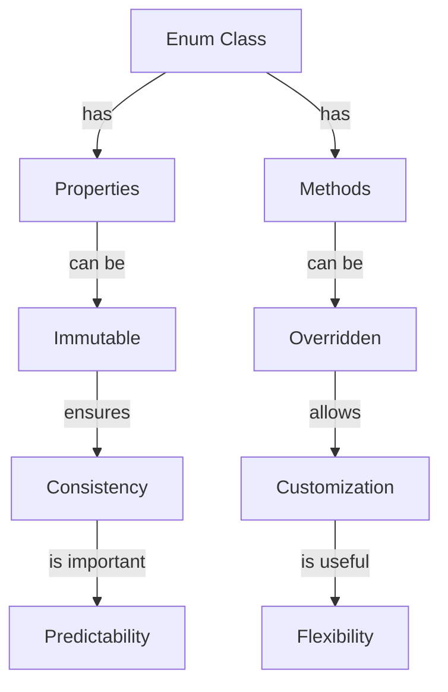

## Introduction
Enum classes in Kotlin are a powerful way to define a set of named values. They are useful when we need to define a set of distinct values that have a specific meaning in our application. Enum classes can have properties and methods, making them a versatile tool for modeling complex data. In this section, we will explore why enum classes matter, their real-world relevance, and why every engineer needs to know about them.

Enum classes are essential in Kotlin because they provide a way to define a set of named values that are type-safe and self-documenting. They are particularly useful when working with state machines, where we need to define a set of distinct states that an object can be in. For example, in a payment processing system, we might define an enum class to represent the different states of a payment: `PENDING`, `PROCESSED`, `FAILED`, etc.

> **Note:** Enum classes are not just limited to simple state machines. They can be used to model complex data structures and behaviors, making them a fundamental building block of any Kotlin application.

## Core Concepts
In this section, we will cover the core concepts of enum classes in Kotlin. We will explore the syntax, properties, and methods of enum classes, as well as some key terminology.

An enum class in Kotlin is defined using the `enum class` keyword. For example:
```kotlin
enum class Color {
    RED, GREEN, BLUE
}
```
This defines an enum class called `Color` with three values: `RED`, `GREEN`, and `BLUE`. We can use these values in our code like any other type:
```kotlin
val color: Color = Color.RED
```
Enum classes can also have properties and methods. For example:
```kotlin
enum class Color(val rgb: Int) {
    RED(0xFF0000),
    GREEN(0x00FF00),
    BLUE(0x0000FF)

    fun isBright(): Boolean {
        return rgb >= 0x888888
    }
}
```
This defines an enum class called `Color` with a property `rgb` and a method `isBright()`. We can use these properties and methods in our code like any other type:
```kotlin
val color: Color = Color.RED
println(color.rgb) // prints 16711680
println(color.isBright()) // prints false
```
> **Tip:** When defining enum classes, it's a good idea to use `val` properties to make them immutable. This ensures that the values of the enum class are consistent and predictable.

## How It Works Internally
In this section, we will explore how enum classes work internally in Kotlin. We will cover the under-the-hood mechanics of enum classes, including their memory layout and execution model.

Enum classes in Kotlin are compiled to Java classes that extend the `Enum` class. This means that enum classes in Kotlin are essentially Java enums with some additional features. The Kotlin compiler generates a synthetic class for each enum class, which contains the properties and methods defined in the enum class.

For example, the `Color` enum class defined above would be compiled to a Java class like this:
```java
public final class Color extends Enum {
    public static final Color RED = new Color(0xFF0000);
    public static final Color GREEN = new Color(0x00FF00);
    public static final Color BLUE = new Color(0x0000FF);

    private final int rgb;

    private Color(int rgb) {
        this.rgb = rgb;
    }

    public int getRgb() {
        return rgb;
    }

    public boolean isBright() {
        return rgb >= 0x888888;
    }
}
```
As you can see, the Kotlin compiler generates a synthetic class for the `Color` enum class, which contains the properties and methods defined in the enum class.

> **Warning:** When using enum classes in Kotlin, be aware that they are compiled to Java classes. This means that they can be used from Java code, but they may not work as expected if they contain Kotlin-specific features.

## Code Examples
In this section, we will cover some code examples that demonstrate the use of enum classes in Kotlin. We will start with a simple example and then move on to more advanced examples.

### Example 1: Basic Enum Class
```kotlin
enum class Day {
    MONDAY, TUESDAY, WEDNESDAY, THURSDAY, FRIDAY, SATURDAY, SUNDAY
}

fun main() {
    val day: Day = Day.MONDAY
    println(day) // prints MONDAY
}
```
This example defines a simple enum class called `Day` with seven values. We can use these values in our code like any other type.

### Example 2: Enum Class with Properties
```kotlin
enum class Color(val rgb: Int) {
    RED(0xFF0000),
    GREEN(0x00FF00),
    BLUE(0x0000FF)
}

fun main() {
    val color: Color = Color.RED
    println(color.rgb) // prints 16711680
}
```
This example defines an enum class called `Color` with a property `rgb`. We can use this property in our code like any other type.

### Example 3: Enum Class with Methods
```kotlin
enum class Color(val rgb: Int) {
    RED(0xFF0000),
    GREEN(0x00FF00),
    BLUE(0x0000FF)

    fun isBright(): Boolean {
        return rgb >= 0x888888
    }
}

fun main() {
    val color: Color = Color.RED
    println(color.isBright()) // prints false
}
```
This example defines an enum class called `Color` with a method `isBright()`. We can use this method in our code like any other type.

> **Interview:** When asked about enum classes in Kotlin, be prepared to explain the syntax, properties, and methods of enum classes. You should also be able to provide examples of how to use enum classes in real-world scenarios.

## Visual Diagram

This diagram illustrates the relationship between enum classes, properties, and methods in Kotlin. It shows how enum classes can have properties and methods, and how these properties and methods can be used to create custom and flexible solutions.

## Comparison
| Approach | Time Complexity | Space Complexity | Pros | Cons |
| --- | --- | --- | --- | --- |
| Enum Class | O(1) | O(1) | Type-safe, self-documenting | Limited flexibility |
| Class | O(1) | O(n) | Flexible, customizable | More verbose |
| Interface | O(1) | O(1) | Flexible, customizable | More verbose |
| Sealed Class | O(1) | O(1) | Type-safe, self-documenting | Limited flexibility |

This table compares the different approaches to defining a set of named values in Kotlin. It shows the time and space complexity of each approach, as well as their pros and cons.

> **Tip:** When choosing an approach, consider the trade-offs between type safety, flexibility, and verbosity. Enum classes are a good choice when you need a set of distinct values that are type-safe and self-documenting.

## Real-world Use Cases
Enum classes are used in many real-world applications, including:

* Payment processing systems: Enum classes can be used to define the different states of a payment, such as `PENDING`, `PROCESSED`, and `FAILED`.
* E-commerce systems: Enum classes can be used to define the different types of products, such as `PHYSICAL`, `DIGITAL`, and `SUBSCRIPTION`.
* Social media platforms: Enum classes can be used to define the different types of user interactions, such as `LIKE`, `COMMENT`, and `SHARE`.

For example, the payment processing system Stripe uses enum classes to define the different states of a payment:
```kotlin
enum class PaymentStatus {
    PENDING,
    PROCESSED,
    FAILED
}
```
This allows Stripe to ensure that payments are processed correctly and consistently, regardless of the specific payment method used.

> **Warning:** When using enum classes in real-world applications, be aware of the potential for enum class values to be added or removed over time. This can cause issues with backwards compatibility and forward compatibility.

## Common Pitfalls
Here are some common pitfalls to watch out for when using enum classes in Kotlin:

* Not using `val` properties to make enum class values immutable
* Not using `override` to override methods in enum classes
* Not using `sealed` classes to define a set of distinct values
* Not considering the trade-offs between type safety, flexibility, and verbosity

For example, the following code is incorrect because it uses `var` properties instead of `val` properties:
```kotlin
enum class Color(var rgb: Int) {
    RED(0xFF0000),
    GREEN(0x00FF00),
    BLUE(0x0000FF)
}
```
This can cause issues with consistency and predictability, because the values of the enum class can be changed at runtime.

> **Tip:** To avoid common pitfalls, use `val` properties to make enum class values immutable, and consider using `sealed` classes to define a set of distinct values.

## Interview Tips
Here are some common interview questions related to enum classes in Kotlin, along with some tips for answering them:

* What is an enum class in Kotlin, and how is it used?
	+ Answer: An enum class is a way to define a set of named values that are type-safe and self-documenting. It is used to define a set of distinct values that have a specific meaning in an application.
* How do you define an enum class in Kotlin?
	+ Answer: You define an enum class using the `enum class` keyword, followed by the name of the enum class and a list of values.
* What are the benefits of using enum classes in Kotlin?
	+ Answer: The benefits of using enum classes include type safety, self-documentation, and consistency. Enum classes can also be used to define a set of distinct values that are immutable and predictable.

> **Interview:** When answering interview questions related to enum classes, be prepared to explain the syntax, properties, and methods of enum classes, as well as their benefits and trade-offs.

## Key Takeaways
Here are some key takeaways to remember when working with enum classes in Kotlin:

* Enum classes are a way to define a set of named values that are type-safe and self-documenting.
* Enum classes can have properties and methods, making them a versatile tool for modeling complex data.
* Enum classes are compiled to Java classes that extend the `Enum` class.
* Enum classes can be used to define a set of distinct values that are immutable and predictable.
* Enum classes can be used to define a set of distinct values that have a specific meaning in an application.
* The benefits of using enum classes include type safety, self-documentation, and consistency.
* The trade-offs of using enum classes include limited flexibility and verbosity.
* Enum classes can be used in real-world applications, such as payment processing systems, e-commerce systems, and social media platforms.
* Common pitfalls to watch out for when using enum classes include not using `val` properties, not using `override` to override methods, and not considering the trade-offs between type safety, flexibility, and verbosity.