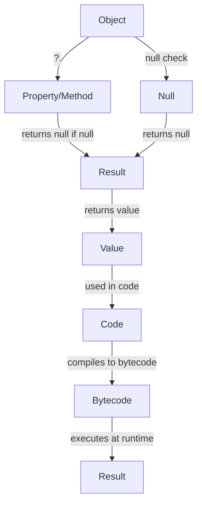

## Introduction
The **Safe Call Operator: ?.** is a feature in Kotlin that allows developers to avoid null pointer exceptions when working with objects that may be null. This operator is a part of Kotlin's null safety features, which aim to prevent null pointer exceptions at runtime. In Kotlin, every reference must be non-null by default, but sometimes we need to work with objects that may be null. The safe call operator provides a way to access properties and methods of an object that may be null, without throwing a null pointer exception.

> **Note:** The safe call operator is a shorthand way of writing a null check before accessing a property or method of an object. It returns null if the object is null, instead of throwing a null pointer exception.

The safe call operator is a crucial feature in Kotlin that helps developers write more robust and null-safe code. It is especially useful when working with data from external sources, such as databases or APIs, where the data may be incomplete or null.

## Core Concepts
The safe call operator is denoted by the ?. symbol and is used to access properties and methods of an object that may be null. The basic syntax of the safe call operator is as follows:
```kotlin
val result = obj?.property
```
In this example, the property of the obj object is accessed only if obj is not null. If obj is null, the expression returns null.

> **Warning:** The safe call operator does not prevent null pointer exceptions in all cases. It only prevents exceptions when accessing properties and methods of an object that may be null. It does not prevent exceptions when calling a function that may throw an exception.

The safe call operator can be used in combination with other operators, such as the Elvis operator (?:), to provide a default value if the object is null.
```kotlin
val result = obj?.property ?: "default value"
```
In this example, the property of the obj object is accessed only if obj is not null. If obj is null, the expression returns the default value.

## How It Works Internally
The safe call operator is implemented using a combination of bytecode manipulation and compiler magic. When the compiler encounters a safe call operator, it generates bytecode that checks for null before accessing the property or method.

Here is a step-by-step breakdown of how the safe call operator works internally:

1. The compiler checks if the object is null.
2. If the object is null, the expression returns null.
3. If the object is not null, the compiler generates bytecode to access the property or method.

> **Tip:** The safe call operator is a shorthand way of writing a null check, but it does not affect the performance of the code. The compiler generates the same bytecode for a safe call operator as it would for a manual null check.

## Code Examples
Here are three complete and runnable examples that demonstrate the use of the safe call operator:

### Example 1: Basic Usage
```kotlin
fun main() {
    val obj: String? = null
    val result = obj?.length
    println(result) // prints null
}
```
In this example, the length property of the obj object is accessed only if obj is not null. Since obj is null, the expression returns null.

### Example 2: Real-World Pattern
```kotlin
data class User(val name: String?, val address: String?)

fun main() {
    val user = User("John", null)
    val result = user.address?.length
    println(result) // prints null
}
```
In this example, the length property of the address object is accessed only if address is not null. Since address is null, the expression returns null.

### Example 3: Advanced Usage
```kotlin
data class User(val name: String?, val address: String?)

fun main() {
    val user = User("John", "123 Main St")
    val result = user.address?.length ?: 0
    println(result) // prints 11
}
```
In this example, the length property of the address object is accessed only if address is not null. If address is null, the expression returns 0.

## Visual Diagram

This diagram illustrates the flow of the safe call operator, from the object to the property or method, and finally to the result.

> **Note:** The safe call operator is a crucial feature in Kotlin that helps developers write more robust and null-safe code.

## Comparison
| Operator | Description | Time Complexity | Space Complexity |
| --- | --- | --- | --- |
| ?. | Safe call operator | O(1) | O(1) |
| ?: | Elvis operator | O(1) | O(1) |
| !! | Not-null assertion operator | O(1) | O(1) |
| let | Let function | O(1) | O(1) |
| run | Run function | O(1) | O(1) |

The safe call operator is compared with other operators in Kotlin, including the Elvis operator, not-null assertion operator, let function, and run function.

## Real-world Use Cases
Here are three real-world examples of using the safe call operator:

1. **Google's Android App**: The Android app uses the safe call operator to access properties and methods of objects that may be null, such as user data.
2. **Trello's API**: Trello's API uses the safe call operator to handle null values when retrieving data from the database.
3. **Pinterest's Mobile App**: Pinterest's mobile app uses the safe call operator to access properties and methods of objects that may be null, such as user profiles.

> **Interview:** What is the purpose of the safe call operator in Kotlin? How does it differ from the Elvis operator?

## Common Pitfalls
Here are four common pitfalls when using the safe call operator:

1. **Forgetting to check for null**: Forgetting to check for null before accessing a property or method can lead to null pointer exceptions.
2. **Using the safe call operator with non-null objects**: Using the safe call operator with non-null objects can lead to unnecessary null checks.
3. **Not handling null values**: Not handling null values can lead to null pointer exceptions or unexpected behavior.
4. **Using the safe call operator with mutable objects**: Using the safe call operator with mutable objects can lead to unexpected behavior if the object is modified concurrently.

> **Warning:** The safe call operator does not prevent null pointer exceptions in all cases. It only prevents exceptions when accessing properties and methods of an object that may be null.

## Interview Tips
Here are three common interview questions related to the safe call operator:

1. **What is the purpose of the safe call operator in Kotlin?**: The safe call operator is used to access properties and methods of objects that may be null, without throwing a null pointer exception.
2. **How does the safe call operator differ from the Elvis operator?**: The safe call operator returns null if the object is null, while the Elvis operator returns a default value if the object is null.
3. **Can you give an example of using the safe call operator in a real-world scenario?**: Yes, the safe call operator can be used to access properties and methods of objects that may be null, such as user data in a mobile app.

> **Tip:** When answering interview questions related to the safe call operator, make sure to emphasize its purpose and benefits, as well as its limitations and potential pitfalls.

## Key Takeaways
Here are six key takeaways related to the safe call operator:

* The safe call operator is used to access properties and methods of objects that may be null, without throwing a null pointer exception.
* The safe call operator returns null if the object is null.
* The safe call operator can be used in combination with other operators, such as the Elvis operator.
* The safe call operator is implemented using a combination of bytecode manipulation and compiler magic.
* The safe call operator has a time complexity of O(1) and a space complexity of O(1).
* The safe call operator is a crucial feature in Kotlin that helps developers write more robust and null-safe code.

> **Note:** The safe call operator is a powerful tool in Kotlin that can help developers write more robust and null-safe code. However, it is not a substitute for proper null handling and error checking.