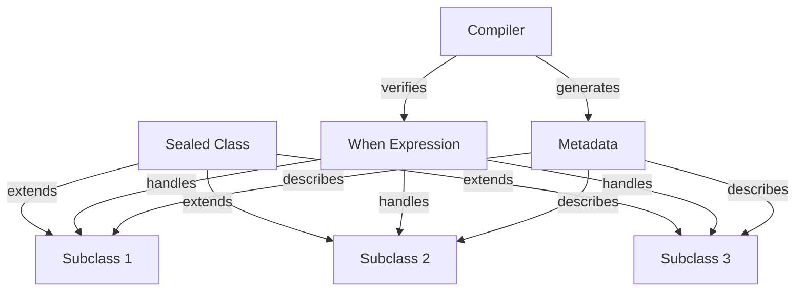

## Introduction
Sealed classes in Kotlin are a way to represent a fixed set of subclasses. They are abstract classes that can have a fixed number of direct subclasses, which must be declared in the same file as the sealed class. This is useful when you have a class hierarchy where you want to ensure that all possible subclasses are known at compile time. Sealed classes are exhaustive when expressions, meaning that the compiler can verify that all possible subclasses are handled in a when expression.

In real-world applications, sealed classes can be used to model a fixed set of states or events. For example, in a finite state machine, you can use a sealed class to represent the different states of the machine. Sealed classes are also useful when working with APIs that return a fixed set of responses, such as HTTP status codes.

> **Note:** Sealed classes are a powerful tool in Kotlin, but they can be tricky to use correctly. It's essential to understand the basics of sealed classes and how to use them effectively in your code.

## Core Concepts
A sealed class is declared using the `sealed` keyword. The sealed class can have properties and functions, just like any other class. However, the subclasses of a sealed class must be declared in the same file as the sealed class.

The key terminology to understand when working with sealed classes is:

* **Sealed class**: The abstract class that represents a fixed set of subclasses.
* **Subclass**: A class that directly extends the sealed class.
* **Exhaustive when expression**: A when expression that handles all possible subclasses of a sealed class.

> **Tip:** When working with sealed classes, it's essential to use exhaustive when expressions to ensure that all possible subclasses are handled. This can help catch errors at compile time rather than runtime.

## How It Works Internally
When the compiler encounters a sealed class, it generates a set of metadata that describes the subclasses of the sealed class. This metadata is used to verify that all possible subclasses are handled in a when expression.

Here's a step-by-step breakdown of how sealed classes work internally:

1. The compiler generates a set of metadata that describes the subclasses of the sealed class.
2. When a when expression is used to handle the subclasses of a sealed class, the compiler checks the metadata to ensure that all possible subclasses are handled.
3. If a subclass is not handled in the when expression, the compiler generates an error.

> **Warning:** If you forget to handle a subclass in a when expression, the compiler will generate an error. This can be frustrating, but it's essential to ensure that your code is correct and exhaustive.

## Code Examples
### Example 1: Basic Sealed Class
```kotlin
// Declare a sealed class
sealed class Color {
    class Red : Color()
    class Green : Color()
    class Blue : Color()
}

// Use a when expression to handle the subclasses
fun printColor(color: Color) {
    when (color) {
        is Color.Red -> println("Red")
        is Color.Green -> println("Green")
        is Color.Blue -> println("Blue")
    }
}
```
### Example 2: Real-World Sealed Class
```kotlin
// Declare a sealed class to represent HTTP status codes
sealed class HttpStatus {
    class Ok : HttpStatus()
    class NotFound : HttpStatus()
    class InternalServerError : HttpStatus()
}

// Use a when expression to handle the subclasses
fun handleHttpStatus(status: HttpStatus) {
    when (status) {
        is HttpStatus.Ok -> println("OK")
        is HttpStatus.NotFound -> println("Not Found")
        is HttpStatus.InternalServerError -> println("Internal Server Error")
    }
}
```
### Example 3: Advanced Sealed Class
```kotlin
// Declare a sealed class to represent a finite state machine
sealed class State {
    class Start : State()
    class Running : State()
    class Finished : State()
}

// Use a when expression to handle the subclasses
fun printState(state: State) {
    when (state) {
        is State.Start -> println("Start")
        is State.Running -> println("Running")
        is State.Finished -> println("Finished")
    }
}
```
> **Interview:** Can you explain the difference between a sealed class and an enum class? How would you use a sealed class to model a finite state machine?

## Visual Diagram

The diagram shows the relationship between a sealed class, its subclasses, and a when expression. The compiler generates metadata that describes the subclasses, and the when expression handles all possible subclasses.

## Comparison
| Approach | Time Complexity | Space Complexity | Pros | Cons | Best For |
| --- | --- | --- | --- | --- | --- |
| Sealed Class | O(1) | O(1) | Ensures exhaustiveness, compile-time safety | Limited to fixed set of subclasses | Modeling finite state machines, API responses |
| Enum Class | O(1) | O(1) | Simple, easy to use | Limited to fixed set of values | Modeling a fixed set of values |
| Abstract Class | O(1) | O(1) | Flexible, allows for multiple subclasses | Does not ensure exhaustiveness | Modeling complex class hierarchies |
| Interface | O(1) | O(1) | Flexible, allows for multiple implementations | Does not ensure exhaustiveness | Modeling interfaces, contracts |

> **Tip:** When choosing between a sealed class and an enum class, consider the flexibility and complexity of your use case. Sealed classes are more flexible, but enum classes are simpler and easier to use.

## Real-world Use Cases
* **Kotlinx Coroutines**: Uses sealed classes to model the different states of a coroutine, such as running, suspended, or finished.
* **Retrofit**: Uses sealed classes to model the different HTTP status codes, such as OK, Not Found, or Internal Server Error.
* **Android Architecture Components**: Uses sealed classes to model the different states of a ViewModel, such as loading, success, or error.

## Common Pitfalls
* **Forgetting to handle a subclass**: If you forget to handle a subclass in a when expression, the compiler will generate an error.
* **Using a sealed class for a large number of subclasses**: Sealed classes are best used for a small, fixed set of subclasses. If you have a large number of subclasses, consider using an abstract class or interface instead.
* **Not using exhaustive when expressions**: Exhaustive when expressions ensure that all possible subclasses are handled. If you don't use exhaustive when expressions, you may miss handling a subclass, leading to runtime errors.

> **Warning:** Forgetting to handle a subclass can lead to runtime errors. Always use exhaustive when expressions to ensure that all possible subclasses are handled.

## Interview Tips
* **What is the difference between a sealed class and an enum class?**: A sealed class is more flexible than an enum class, allowing for multiple subclasses and properties. An enum class is simpler and easier to use, but limited to a fixed set of values.
* **How would you use a sealed class to model a finite state machine?**: You would declare a sealed class to represent the different states of the machine, and use a when expression to handle the subclasses.
* **What is the benefit of using a sealed class over an abstract class or interface?**: Sealed classes ensure exhaustiveness, compile-time safety, and flexibility, making them a good choice for modeling complex class hierarchies.

## Key Takeaways
* Sealed classes are a powerful tool in Kotlin for modeling a fixed set of subclasses.
* Sealed classes ensure exhaustiveness, compile-time safety, and flexibility.
* Use exhaustive when expressions to handle all possible subclasses.
* Sealed classes are best used for a small, fixed set of subclasses.
* Consider using an abstract class or interface for large, complex class hierarchies.
* Always use exhaustive when expressions to ensure that all possible subclasses are handled.
* Sealed classes are a good choice for modeling finite state machines, API responses, and complex class hierarchies.