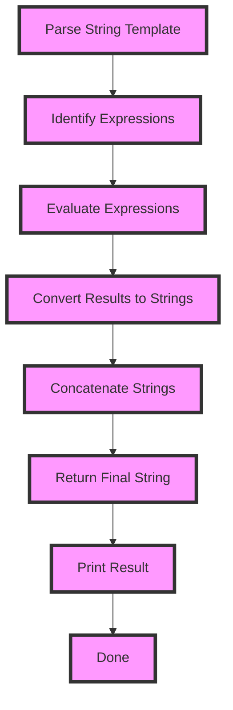

## Introduction
String templates are a powerful feature in Kotlin that allows you to embed expressions inside string literals. This feature is useful for creating dynamic strings, such as greetings, notifications, or error messages, where you need to insert values or results of expressions into the string. In this section, we will explore what string templates are, why they matter, and their real-world relevance.

String templates are essential in Kotlin because they provide a concise and readable way to create dynamic strings. Without string templates, you would need to use string concatenation or formatting methods, which can be verbose and error-prone. With string templates, you can write more expressive and efficient code.

> **Note:** String templates are not unique to Kotlin; other languages, such as JavaScript and Python, also have similar features. However, Kotlin's string templates are particularly powerful and flexible.

## Core Concepts
In Kotlin, a string template is a string literal that contains one or more expressions enclosed in curly braces `${}`. The expressions can be simple values, variables, or more complex expressions, such as function calls or arithmetic operations. When a string template is evaluated, the expressions are replaced with their values, and the resulting string is returned.

The key terminology in string templates includes:

* **String literal**: a sequence of characters enclosed in double quotes `""`
* **Expression**: a value, variable, or operation that is evaluated to produce a result
* **Template**: a string literal that contains one or more expressions enclosed in curly braces `${}`

> **Tip:** To use string templates effectively, it's essential to understand the syntax and semantics of the expressions you can use inside the template.

## How It Works Internally
When you use a string template in Kotlin, the compiler translates it into a regular string concatenation operation. The expressions inside the template are evaluated first, and then their results are converted to strings using the `toString()` method. The resulting strings are then concatenated to form the final string.

Here's a step-by-step breakdown of how string templates work internally:

1. **Parsing**: The compiler parses the string template and identifies the expressions inside the curly braces.
2. **Evaluation**: The expressions are evaluated, and their results are converted to strings using the `toString()` method.
3. **Concatenation**: The resulting strings are concatenated to form the final string.

> **Warning:** Be careful when using complex expressions inside string templates, as they can lead to performance issues or unexpected behavior.

## Code Examples
Here are three complete and runnable examples that demonstrate the use of string templates in Kotlin:

### Example 1: Basic Usage
```kotlin
fun main() {
    val name = "John"
    val age = 30
    val greeting = "Hello $name, you are ${age + 1} years old"
    println(greeting)
}
```
This example shows how to use a simple string template to create a greeting message.

### Example 2: Real-World Pattern
```kotlin
data class User(val name: String, val age: Int)

fun main() {
    val user = User("Jane", 25)
    val greeting = "Hello ${user.name}, you are ${user.age + 1} years old"
    println(greeting)
}
```
This example demonstrates how to use string templates with data classes to create more complex and dynamic strings.

### Example 3: Advanced Usage
```kotlin
fun factorial(n: Int): Int {
    return if (n == 0) 1 else n * factorial(n - 1)
}

fun main() {
    val n = 5
    val result = "The factorial of $n is ${factorial(n)}"
    println(result)
}
```
This example shows how to use string templates with recursive functions to create more advanced and dynamic strings.

## Visual Diagram

This diagram illustrates the step-by-step process of evaluating a string template in Kotlin.

> **Note:** The diagram shows the key steps involved in evaluating a string template, from parsing to concatenation.

## Comparison
Here's a comparison table that highlights the differences between string templates and other string formatting methods:

| Approach | Time Complexity | Space Complexity | Pros | Cons | Best For |
| --- | --- | --- | --- | --- | --- |
| String Templates | O(n) | O(n) | Concise, readable, efficient | Limited control over formatting | Simple string formatting |
| String Concatenation | O(n) | O(n) | Flexible, easy to use | Verbose, error-prone | Complex string formatting |
| String Formatting | O(n) | O(n) | Powerful, customizable | Steep learning curve | Advanced string formatting |
| Regular Expressions | O(n) | O(n) | Flexible, powerful | Complex, error-prone | Pattern matching and validation |

> **Tip:** Choose the approach that best fits your use case, considering factors such as performance, readability, and maintainability.

## Real-world Use Cases
Here are three real-world examples of using string templates in production:

1. **Notification System**: A notification system uses string templates to create personalized messages for users, such as "Hello John, you have 5 new messages".
2. **Error Handling**: An error handling system uses string templates to create error messages, such as "Error: ${error.code} - ${error.message}".
3. **Reporting**: A reporting system uses string templates to create dynamic reports, such as "Total sales: ${sales.total} - Average sale: ${sales.average}".

> **Warning:** Be careful when using string templates in production, as they can lead to performance issues or security vulnerabilities if not used properly.

## Common Pitfalls
Here are four common mistakes to avoid when using string templates:

1. **Incorrect syntax**: Using incorrect syntax, such as missing or mismatched curly braces, can lead to compilation errors.
2. **Null pointer exceptions**: Using null values in string templates can lead to null pointer exceptions.
3. **Performance issues**: Using complex expressions or large data structures in string templates can lead to performance issues.
4. **Security vulnerabilities**: Using string templates to create user-inputted strings can lead to security vulnerabilities, such as SQL injection or cross-site scripting (XSS).

Here's an example of the wrong way vs the right way to use string templates:
```kotlin
// Wrong way
val greeting = "Hello $name" // null pointer exception if name is null

// Right way
val greeting = "Hello ${name ?: "Unknown"}" // uses Elvis operator to handle null values
```
> **Tip:** Always use the Elvis operator (`?:`) to handle null values in string templates.

## Interview Tips
Here are three common interview questions related to string templates, along with weak and strong answers:

1. **What is a string template, and how does it work?**
	* Weak answer: "A string template is a way to create dynamic strings, but I'm not sure how it works."
	* Strong answer: "A string template is a string literal that contains expressions enclosed in curly braces. The expressions are evaluated, and their results are converted to strings using the `toString()` method. The resulting strings are then concatenated to form the final string."
2. **How do you handle null values in string templates?**
	* Weak answer: "I'm not sure, but I think you can use a null check or something."
	* Strong answer: "You can use the Elvis operator (`?:`) to handle null values in string templates. For example, `val greeting = "Hello ${name ?: "Unknown"}"`."
3. **What are some common pitfalls when using string templates?**
	* Weak answer: "I'm not sure, but I think you should just be careful when using them."
	* Strong answer: "Some common pitfalls when using string templates include incorrect syntax, null pointer exceptions, performance issues, and security vulnerabilities. To avoid these pitfalls, you should always use the correct syntax, handle null values properly, and be mindful of performance and security concerns."

> **Interview:** Be prepared to answer questions about string templates, including how they work, how to handle null values, and common pitfalls to avoid.

## Key Takeaways
Here are six key takeaways to remember when working with string templates:

* **String templates are powerful and flexible**: They allow you to create dynamic strings with ease and expressiveness.
* **Use the correct syntax**: Always use the correct syntax, including curly braces and expressions, to avoid compilation errors.
* **Handle null values properly**: Use the Elvis operator (`?:`) to handle null values in string templates.
* **Be mindful of performance**: Avoid using complex expressions or large data structures in string templates to prevent performance issues.
* **Be aware of security vulnerabilities**: Use string templates with caution, especially when creating user-inputted strings, to avoid security vulnerabilities.
* **Use string templates judiciously**: Choose the approach that best fits your use case, considering factors such as performance, readability, and maintainability.

> **Note:** String templates are a powerful tool in Kotlin, but they require careful use and attention to detail to avoid pitfalls and ensure optimal performance.