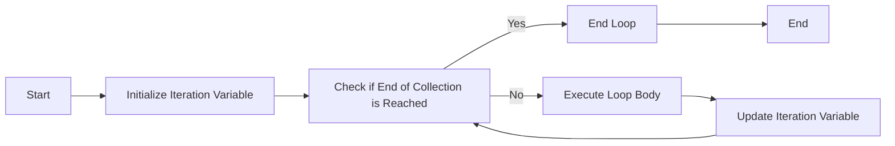

## Introduction
The **for loop** is a fundamental control structure in programming, allowing developers to iterate over a collection of items and perform operations on each one. In Kotlin, the **for loop** is used to iterate over a collection, such as a list, array, or set, and is a crucial tool for any programmer. The **for loop** is essential in real-world applications, where it is used to process data, perform calculations, and update records. For example, in a web application, a **for loop** might be used to iterate over a list of users and send each one a notification.

> **Note:** The **for loop** is a versatile control structure that can be used in a variety of situations, from simple iteration to complex data processing.

## Core Concepts
The **for loop** consists of three main components: the **iteration variable**, the **collection**, and the **loop body**. The **iteration variable** is the variable that takes on the value of each item in the collection during each iteration. The **collection** is the group of items that the loop will iterate over. The **loop body** is the code that is executed during each iteration.

*   **Iteration Variable:** The variable that takes on the value of each item in the collection during each iteration.
*   **Collection:** The group of items that the loop will iterate over.
*   **Loop Body:** The code that is executed during each iteration.

> **Tip:** When using a **for loop**, it is essential to ensure that the loop body is properly indented to avoid syntax errors.

## How It Works Internally
When a **for loop** is executed, the following steps occur:

1.  The **collection** is evaluated to determine the number of items it contains.
2.  The **iteration variable** is initialized to the first item in the **collection**.
3.  The **loop body** is executed, with the **iteration variable** taking on the value of the current item.
4.  The **iteration variable** is updated to the next item in the **collection**.
5.  Steps 3 and 4 are repeated until the end of the **collection** is reached.

The time complexity of a **for loop** is O(n), where n is the number of items in the **collection**. The space complexity is O(1), as the loop only requires a constant amount of memory to store the **iteration variable** and the **loop body**.

> **Warning:** A common mistake when using **for loops** is to iterate over a collection that is being modified concurrently, which can lead to unpredictable behavior.

## Code Examples
### Example 1: Basic Usage
```kotlin
fun main() {
    val numbers = listOf(1, 2, 3, 4, 5)
    for (number in numbers) {
        println(number)
    }
}
```
This example demonstrates the basic usage of a **for loop** in Kotlin, iterating over a list of numbers and printing each one.

### Example 2: Real-World Pattern
```kotlin
fun calculateTotalCost(order: List<Item>) {
    var totalCost = 0.0
    for (item in order) {
        totalCost += item.price * item.quantity
    }
    println("Total cost: $totalCost")
}

data class Item(val name: String, val price: Double, val quantity: Int)

fun main() {
    val order = listOf(
        Item("Apple", 1.99, 2),
        Item("Banana", 0.99, 3),
        Item("Orange", 2.49, 1)
    )
    calculateTotalCost(order)
}
```
This example demonstrates a real-world usage of a **for loop**, calculating the total cost of an order by iterating over a list of items and summing their prices.

### Example 3: Advanced Usage
```kotlin
fun findFirstMatch(numbers: List<Int>, target: Int): Int? {
    for (number in numbers) {
        if (number == target) {
            return number
        }
    }
    return null
}

fun main() {
    val numbers = listOf(1, 2, 3, 4, 5)
    val target = 3
    val result = findFirstMatch(numbers, target)
    if (result != null) {
        println("Found match: $result")
    } else {
        println("No match found")
    }
}
```
This example demonstrates an advanced usage of a **for loop**, finding the first match in a list of numbers and returning the matched number.

> **Interview:** When asked about the time complexity of a **for loop**, be sure to explain that it is O(n), where n is the number of items in the collection.

## Visual Diagram

This diagram illustrates the flow of a **for loop**, from initialization to termination.

## Comparison
| Approach | Time Complexity | Space Complexity | Pros | Cons | Best For |
| --- | --- | --- | --- | --- | --- |
| For Loop | O(n) | O(1) | Simple to implement, efficient for small collections | Can be slow for large collections | Iterating over small to medium-sized collections |
| While Loop | O(n) | O(1) | Flexible, can be used for complex iteration scenarios | More prone to errors, less readable | Iterating over collections with complex termination conditions |
| Recursion | O(n) | O(n) | Elegant, can be used for tree-like data structures | Can cause stack overflow for large collections, less efficient | Iterating over tree-like data structures, solving recursive problems |
| Iterator | O(n) | O(1) | Efficient, can be used for large collections | More complex to implement, less readable | Iterating over large collections, using iterators |

> **Tip:** When choosing an iteration approach, consider the size of the collection, the complexity of the iteration scenario, and the performance requirements of the application.

## Real-world Use Cases
1.  **E-commerce Website:** An e-commerce website uses a **for loop** to iterate over a list of products and display each one on the product page.
2.  **Social Media Platform:** A social media platform uses a **for loop** to iterate over a list of users and send each one a notification when a new post is published.
3.  **Financial Application:** A financial application uses a **for loop** to iterate over a list of transactions and calculate the total balance.

> **Note:** In real-world applications, **for loops** are often used in conjunction with other control structures, such as **if-else statements** and **while loops**, to create complex iteration scenarios.

## Common Pitfalls
1.  **Infinite Loop:** A common mistake is to create an infinite loop by forgetting to update the iteration variable or by using a faulty termination condition.
```kotlin
// Wrong
for (i in 1..10) {
    println(i)
    // No update to i
}

// Right
for (i in 1..10) {
    println(i)
    // Update to i
    i++
}
```
2.  **Off-by-One Error:** Another common mistake is to introduce an off-by-one error by using an incorrect index or by forgetting to adjust the iteration variable.
```kotlin
// Wrong
for (i in 1..10) {
    println(i)
    // No adjustment to i
}

// Right
for (i in 0..9) {
    println(i + 1)
    // Adjustment to i
}
```
3.  **Concurrent Modification:** A common mistake is to iterate over a collection that is being modified concurrently, which can lead to unpredictable behavior.
```kotlin
// Wrong
for (item in collection) {
    collection.remove(item)
}

// Right
val iterator = collection.iterator()
while (iterator.hasNext()) {
    val item = iterator.next()
    iterator.remove()
}
```
4.  **Null Pointer Exception:** A common mistake is to iterate over a collection that contains null values, which can lead to a null pointer exception.
```kotlin
// Wrong
for (item in collection) {
    println(item.name)
}

// Right
for (item in collection) {
    if (item != null) {
        println(item.name)
    }
}
```
> **Warning:** When using **for loops**, be careful to avoid common pitfalls, such as infinite loops, off-by-one errors, concurrent modification, and null pointer exceptions.

## Interview Tips
1.  **Time Complexity:** When asked about the time complexity of a **for loop**, explain that it is O(n), where n is the number of items in the collection.
2.  **Space Complexity:** When asked about the space complexity of a **for loop**, explain that it is O(1), as the loop only requires a constant amount of memory to store the iteration variable and the loop body.
3.  **Real-World Scenarios:** When asked about real-world scenarios where **for loops** are used, provide examples, such as iterating over a list of products on an e-commerce website or sending notifications to users on a social media platform.

> **Interview:** When answering interview questions about **for loops**, be sure to provide clear and concise explanations, and use examples to illustrate your points.

## Key Takeaways
*   The **for loop** is a fundamental control structure in programming, used to iterate over a collection of items and perform operations on each one.
*   The **for loop** consists of three main components: the **iteration variable**, the **collection**, and the **loop body**.
*   The time complexity of a **for loop** is O(n), where n is the number of items in the collection.
*   The space complexity of a **for loop** is O(1), as the loop only requires a constant amount of memory to store the iteration variable and the loop body.
*   **For loops** are commonly used in real-world applications, such as iterating over a list of products on an e-commerce website or sending notifications to users on a social media platform.
*   When using **for loops**, be careful to avoid common pitfalls, such as infinite loops, off-by-one errors, concurrent modification, and null pointer exceptions.
*   When choosing an iteration approach, consider the size of the collection, the complexity of the iteration scenario, and the performance requirements of the application.