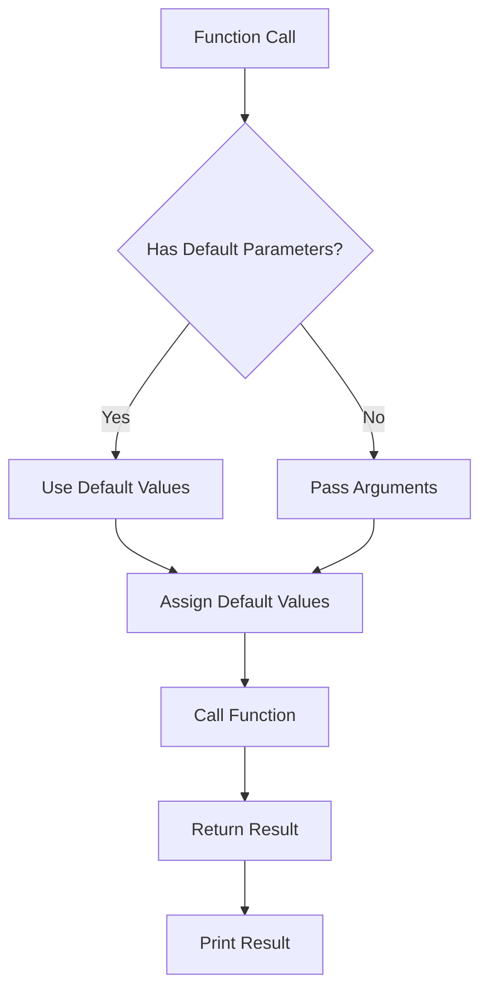

## Introduction
**Default and named parameters** are fundamental concepts in Kotlin that enhance the flexibility and readability of functions. They allow developers to write more concise and expressive code, making it easier to work with functions that have multiple parameters. In this section, we will explore the importance of default and named parameters, their real-world relevance, and why every engineer should understand these concepts.

Default and named parameters are essential in Kotlin because they enable developers to create functions that are easier to use and more flexible. By providing default values for parameters, developers can reduce the number of arguments that need to be passed to a function, making the code more concise and easier to read. Named parameters, on the other hand, allow developers to specify the name of the parameter when calling a function, making the code more readable and self-explanatory.

> **Note:** Default and named parameters are not unique to Kotlin and can be found in other programming languages, such as Python and JavaScript. However, Kotlin's implementation of these concepts is particularly elegant and easy to use.

## Core Concepts
In this section, we will delve into the precise definitions, mental models, and key terminology related to default and named parameters.

* **Default parameters**: A default parameter is a parameter that has a default value assigned to it. This means that when calling a function, the parameter can be omitted if the default value is acceptable.
* **Named parameters**: A named parameter is a parameter that is specified by its name when calling a function. This allows developers to pass arguments to a function in any order, as long as the parameter names are specified.

> **Tip:** When working with default and named parameters, it's essential to understand the order of evaluation. In Kotlin, parameters are evaluated from left to right, so default parameters must be placed after named parameters.

## How It Works Internally
In this section, we will explore the under-the-hood mechanics of default and named parameters in Kotlin.

When a function is called with default parameters, the Kotlin compiler checks if the parameter has a default value. If it does, the compiler will use the default value if the parameter is not provided. If the parameter is provided, the compiler will use the provided value.

Named parameters, on the other hand, are evaluated at compile-time. When a function is called with named parameters, the compiler checks if the parameter names match the names of the parameters in the function signature. If they do, the compiler will assign the values to the corresponding parameters.

> **Warning:** When using default and named parameters, it's essential to be aware of the potential for ambiguity. If a function has multiple parameters with default values, it can be challenging to determine which parameter is being referred to when using named parameters.

## Code Examples
In this section, we will explore three complete and runnable examples of default and named parameters in Kotlin.

### Example 1: Basic Usage
```kotlin
fun greet(name: String, message: String = "Hello") {
    println("$message, $name!")
}

fun main() {
    greet("John") // Output: Hello, John!
    greet("John", "Hi") // Output: Hi, John!
}
```
In this example, the `greet` function has a default parameter `message` with a default value of "Hello". The `main` function demonstrates how to call the `greet` function with and without the `message` parameter.

### Example 2: Real-World Pattern
```kotlin
data class Person(val name: String, val age: Int = 30)

fun createPerson(name: String, age: Int = 30) = Person(name, age)

fun main() {
    val person1 = createPerson("John") // age will be 30
    val person2 = createPerson("Jane", 25) // age will be 25
    println(person1) // Output: Person(name=John, age=30)
    println(person2) // Output: Person(name=Jane, age=25)
}
```
In this example, the `Person` data class has a default parameter `age` with a default value of 30. The `createPerson` function demonstrates how to create a `Person` object with and without the `age` parameter.

### Example 3: Advanced Usage
```kotlin
fun calculateArea(length: Int = 10, width: Int = 20, height: Int = 30) {
    val area = length * width * height
    println("The area is $area")
}

fun main() {
    calculateArea() // Output: The area is 6000
    calculateArea(length = 15) // Output: The area is 9000
    calculateArea(length = 15, width = 25) // Output: The area is 11250
}
```
In this example, the `calculateArea` function has three default parameters `length`, `width`, and `height`. The `main` function demonstrates how to call the `calculateArea` function with and without the parameters.

## Visual Diagram

This diagram illustrates the flow of a function call with default parameters. The diagram shows how the function call is evaluated, and how default values are used if parameters are not provided.

> **Interview:** Can you explain how default parameters are evaluated in Kotlin? How do named parameters affect the evaluation process?

## Comparison
| Approach | Time Complexity | Space Complexity | Pros | Cons | Best For |
| --- | --- | --- | --- | --- | --- |
| Default Parameters | O(1) | O(1) | Reduces code verbosity, improves readability | Can lead to ambiguity, requires careful ordering | Simple functions with few parameters |
| Named Parameters | O(1) | O(1) | Improves code readability, reduces ambiguity | Requires more boilerplate code, can be verbose | Complex functions with many parameters |
| Optional Parameters | O(1) | O(1) | Provides flexibility, reduces code verbosity | Can lead to null pointer exceptions, requires careful handling | Functions with optional parameters |
| Overloaded Functions | O(1) | O(1) | Provides flexibility, improves code readability | Can lead to code duplication, requires careful maintenance | Functions with multiple parameter combinations |

## Real-world Use Cases
1. **Android Development**: In Android development, default and named parameters are used extensively in functions that handle user input, such as `Toast.makeText` and `AlertDialog.Builder`.
2. **Kotlinx**: The Kotlinx library provides a range of functions with default and named parameters, such as `kotlinx.coroutines.launch` and `kotlinx.coroutines.async`.
3. **Spring Framework**: The Spring Framework uses default and named parameters in its API, such as `@RequestParam` and `@PathVariable`.

## Common Pitfalls
1. **Ambiguity**: Default and named parameters can lead to ambiguity if not used carefully. For example, if a function has multiple parameters with default values, it can be challenging to determine which parameter is being referred to when using named parameters.
2. **Null Pointer Exceptions**: Optional parameters can lead to null pointer exceptions if not handled carefully.
3. **Code Duplication**: Overloaded functions can lead to code duplication if not maintained carefully.
4. **Verbosity**: Named parameters can be verbose if not used judiciously.

> **Warning:** When using default and named parameters, it's essential to be aware of the potential for ambiguity and verbosity.

## Interview Tips
1. **What is the difference between default and named parameters?**: A good answer should explain the difference between default and named parameters, including their uses and benefits.
2. **How do you handle ambiguity when using default and named parameters?**: A good answer should explain how to handle ambiguity, including the use of named parameters and careful ordering of parameters.
3. **What are the benefits and drawbacks of using default and named parameters?**: A good answer should explain the benefits and drawbacks of using default and named parameters, including their impact on code readability and maintainability.

## Key Takeaways
* Default parameters reduce code verbosity and improve readability.
* Named parameters improve code readability and reduce ambiguity.
* Optional parameters provide flexibility but require careful handling.
* Overloaded functions provide flexibility but can lead to code duplication.
* Default and named parameters can lead to ambiguity if not used carefully.
* Verbosity can be a problem if named parameters are not used judiciously.
* Time complexity: O(1) for default and named parameters.
* Space complexity: O(1) for default and named parameters.
* Best practices: use default and named parameters judiciously, handle ambiguity carefully, and avoid verbosity.