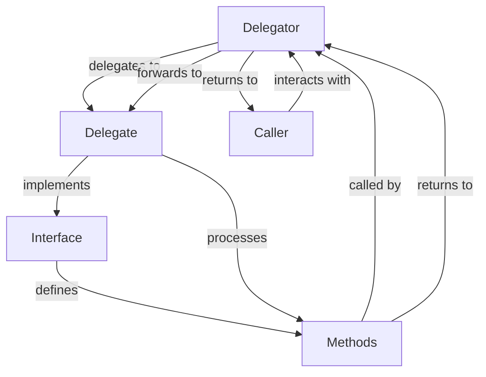

## Introduction
Delegation is a fundamental concept in object-oriented programming (OOP) that allows one object to delegate some of its responsibilities to another object. In Kotlin, delegation is achieved using the `by` keyword, which enables class and property delegation. This feature simplifies the process of creating complex objects by breaking them down into smaller, more manageable components. Delegation is essential in real-world applications, where it helps to promote code reuse, reduce coupling, and improve maintainability. For instance, in a web application, you might use delegation to create a complex UI component that consists of multiple smaller components, each with its own set of responsibilities.

## Core Concepts
To understand delegation in Kotlin, it's essential to grasp the following core concepts:
- **Class Delegation**: This type of delegation allows a class to delegate some of its responsibilities to another class. The delegating class, also known as the **delegate**, implements an interface or inherits from a class, while the **delegator** class delegates its responsibilities to the delegate.
- **Property Delegation**: This type of delegation enables a class to delegate the getter and setter of a property to another object. The delegate object is responsible for storing and retrieving the property's value.
- **Delegate**: The object that receives the delegated responsibilities.
- **Delegator**: The object that delegates its responsibilities to the delegate.

> **Note:** Delegation is different from inheritance, where a subclass inherits all the properties and methods of its superclass. In delegation, the delegator object only delegates specific responsibilities to the delegate object.

## How It Works Internally
When you use the `by` keyword to delegate a class or property, Kotlin creates a proxy object that forwards all method calls to the delegate object. This process is transparent to the caller, who interacts with the delegator object as if it were the delegate object. Here's a step-by-step breakdown of how it works:
1. The delegator object creates a delegate object that implements the interface or inherits from the class being delegated.
2. The delegator object uses the `by` keyword to delegate its responsibilities to the delegate object.
3. When a method is called on the delegator object, Kotlin checks if the delegator object has a method with the same name and signature. If it does, the method is called directly on the delegator object.
4. If the delegator object does not have a method with the same name and signature, Kotlin forwards the method call to the delegate object.
5. The delegate object processes the method call and returns the result to the delegator object.
6. The delegator object returns the result to the caller.

The time complexity of delegation is O(1), since it only involves a simple method call. The space complexity is also O(1), since no additional memory is allocated.

## Code Examples
### Example 1: Basic Class Delegation
```kotlin
// Define an interface for the delegate
interface Printable {
    fun print()
}

// Create a delegate class that implements the interface
class Printer : Printable {
    override fun print() {
        println("Printing...")
    }
}

// Create a delegator class that delegates to the delegate
class Document(private val printer: Printer) : Printable by printer

fun main() {
    val printer = Printer()
    val document = Document(printer)
    document.print() // Output: Printing...
}
```
### Example 2: Property Delegation
```kotlin
// Define a class that delegates a property to another object
class Person(private val name: String) {
    val fullName: String by lazy { name.toUpperCase() }
}

fun main() {
    val person = Person("John Doe")
    println(person.fullName) // Output: JOHN DOE
}
```
### Example 3: Advanced Delegation with Multiple Delegates
```kotlin
// Define an interface for the delegate
interface Printable {
    fun print()
}

// Create multiple delegate classes that implement the interface
class Printer : Printable {
    override fun print() {
        println("Printing...")
    }
}

class Scanner : Printable {
    override fun print() {
        println("Scanning...")
    }
}

// Create a delegator class that delegates to multiple delegates
class Document(private val printer: Printer, private val scanner: Scanner) : Printable {
    override fun print() {
        printer.print()
        scanner.print()
    }
}

fun main() {
    val printer = Printer()
    val scanner = Scanner()
    val document = Document(printer, scanner)
    document.print() // Output: Printing... Scanning...
}
```
> **Tip:** Delegation can be used to create complex objects that consist of multiple smaller components, each with its own set of responsibilities.

## Visual Diagram

The diagram shows the relationship between the delegator, delegate, interface, methods, and caller. The delegator delegates its responsibilities to the delegate, which implements the interface and defines the methods. The delegator forwards method calls to the delegate, which processes them and returns the results to the delegator. The delegator then returns the results to the caller.

## Comparison
| Approach | Time Complexity | Space Complexity | Pros | Cons | Best For |
| --- | --- | --- | --- | --- | --- |
| Class Delegation | O(1) | O(1) | Promotes code reuse, reduces coupling | Can be complex to implement | Creating complex objects with multiple responsibilities |
| Property Delegation | O(1) | O(1) | Simplifies property management, reduces boilerplate code | Limited to properties only | Managing properties with complex logic |
| Inheritance | O(1) | O(1) | Simple to implement, promotes code reuse | Can lead to tight coupling, rigid hierarchy | Creating a rigid hierarchy of classes |
| Composition | O(1) | O(1) | Promotes loose coupling, flexible hierarchy | Can be complex to implement | Creating complex objects with multiple components |

> **Warning:** Delegation can lead to complex code if not implemented carefully. It's essential to weigh the pros and cons of each approach and choose the best one for your specific use case.

## Real-world Use Cases
1. **Android UI Components**: Android uses delegation to create complex UI components, such as buttons and text views, which delegate their responsibilities to smaller components, such as drawables and layouts.
2. **Spring Framework**: The Spring Framework uses delegation to create complex web applications, where controllers delegate their responsibilities to services, which in turn delegate to repositories.
3. **Kotlin Coroutines**: Kotlin coroutines use delegation to create complex asynchronous workflows, where coroutines delegate their responsibilities to suspend functions, which in turn delegate to other coroutines.

## Common Pitfalls
1. **Over-Delegation**: Delegating too many responsibilities to a single delegate can lead to tight coupling and make the code harder to maintain.
2. **Under-Delegation**: Not delegating enough responsibilities can lead to duplicated code and make the code harder to maintain.
3. **Incorrect Delegation**: Delegating responsibilities to the wrong delegate can lead to incorrect behavior and make the code harder to debug.
4. **Delegation Cycles**: Creating delegation cycles, where a delegate delegates to another delegate, which in turn delegates back to the original delegate, can lead to infinite loops and make the code harder to debug.

> **Interview:** What is the difference between class delegation and property delegation in Kotlin? How would you implement delegation in a complex object-oriented system?

## Interview Tips
1. **Define Delegation**: Be able to define delegation and explain its benefits and drawbacks.
2. **Explain Class Delegation**: Be able to explain how class delegation works in Kotlin, including the use of the `by` keyword and the role of the delegate and delegator.
3. **Explain Property Delegation**: Be able to explain how property delegation works in Kotlin, including the use of lazy initialization and the role of the delegate and delegator.

## Key Takeaways
* Delegation is a fundamental concept in object-oriented programming that allows one object to delegate some of its responsibilities to another object.
* Class delegation and property delegation are two types of delegation in Kotlin.
* Delegation promotes code reuse, reduces coupling, and improves maintainability.
* Delegation can be used to create complex objects with multiple responsibilities.
* The time complexity of delegation is O(1), and the space complexity is also O(1).
* Delegation can lead to complex code if not implemented carefully.
* Common pitfalls of delegation include over-delegation, under-delegation, incorrect delegation, and delegation cycles.