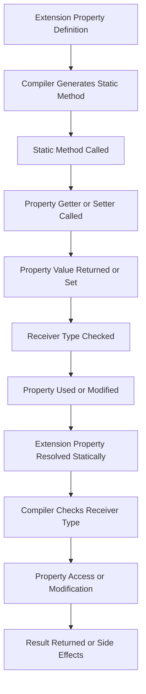

## Introduction
**Extension properties** are a powerful feature in Kotlin that allows developers to add properties to existing classes without modifying their source code. This feature is particularly useful when working with third-party libraries or frameworks where you don't have control over the class implementation. In this section, we will explore the concept of extension properties, their real-world relevance, and why every engineer needs to know about them.

Extension properties are a part of Kotlin's extension functions and properties feature, which enables developers to extend the functionality of existing classes. This feature is essential in software development, as it allows developers to add new functionality to existing code without modifying the original implementation. In real-world scenarios, extension properties are used extensively in frameworks and libraries, such as Android, where developers need to add custom properties to existing UI components.

> **Note:** Extension properties are resolved statically, which means that the compiler checks the type of the receiver (the object on which the property is called) to determine which property to use. This is different from Java, where method calls are resolved dynamically.

## Core Concepts
To understand extension properties, it's essential to grasp the following core concepts:

* **Extension functions and properties**: These are functions and properties that can be added to existing classes without modifying their source code.
* **Receiver type**: The type of the object on which the extension property is called.
* **Property getter and setter**: The getter and setter methods that are used to access and modify the property value.

In Kotlin, extension properties are defined using the `val` or `var` keyword, followed by the property name and the receiver type. For example:
```kotlin
val String.lengthInBytes: Int
    get() = this.toByteArray().size
```
This code defines an extension property `lengthInBytes` on the `String` class, which returns the length of the string in bytes.

## How It Works Internally
When you define an extension property, the Kotlin compiler generates a static method that gets or sets the property value. The method name is derived from the property name and the receiver type. For example, the `lengthInBytes` property would be compiled to a static method named `getLengthInBytes(String)`.

Here's a step-by-step breakdown of how extension properties work internally:

1. The compiler checks the type of the receiver (the object on which the property is called) to determine which property to use.
2. The compiler generates a static method that gets or sets the property value.
3. The static method is called when the property is accessed or modified.

> **Warning:** Extension properties can lead to naming conflicts if multiple extensions define properties with the same name. To avoid this, use unique property names or use the `import` statement to import specific extensions.

## Code Examples
Here are three complete and runnable code examples that demonstrate the use of extension properties:

### Example 1: Basic usage
```kotlin
// Define an extension property on the String class
val String.lengthInBytes: Int
    get() = this.toByteArray().size

// Use the extension property
fun main() {
    val str = "Hello, World!"
    println(str.lengthInBytes)
}
```
This code defines an extension property `lengthInBytes` on the `String` class and uses it to print the length of a string in bytes.

### Example 2: Real-world pattern
```kotlin
// Define an extension property on the ImageView class
var ImageView.imageUri: Uri?
    get() = tag as? Uri
    set(value) {
        tag = value
        setImageURI(value)
    }

// Use the extension property
fun main() {
    val imageView = ImageView(context)
    imageView.imageUri = Uri.parse("https://example.com/image.jpg")
}
```
This code defines an extension property `imageUri` on the `ImageView` class and uses it to set and get the image URI.

### Example 3: Advanced usage
```kotlin
// Define an extension property on the List class
val <T> List<T>.firstOrDefault: T?
    get() = if (isEmpty()) null else first()

// Use the extension property
fun main() {
    val list = listOf(1, 2, 3)
    println(list.firstOrDefault) // prints 1

    val emptyList = listOf<T>()
    println(emptyList.firstOrDefault) // prints null
}
```
This code defines an extension property `firstOrDefault` on the `List` class and uses it to print the first element of a list or null if the list is empty.

## Visual Diagram

This diagram illustrates the process of defining and using an extension property in Kotlin.

> **Tip:** Use the `val` or `var` keyword to define extension properties, and use the `get()` and `set()` methods to define the property getter and setter.

## Comparison
Here's a comparison table that highlights the differences between extension properties and other similar features in Kotlin:

| Approach | Time Complexity | Space Complexity | Pros | Cons | Best For |
| --- | --- | --- | --- | --- | --- |
| Extension Properties | O(1) | O(1) | Easy to use, flexible | Can lead to naming conflicts | Adding properties to existing classes |
| Inheritance | O(1) | O(n) | Allows for code reuse | Can lead to tight coupling | Creating a new class that inherits behavior from an existing class |
| Composition | O(1) | O(n) | Allows for loose coupling | Can lead to complexity | Creating a new class that contains an instance of an existing class |
| Delegation | O(1) | O(1) | Allows for code reuse | Can lead to complexity | Creating a new class that delegates to an existing class |

## Real-world Use Cases
Here are three real-world use cases that demonstrate the use of extension properties in production:

1. **Android**: The Android framework uses extension properties extensively to add custom properties to existing UI components. For example, the `ImageView` class has an `imageUri` property that can be used to set and get the image URI.
2. **Kotlinx**: The Kotlinx library provides a set of extension properties and functions that can be used to work with collections, strings, and other data structures.
3. **Spring**: The Spring framework uses extension properties to add custom properties to existing classes. For example, the `RestController` class has a `basePath` property that can be used to set the base path for the controller.

> **Interview:** Can you explain the difference between extension properties and inheritance in Kotlin? How would you use extension properties to add a custom property to an existing class?

## Common Pitfalls
Here are four common pitfalls to watch out for when using extension properties:

1. **Naming conflicts**: Extension properties can lead to naming conflicts if multiple extensions define properties with the same name. To avoid this, use unique property names or use the `import` statement to import specific extensions.
2. **Tight coupling**: Extension properties can lead to tight coupling between classes if not used carefully. To avoid this, use extension properties to add behavior to existing classes rather than creating new classes that inherit from existing classes.
3. **Complexity**: Extension properties can lead to complexity if not used carefully. To avoid this, use extension properties to add simple behavior to existing classes rather than creating complex logic.
4. **Performance issues**: Extension properties can lead to performance issues if not used carefully. To avoid this, use extension properties to add behavior to existing classes rather than creating new classes that inherit from existing classes.

> **Warning:** Extension properties can lead to performance issues if not used carefully. Always profile your code to ensure that extension properties are not causing performance bottlenecks.

## Interview Tips
Here are three common interview questions related to extension properties in Kotlin, along with some tips on how to answer them:

1. **What is the difference between extension properties and inheritance in Kotlin?**
	* Weak answer: Extension properties are used to add behavior to existing classes, while inheritance is used to create new classes that inherit behavior from existing classes.
	* Strong answer: Extension properties are used to add behavior to existing classes without modifying their source code, while inheritance is used to create new classes that inherit behavior from existing classes. Extension properties are resolved statically, while inheritance is resolved dynamically.
2. **How would you use extension properties to add a custom property to an existing class?**
	* Weak answer: You can use the `val` or `var` keyword to define an extension property on an existing class.
	* Strong answer: You can use the `val` or `var` keyword to define an extension property on an existing class, and use the `get()` and `set()` methods to define the property getter and setter. You can also use the `import` statement to import specific extensions.
3. **What are some common pitfalls to watch out for when using extension properties in Kotlin?**
	* Weak answer: Extension properties can lead to naming conflicts and tight coupling between classes.
	* Strong answer: Extension properties can lead to naming conflicts, tight coupling between classes, complexity, and performance issues. To avoid these pitfalls, use unique property names, use extension properties to add simple behavior to existing classes, and profile your code to ensure that extension properties are not causing performance bottlenecks.

## Key Takeaways
Here are ten key takeaways to remember when working with extension properties in Kotlin:

* Extension properties are used to add behavior to existing classes without modifying their source code.
* Extension properties are resolved statically, which means that the compiler checks the type of the receiver to determine which property to use.
* Use the `val` or `var` keyword to define extension properties.
* Use the `get()` and `set()` methods to define the property getter and setter.
* Extension properties can lead to naming conflicts if multiple extensions define properties with the same name.
* Extension properties can lead to tight coupling between classes if not used carefully.
* Extension properties can lead to complexity if not used carefully.
* Extension properties can lead to performance issues if not used carefully.
* Use unique property names to avoid naming conflicts.
* Profile your code to ensure that extension properties are not causing performance bottlenecks.

> **Tip:** Always use the `val` or `var` keyword to define extension properties, and use the `get()` and `set()` methods to define the property getter and setter.