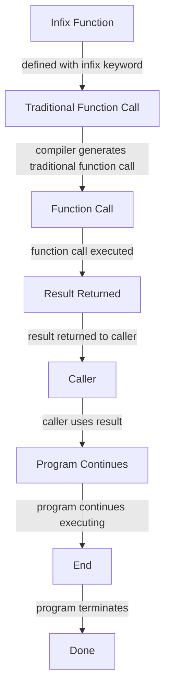

## Introduction
Infix functions are a powerful feature in Kotlin that allows you to define functions that can be called using the infix notation. This means that instead of calling a function using the traditional `object.function()` notation, you can call it using the `object function` notation. Infix functions are useful for creating domain-specific languages (DSLs) and for making your code more readable and concise. In this section, we will explore what infix functions are, why they matter, and their real-world relevance.

Infix functions are particularly useful when working with data structures such as lists, sets, and maps. For example, you can define an infix function `contains` that checks if a list contains a certain element. This function can then be called using the infix notation, making your code more readable and concise.

> **Note:** Infix functions are not unique to Kotlin and can be found in other programming languages such as Scala and Groovy.

## Core Concepts
To understand infix functions, you need to understand the following core concepts:

* **Infix notation**: This is the notation used to call a function using the `object function` syntax.
* **Infix function**: This is a function that can be called using the infix notation.
* **Receiver**: This is the object on which the infix function is called.
* **Parameter**: This is the object that is passed to the infix function.

The syntax for defining an infix function in Kotlin is as follows:
```kotlin
class MyClass {
    infix fun myFunction(param: String) {
        // function body
    }
}
```
You can then call this function using the infix notation:
```kotlin
val obj = MyClass()
obj myFunction "hello"
```
> **Tip:** When defining an infix function, make sure to use the `infix` keyword to indicate that the function can be called using the infix notation.

## How It Works Internally
When you call an infix function using the infix notation, Kotlin internally converts the call to a traditional function call. This means that the following two calls are equivalent:
```kotlin
obj myFunction "hello"
obj.myFunction("hello")
```
Kotlin achieves this by using a feature called **operator overloading**. When you define an infix function, Kotlin generates a traditional function call that can be used to call the function.

Here is a step-by-step breakdown of how infix functions work internally:

1. The compiler checks if the function is defined with the `infix` keyword.
2. If the function is defined with the `infix` keyword, the compiler generates a traditional function call that can be used to call the function.
3. When you call the function using the infix notation, the compiler converts the call to a traditional function call.
4. The traditional function call is then executed, and the result is returned to the caller.

> **Warning:** Infix functions can be confusing if not used properly. Make sure to use them sparingly and only when they make your code more readable and concise.

## Code Examples
Here are three complete and runnable examples of using infix functions in Kotlin:

### Example 1: Basic Usage
```kotlin
class Person(val name: String) {
    infix fun livesIn(city: String) {
        println("$name lives in $city")
    }
}

fun main() {
    val person = Person("John")
    person livesIn "New York"
}
```
This example defines a `Person` class with an infix function `livesIn` that takes a `city` parameter. The `main` function creates a `Person` object and calls the `livesIn` function using the infix notation.

### Example 2: Real-World Pattern
```kotlin
class Money(val amount: Double) {
    infix fun plus(other: Money): Money {
        return Money(amount + other.amount)
    }
}

fun main() {
    val money1 = Money(10.0)
    val money2 = Money(20.0)
    val result = money1 plus money2
    println("Result: ${result.amount}")
}
```
This example defines a `Money` class with an infix function `plus` that takes another `Money` object as a parameter. The `main` function creates two `Money` objects and calls the `plus` function using the infix notation.

### Example 3: Advanced Usage
```kotlin
class Graph {
    private val nodes = mutableMapOf<String, MutableList<String>>()

    infix fun addNode(node: String) {
        nodes[node] = mutableListOf()
    }

    infix fun connect(node1: String, node2: String) {
        nodes[node1]?.add(node2)
    }

    fun printGraph() {
        for ((node, neighbors) in nodes) {
            println("$node -> $neighbors")
        }
    }
}

fun main() {
    val graph = Graph()
    graph addNode "A"
    graph addNode "B"
    graph connect "A" to "B"
    graph.printGraph()
}
```
This example defines a `Graph` class with infix functions `addNode` and `connect`. The `main` function creates a `Graph` object and calls the `addNode` and `connect` functions using the infix notation.

## Visual Diagram

This diagram illustrates the internal workings of infix functions in Kotlin. The diagram shows how the compiler generates a traditional function call from an infix function call, and how the function call is executed and the result is returned to the caller.

## Comparison
Here is a comparison of infix functions with traditional functions in Kotlin:
| Approach | Time Complexity | Space Complexity | Pros | Cons | Best For |
|----------|----------------|-----------------|------|------|----------|
| Infix Functions | O(1) | O(1) | Readable and concise code, flexible syntax | Can be confusing if not used properly | Domain-specific languages, data structures |
| Traditional Functions | O(1) | O(1) | Clear and explicit syntax, easy to understand | Less flexible syntax | General-purpose programming, complex algorithms |

> **Interview:** Can you explain the difference between infix functions and traditional functions in Kotlin? How would you choose between the two in a real-world project?

## Real-world Use Cases
Here are three real-world use cases for infix functions in Kotlin:

1. **Domain-specific languages**: Infix functions are useful for creating domain-specific languages (DSLs) in Kotlin. For example, you can define an infix function `select` that takes a `column` parameter and returns a `SELECT` statement.
2. **Data structures**: Infix functions are useful for working with data structures such as lists, sets, and maps. For example, you can define an infix function `contains` that takes an `element` parameter and returns a boolean indicating whether the element is in the data structure.
3. **Graph algorithms**: Infix functions are useful for working with graph algorithms in Kotlin. For example, you can define an infix function `connect` that takes two `node` parameters and connects them in a graph.

## Common Pitfalls
Here are four common pitfalls to watch out for when using infix functions in Kotlin:

1. **Confusing syntax**: Infix functions can be confusing if not used properly. Make sure to use them sparingly and only when they make your code more readable and concise.
2. **Overloading**: Infix functions can be overloaded, which can lead to confusion and errors. Make sure to use unique and descriptive names for your infix functions.
3. **Null safety**: Infix functions can be called on null objects, which can lead to null pointer exceptions. Make sure to handle null safety properly when using infix functions.
4. **Performance**: Infix functions can have performance implications if not used properly. Make sure to use them only when necessary and to optimize your code for performance.

> **Tip:** Use infix functions sparingly and only when they make your code more readable and concise. Avoid overloading and null safety issues, and optimize your code for performance.

## Interview Tips
Here are three common interview questions related to infix functions in Kotlin, along with sample answers:

1. **What is the difference between infix functions and traditional functions in Kotlin?**
Answer: Infix functions are functions that can be called using the infix notation, while traditional functions are functions that can be called using the traditional function call syntax. Infix functions are useful for creating domain-specific languages and for making your code more readable and concise.
2. **How do you define an infix function in Kotlin?**
Answer: You define an infix function in Kotlin by using the `infix` keyword before the `fun` keyword. For example: `infix fun myFunction(param: String) { ... }`.
3. **What are some common use cases for infix functions in Kotlin?**
Answer: Infix functions are useful for creating domain-specific languages, working with data structures, and implementing graph algorithms. They are also useful for making your code more readable and concise.

> **Interview:** Can you explain the benefits and drawbacks of using infix functions in Kotlin? How would you choose between infix functions and traditional functions in a real-world project?

## Key Takeaways
Here are ten key takeaways from this section on infix functions in Kotlin:

* Infix functions are functions that can be called using the infix notation.
* Infix functions are useful for creating domain-specific languages and for making your code more readable and concise.
* Infix functions can be defined using the `infix` keyword before the `fun` keyword.
* Infix functions can be overloaded, which can lead to confusion and errors.
* Infix functions can be called on null objects, which can lead to null pointer exceptions.
* Infix functions can have performance implications if not used properly.
* Use infix functions sparingly and only when they make your code more readable and concise.
* Avoid overloading and null safety issues when using infix functions.
* Optimize your code for performance when using infix functions.
* Infix functions are a powerful feature in Kotlin that can make your code more readable and concise, but they require careful use and attention to detail.