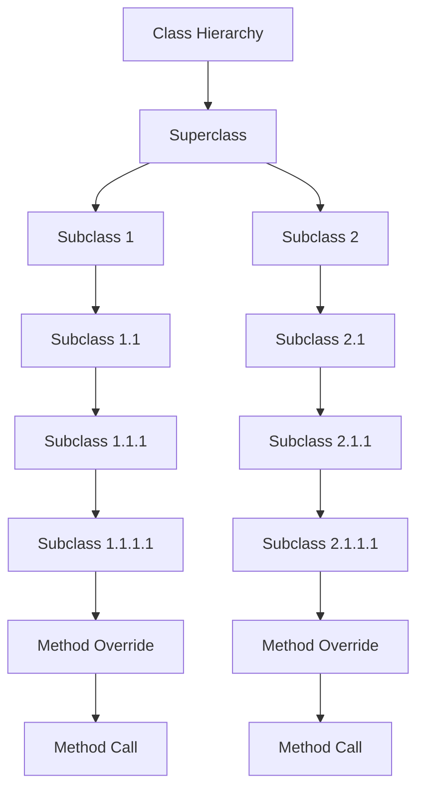

## Introduction
**Inheritance** is a fundamental concept in object-oriented programming (OOP) that allows one class to inherit the properties and behavior of another class. In Kotlin, inheritance is used to create a new class that is a modified version of an existing class. The existing class is called the **superclass** or **parent class**, and the new class is called the **subclass** or **child class**. Inheritance is useful for promoting code reuse, facilitating the creation of a hierarchy of related classes, and enabling the modeling of real-world relationships between objects.

> **Note:** Inheritance is a key aspect of OOP, and understanding its concepts and mechanisms is essential for any software developer.

In Kotlin, inheritance is declared using the `:` keyword, followed by the name of the superclass. For example:
```kotlin
open class Animal {
    fun eat() {
        println("Eating...")
    }
}

class Dog : Animal() {
    fun bark() {
        println("Barking...")
    }
}
```
In this example, the `Dog` class inherits the `eat()` method from the `Animal` class.

## Core Concepts
The core concepts of inheritance in Kotlin include:

* **Open classes**: A class that can be inherited from must be declared as `open`.
* **Override**: A subclass can override a method of its superclass using the `override` keyword.
* **Final**: A class or method can be declared as `final` to prevent it from being inherited or overridden.

> **Tip:** When designing a class hierarchy, it's essential to consider the **Liskov Substitution Principle (LSP)**, which states that a subclass should be substitutable for its superclass.

## How It Works Internally
When a subclass inherits from a superclass, it inherits all the fields and methods of the superclass. The subclass can also add new fields and methods or override the ones inherited from the superclass.

Here's a step-by-step breakdown of how inheritance works internally:

1. The subclass is compiled, and the compiler checks if the superclass is `open`.
2. If the superclass is `open`, the compiler generates a new class file for the subclass.
3. The subclass inherits all the fields and methods of the superclass.
4. The subclass can override the methods of the superclass using the `override` keyword.
5. The subclass can add new fields and methods.

> **Warning:** When overriding a method, make sure to use the `override` keyword to avoid compiler errors.

## Code Examples
Here are three complete and runnable code examples that demonstrate the use of inheritance in Kotlin:

### Example 1: Basic Inheritance
```kotlin
open class Vehicle {
    fun drive() {
        println("Driving...")
    }
}

class Car : Vehicle() {
    fun honk() {
        println("Honking...")
    }
}

fun main() {
    val car = Car()
    car.drive()
    car.honk()
}
```
This example demonstrates basic inheritance, where the `Car` class inherits the `drive()` method from the `Vehicle` class.

### Example 2: Overriding Methods
```kotlin
open class Shape {
    open fun area(): Double {
        return 0.0
    }
}

class Circle : Shape() {
    override fun area(): Double {
        return 3.14 * 2 * 2
    }
}

fun main() {
    val circle = Circle()
    println("Area: ${circle.area()}")
}
```
This example demonstrates method overriding, where the `Circle` class overrides the `area()` method of the `Shape` class.

### Example 3: Final Classes and Methods
```kotlin
final class Singleton {
    companion object {
        private var instance: Singleton? = null

        fun getInstance(): Singleton {
            if (instance == null) {
                instance = Singleton()
            }
            return instance!!
        }
    }
}

class SingletonUser {
    fun useSingleton() {
        val singleton = Singleton.getInstance()
        // Use the singleton instance
    }
}

fun main() {
    val user = SingletonUser()
    user.useSingleton()
}
```
This example demonstrates the use of final classes and methods, where the `Singleton` class is declared as `final` to prevent it from being inherited.

## Visual Diagram

This diagram illustrates a class hierarchy with multiple levels of inheritance and method overriding.

> **Note:** The diagram shows how the `Subclass 1.1.1.1` class overrides a method from its superclass, and how the `Subclass 2.1.1.1` class also overrides a method from its superclass.

## Comparison
Here's a comparison table that summarizes the different approaches to inheritance in Kotlin:

| Approach | Time Complexity | Space Complexity | Pros | Cons | Best For |
| --- | --- | --- | --- | --- | --- |
| Composition | O(1) | O(1) | Flexible, reusable code | More complex, harder to understand | Complex systems with multiple dependencies |
| Inheritance | O(1) | O(1) | Promotes code reuse, facilitates hierarchy creation | Tight coupling, harder to maintain | Simple systems with a clear hierarchy |
| Interface Inheritance | O(1) | O(1) | Promotes code reuse, facilitates polymorphism | Limited functionality, harder to understand | Systems with multiple interfaces and polymorphism |
| Abstract Classes | O(1) | O(1) | Promotes code reuse, facilitates hierarchy creation | Limited functionality, harder to understand | Systems with a clear hierarchy and abstract methods |

> **Tip:** When choosing an approach to inheritance, consider the trade-offs between time and space complexity, as well as the pros and cons of each approach.

## Real-world Use Cases
Here are three real-world use cases for inheritance in Kotlin:

1. **Android App Development**: In Android app development, inheritance is used to create a hierarchy of views and layouts. For example, the `TextView` class inherits from the `View` class, and the `Button` class inherits from the `TextView` class.
2. **Game Development**: In game development, inheritance is used to create a hierarchy of game objects and characters. For example, the `Character` class inherits from the `GameObject` class, and the `Player` class inherits from the `Character` class.
3. **Financial System Development**: In financial system development, inheritance is used to create a hierarchy of financial instruments and transactions. For example, the `Stock` class inherits from the `FinancialInstrument` class, and the `Bond` class inherits from the `FinancialInstrument` class.

> **Note:** Inheritance is a powerful tool for creating complex systems, but it requires careful design and planning to avoid tight coupling and maintainability issues.

## Common Pitfalls
Here are four common pitfalls to watch out for when using inheritance in Kotlin:

1. **Tight Coupling**: Inheritance can lead to tight coupling between classes, making it harder to maintain and modify the code.
2. **Fragile Base Class Problem**: Changes to the superclass can break the subclass, leading to fragile code that's hard to maintain.
3. **Multiple Inheritance**: Kotlin does not support multiple inheritance, which can lead to diamond problems and ambiguity issues.
4. **Overriding Methods**: Overriding methods can lead to unexpected behavior if not done correctly, especially when dealing with polymorphism.

> **Warning:** When using inheritance, make sure to follow the **Liskov Substitution Principle (LSP)** and avoid tight coupling and fragile base class problems.

## Interview Tips
Here are three common interview questions related to inheritance in Kotlin, along with weak and strong answers:

1. **What is inheritance in Kotlin?**
	* Weak answer: "Inheritance is when one class inherits from another class."
	* Strong answer: "Inheritance in Kotlin is a mechanism that allows one class to inherit the properties and behavior of another class, promoting code reuse and facilitating the creation of a hierarchy of related classes."
2. **How do you override a method in Kotlin?**
	* Weak answer: "You use the `override` keyword."
	* Strong answer: "In Kotlin, you override a method by using the `override` keyword, which allows you to provide a specific implementation for a method that's already defined in the superclass, while also ensuring that the method signature remains the same."
3. **What is the Liskov Substitution Principle (LSP)?**
	* Weak answer: "It's a principle that says you should use inheritance carefully."
	* Strong answer: "The Liskov Substitution Principle (LSP) is a fundamental principle in object-oriented programming that states that a subclass should be substitutable for its superclass, ensuring that any code that uses the superclass can work with the subclass without knowing the difference, which promotes code reuse, flexibility, and maintainability."

> **Interview:** When answering interview questions related to inheritance, make sure to demonstrate a deep understanding of the concepts and mechanisms, as well as the ability to apply them to real-world scenarios.

## Key Takeaways
Here are ten key takeaways to remember when working with inheritance in Kotlin:

* Inheritance promotes code reuse and facilitates the creation of a hierarchy of related classes.
* The `open` keyword is used to declare a class that can be inherited from.
* The `override` keyword is used to override a method of the superclass.
* The `final` keyword is used to prevent a class or method from being inherited or overridden.
* Inheritance can lead to tight coupling and fragile base class problems if not done carefully.
* The Liskov Substitution Principle (LSP) is essential for ensuring that subclasses are substitutable for their superclasses.
* Inheritance is a powerful tool for creating complex systems, but it requires careful design and planning.
* Kotlin does not support multiple inheritance, which can lead to diamond problems and ambiguity issues.
* Overriding methods can lead to unexpected behavior if not done correctly, especially when dealing with polymorphism.
* Inheritance is a fundamental concept in object-oriented programming, and understanding its concepts and mechanisms is essential for any software developer.