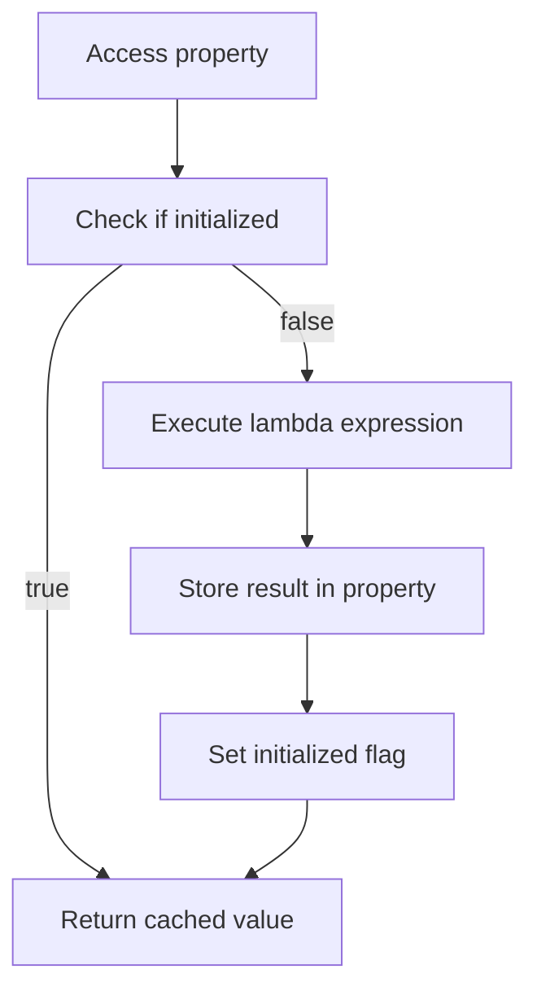

## Introduction
**Lazy Delegation** in Kotlin is a technique that allows you to initialize a property only when it is first accessed. This can be useful when the initialization of a property is expensive or when it depends on other properties that may not be available at the time of object creation. In this section, we will explore what lazy delegation is, why it matters, and its real-world relevance. 
> **Note:** Lazy delegation is particularly useful when dealing with properties that have a high initialization cost, such as database connections or network requests.

Lazy delegation is a part of the Kotlin standard library and is implemented using the `by lazy` delegate. This delegate takes a lambda expression that is used to initialize the property. The lambda expression is only executed when the property is first accessed, and the result is stored in the property.

## Core Concepts
**Lazy Delegation** is a design pattern that allows you to delay the initialization of a property until it is first accessed. The core concept of lazy delegation is the use of a delegate that is responsible for initializing the property. 
> **Tip:** Use lazy delegation when you need to initialize a property that depends on other properties that may not be available at the time of object creation.

In Kotlin, lazy delegation is implemented using the `by lazy` delegate. This delegate takes a lambda expression that is used to initialize the property. The lambda expression is only executed when the property is first accessed, and the result is stored in the property.

The key terminology associated with lazy delegation includes:
* **Delegate**: an object that is responsible for initializing a property.
* **Lazy**: a delegate that initializes a property only when it is first accessed.
* **Lambda expression**: a function that is used to initialize a property.

## How It Works Internally
When you use the `by lazy` delegate to initialize a property, Kotlin creates a delegate object that is responsible for initializing the property. The delegate object stores the lambda expression that is used to initialize the property and a flag that indicates whether the property has been initialized.

When you access the property for the first time, the delegate object checks the flag to see if the property has been initialized. If it has not been initialized, the delegate object executes the lambda expression and stores the result in the property. The flag is then set to indicate that the property has been initialized.

Here is a step-by-step breakdown of how lazy delegation works internally:
1. The `by lazy` delegate is used to initialize a property.
2. A delegate object is created to store the lambda expression and a flag.
3. When the property is accessed for the first time, the delegate object checks the flag.
4. If the flag indicates that the property has not been initialized, the delegate object executes the lambda expression.
5. The result of the lambda expression is stored in the property.
6. The flag is set to indicate that the property has been initialized.

## Code Examples
### Example 1: Basic Usage
```kotlin
class Person(val name: String) {
    val greeting: String by lazy {
        "Hello, $name!"
    }
}

fun main() {
    val person = Person("John")
    println(person.greeting) // prints "Hello, John!"
}
```
In this example, the `greeting` property is initialized using the `by lazy` delegate. The lambda expression is executed only when the `greeting` property is first accessed.

### Example 2: Real-World Pattern
```kotlin
class DatabaseConnection(val url: String, val username: String, val password: String) {
    val connection: java.sql.Connection by lazy {
        java.sql.DriverManager.getConnection(url, username, password)
    }
}

fun main() {
    val dbConnection = DatabaseConnection("jdbc:mysql://localhost:3306/mydb", "root", "password")
    val statement = dbConnection.connection.createStatement()
    val resultSet = statement.executeQuery("SELECT * FROM mytable")
    while (resultSet.next()) {
        println(resultSet.getString(1))
    }
}
```
In this example, the `connection` property is initialized using the `by lazy` delegate. The lambda expression is executed only when the `connection` property is first accessed.

### Example 3: Advanced Usage
```kotlin
class Logger {
    val logFile: java.io.FileWriter by lazy {
        java.io.FileWriter("log.txt")
    }

    fun log(message: String) {
        logFile.write(message + "\n")
        logFile.flush()
    }
}

fun main() {
    val logger = Logger()
    logger.log("Hello, world!")
}
```
In this example, the `logFile` property is initialized using the `by lazy` delegate. The lambda expression is executed only when the `logFile` property is first accessed.

## Visual Diagram

This diagram illustrates the internal mechanics of lazy delegation. When a property is accessed, the delegate checks if it has been initialized. If it has, the cached value is returned. If not, the lambda expression is executed, and the result is stored in the property.

## Comparison
| Approach | Time Complexity | Space Complexity | Pros | Cons | Best For |
| --- | --- | --- | --- | --- | --- |
| Eager Initialization | O(1) | O(1) | Simple, efficient | Wastes resources if not used | Properties that are always used |
| Lazy Initialization | O(1) (first access), O(n) (subsequent accesses) | O(1) | Efficient, reduces waste | More complex, slower first access | Properties that may not be used |
| Memoization | O(1) (first access), O(1) (subsequent accesses) | O(n) | Fast, efficient | Uses more memory | Properties that are frequently accessed |
| Lazy Delegation | O(1) (first access), O(1) (subsequent accesses) | O(1) | Efficient, flexible | More complex | Properties that may not be used, or have complex initialization |

## Real-world Use Cases
* **Database connections**: Lazy delegation can be used to initialize database connections only when they are first accessed.
* **Network requests**: Lazy delegation can be used to initialize network requests only when they are first accessed.
* **File I/O**: Lazy delegation can be used to initialize file I/O operations only when they are first accessed.

## Common Pitfalls
* **Not checking for null**: When using lazy delegation, it is essential to check for null values to avoid NullPointerExceptions.
* **Not handling exceptions**: When using lazy delegation, it is essential to handle exceptions properly to avoid crashes or unexpected behavior.
* **Not considering thread safety**: When using lazy delegation, it is essential to consider thread safety to avoid concurrency issues.
* **Not optimizing performance**: When using lazy delegation, it is essential to optimize performance to avoid unnecessary computations or memory usage.

## Interview Tips
* **What is lazy delegation?**: Lazy delegation is a technique that allows you to initialize a property only when it is first accessed.
* **How does lazy delegation work internally?**: Lazy delegation uses a delegate object that stores a lambda expression and a flag. When the property is accessed, the delegate checks the flag and executes the lambda expression if necessary.
* **What are the benefits of lazy delegation?**: Lazy delegation reduces waste, improves performance, and makes code more efficient.

## Key Takeaways
* **Lazy delegation is a technique that allows you to initialize a property only when it is first accessed**.
* **Lazy delegation uses a delegate object that stores a lambda expression and a flag**.
* **Lazy delegation is useful for properties that may not be used or have complex initialization**.
* **Lazy delegation can improve performance and reduce waste**.
* **Lazy delegation requires careful consideration of thread safety and exception handling**.
* **Lazy delegation can be used with database connections, network requests, and file I/O operations**.
* **Lazy delegation has a time complexity of O(1) for the first access and O(1) for subsequent accesses**.
* **Lazy delegation has a space complexity of O(1)**.